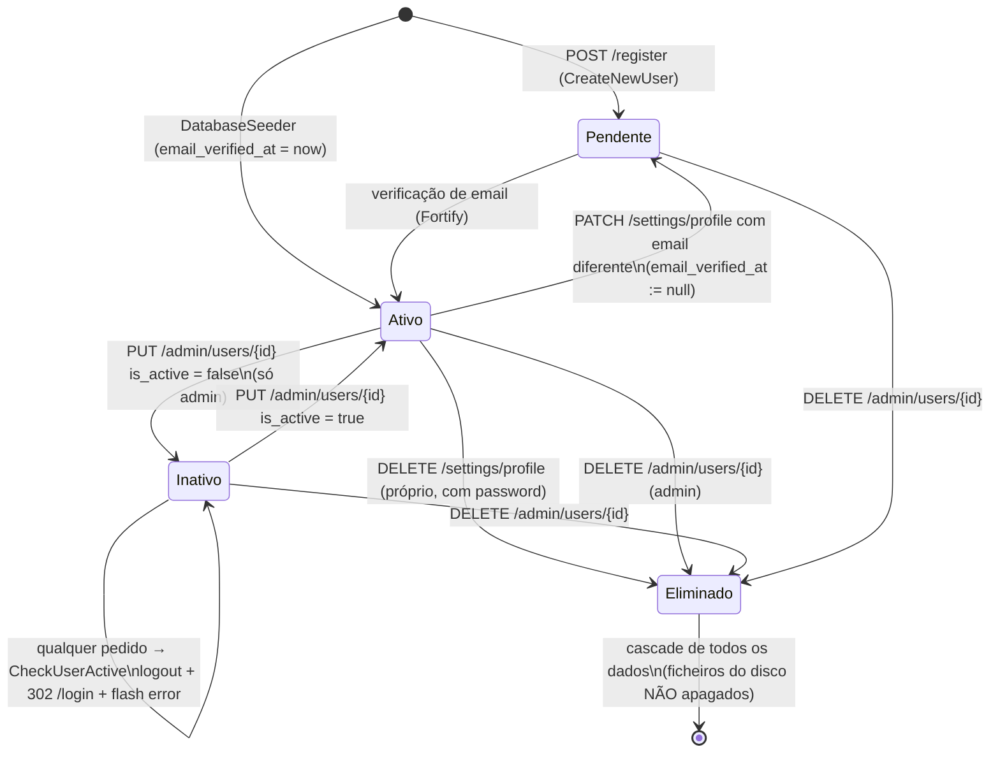
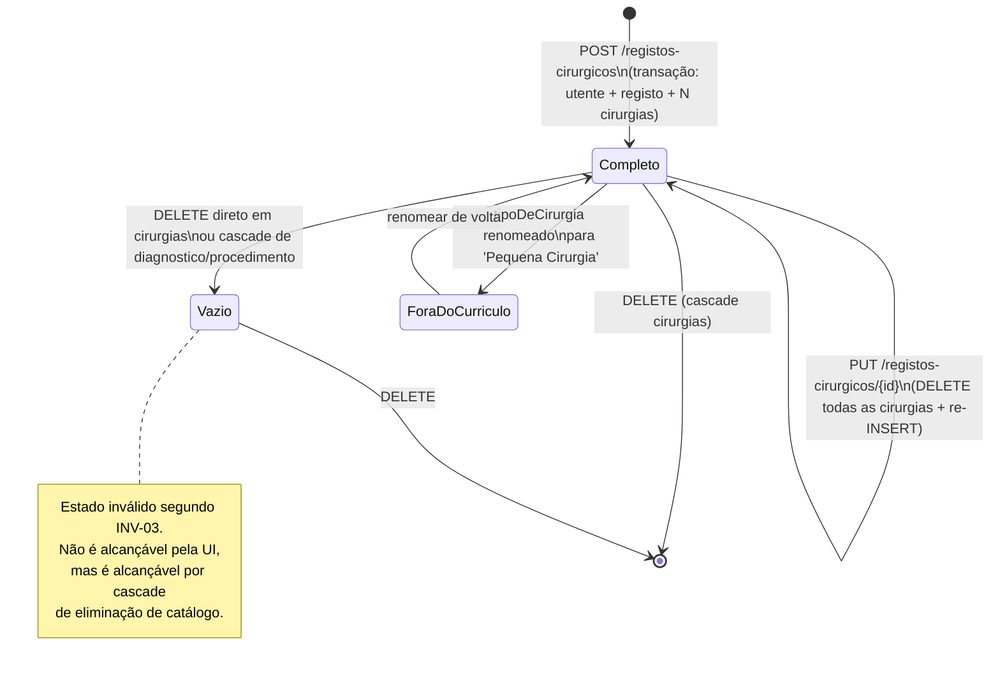
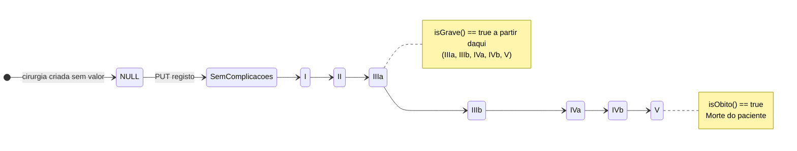
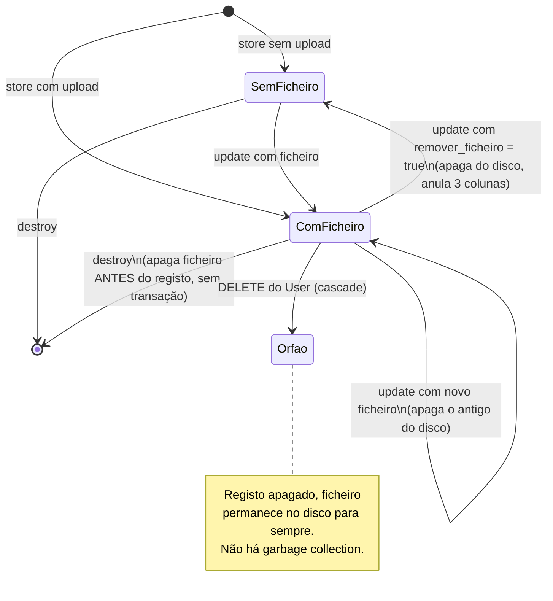

# MedTrack / Medfolio — Documentação da Business Logic

> **Âmbito**: engenharia inversa completa da lógica de negócio a partir do código-fonte (branch `main`, commit `6c7eeb0`).
> **Método**: leitura de rotas → controllers → form requests → policies → models/scopes → migrations → exports → frontend.
> **Convenção de confiança** usada em todo o documento:
> - `[C]` **CONFIRMADO PELO CÓDIGO** — existe uma linha de código que o demonstra.
> - `[I]` **INFERIDO** — dedução coerente a partir de várias evidências, mas não explicitada no código.
> - `[N]` **NÃO DETERMINÁVEL** a partir do código analisado.
>
> ⚠️ Os documentos pré-existentes `IMPLEMENTACAO.md` e `DATABASE_TABLES.md` estão **desatualizados** e descrevem entidades que já não existem (`Area`, `TipoDeOrigem`, `TipoAbordagemEnum`, `CirurgiaController`, `utentes.data_nascimento`). Não devem ser usados como referência. `[C]`

---

## Índice

1. [Executive Summary](#1-executive-summary)
2. [Architecture Overview](#2-architecture-overview)
3. [Modules & Components](#3-modules--components)
4. [Business Logic](#4-business-logic)
5. [Business Rules](#5-business-rules)
6. [Data Model](#6-data-model)
7. [Database Rules](#7-database-rules)
8. [APIs](#8-apis)
9. [Authentication & Authorization](#9-authentication--authorization)
10. [State Machines](#10-state-machines)
11. [Events & Async Processing](#11-events--async-processing)
12. [External Integrations](#12-external-integrations)
13. [Error Handling](#13-error-handling)
14. [Edge Cases](#14-edge-cases)
15. [Security Rules](#15-security-rules)
16. [Observability](#16-observability)
17. [End-to-End Business Flows](#17-end-to-end-business-flows)
18. [Dependency Map](#18-dependency-map)
19. [Inconsistencies & Potential Bugs](#19-inconsistencies--potential-bugs)
20. [Assumptions & Ambiguities](#20-assumptions--ambiguities)
21. [Glossary](#21-glossary)
22. [Business Rules Matrix](#22-business-rules-matrix)

---

## 1. Executive Summary

### 1.1 Propósito do sistema

O MedTrack (internamente também designado *Medfolio* — ver `config/medfolio.php` e `App\Providers\MedfolioServiceProvider`) é um **portfólio clínico pessoal para médicos cirurgiões**. `[C]`

O sistema permite a um médico registar e consolidar, ao longo do seu percurso, três tipos de produção profissional:

| Domínio | Entidade raiz | Objetivo de negócio |
|---|---|---|
| **Atividade cirúrgica** | `RegistoCirurgico` + `Cirurgia` | Registar cada ato cirúrgico: doente, hospital, especialidade, data, tipo/abordagem, e para cada diagnóstico as intervenções realizadas, a função desempenhada (principal vs. ajudante) e as complicações (Clavien-Dindo). |
| **Atividade científica** | `AtividadeCientifica` | Registar artigos, posters, comunicações orais, sessões clínicas, capítulos de livro, etc., com metadados bibliométricos (DOI, ISBN, fator de impacto, posição de autor) e ficheiro anexo. |
| **Formação** | `Formacao` | Registar congressos, cursos, workshops, com duração em horas, créditos e certificado anexo. |

O produto final de negócio é o **currículo cirúrgico quantificado**: a página *Cirurgias por Área* (`registos-cirurgicos/cirurgias-por-area`) produz a tabela hierárquica Zona Anatómica → Tipo de Patologia (Benigno/Maligno) → Tipo de Abordagem → (Patologia × Procedimento), com contagens desagregadas por *Electivo/Urgente* × *Cirurgião/Ajudante*. É este o artefacto tipicamente exigido em provas de idoneidade / avaliação de internato. `[I — inferido do formato da tabela e do domínio; o código não declara a finalidade]`

### 1.2 Modelo de tenancy

O sistema é **multi-tenant por utilizador**, não por organização. `[C]`

Cada médico é um *tenant*. Quase todos os dados — incluindo os **catálogos** (hospitais, especialidades, zonas anatómicas, diagnósticos, procedimentos) e até os **utentes/doentes** — são privados de cada utilizador e replicados por utilizador. Isto é implementado pelo trait `App\Traits\BelongsToUser` + global scope `App\Models\Scopes\UserScope`.

Consequência de negócio importante: **dois médicos que operam o mesmo doente têm dois registos `Utente` distintos**, cada um com o seu `user_id`, ainda que o nº de processo hospitalar seja o mesmo. `[C — `utentes.user_id` + `UserScope`]`

### 1.3 Perfis de acesso

Existem **dois sistemas de autenticação paralelos e independentes**: `[C]`

1. **Utilizador clínico** (`users`, guard `web`, Laravel Fortify): regista e consulta o seu próprio portfólio. Pode ter role Spatie `admin` ou `user`.
2. **Administrador de plataforma** (`admin_users`, guard `admin`, login próprio em `/admin/login`): back-office de gestão de utilizadores, consulta transversal de currículos e log de auditoria.

O middleware `admin` aceita **qualquer um dos dois** (guard `admin` autenticado **OU** utilizador `web` com role Spatie `admin`). `[C — AdminMiddleware:17-22]`

### 1.4 Números do sistema

- 17 models Eloquent, 9 policies, 2 guards, 3 service providers.
- 23 tabelas aplicacionais (excluindo tabelas de infraestrutura Laravel).
- ~20 rotas de recurso + 12 rotas admin + rotas Fortify.
- 0 jobs, 0 queues em uso, 0 eventos de domínio, 0 cron jobs, 0 integrações HTTP externas. `[C]`

---

## 2. Architecture Overview

### 2.1 Stack

| Camada | Tecnologia | Ficheiro de referência |
|---|---|---|
| Backend | Laravel 12 / PHP ^8.2 | `composer.json` |
| Autenticação | Laravel Fortify ^1.30 (2FA, reset password, email verification, registration) | `config/fortify.php` |
| Autorização | Spatie Laravel Permission ^6.24 (apenas *roles*, sem *permissions* atribuídas) + Laravel Policies | `config/permission.php`, `app/Policies/` |
| Camada de transporte UI | Inertia.js 2 (server-driven SPA) | `config/inertia.php`, `HandleInertiaRequests` |
| Frontend | React 19 + TypeScript + Vite + Tailwind + shadcn/ui | `resources/js/`, `vite.config.ts` |
| Geração de rotas TS | Laravel Wayfinder ^0.1.9 | `@/routes/index` (importado em `app-sidebar.tsx`) |
| Exportação | maatwebsite/excel ^3.1 (backend, `.xlsx`) + SheetJS `xlsx` (frontend) | `app/Exports/`, `cirurgiasPorArea.tsx` |
| Base de dados | SQLite por omissão; MySQL 5.7 no `docker-compose.yml` | `.env.example`, `docker-compose.yml` |
| Filesystem | disco `local` (privado, `storage/app/private`) | `config/filesystems.php`, controllers de upload |

### 2.2 Fluxo de um pedido

```
Browser (React/Inertia)
   │  XHR com header X-Inertia
   ▼
routes/web.php  ──► middleware 'web' (session, CSRF, cookies)
   │                 + HandleAppearance (tema)
   │                 + HandleInertiaRequests (shared props: auth, flash, enums)
   ▼
middleware de grupo: 'auth' → 'active' (CheckUserActive) → 'verified'
   ▼
Controller
   │  ├─ FormRequest::rules()      ← validação declarativa
   │  ├─ Gate/Policy::authorize()  ← autorização por registo
   ▼
Model Eloquent
   │  └─ Global scope UserScope    ← isolamento de tenant (injetado no SQL)
   ▼
Base de dados
   ▼
Inertia::render('pagina', props) ──► React resolve ./pages/{nome}.tsx
```

**Não existe camada de Service nem Repository.** Toda a lógica de negócio vive em **controllers**, **form requests**, **models** e — no caso das estatísticas do dashboard — **numa closure dentro de `routes/web.php`**. `[C]` O único "service" (`AdminLogService`) é um logger estático, não contém regras de negócio.

### 2.3 Os três mecanismos transversais que governam tudo

Estes três mecanismos explicam a maioria dos comportamentos do sistema e devem ser compreendidos antes de qualquer módulo:

#### (A) `UserScope` — isolamento de tenant automático

```php
// app/Models/Scopes/UserScope.php:15-20
public function apply(Builder $builder, Model $model): void
{
    if (Auth::check() && !Auth::user()->hasRole('admin')) {
        $builder->where($model->getTable() . '.user_id', Auth::id());
    }
}
```

Regras derivadas:
- **RN-A1** `[C]` Toda a query a um model com `BelongsToUser` é automaticamente filtrada por `user_id = Auth::id()`.
- **RN-A2** `[C]` Se o utilizador autenticado tiver role `admin`, o filtro **não** é aplicado → vê tudo.
- **RN-A3** `[C]` Se **não houver sessão autenticada** (`Auth::check() === false`), o filtro **também não é aplicado**. Isto é seguro enquanto todas as rotas estiverem atrás de `auth` — o que **não acontece** (ver [BUG-01](#19-inconsistencies--potential-bugs)).
- **RN-A4** `[C]` O guard usado é o *default* (`web`). Um administrador autenticado apenas no guard `admin` faz `Auth::check() === false` → o scope não é aplicado → vê todos os registos de todos os utilizadores. Este é o mecanismo (implícito) pelo qual o back-office funciona.
- **RN-A5** `[C]` Como o scope filtra na query, aceder a um registo de outro utilizador devolve **404 (ModelNotFound)** e não 403. Confirmado e assumido nos testes: `tests/Feature/AtividadeCientificaTest.php:53-67`.

Models **com** `BelongsToUser`: `Utente`, `RegistoCirurgico`, `Diagnostico`, `Procedimento`, `Especialidade`, `Hospital`, `ZonaAnatomica`, `AtividadeCientifica`, `Formacao`.

Models **sem** scope (globais ou não isolados): `Cirurgia`, `TipoDeCirurgia`, `FuncaoCirurgiao`, `TipoDeAbordagem` (⚠️ tem `user_id` mas **não** usa o trait — ver [BUG-07](#19-inconsistencies--potential-bugs)), `User`, `AdminUser`, `AdminActivityLog`.

#### (B) `BelongsToUser::creating` — atribuição implícita de dono

```php
// app/Traits/BelongsToUser.php:20-24
static::creating(function ($model) {
    if (!$model->user_id && Auth::check()) {
        $model->user_id = Auth::id();
    }
});
```

- **RN-B1** `[C]` Ao criar qualquer entidade com o trait, se `user_id` não foi definido explicitamente, é preenchido com o utilizador autenticado.
- **RN-B2** `[C]` Vários controllers definem `user_id` **explicitamente** antes de criar (ex.: `UtenteController:63`, `EspecialidadeController:42`, `DiagnosticoController:66`), tornando este hook redundante nesses caminhos. É um mecanismo de rede de segurança, não a fonte primária.
- **RN-B3** `[C]` Se não houver sessão, `user_id` fica **NULL**. As colunas `user_id` de `utentes`, `diagnosticos` e `procedimentos` são *nullable* → é possível criar órfãos.

#### (C) `Gate::before` — super-poder do role `admin`

```php
// app/Providers/AppServiceProvider.php:25-27
Gate::before(function (User $user, string $ability) {
    return $user->hasRole('admin') ? true : null;
});
```

- **RN-C1** `[C]` Um utilizador `web` com role Spatie `admin` passa **todas** as verificações de Policy, mesmo aquelas que retornam `false` explicitamente (ex.: `UserPolicy::viewAny()` retorna `false` — só o admin passa, via este Gate).
- **RN-C2** `[C]` `Gate::before` só se aplica a checks feitos via `Gate`/`$this->authorize()`. **Não** se aplica às verificações manuais `if ($x->user_id !== auth()->id()) abort(403)` do `HospitalController` — logo um admin recebe 403 num hospital alheio. Inconsistência real (ver [INC-04](#19-inconsistencies--potential-bugs)).

### 2.4 Comunicação entre componentes

| Origem | Destino | Mecanismo |
|---|---|---|
| React → Laravel | Controllers | Inertia `router.post/put/delete` (form-encoded, header `X-Inertia`) |
| React → Laravel (pesquisa de utente) | `UtenteController::findByProcesso` | `fetch()` nativo, resposta **JSON** (única rota JSON do sistema) `[C — create.tsx:179]` |
| Laravel → React (dados de página) | props Inertia | `Inertia::render(componente, props)` |
| Laravel → React (dados globais) | shared props | `HandleInertiaRequests::share()` — `auth`, `flash`, `name`, `quote`, `sidebarOpen` |
| Laravel → React (enums) | shared props | `MedfolioServiceProvider::boot()` — `enums.sexo`, `enums.funcaoCirurgiao`, `enums.clavienDindo` |
| Modal QuickAdd → Controller | header aplicacional | `X-Inertia-Modal-Redirect-Back: true` → controller responde `redirect()->back()` com o ID novo em flash em vez de redirecionar para o index |
| Controller → Controller (estado entre requests) | **sessão** | `session('registos_filtros')` guarda os filtros da listagem de registos cirúrgicos |

### 2.5 Dependências externas relevantes

| Dependência | Uso | Criticidade |
|---|---|---|
| `laravel/fortify` | Login, registo, reset de password, verificação de email, 2FA TOTP | **Crítica** — sem ela não há autenticação |
| `spatie/laravel-permission` | Roles `admin`/`user`; consultado em `UserScope`, `Gate::before`, `AdminMiddleware`, `HandleInertiaRequests` | **Crítica** — determina isolamento de dados |
| `maatwebsite/excel` | 3 exports `.xlsx` server-side | Média — falha degrada só a exportação |
| `inertiajs/inertia-laravel` | Toda a camada de apresentação | **Crítica** |
| `laravel/wayfinder` | Geração de helpers de rota TS | Build-time |
| SMTP (`config/mail.php`) | Emails de verificação e reset de password | Alta. Por omissão `MAIL_MAILER=log` → **em ambiente por omissão nenhum email é realmente enviado** `[C — .env.example:781]` |
| SheetJS `xlsx` (npm) | Export client-side da tabela *Cirurgias por Área* | Média |

**Não existem** chamadas HTTP a APIs externas, webhooks, filas de mensagens, S3, ou serviços de terceiros. `[C — nenhuma ocorrência de Http::, Guzzle, ou dispatch() no código aplicacional]`

---

## 3. Modules & Components

### 3.1 Mapa de módulos

| # | Módulo | Entidades | Controller(s) | Policy | Scope tenant | Autorização de escrita |
|---|---|---|---|---|---|---|
| M1 | **Registo Cirúrgico** (núcleo) | `RegistoCirurgico`, `Cirurgia` | `RegistoCirurgicoController` | `RegistoCirurgicoPolicy` | ✅ (`RegistoCirurgico`) / ❌ (`Cirurgia`) | Policy `create`/`update`/`delete` |
| M2 | **Utentes** | `Utente` | `UtenteController` | `UtentePolicy` | ✅ | Gate por registo |
| M3 | **Atividade Científica** | `AtividadeCientifica` | `AtividadeCientificaController` | `AtividadeCientificaPolicy` | ✅ | Policy |
| M4 | **Formações** | `Formacao` | `FormacaoController` | `FormacaoPolicy` | ✅ | Policy |
| M5 | **Catálogos do utilizador** | `Hospital`, `Especialidade`, `ZonaAnatomica`, `Diagnostico`, `Procedimento` | 5 controllers | 4 policies (Hospital **sem** policy) | ✅ | Gate / verificação manual |
| M6 | **Catálogos globais** | `TipoDeCirurgia`, `FuncaoCirurgiao` | 2 controllers | ❌ nenhuma | ❌ | **Nenhuma** ⚠️ |
| M7 | **Catálogo semi-global** | `TipoDeAbordagem` | `TipoDeAbordagemController` | ❌ | ❌ (apesar de ter `user_id`) | `ensureAdmin()` manual |
| M8 | **Dashboard clínico** | (agregação) | closure em `routes/web.php:27-155` | — | manual (`where user_id`) | Leitura |
| M9 | **Relatório Cirurgias por Área** | (agregação) | `RegistoCirurgicoController::cirurgiasPorArea` | `viewAny` | manual + scope | Leitura |
| M10 | **Back-office Admin** | `AdminUser`, `AdminActivityLog`, leitura de `User`/`RegistoCirurgico` | `Admin\*Controller` (5) | ❌ (middleware `admin`) | ❌ | Middleware `admin` |
| M11 | **Definições de conta** | `User` | `Settings\*Controller` (3) | `UserPolicy` (parcial) | — | Sessão do próprio |
| M12 | **Autenticação** | `User`, `AdminUser` | Fortify + `Admin\AuthController` | — | — | — |
| — | **Órfão** | `User` | `App\Http\Controllers\UserController` | `UserPolicy` | — | **Sem rotas registadas** ⚠️ |

### 3.2 Componentes transversais

| Componente | Ficheiro | Responsabilidade |
|---|---|---|
| `BelongsToUser` | `app/Traits/BelongsToUser.php` | Aplica `UserScope` + preenche `user_id` no `creating` + relação `user()` |
| `UserScope` | `app/Models/Scopes/UserScope.php` | Filtro global de tenant |
| `AdminMiddleware` (alias `admin`) | `app/Http/Middleware/AdminMiddleware.php` | Aceita guard `admin` **ou** role Spatie `admin` |
| `CheckUserActive` (alias `active`) | `app/Http/Middleware/CheckUserActive.php` | Faz logout imediato de contas com `is_active = false` |
| `HandleInertiaRequests` | `app/Http/Middleware/HandleInertiaRequests.php` | Shared props: `auth.user`, `auth.is_admin`, `auth.is_admin_guard`, `flash.*` |
| `MedfolioServiceProvider` | `app/Providers/MedfolioServiceProvider.php` | Partilha enums com o frontend |
| `AppServiceProvider` | `app/Providers/AppServiceProvider.php` | `Gate::before` para role `admin` |
| `FortifyServiceProvider` | `app/Providers/FortifyServiceProvider.php` | Views Inertia de auth + rate limiters `login` e `two-factor` |
| `AdminLogService` | `app/Services/AdminLogService.php` | Audit log — **só regista se `Auth::guard('admin')` estiver autenticado** |
| `config/medfolio.php` | — | Opções de negócio: sexos, funções, Clavien-Dindo, categorias, tipos, paginação |

### 3.3 Enums de domínio

| Enum | Valores | Onde é persistido | Métodos de negócio |
|---|---|---|---|
| `SexoEnum` | `Masculino`, `Feminino`, `Outro` | `utentes.sexo` | `values()`, `toArray()`, `label()` |
| `ClavienDindoEnum` | `Sem Complicações`, `I`, `II`, `IIIa`, `IIIb`, `IVa`, `IVb`, `V` | `cirurgias.clavien-dindo` | `descricao()`, `isGrave()` (≥ IIIa), `isObito()` (= V) |
| `TipoDiagnosticoEnum` | `Benigno`, `Maligno` | `diagnosticos.tipo` (string livre, **sem cast**) | `values()` |
| `TipoAtividadeEnum` | `Artigo Revista`, `Poster Congresso`, `Comunicação Oral`, `Sessão Clínica`, `Journal Club`, `Workshop`, `Conferência`, `Capítulo de Livro`, `Vídeo` | `atividades_cientificas.tipo` | `isPublicacao()`, `isApresentacao()`, `isEducacional()` |
| `TipoFormacaoEnum` | `Congresso`, `Workshop`, `Webinar`, `Curso`, `Conferência`, `Seminário`, `Simpósio`, `Jornadas` | `formacoes.tipo` | `isEventoLongo()`, `isPotencialmenteOnline()` |
| `TipoParticipacaoEnum` | `Participante`, `Orador`, `Organizador`, `Moderador` | `formacoes.tipo_participacao` | `isPapelAtivo()` (≠ Participante) |
| `FuncaoCirurgiaoEnum` | `Cirurgião Principal`, `Cirurgião Assistente`, `Residente`, `Interno` | ⚠️ **já não é persistido** — substituído pela tabela `funcao_cirurgiaos` na migration `2026_04_20_000002` | `isPrincipal()`, `isAssistente()` |

**Regra implícita crítica** `[C]`: `ClavienDindoEnum::descricao()` usa um `match($this)` **sem `default` e sem o caso `Sem_Complicacoes`**. Chamar `descricao()` num registo com valor `Sem Complicações` lança `\UnhandledMatchError`. O método não é invocado em lado nenhum do código atual, pelo que é uma bomba-relógio latente. `[C — ClavienDindoEnum.php:46-57]`

**Regras de negócio "mortas"** `[C]`: `isGrave()`, `isObito()`, `isPublicacao()`, `isApresentacao()`, `isEducacional()`, `isEventoLongo()`, `isPotencialmenteOnline()`, `isPapelAtivo()`, `Cirurgia::isPrincipal()`, `Cirurgia::temComplicacoes()`, `Formacao::isFutura()`, `Formacao::isEventoMultiplo()`, `AtividadeCientifica::scopePorTipo/PorAno/PorCategoria/AutorPrincipal`, `Especialidade::scopeBuscar`, `RegistoCirurgico::scopeEntreDatas/PorTipo`, `Utente::scopeSexo`, `Cirurgia::scopePorDiagnostico/PorProcedimento/ComComplicacoes` — **nenhum destes é chamado em qualquer controller, view ou export**. Codificam intenção de negócio que nunca chegou a ser aplicada.

---

## 4. Business Logic

### M1 — Registo Cirúrgico (módulo núcleo)

#### 4.1.1 Modelo conceptual

Um **Registo Cirúrgico** representa **um ato operatório** (um doente, uma data, um bloco). Dentro dele existem N **Cirurgias**, onde cada linha `Cirurgia` é o **par (diagnóstico, procedimento)** com os seus atributos próprios.

```
RegistoCirurgico (1 ato operatório)
 ├── utente_id, hospital_id, especialidade_id
 ├── data_cirurgia, tipo_de_cirurgia_id, tipo_de_abordagem_id, ambulatorio, observacoes
 └── Cirurgia[]   ← produto cartesiano (diagnóstico × procedimentos)
      ├── diagnostico_id + tipo (Benigno/Maligno, denormalizado)
      ├── procedimento_id
      ├── funcao_cirurgiao_id     ← papel do médico NESTA intervenção
      ├── clavien-dindo           ← complicação DESTA intervenção
      ├── anatomia_patologica
      └── observacoes
```

**Regra estrutural RN-M1-01** `[C — RegistoCirurgicoController:247-259]`: o payload do frontend é hierárquico (`diagnosticos[].procedimentos[]`) mas a persistência é **plana**. O controller faz um duplo `foreach` e cria **uma linha `cirurgias` por cada par (diagnóstico, procedimento)**. Um registo com 2 diagnósticos × 3 procedimentos cada gera **6 linhas** em `cirurgias`.

**Regra implícita RN-M1-02** `[C — transformForWizard:334-351]`: a operação inversa (BD → wizard) reagrupa por `diagnostico_id` usando um mapa. Consequência: **se o mesmo diagnóstico aparecer em duas "linhas de diagnóstico" distintas no frontend, elas colapsam numa só ao reabrir o registo**, e o campo `tipo` (Benigno/Maligno) que prevalece é o da **primeira** cirurgia encontrada para esse diagnóstico. Perda de informação silenciosa.

**Regra implícita RN-M1-03** `[C — cirurgias.tipo + diagnosticos.tipo]`: o `tipo` (Benigno/Maligno) existe **em duplicado**: em `diagnosticos.tipo` (o "tipo canónico" do diagnóstico) e em `cirurgias.tipo` (snapshot no ato). O wizard escreve em `cirurgias.tipo`, mas o relatório *Cirurgias por Área* lê de **`diagnosticos.tipo`** (`cirurgiasPorArea:493`). Ou seja: **o valor gravado no ato é ignorado no relatório**. Ver [INC-01](#19-inconsistencies--potential-bugs).

#### 4.1.2 Fluxo `store` — criar registo cirúrgico

**Input**: payload aninhado `{utente:{}, registo:{}, diagnosticos:[{procedimentos:[]}]}` (POST `/registos-cirurgicos`).

```
INPUT
  utente: {id?, nome?, processo, idade, sexo}
  registo: {hospital, especialidade, data_cirurgia, tipo_de_cirurgia_id,
            ambulatorio, observacoes?, tipo_de_abordagem_id?}
  diagnosticos: [{diagnostico_id, tipo?, procedimentos:[
                    {procedimento_id, funcao, clavien_dindo?,
                     anatomia_patologica?, observacoes?}]}]
   │
   ▼
VALIDAÇÕES (StoreRegistoCirurgicoRequest:25-67)
  ✓ utente.id            nullable, exists:utentes,id            ← ⚠️ sem filtro de user_id
  ✓ utente.nome          nullable, max:255                      ← nome NÃO é obrigatório
  ✓ utente.processo      required, integer,
                         unique(utentes.processo WHERE user_id = auth) ignore(utente.id)
  ✓ utente.idade         required, integer                      ← ⚠️ sem min:0
  ✓ utente.sexo          required, enum(SexoEnum)
  ✓ registo.hospital     required, integer, exists(hospitals WHERE user_id = auth) ✅ tenant-safe
  ✓ registo.especialidade required, integer, exists(especialidades WHERE user_id = auth) ✅
  ✓ registo.data_cirurgia required, date                        ← ⚠️ sem before/after
  ✓ registo.tipo_de_cirurgia_id required, exists:tipo_de_cirurgias,id (global, ok)
  ✓ registo.ambulatorio  required, boolean
  ✓ registo.tipo_de_abordagem_id NULLABLE, exists:tipo_de_abordagens,id ← ⚠️ sem user_id
  ✓ diagnosticos         required, array, min:1
  ✓ *.diagnostico_id     required, exists:diagnosticos,id       ← ⚠️ sem user_id (IDOR)
  ✓ *.tipo               nullable, string                       ← ⚠️ não valida o enum
  ✓ *.procedimentos      required, array, min:1
  ✓ *.*.procedimento_id  required, exists:procedimentos,id      ← ⚠️ sem user_id (IDOR)
  ✓ *.*.funcao           required, exists:funcao_cirurgiaos,id
  ✓ *.*.clavien_dindo    nullable, enum(ClavienDindoEnum)
   │
   ▼
AUTORIZAÇÃO
  RegistoCirurgicoPolicy::create() → true para qualquer autenticado
   │
   ▼
REGRAS DE NEGÓCIO + DECISÕES  (dentro de DB::transaction, linhas 214-260)
  ┌─ DECISÃO: utente.id preenchido?
  │   SIM → Utente::where(id)->where(user_id = auth)->firstOrFail()
  │          e ATUALIZA nome/processo/idade/sexo com os valores submetidos
  │          ⚠️ EFEITO: reoperar um doente sobrescreve a demografia guardada
  │   NÃO → Utente::create(dados + user_id = auth)
  │
  ├─ Cria RegistoCirurgico via $utente->registosCirurgicos()->create([...])
  │    user_id = auth()->id()  (explícito)
  │    hospital_id       ← payload 'registo.hospital'        (renomeado)
  │    especialidade_id  ← payload 'registo.especialidade'   (renomeado)
  │
  └─ foreach diagnostico → foreach procedimento → cria 1 Cirurgia
       tipo ← $diagnostico['tipo']   (do diagnóstico, replicado em cada procedimento)
   │
   ▼
SIDE EFFECTS
  • INSERT/UPDATE utentes (1)
  • INSERT registo_cirurgicos (1)
  • INSERT cirurgias (N = Σ procedimentos)
  • Flash session 'success'
  • ⚠️ NÃO limpa session('registos_filtros')
   │
   ▼
OUTPUT
  302 → route('registos-cirurgicos.index') + flash success
```

**Pré-condições** `[C]`:
- Sessão autenticada, conta `is_active`, email verificado.
- O utilizador **tem de possuir pelo menos 1 Hospital e 1 Especialidade próprios** (`registo.hospital`/`registo.especialidade` são `required` + `exists WHERE user_id`). Um utilizador acabado de registar via Fortify não tem nenhum → **não consegue criar registos** até criar os catálogos manualmente. Ver [GAP-01](#19-inconsistencies--potential-bugs).
- Tem de existir pelo menos 1 `TipoDeCirurgia` e 1 `FuncaoCirurgiao` na BD (catálogos globais, semeados por migration/seeder).

**Pós-condições** `[C]`:
- Existe exatamente 1 `RegistoCirurgico` com `user_id = auth`, ligado a 1 `Utente` do mesmo `user_id`.
- `count(cirurgias)` = Σ(procedimentos por diagnóstico), todas com `registo_cirurgico_id` do novo registo.
- Atomicidade garantida por `DB::transaction` — falha em qualquer ponto reverte tudo (incluindo a criação/atualização do utente).

#### 4.1.3 Fluxo `update` — atualizar registo cirúrgico

Diferenças materiais face ao `store`:

| Aspeto | `store` | `update` |
|---|---|---|
| Regra de `utente.processo` | `integer` + `unique` por utilizador | `required\|max:50` — **sem `integer`, sem `unique`** `[C — UpdateRegistoCirurgicoRequest:25]` |
| Regra de `tipo_de_abordagem_id` | `nullable` | **`required`** `[C — :43]` |
| Dono usado no `exists` de hospital/especialidade | `auth()->id()` | `$this->route('registo')?->user_id ?? auth()->id()` `[C — :19]` |
| Utente | cria ou atualiza | **só atualiza o utente já associado**; se `$registo->utente` for null, os dados do utente são **silenciosamente ignorados** `[C — :387-396]` |
| Não permite trocar de utente | — | O `utente_id` do registo **nunca é alterado** no update `[C]` |
| Cirurgias | INSERT | **DELETE total + re-INSERT** `[C — :411-426]` |
| Redirect | `index` sem query | `index` **com os filtros guardados em sessão** (`session('registos_filtros')`) `[C — :429]` |

**Regra RN-M1-04 (destrutiva)** `[C — RegistoCirurgicoController:411]`: `$registo->cirurgias()->delete()` apaga **todas** as linhas e recria-as. Consequências:
- Os `cirurgias.id` mudam a cada edição → qualquer referência externa a um `id` de cirurgia fica inválida.
- Os `created_at` das cirurgias passam a ser a data da última edição, não a da cirurgia.
- Se a transação falhar após o delete, o rollback protege — mas apenas porque tudo está dentro de `DB::transaction`.

**Regra implícita RN-M1-05** `[C — UpdateRegistoCirurgicoRequest:19]`: usar `$this->route('registo')?->user_id` significa que, para um **admin** a editar o registo de outro médico, a validação `exists(hospitals WHERE user_id = <dono do registo>)` aponta para os catálogos do **dono**, não do admin. Isto é intencionalmente correto para o caso admin. `[I — o código não o comenta, mas é o único motivo plausível para o `??`]`

#### 4.1.4 Fluxo `index` — listagem com filtros persistentes

Este é o fluxo com mais lógica implícita do sistema.

```
INPUT: GET /registos-cirurgicos?search=&data_inicio=&data_fim=&diagnostico_id=
                               &procedimento_id=&funcao_cirurgiao_id=&tipo_de_cirurgia_ids[]=
   │
   ▼
REGRA DE SESSÃO (linhas 37-53)
  SE não há QUALQUER query string  → session()->forget('registos_filtros')   [reset]
  SE há query string               → session(['registos_filtros' => request()->only([7 chaves])])
   │
   ▼
MERGE DE FILTROS (linhas 60-76)
  filtros = defaults  ⊕  sessão  ⊕  query atual     (prioridade crescente →)
   │
   ▼
FALLBACK (linhas 79-87)
  SE !isset(filtros['tipo_de_cirurgia_ids'])  → preencher com TODOS os ids
  ⚠️ CÓDIGO INACESSÍVEL: a chave existe sempre (vem do array de defaults com [])
     → o fallback "selecionar todos os tipos" NUNCA executa
   │
   ▼
QUERY (linhas 90-149)
  base: eager load de 9 relações + withCount('cirurgias') + orderBy(data_cirurgia DESC)
        + UserScope implícito (user_id = auth)
  search       → LIKE em utente.nome OU utente.processo OU hospital.nome OU especialidade.nome
  data_inicio  → whereDate(data_cirurgia >= X)
  data_fim     → whereDate(data_cirurgia <= X)
  tipo_de_cirurgia_ids → whereIn
  diagnostico_id       → whereHas(cirurgias.diagnostico_id)
  procedimento_id      → whereHas(cirurgias.procedimento_id)
  funcao_cirurgiao_id  → whereHas(cirurgias.funcao_cirurgiao_id)
   │
   ▼
OUTPUT: paginate(15)->withQueryString()
        + listas de apoio (diagnósticos, procedimentos, tipos, funções do utilizador)
```

**RN-M1-06** `[C — :37-39]`: aceder a `/registos-cirurgicos` **sem** query string **limpa os filtros guardados**. Aceder com qualquer query string **substitui** os filtros guardados. Não existe merge parcial — enviar só `search=x` apaga o `data_inicio` anteriormente guardado (porque `request()->only()` devolve as 7 chaves com as ausentes omitidas, e o `session([...])` substitui o array inteiro).

**RN-M1-07** `[C — :117]` **Bug de precedência de operadores SQL**: no bloco `search`, o `whereHas('utente')` é seguido de `->orWhereHas('hospital')` e `->orWhereHas('especialidade')` dentro do mesmo closure. O closure externo agrupa corretamente (`where(function(){...})`), portanto o SQL resultante é `(utente LIKE ... OR hospital LIKE ... OR especialidade LIKE ...)` — **está correto**. O `orWhere('processo')` interno também está dentro do sub-closure de `utente`. Sem bug aqui. `[C — verificado linha a linha]`

**RN-M1-08** `[C — :156-159]`: as listas de apoio (`diagnosticos`, `procedimentos`) usam `where('user_id', auth()->id())` **explicitamente**, o que é redundante com o `UserScope` — mas tem um efeito real: **para um admin, o `UserScope` não se aplica mas o `where` explícito sim** → o admin vê registos de todos mas as dropdowns de filtro mostram apenas os seus próprios diagnósticos/procedimentos. Inconsistência funcional.

#### 4.1.5 Fluxo `create` com duplicação

```
GET /registos-cirurgicos/create?duplicate_from={id}
   │
   ├─ authorize('create', RegistoCirurgico::class)
   ├─ RegistoCirurgico::findOrFail(duplicate_from)   ← UserScope aplica-se → 404 se alheio
   ├─ authorize('view', $original)                   ← 2.ª barreira
   ├─ transformForWizard($original)
   └─ LIMPA: utente = {nome:'', processo:'', idade:'', sexo:''} e data_cirurgia = ''
```

**RN-M1-09** `[C — :178-185]`: a duplicação **preserva** hospital, especialidade, tipo de cirurgia, tipo de abordagem, ambulatório, observações, **e toda a árvore diagnósticos/procedimentos/funções/Clavien-Dindo**; **limpa** apenas o doente e a data. Regra de negócio: *"repeti a mesma operação noutro doente"*.

**⚠️ Efeito colateral não óbvio** `[C — :183]`: `'idade' => ''` (string vazia) é injetado num campo tipado `number` no TS (`UtenteData.idade: number`). Na validação será rejeitado por `integer` se o utilizador não preencher.

#### 4.1.6 Fluxo `cirurgiasPorArea` — o relatório de currículo

Este é o cálculo de negócio mais denso do sistema (`RegistoCirurgicoController:462-573`).

**Passo 1 — Query com subquery de ordenação** `[C — :465-478]`

```sql
SELECT registo_cirurgicos.*,
       (SELECT zona_anatomicas.ordem
          FROM cirurgias
          JOIN diagnosticos   ON diagnosticos.id       = cirurgias.diagnostico_id
          JOIN zona_anatomicas ON zona_anatomicas.id   = diagnosticos.zona_anatomica_id
         WHERE cirurgias.registo_cirurgico_id = registo_cirurgicos.id
         ORDER BY zona_anatomicas.ordem ASC
         LIMIT 1) AS zona_ordem
  FROM registo_cirurgicos
 WHERE registo_cirurgicos.user_id = <auth>
   AND registo_cirurgicos.user_id = <auth>   -- (duplicado: UserScope + where explícito)
 ORDER BY zona_ordem
```

Regra: um registo é ordenado pela **zona anatómica de menor `ordem`** entre todas as suas cirurgias.

**Passo 2 — Exclusão de "Pequena Cirurgia"** `[C — :481]`

```php
$registos = $registos->filter(fn($r) => $r->tipoDeCirurgia?->nome !== 'Pequena Cirurgia');
```

**RN-M1-10**: registos cujo tipo de cirurgia se chame literalmente `'Pequena Cirurgia'` são **excluídos do relatório de currículo**. Comparação por **string exata**, case-sensitive, sobre um catálogo global editável por qualquer utilizador → frágil. Filtro aplicado **em memória** (após `get()`), não em SQL → carrega todos os registos do utilizador para memória.

**Passo 3 — Classificação de cada `Cirurgia`** `[C — :486-566]`

| Dimensão | Fonte | Fallback | Regra |
|---|---|---|---|
| **Zona anatómica** | `$c->diagnostico->zonaAnatomica->nome` | `'Sem área definida'` | Chave de 1.º nível |
| **Tipo de patologia** | `$c->diagnostico->tipo` | `'Benigno'` ⚠️ | Chave de 2.º nível. **Um diagnóstico sem tipo é contado como Benigno** |
| **Tipo de abordagem** | `$reg->tipoDeAbordagem->nome` | `'Sem abordagem'` | Chave de 3.º nível |
| **Patologia** | `$c->diagnostico->nome` | `'Sem diagnóstico'` | Parte da chave de linha |
| **Procedimento** | `$c->procedimento->nome` | `'Sem procedimento'` | Parte da chave de linha |
| **Electivo/Urgente** | `strtolower($reg->tipoDeCirurgia->nome) === 'cirurgia de urgência'` | — | **Tudo o que não for exatamente "cirurgia de urgência" é `Electivo`** |
| **Cir/Ajud** | `strtolower($c->funcaoCirurgiao->nome) === 'principal'` | — | ⚠️ compara com `'principal'`, mas o catálogo semeado tem `'Cirurgião Principal'` |
| **Formativa** | `str_contains($nomeFuncao, 'formativa')` | — | Só avaliado no ramo *ajudante*; um "principal formativo" nunca é contado como formativo |

**Fórmula de agregação** `[C — :537-566]`:

```
chave_linha = patologia + '|' + procedimento
bucket      = resultado[zona][tipoPatologia][tipoAbordagem][chave_linha]

SE tipoCir == 'Electivo':
    bucket["electivo_" + funcao]++          // electivo_cir | electivo_ajud
    SE isFormativa: bucket["formativa_electivo"]++
SENÃO:
    bucket["urgente_" + funcao]++           // urgente_cir  | urgente_ajud
    SE isFormativa: bucket["formativa_urgente"]++

bucket["ordem_zona"] = diagnostico.zonaAnatomica.ordem ?? 999
```

**Cálculos derivados no frontend** `[C — cirurgiasPorArea.tsx]`:
- `total` por linha = `electivo_cir + electivo_ajud + urgente_cir + urgente_ajud` (linha 78-82). **`formativa_*` NÃO entra no total** — é um contador paralelo, subconjunto de `*_ajud`.
- `totaisZona[zona].total` = soma dos totais de todas as linhas de todos os tipos e abordagens dessa zona (linhas 176-196).
- Ordenação das zonas por `ordem_zona` do **primeiro item do primeiro tipo** de cada zona (linhas 167-173) — assume que todos os diagnósticos de uma zona partilham a mesma `ordem`, o que é verdade porque `ordem` é atributo da `ZonaAnatomica`. `[I]`
- Ordenação das linhas: modo `diag` → por patologia, depois procedimento; modo `proc` → por procedimento, depois patologia (linhas 51-65 e `TabelaDiagProced.tsx:41-53`).

**Pré-condição não validada** `[C]`: o relatório assume que toda a `Cirurgia` tem `diagnostico`, `procedimento` e `funcaoCirurgiao` carregados. Se `funcao_cirurgiao_id` for NULL (possível — a FK é `nullOnDelete`), `strtolower(null)` emite *deprecation* no PHP 8.1+ e devolve `''`, que cai no ramo `ajud` → **a cirurgia é contada como ajudante**. `[C — :511-519]`

**Nota de arquitetura**: as relações `diagnostico`, `procedimento`, `funcaoCirurgiao`, `tipoDeCirurgia`, `tipoDeAbordagem` **não são eager-loaded** neste método → **N+1 queries** severo (5 queries por cirurgia). Problema técnico, não de negócio, mas com impacto direto na usabilidade do relatório principal.

---

### M2 — Utentes (doentes)

#### 4.2.1 Regras

| ID | Regra | Fonte |
|---|---|---|
| RN-M2-01 | O **nome do utente é opcional**; o **nº de processo é obrigatório e inteiro**. A identificação de negócio é o processo, não o nome. | `StoreUtenteRequest:27-30`; migration `2026_01_09_203924` tornou `nome` nullable |
| RN-M2-02 | `idade` é obrigatória, inteiro, `min:0`. É armazenada como **valor absoluto**, não calculada a partir de data de nascimento (a coluna `data_nascimento` **não existe**). | `StoreUtenteRequest:28`; migration `2025_08_24_221057` |
| RN-M2-03 | **Contradição de unicidade**: via `UtenteController` o `processo` é `unique:utentes,processo` **globalmente** (todos os tenants); via o wizard de registo cirúrgico é único **apenas dentro do `user_id`**. | `StoreUtenteRequest:30` vs `StoreRegistoCirurgicoRequest:35-37` — ver [INC-02](#19-inconsistencies--potential-bugs) |
| RN-M2-04 | Não existe índice único na BD sobre `processo`. A unicidade é puramente aplicacional → sujeita a *race condition*. | migration `2025_08_24_221057` (sem `unique()`) |
| RN-M2-05 | `sexo` é obrigatório e restrito a `SexoEnum`. | `StoreUtenteRequest:29` |
| RN-M2-06 | A listagem de utentes conta os registos cirúrgicos, mas **só os do utilizador autenticado** (exceto para admin, que conta todos). | `UtenteController:30-34` |
| RN-M2-07 | A pesquisa de utente é por `nome LIKE` **OU** `processo LIKE` (o processo é numérico mas pesquisado como texto). | `UtenteController:24-29` |

#### 4.2.2 Endpoint JSON `findByProcesso`

```
GET /api/utentes/processo/{processo}
   │
   ├─ SEM Gate::authorize   ← confia inteiramente no UserScope
   ├─ Utente::where('processo', $processo)->first()
   │     ↳ UserScope injeta AND user_id = auth
   │
   ├─ SE não encontrado → 200 {"utente": null}      ← nunca 404
   └─ SE encontrado     → 200 {"utente": {id, nome, processo, data_nascimento, sexo}}
```

**RN-M2-08** `[C — UtenteController:158]`: o campo `data_nascimento` da resposta refere-se a uma coluna **que não existe**. `$utente->data_nascimento` devolve sempre `null`, e `?->format()` degrada silenciosamente. Mesma referência morta em `show()` (:97), `edit()` (:110). Resíduo de um modelo de dados anterior.

**RN-M2-09** `[C — :147]`: como o *scope* filtra por `user_id`, um médico **nunca** encontra o doente de outro médico — mesmo que o processo hospitalar seja o mesmo. Isto força a duplicação de doentes entre tenants (comportamento intencional dado o desenho multi-tenant).

**Fluxo completo (usado no Passo 1 do wizard)** `[C — create.tsx:175-194]`:

```
Utilizador digita processo → clica "Procurar"
   │
   ├─ fetch(/api/utentes/processo/{n})
   ├─ SE data.utente → preenche formulário + utenteFound = true  ("✓ Utente encontrado")
   └─ SENÃO         → mantém processo, idade = 0, utenteFound = false
                      ("⚠ Utente não encontrado. Preencha os dados abaixo para criar.")
```

⚠️ O `catch` apenas faz `console.error` — **numa falha de rede o utilizador não recebe qualquer feedback** e o formulário fica no estado anterior. `[C — create.tsx:191-193]`

---

### M3 — Atividade Científica

#### 4.3.1 Regras de validação (`StoreAtividadeRequest` / `UpdateAtividadeRequest` — regras idênticas + `remover_ficheiro`)

| Campo | Regra | Nota de negócio |
|---|---|---|
| `titulo` | required, max 255 | |
| `tipo` | required, `Rule::enum(TipoAtividadeEnum)` | 9 tipos |
| `data` | required, date | Sem limite superior → **datas futuras são aceites** |
| `categoria` | nullable, `in:Nacional,Internacional,Regional,Local` | Fonte: `config/medfolio.php:44-49` |
| `autor_principal` | `boolean` (sem `nullable`) | |
| `posicao_autor` | nullable, integer, 1..100 | **Não é validada contra `autor_principal`** — é possível `autor_principal = true` e `posicao_autor = 7` |
| `doi` / `isbn` | nullable, string | **Sem validação de formato**; `TipoAtividadeEnum::isPublicacao()` existe mas não é usada para os exigir |
| `link` | nullable, `url`, max 500 | |
| `fator_impacto` | nullable, numeric, 0..99999 | Cast `decimal:3`; coluna `decimal(8,3)` → **valores ≥ 100000 são rejeitados pela validação, mas 99999.999 excede `decimal(8,3)`?** Não: 8 dígitos totais, 3 decimais → máx. 99999.999. Consistente. |
| `ficheiro` | nullable, file, mimes `pdf,doc,docx,ppt,pptx,jpg,jpeg,png`, max 10240 KB (10 MB) | |

#### 4.3.2 Ciclo de vida do ficheiro anexo

```
STORE (AtividadeCientificaController:56-62)
  SE hasFile('ficheiro'):
      path = file->store('atividades', 'local')       ← nome gerado (hash), disco PRIVADO
      ficheiro_original_name = nome original do cliente
      ficheiro_size          = bytes

UPDATE (:142-161) — ordem das decisões importa:
  1. SE remover_ficheiro == true E temFicheiro():
        Storage::delete(path antigo); path/name/size ← null
  2. SE hasFile('ficheiro'):
        SE temFicheiro(): Storage::delete(path antigo)   ← ⚠️ usa o valor AINDA em BD
        grava novo ficheiro
  ⚠️ Se ambos forem enviados, o passo 1 apaga o ficheiro e anula os campos do array $data,
     e o passo 2 sobrepõe-nos com o novo → resultado correto, mas o
     `$atividade->temFicheiro()` do passo 2 continua a ver o path antigo (já apagado)
     → segunda tentativa de Storage::delete sobre ficheiro inexistente (silenciosa).

DESTROY (:177-182)
  SE temFicheiro(): Storage::delete(path)   ← ficheiro apagado ANTES do registo
  $atividade->delete()
  ⚠️ NÃO está em transação: se o delete da BD falhar, o ficheiro já foi perdido.

DOWNLOAD (:192-203)
  authorize('view')  → 403/404
  SE !temFicheiro()  → abort(404, 'Ficheiro não encontrado.')
  Storage::disk('local')->download(path, original_name)
```

**RN-M3-01** `[C]`: os ficheiros ficam no disco `local` (privado) — **não são acessíveis por URL direto**. Só através da rota `atividades-cientificas/{atividade}/download`, protegida por `authorize('view')` + `UserScope`.

**RN-M3-02** `[C — AtividadeCientificaController:143]`: `remover_ficheiro` é lido com `$request->boolean(...)`, aceitando `"1"`, `"true"`, `"on"`, `1`, `true`.

**RN-M3-03 (inconsistência de camadas)** `[C — :163 vs :145-147]`: no `update`, os campos `ficheiro_path/original_name/size` são atribuídos a `$data` e passados a `$atividade->update($data)`. Como todos constam do `$fillable`, o mass-assignment funciona. Mas se `remover_ficheiro` for enviado, ele **também** faz parte de `$data` (é uma regra de validação) e **não** faz parte do `$fillable` → Eloquent ignora-o silenciosamente. Comportamento correto por acidente.

**RN-M3-04** `[C — :25]`: a listagem usa `scopeRecentes()` → `ORDER BY data DESC`. Não há filtros na listagem (ao contrário de Formações), apesar de existirem os scopes `porTipo`, `porAno`, `porCategoria`, `autorPrincipal` — todos **não utilizados**.

---

### M4 — Formações

Regras análogas a M3, com estas especificidades:

| ID | Regra | Fonte |
|---|---|---|
| RN-M4-01 | `data_fim` é opcional mas, se presente, tem de ser `after_or_equal:data_inicio`. Única validação **inter-campos** de todo o sistema. | `StoreFormacaoRequest:32` |
| RN-M4-02 | `duracao_horas`: inteiro, 1..1000. `creditos`: numérico, 0..100 (`decimal:2`). | `:33`, `:39` |
| RN-M4-03 | `tipo_participacao` é **opcional**; `tema_apresentacao` também. Não há regra que exija tema quando a participação é `Orador`/`Moderador`, apesar de `isPapelAtivo()` existir. | `:37-38` |
| RN-M4-04 | Certificado: mimes `pdf,doc,docx,jpg,jpeg,png` (⚠️ **sem `ppt/pptx`**, ao contrário das atividades científicas), máx. 10 MB. | `:41` |
| RN-M4-05 | A listagem **tem** filtros: `tipo` (exato), `ano` (`whereYear(data_inicio)`), `categoria` (exato) — combináveis por AND. | `FormacaoController:27-40` |
| RN-M4-06 | Após `store`/`update` o utilizador é redirecionado para **`formacoes.show`** (não para o index, ao contrário de todos os outros módulos). | `:80-82`, `:143-145` |
| RN-M4-07 | Ordenação por omissão: `data_inicio DESC` (`scopeRecentes`). | `:25` |
| RN-M4-08 | `user_id` é atribuído a partir de `$request->user()->id` (e não `auth()->id()` como nos outros módulos) — equivalente. | `:68` |

**Acessores de negócio (calculados, não persistidos)** `[C — Formacao.php:92-160]`:
- `periodo_formatado`: se `data_fim` for nula **ou** igual a `data_inicio` → mostra só a data de início; senão `"dd/mm/aaaa a dd/mm/aaaa"`.
- `certificado_size_formatado`: conversão binária (÷1024) até GB, arredondada a 2 casas.
- `isEventoMultiplo()`, `isFutura()` — definidos, **não usados**.

⚠️ `Formacao::isFutura()` compara `$this->data_inicio >= now()->toDateString()` — um objeto `Carbon` com uma **string**. A comparação funciona por coerção mas é frágil. `[C — :159]`

---

### M5 — Catálogos do utilizador

Cinco catálogos privados por tenant. Comportamento comum: CRUD completo, `paginate(15)`, `user_id` atribuído no `store`, autorização por `Gate::authorize` + Policy que compara `user_id`.

#### 4.5.1 Diferenças por catálogo

| Catálogo | Unicidade | Autorização `index` | Particularidades |
|---|---|---|---|
| `Hospital` | ❌ nenhuma (nem app nem BD) | ❌ nenhuma | **Sem Policy.** Usa `if ($hospital->user_id !== auth()->id()) abort(403)` em `show/edit/update/destroy`; `create`/`store` **sem qualquer verificação** |
| `Especialidade` | ✅ `unique(user_id, nome)` na BD **e** na validação | ❌ nenhuma | `procedimentos()` é `hasMany(Procedimento, 'especialidade', 'nome')` — join por **nome**, não por id |
| `ZonaAnatomica` | ❌ nenhuma | ❌ nenhuma | Tem `ordem` (int, default 0) para ordenar o relatório; `$timestamps = false` |
| `Diagnostico` | ❌ nenhuma | ❌ nenhuma | `zona_anatomica_id` obrigatório; `prepareForValidation` pode **criar** zonas |
| `Procedimento` | ❌ nenhuma | ❌ nenhuma | `especialidade` é **string** validada com `exists:especialidades,nome` (global) |

#### 4.5.2 Regra oculta: criação implícita de Zona Anatómica

`StoreDiagnosticoRequest::prepareForValidation()` `[C — :11-51]`:

```
SE zona_anatomica_id já preenchido → return (nada acontece)
SE input 'zona_anatomica' vazio    → return
SE 'zona_anatomica' é numérico     → zona_anatomica_id = (int) valor
SENÃO (é texto):
    SE não há Auth::id() → return
    ZonaAnatomica::firstOrCreate(['user_id' => auth, 'nome' => texto])
    zona_anatomica_id = id resultante
```

**RN-M5-01 (side effect em fase de validação)** `[C]`: uma zona anatómica pode ser **criada na base de dados durante a validação**, antes de qualquer autorização e **fora de qualquer transação**. Se a validação do `nome` do diagnóstico falhar depois, a zona anatómica **fica criada** — órfã. `[C]` Além disso, `firstOrCreate` sem `ordem` explícito usa o default `0`, colocando-a no topo do relatório.

**RN-M5-02** `[C]`: como o mesmo FormRequest (`StoreDiagnosticoRequest`) é usado no `update` (`DiagnosticoController:115`), o mesmo efeito ocorre ao editar.

#### 4.5.3 Regra oculta: reordenação de zonas anatómicas

```
POST /zona-anatomicas/reorder     body: { ordem: [ {id, ordem}, ... ] }
   │
   ├─ ⚠️ ROTA FORA DO GRUPO 'auth' (routes/web.php:204)
   ├─ ⚠️ SEM Gate::authorize
   ├─ foreach: ZonaAnatomica::findOrFail(id)->update(['ordem' => ordem])
   └─ return back()
```

**RN-M5-03** `[C — ZonaAnatomicaController:105-113`, `routes/web.php:204]`: **não há transação** — uma falha a meio deixa a ordenação parcialmente aplicada. **Não há autorização** — e como está fora de `auth`, o `UserScope` não se aplica (`Auth::check() === false`), permitindo a **qualquer visitante não autenticado reordenar as zonas de qualquer utilizador**. Ver [BUG-01](#19-inconsistencies--potential-bugs).

#### 4.5.4 Regra: QuickAdd (criação inline a partir do wizard)

```
Modal no wizard → POST /{recurso} com header X-Inertia-Modal-Redirect-Back: true
   │
   ├─ Controller cria o registo
   ├─ SE header presente → redirect()->back()->with(['success' => ..., 'new_X_id' => $id])
   └─ SENÃO              → redirect()->route('{recurso}.index')
```

Suportado por: `DiagnosticoController:70-75`, `EspecialidadeController:46-51`, `ProcedimentoController:62-67`, `ZonaAnatomicaController:46-51`. `[C]`

O frontend lê o id de `page.props.flash.new_{recurso}_id` e injeta-o na dropdown sem recarregar. `[C — QuickAddDialogs.tsx]`

⚠️ `QuickAddEspecialidade` lê `flash.new_diagnostico_id` em vez de `flash.new_especialidade_id` → ver [BUG-05](#19-inconsistencies--potential-bugs).

`TipoDeAbordagem` e `FuncaoCirurgiao` usam um mecanismo **diferente** (resposta JSON quando `wantsJson()` ou `X-Requested-With: XMLHttpRequest`), não o header de modal. `[C — TipoDeAbordagemController:45-47`, `FuncaoCirurgiaoController:32-34]`

---

### M6/M7 — Catálogos globais e semi-globais

| Catálogo | Tabela | `user_id`? | Scope? | Quem pode escrever? |
|---|---|---|---|---|
| `TipoDeCirurgia` | `tipo_de_cirurgias` | ❌ | ❌ | **Qualquer utilizador autenticado** — CRUD completo sem qualquer verificação `[C — TipoDeCirurgiaController]` |
| `FuncaoCirurgiao` | `funcao_cirurgiaos` | ❌ | ❌ | **Qualquer utilizador autenticado** — CRUD completo sem verificação `[C — FuncaoCirurgiaoController]` |
| `TipoDeAbordagem` | `tipo_de_abordagens` | ✅ (NOT NULL) | ❌ **não usa `BelongsToUser`** | Leitura: todos; escrita: **só role `admin`** (`ensureAdmin()`) `[C]` |

**RN-M6-01 (risco sistémico)** `[C — routes/web.php:161,167]`: `Route::resource('tipos-de-cirurgia', ...)` e `Route::resource('funcoes-cirurgiao', ...)` expõem `store/update/destroy` a **qualquer utilizador autenticado**, sem Policy nem Gate. Como estes catálogos são globais e o relatório de currículo depende de comparações por nome (`'Pequena Cirurgia'`, `'cirurgia de urgência'`, `'principal'`), **um único utilizador pode renomear ou apagar um tipo e alterar/quebrar o relatório de todos os outros**. As rotas não estão no menu lateral (comentadas em `app-sidebar.tsx:74-89`) mas continuam **acessíveis por URL direto**.

**RN-M6-02** `[C]`: `FuncaoCirurgiao` valida `unique:funcao_cirurgiaos,nome`; `TipoDeCirurgia` **não valida unicidade** → é possível criar dois tipos com o mesmo nome.

**RN-M6-03** `[C]`: apagar um `TipoDeCirurgia` faz **cascade delete** de todos os `registo_cirurgicos` que o usam (FK `onDelete('cascade')`, migration `2025_08_25_112428`). **Perda de dados massiva e silenciosa, acessível a qualquer utilizador.** Ver [BUG-02](#19-inconsistencies--potential-bugs).

**RN-M7-01** `[C]`: `TipoDeAbordagem` tem `user_id` mas **não** usa `BelongsToUser` → todos os utilizadores veem os tipos de abordagem de **todos** os utilizadores em `/tipos-de-abordagem` e nas dropdowns do wizard (`RegistoCirurgicoController:190`: `TipoDeAbordagem::orderBy('nome')->get()` sem filtro). Fuga de dados de baixa sensibilidade, mas real. Combinado com a validação `exists:tipo_de_abordagens,id` sem filtro de utilizador, um registo pode referenciar a abordagem de outro médico.

---

### M8 — Dashboard clínico

Toda a lógica está numa **closure de 128 linhas em `routes/web.php:27-155`**, não num controller. `[C]`

**Decisão de encaminhamento** `[C — :30-32]`:
```
SE user->hasRole('admin') → redirect(admin.dashboard)
SENÃO                     → renderizar dashboard clínico
```

**Métricas calculadas** (todas com `where('user_id', $userId)` explícito):

| Prop | Fórmula | Observação |
|---|---|---|
| `totalRegistos` | `count(RegistoCirurgico WHERE user_id)` | Inclui Pequena Cirurgia |
| `totalUtentes` | `count(Utente WHERE EXISTS(registosCirurgicos WHERE user_id))` | Utentes **sem** registos não contam |
| `cirurgiasMes` | `count(... WHERE data_cirurgia >= início do mês corrente)` | `whereDate >=`, sem limite superior → inclui **datas futuras** |
| `complicacoes` | `count(Cirurgia WHERE registo.user_id AND clavien-dindo IS NOT NULL AND != 'Sem Complicações')` | Conta **linhas de cirurgia**, não registos |
| `totalPublicacoes` | `count(AtividadeCientifica WHERE user_id)` | Nome enganador: conta **todas** as atividades, não só publicações |
| `formacoes` | `count(Formacao WHERE user_id)` | |
| `horasFormacao` | `SUM(duracao_horas)` | `?? 0` — mas `SUM` já devolve 0/null tratado |
| `creditosFormacao` | `SUM(creditos)` | |
| `totalMeusRegistosPrincipais` | registos **sem** tipo `'Pequena Cirurgia'` | **Idêntico** a `totalSemPequenaCirurgia` (duplicado) |
| `totalSemPequenaCirurgia` | idem | duplicado |
| `totalPrincipalSemPequenaCirurgia` | registos sem Pequena Cirurgia **E** com ≥1 cirurgia cuja função se chame `'Principal'` | ⚠️ nome exato `'Principal'` — o catálogo semeado usa `'Cirurgião Principal'` → **devolve sempre 0** |
| `totalNãoPrincipalSemPequenaCirurgia` | idem, com função `!= 'Principal'` | ⚠️ com o catálogo semeado, **todas** as cirurgias satisfazem → igual a `totalSemPequenaCirurgia` |
| `totalPequenaCirurgia` | registos **com** tipo `'Pequena Cirurgia'` | |
| `totalPrincipalPequenaCirurgia` / `totalNãoPrincipalPequenaCirurgia` | idem, particionado pela função | mesmo problema de nome |
| `totalProcedimentosPrincipal` | `count(Cirurgia)` com `procedimento_id NOT NULL` e função `'Principal'`, em registos sem Pequena Cirurgia | conta **procedimentos**, não registos |
| `totalProcedimentosAjudante` | idem com função `!= 'Principal'` | |
| `recentRegistos` | 5 registos mais recentes por `data_cirurgia`, **excluindo** Pequena Cirurgia, com utente/tipo/procedimentos | `procedimentos` é a lista **única** de nomes de procedimento |

**RN-M8-01 (dupla contagem)** `[C]`: `totalPrincipal*` e `totalNãoPrincipal*` usam `whereHas` sobre `cirurgias`. Um registo com uma cirurgia como principal e outra como ajudante **conta nas duas métricas**. `totalPrincipal + totalNãoPrincipal ≠ total`. Isto é uma sobre-contagem estrutural, não um arredondamento.

**RN-M8-02 (nomenclatura inconsistente de "principal")** `[C]` — três convenções diferentes no mesmo sistema para a mesma pergunta de negócio:

| Local | Comparação | Resultado com o catálogo semeado (`Cirurgião Principal`) |
|---|---|---|
| `routes/web.php:75` (dashboard) | `nome = 'Principal'` | ❌ nunca corresponde |
| `Cirurgia::isPrincipal()` | `nome === 'Cirurgião Principal'` | ✅ corresponde (mas o método não é usado) |
| `cirurgiasPorArea:513` | `strtolower(nome) === 'principal'` | ❌ nunca corresponde |

Ver [INC-03](#19-inconsistencies--potential-bugs). É a inconsistência com maior impacto de negócio do sistema: **o relatório de currículo classifica todas as intervenções como "ajudante"** com o catálogo por omissão.

**RN-M8-03** `[C — :50-51]`: `complicacoes` exclui explicitamente o valor `'Sem Complicações'`. Ou seja, `Sem Complicações` é tratado como "sem complicação" (equivalente a NULL) apesar de ser um caso do enum. Semântica de negócio: **complicação = Clavien-Dindo preenchido e diferente de "Sem Complicações"**.

---

### M9 — Exportações

Três exports server-side (`.xlsx` via maatwebsite/excel), todos com o mesmo padrão:

```
GET /{recurso}/export
   ├─ authorize('viewAny', Model::class)   → sempre true
   ├─ new Export(auth()->id())             ← userId passado explicitamente
   └─ Excel::download(..., '{recurso}-YYYY-MM-DD.xlsx')
```

**RN-M9-01** `[C]`: os exports filtram por `where('user_id', $this->userId)` **explicitamente** no `query()`, **além** do `UserScope`. Consequência: **um admin exporta apenas os seus próprios dados**, nunca os de terceiros. Comportamento seguro mas provavelmente não intencional para o perfil admin.

**RN-M9-02 (formato do export cirúrgico)** `[C — RegistosCirurgicosExport:65-73]`: todas as cirurgias de um registo são **achatadas numa única célula** (coluna J), separadas por `PHP_EOL`, com o formato:
```
[{diagnóstico} / {procedimento} / ({função}) / [Clavien-Dindo: X] / [Anatomia Patológica: Y] / [Observações: Z]]
```
Segmentos vazios deixam separadores ` / / ` consecutivos. A coluna J recebe `wrapText`.

**RN-M9-03** `[C — :78-84]`: o `map()` acede a `$registo->utente->idade`, `->sexo->value`, `$registo->tipoDeCirurgia->nome` e `$registo->tipoDeAbordagem->nome` **sem null-safe**. Um registo com utente apagado, sexo nulo ou tipo de cirurgia nulo faz o export **rebentar com `Error: Attempt to read property on null`** (para `->sexo->value`, o `sexo` nulo lança erro real). Ver [BUG-06](#19-inconsistencies--potential-bugs).

**RN-M9-04** `[C — RegistosCirurgicosExport:12]`: a classe declara `registerEvents()` mas **não implementa `WithEvents`** → o `AfterSheet` que aplica `wrapText` **nunca é registado nem executado**. Código morto.

**Export client-side** (*Cirurgias por Área*) `[C — cirurgiasPorArea.tsx:13-164]`: gera o `.xlsx` inteiramente no browser com SheetJS a partir das props já renderizadas. Estrutura: para cada Zona → cada Tipo de Patologia → cada Abordagem: cabeçalho, linhas ordenadas, linha `Totais`, e duas linhas de texto `Total Formativa (Electivo/Urgente)`. Nome do ficheiro depende do modo: `cirurgias_por_diagnostico.xlsx` ou `cirurgias_por_procedimento.xlsx`.

---

### M10 — Back-office Admin

| Endpoint | Lógica de negócio |
|---|---|
| `admin/dashboard` | `total_users` = users **sem** role `admin`. `complete_curriculums` = users com `$user->has('registosCirurgicos')` ⚠️ — `has()` num **modelo** (não query builder) é o método de relação do Eloquent, que devolve sempre uma *Relation*/truthy → **`completeUsers` == `totalUsers` sempre, e `incompleteUsers` == 0 sempre**. Ver [BUG-03](#19-inconsistencies--potential-bugs). `recent_records` funde os 5 mais recentes de cada tipo e devolve os 8 mais recentes globais. |
| `admin/users` (index) | Pesquisa por `name` OU `email`, com `withCount` de registos/atividades/formações, `paginate(10)`, ordenado por `created_at DESC`. ⚠️ A cláusula `where(name LIKE)->orWhere(email LIKE)` **não está agrupada**, mas como é a única condição da query não há efeito prático. |
| `admin/users` (store) | Valida `name/email/password`. Cria o `User`. Depois **cria sempre um novo `Hospital` e uma nova `Especialidade`** — copiando o *nome* do hospital/especialidade selecionado (ou `"Hospital de {nome}"` como fallback) — e liga o user a esses **novos** registos. ⚠️ Não reutiliza os existentes → duplicação sistemática de catálogos. ⚠️ `hospital_id`/`especialidade_id` **não são validados**. ⚠️ **Não regista no audit log**. ⚠️ **Não atribui role Spatie**. |
| `admin/users` (update) | Valida `name/email/hospital_id/especialidade_id/is_active`. **Não permite alterar password.** Regista `AdminLogService::log('Edit User', User::class, id, $validated)`. |
| `admin/users` (destroy) | **Sem confirmação, sem validação, sem proteção**. Regista o log **antes** do delete. `$user->delete()` faz cascade a `registo_cirurgicos`, `utentes`, `atividades_cientificas`, `formacoes`, `hospitals`, `especialidades`, `zona_anatomicas`, `diagnosticos`, `procedimentos`, `tipo_de_abordagens`. **Não apaga os ficheiros do disco** → ficheiros órfãos permanentes. |
| `admin/curriculos` (index) | Lista **apenas `RegistoCirurgico`** (o comentário no código admite que atividades e formações ficaram por fazer: *"for this MVP, we focus on surgeries"*). Filtros: `user_id`, `search` (nome do user OU id do registo). ⚠️ `$record->user->name` sem null-safe → **500 se `user_id` for NULL** (a coluna é nullable). |
| `admin/curriculos/{id}/export/json` | Devolve o registo completo em JSON com `Content-Disposition: attachment`. Regista no audit log. **Sem verificação de que o admin pode ver aquele utilizador.** |
| `admin/curriculos/{id}/export/pdf` | **Não implementado** — regista no log e devolve `back()->with('error', 'Funcionalidade PDF requer biblioteca laravel-dompdf.')`. |
| `admin/logs` | `AdminActivityLog` com `adminUser`, `latest()`, `paginate(50)`. Sem filtros. |

---

### M11/M12 — Conta e Autenticação

| Fluxo | Regras |
|---|---|
| **Registo** (Fortify + `CreateNewUser`) | `name` required; `email` unique; `password` com `Password::default()` + `confirmed`. ⚠️ **Não cria Hospital/Especialidade, não atribui role, não define `is_active`** (fica no default `true` da BD). Ver [GAP-01](#19-inconsistencies--potential-bugs). |
| **Login** | Fortify, guard `web`. Rate limit: **5/min por (email+IP)** (`FortifyServiceProvider:85-89`, com `Str::transliterate` + `Str::lower`). |
| **2FA** | TOTP com `confirm: true` e `confirmPassword: true`. Rate limit **5/min por `session('login.id')`**. Aceder a `/settings/two-factor` exige `password.confirm` (janela de 3h — `config/auth.php:117`). |
| **Reset password** | Token válido 60 min, throttle 60 s (`config/auth.php:97-103`). |
| **Alterar password** (`Settings\PasswordController`) | Exige `current_password`; nova com `Password::defaults()` + `confirmed`; rota com `throttle:6,1`. |
| **Atualizar perfil** | `name`, `email` (unique, `lowercase`), `hospital_id`/`especialidade_id` validados **com `WHERE user_id = próprio`** ✅. **Se o email mudar, `email_verified_at` é anulado** → o utilizador perde acesso às rotas `verified` até reverificar. `[C — ProfileController:38-40]` |
| **Apagar conta própria** | Exige `current_password`. Faz logout, `$user->delete()` (cascade total), invalida sessão. **Não apaga ficheiros do disco.** **Não está em transação.** |
| **Login admin** (`Admin\AuthController`) | Guard `admin`. `session()->regenerate()` (proteção contra fixation). Log `'Admin Login'`. Erro genérico em PT. ⚠️ **Sem rate limiting** (os limiters do Fortify aplicam-se só às rotas Fortify). |
| **Logout admin** | Faz logout de **ambos** os guards, invalida sessão e regenera token. Log `'Admin Logout'` — mas escrito **antes** do logout, portanto **é registado corretamente** (o `AdminLogService` precisa do guard ainda ativo). `[C — AuthController:52-56]` |

---

## 5. Business Rules

Esta secção consolida as regras **transversais**, as suas **prioridades** e **dependências**. A matriz exaustiva com referências de código está na [secção 22](#22-business-rules-matrix).

### 5.1 Ordem de avaliação (prioridade entre regras)

Quando várias regras podem impedir uma operação, esta é a ordem real de execução — a **primeira que falha determina a resposta**:

```
1. Middleware 'web'         → sessão + CSRF        → 419 se token inválido/expirado
2. Middleware 'auth'        → sessão autenticada?  → 302 /login
3. Middleware 'active'      → is_active == true?   → logout + 302 /login com erro
4. Middleware 'verified'    → email verificado?    → 302 /email/verify
5. Middleware 'admin'       → guard admin OU role  → 302 admin.login | 302 dashboard | 401 JSON
6. Route model binding      → UserScope aplicado   → 404 se pertencer a outro tenant
7. FormRequest::authorize() → sempre true          → (nunca falha neste projeto)
8. FormRequest::rules()     → validação            → 422 (JSON) | 302 back + errors (Inertia)
9. Gate::before             → role 'admin' → true  → bypass de tudo o que se segue
10. Policy::{ability}()     → user_id == owner?    → 403
11. Verificação manual      → user_id !== auth     → 403 (só HospitalController)
12. Regras de negócio no controller
13. Constraints da BD       → 500 (QueryException não tratada)
```

**Prioridade P-01** `[C]`: **o `UserScope` (passo 6) precede sempre as Policies (passo 10)**. Por isso o sistema devolve 404 e não 403 para recursos de outros tenants — o registo nunca chega a ser carregado. As Policies só protegem contra o caso `admin` (que ignora o scope) e contra bugs de scoping.

**Prioridade P-02** `[C]`: **`Gate::before` (passo 9) tem precedência absoluta sobre as Policies**. Uma Policy que devolve `false` incondicionalmente (`UserPolicy::viewAny`, `::create`, `::delete`) só é ultrapassável por um `admin`. Isto é o mecanismo intencional de elevação.

**Prioridade P-03** `[C]`: **a validação (passo 8) precede a autorização por registo (passo 10)** nos controllers que injetam um FormRequest na assinatura do método (`store`, `update`). Consequência real: em `DiagnosticoController::store`, o `prepareForValidation` pode **criar uma ZonaAnatomica antes de qualquer autorização**.

### 5.2 Invariantes do sistema

| ID | Invariante | Garantido por | Estado |
|---|---|---|---|
| INV-01 | Todo o `RegistoCirurgico` pertence a exatamente 1 `Utente` do **mesmo `user_id`** | Convenção no controller (`$utente->registosCirurgicos()->create`) | ⚠️ **Não garantido pela BD.** Nada impede um `UPDATE` que quebre isto |
| INV-02 | Toda a `Cirurgia` pertence a um `RegistoCirurgico` existente | FK `onDelete('cascade')` | ✅ Garantido |
| INV-03 | Todo o `RegistoCirurgico` tem ≥ 1 `Cirurgia` | Validação `diagnosticos: required|array|min:1` no store/update | ⚠️ Só na aplicação. Não existe constraint; um delete direto em `cirurgias` deixa o registo vazio |
| INV-04 | Um utilizador só vê/edita dados com o seu `user_id` | `UserScope` + Policies | ⚠️ Quebrado em: rota `reorder`, catálogos globais, `TipoDeAbordagem`, validações `exists` sem filtro |
| INV-05 | `cirurgias.diagnostico_id` e `procedimento_id` pertencem ao mesmo `user_id` do registo | **Nada** | ❌ **Não garantido** — as validações `exists:diagnosticos,id` / `exists:procedimentos,id` não filtram por utilizador (IDOR) |
| INV-06 | `users.hospital_id` aponta para um hospital do próprio utilizador | `ProfileUpdateRequest` ✅ / `Admin\UserController::update` ❌ (só `exists:hospitals,id`) | ⚠️ Parcial |
| INV-07 | `utentes.processo` é único por utilizador | Validação aplicacional apenas | ⚠️ Sem índice único → *race condition* |
| INV-08 | `especialidades(user_id, nome)` é único | **Índice único na BD** ✅ + validação | ✅ Garantido |
| INV-09 | Um `AdminActivityLog` refere-se a um `AdminUser` existente | FK cascade | ✅ Garantido — mas o cascade **apaga o histórico de auditoria** quando o admin é removido (anti-padrão de auditoria) |

### 5.3 Dependências entre regras

```
RN-A1 (UserScope)
  ├── depende de → Spatie hasRole('admin')      [se a cache de roles falhar, o scope aplica-se sempre]
  ├── depende de → guard default 'web'
  └── é pressuposto por → RN-M2-08 (findByProcesso sem authorize)
                          RN-M5-* (catálogos sem authorize no index)
                          RN-A5 (404 em vez de 403)

RN-M1-10 (excluir 'Pequena Cirurgia')
  └── depende de → nome exato do TipoDeCirurgia (catálogo global editável por todos: RN-M6-01)
        └── se alterado → dashboard (7 métricas) + cirurgiasPorArea alteram-se em silêncio

RN-M8-02 (classificação Principal/Ajudante)
  └── depende de → nome do FuncaoCirurgiao (catálogo global editável por todos: RN-M6-01)
        └── três comparações divergentes (INC-03)

RN-M1-03 (tipo Benigno/Maligno)
  ├── escrita  → cirurgias.tipo   (wizard)
  └── leitura  → diagnosticos.tipo (relatório)    ← divergência INC-01

Relatório cirurgiasPorArea
  ├── depende de → diagnostico.zona_anatomica_id  (nullable → 'Sem área definida')
  ├── depende de → zona_anatomicas.ordem          (default 0; reordenável sem auth: BUG-01)
  ├── depende de → tipoDeAbordagem                (nullable → 'Sem abordagem')
  └── depende de → funcaoCirurgiao                (nullable → contado como 'ajud')
```

### 5.4 Regras implícitas (não documentadas em nenhum comentário)

| ID | Regra implícita | Evidência |
|---|---|---|
| IMP-01 | O nº de processo, não o nome, é o identificador de negócio do doente | `nome` nullable desde `2026_01_09_203924`; pesquisa e wizard giram em torno de `processo` |
| IMP-02 | A idade é registada **no momento da cirurgia** (não derivada de data de nascimento) | coluna `idade` integer; `data_nascimento` foi removida |
| IMP-03 | "Pequena Cirurgia" não conta para o currículo formal | exclusão em 3 sítios: `routes/web.php:58,63,68,125,131` e `cirurgiasPorArea:481` |
| IMP-04 | Tudo o que não for "Cirurgia de Urgência" é considerado **Electivo** | `cirurgiasPorArea:506-508` (else implícito) |
| IMP-05 | Um diagnóstico sem `tipo` é contado como **Benigno** | `cirurgiasPorArea:493` (`?? 'Benigno'`) |
| IMP-06 | "Formativa" é uma qualidade do **nome da função**, detetada por substring | `str_contains($nomeFuncao, 'formativa')` — não existe coluna nem flag |
| IMP-07 | Uma função "formativa" só é contabilizada quando o médico é **ajudante** | o `str_contains` está no ramo `else` (`cirurgiasPorArea:516-519`) |
| IMP-08 | `Sem Complicações` é semanticamente equivalente a NULL | `routes/web.php:50-51` |
| IMP-09 | Reoperar um doente **atualiza** a sua demografia com os dados do novo formulário | `RegistoCirurgicoController:224-229` |
| IMP-10 | Editar um registo cirúrgico **substitui** integralmente as cirurgias (não faz diff) | `:411-426` |
| IMP-11 | Os filtros da listagem de registos são **estado de sessão**, não de URL | `:37-53` |
| IMP-12 | O admin (role Spatie) é redirecionado do dashboard clínico para o de plataforma | `routes/web.php:30-32` |

---

## 6. Data Model

### 6.1 ERD (Mermaid)

```mermaid
erDiagram
    users ||--o{ registo_cirurgicos : "cria"
    users ||--o{ utentes : "possui"
    users ||--o{ hospitals : "possui"
    users ||--o{ especialidades : "possui"
    users ||--o{ zona_anatomicas : "possui"
    users ||--o{ diagnosticos : "possui"
    users ||--o{ procedimentos : "possui"
    users ||--o{ tipo_de_abordagens : "possui"
    users ||--o{ atividades_cientificas : "possui"
    users ||--o{ formacoes : "possui"
    users }o--o| hospitals : "hospital_id (default)"
    users }o--o| especialidades : "especialidade_id (default)"

    utentes ||--o{ registo_cirurgicos : "e alvo de"
    hospitals ||--o{ registo_cirurgicos : "local de"
    especialidades ||--o{ registo_cirurgicos : "ambito de"
    tipo_de_cirurgias ||--o{ registo_cirurgicos : "classifica"
    tipo_de_abordagens ||--o{ registo_cirurgicos : "via de acesso"

    registo_cirurgicos ||--o{ cirurgias : "detalha em"
    diagnosticos ||--o{ cirurgias : "motiva"
    procedimentos ||--o{ cirurgias : "executa"
    funcao_cirurgiaos ||--o{ cirurgias : "papel em"

    zona_anatomicas ||--o{ diagnosticos : "localiza"

    admin_users ||--o{ admin_activity_logs : "gera"

    users ||--o{ model_has_roles : "tem"
    roles ||--o{ model_has_roles : "atribuida a"
    roles ||--o{ role_has_permissions : ""
    permissions ||--o{ role_has_permissions : ""

    users {
        bigint id PK
        string name
        string email UK
        boolean is_active "default true"
        bigint hospital_id FK "nullable, nullOnDelete"
        bigint especialidade_id FK "nullable, nullOnDelete"
        timestamp email_verified_at "nullable"
        string password "hashed"
        text two_factor_secret "nullable"
        text two_factor_recovery_codes "nullable"
        timestamp two_factor_confirmed_at "nullable"
    }

    utentes {
        bigint id PK
        string nome "NULLABLE"
        integer idade
        string sexo "SexoEnum"
        integer processo "sem indice unico"
        bigint user_id FK "nullable, cascade"
    }

    registo_cirurgicos {
        bigint id PK
        bigint user_id FK "nullable, cascade"
        bigint utente_id FK "cascade"
        bigint hospital_id FK "nullable, nullOnDelete"
        bigint especialidade_id FK "nullable, nullOnDelete"
        date data_cirurgia
        bigint tipo_de_cirurgia_id FK "CASCADE"
        bigint tipo_de_abordagem_id FK "nullable, nullOnDelete"
        boolean ambulatorio "default false"
        text observacoes "nullable"
    }

    cirurgias {
        bigint id PK
        bigint registo_cirurgico_id FK "cascade"
        bigint diagnostico_id FK "cascade"
        bigint procedimento_id FK "cascade"
        string tipo "nullable, Benigno/Maligno"
        bigint funcao_cirurgiao_id FK "nullable, nullOnDelete"
        string clavien_dindo "coluna 'clavien-dindo', nullable"
        text anatomia_patologica "nullable"
        text observacoes "nullable"
    }

    diagnosticos {
        bigint id PK
        string nome
        bigint zona_anatomica_id FK "nullable, nullOnDelete"
        string tipo "nullable"
        text descricao "nullable"
        bigint user_id FK "nullable, cascade"
    }

    procedimentos {
        bigint id PK
        string nome
        string especialidade "STRING, nao FK"
        text descricao "nullable"
        bigint user_id FK "nullable, cascade"
    }

    especialidades {
        bigint id PK
        string nome
        string descricao "nullable"
        bigint user_id FK "NOT NULL, cascade"
    }

    hospitals {
        bigint id PK
        string nome
        bigint user_id FK "NOT NULL, cascade"
    }

    zona_anatomicas {
        bigint id PK
        string nome
        text descricao "nullable"
        bigint user_id FK "NOT NULL, cascade"
        integer ordem "default 0"
    }

    tipo_de_cirurgias {
        bigint id PK
        string nome "GLOBAL, sem user_id"
    }

    funcao_cirurgiaos {
        bigint id PK
        string nome "GLOBAL, sem user_id"
    }

    tipo_de_abordagens {
        bigint id PK
        string nome
        bigint user_id FK "NOT NULL, cascade, MAS SEM SCOPE"
    }

    atividades_cientificas {
        bigint id PK
        bigint user_id FK "NOT NULL, cascade"
        string titulo
        string tipo "TipoAtividadeEnum"
        date data
        boolean autor_principal "default false"
        integer posicao_autor "nullable"
        decimal fator_impacto "8,3 nullable"
        string ficheiro_path "nullable"
    }

    formacoes {
        bigint id PK
        bigint user_id FK "NOT NULL, cascade, INDEXED"
        string titulo
        string tipo "INDEXED, TipoFormacaoEnum"
        date data_inicio "INDEXED"
        date data_fim "nullable"
        integer duracao_horas "nullable"
        decimal creditos "8,2 nullable"
        string certificado_path "nullable"
    }

    admin_users {
        bigint id PK
        string name
        string email UK
        string password "hashed"
        enum role "super_admin|admin, default admin"
    }

    admin_activity_logs {
        bigint id PK
        bigint admin_user_id FK "cascade"
        string action
        string target_type "nullable"
        bigint target_id "nullable"
        json details "nullable"
        string ip_address "nullable"
        string user_agent "nullable"
    }
```



### 6.2 Representação textual do modelo

```
                              ┌─────────────┐
                              │    users    │  (tenant root)
                              └──────┬──────┘
                                     │ user_id (cascade em quase tudo)
     ┌──────────────┬─────────────┬──┴───┬──────────────┬────────────────┐
     ▼              ▼             ▼      ▼              ▼                ▼
 utentes      hospitals    especialidades  zona_anatomicas  atividades_  formacoes
     │              │             │            │           cientificas
     │              │             │            │
     │              │             │            └──> diagnosticos ──┐
     │              │             │                                │
     │              │             │            procedimentos ──────┤
     │              │             │                 (especialidade │
     │              │             │                  por NOME)     │
     ▼              ▼             ▼                                │
   ┌────────────────────────────────────────────┐                  │
   │           registo_cirurgicos               │                  │
   │  utente_id, hospital_id, especialidade_id, │                  │
   │  tipo_de_cirurgia_id, tipo_de_abordagem_id │                  │
   └───────────────────┬────────────────────────┘                  │
                       │ 1:N                                       │
                       ▼                                           │
                 ┌───────────┐  diagnostico_id, procedimento_id <──┘
                 │ cirurgias │  funcao_cirurgiao_id ──> funcao_cirurgiaos (GLOBAL)
                 └───────────┘

 CATÁLOGOS GLOBAIS (sem user_id, sem scope, escrita livre):
   tipo_de_cirurgias, funcao_cirurgiaos

 CATÁLOGO SEMI-GLOBAL (com user_id mas SEM scope):
   tipo_de_abordagens

 BACK-OFFICE (universo separado):
   admin_users ──1:N──> admin_activity_logs

 INFRAESTRUTURA:
   sessions, password_reset_tokens, cache, cache_locks,
   jobs, job_batches, failed_jobs,
   permissions, roles, model_has_permissions, model_has_roles, role_has_permissions
```

### 6.3 Cardinalidades

| Relação | Cardinalidade | Obrigatoriedade |
|---|---|---|
| `User` → `RegistoCirurgico` | 1 : N | `user_id` **nullable** → registos órfãos possíveis |
| `Utente` → `RegistoCirurgico` | 1 : N | `utente_id` NOT NULL |
| `RegistoCirurgico` → `Cirurgia` | 1 : N | ≥1 exigido pela aplicação, 0 possível na BD |
| `Diagnostico` → `Cirurgia` | 1 : N | `diagnostico_id` NOT NULL |
| `Procedimento` → `Cirurgia` | 1 : N | `procedimento_id` NOT NULL |
| `FuncaoCirurgiao` → `Cirurgia` | 1 : N | `funcao_cirurgiao_id` **nullable** |
| `ZonaAnatomica` → `Diagnostico` | 1 : N | `zona_anatomica_id` **nullable** (mas `required` na validação) |
| `Especialidade` → `Procedimento` | 1 : N **por nome** | `hasMany(Procedimento, 'especialidade', 'nome')` — join textual, não referencial |
| `User` ↔ `Hospital` | 1:N **e** N:1 (circular) | `hospitals.user_id` NOT NULL + `users.hospital_id` nullable |
| `User` ↔ `Especialidade` | 1:N **e** N:1 (circular) | idem |
| `User` ↔ `Role` (Spatie) | N : M polimórfica | via `model_has_roles` |
| `AdminUser` → `AdminActivityLog` | 1 : N | cascade |

**Nota sobre a relação circular** `[C]`: `users.hospital_id → hospitals.id` e `hospitals.user_id → users.id`. A criação de um utilizador exige duas fases (criar user → criar hospital → `update` do user), como se vê em `Admin\UserController::store:56-80`. Apagar um utilizador funciona porque `hospitals.user_id` é `cascade` e `users.hospital_id` é `nullOnDelete` — a ordem resolve-se, mas depende do motor de BD honrar as FKs (⚠️ **no SQLite as FKs estão desativadas por omissão em algumas configurações**).

---

## 7. Database Rules

### 7.1 Dicionário de dados detalhado

Legenda: **PK** primary key · **FK** foreign key · **O** obrigatório · **N** nullable · **D** default

#### `users`
| Campo | Tipo | O/N | Default | Constraint / Índice | Uso na Business Logic |
|---|---|---|---|---|---|
| `id` | bigint unsigned | O | auto | **PK** | Referenciado por 11 tabelas |
| `name` | string(255) | O | — | — | Exibição; usado para gerar `"Hospital de {name}"` |
| `email` | string(255) | O | — | **UNIQUE** | Login; `lowercase_usernames = true` no Fortify |
| `is_active` | boolean | O | `true` | — | `CheckUserActive` faz logout se `false` |
| `hospital_id` | bigint | N | null | **FK** `hospitals.id` nullOnDelete | Pré-preenchimento do wizard (`create.tsx:132`) |
| `especialidade_id` | bigint | N | null | **FK** `especialidades.id` nullOnDelete | Idem |
| `email_verified_at` | timestamp | N | null | — | Middleware `verified`; **anulado ao mudar de email** |
| `password` | string | O | — | cast `hashed` | |
| `two_factor_secret` | text | N | null | `$hidden` | Fortify TOTP |
| `two_factor_recovery_codes` | text | N | null | `$hidden` | |
| `two_factor_confirmed_at` | timestamp | N | null | cast datetime | `hasEnabledTwoFactorAuthentication()` |
| `remember_token` | string(100) | N | null | `$hidden` | |
| `created_at` / `updated_at` | timestamp | N | null | — | `admin/dashboard` ordena por `created_at` |

#### `utentes`
| Campo | Tipo | O/N | Default | Constraint | Uso |
|---|---|---|---|---|---|
| `id` | bigint | O | auto | **PK** | |
| `nome` | string(255) | **N** | null | — | Opcional; pesquisa LIKE |
| `idade` | integer | O | — | — | Idade **à data da cirurgia**; validada `min:0` só na app |
| `sexo` | string | O | — | cast `SexoEnum` | ⚠️ Coluna string livre — a BD aceita qualquer valor |
| `processo` | integer | O | — | ⚠️ **SEM índice único** | Identificador de negócio; unicidade só aplicacional |
| `user_id` | bigint | **N** | null | **FK** `users.id` cascade | Tenant |
| `created_at`/`updated_at` | timestamp | N | null | — | |

⚠️ **A coluna `data_nascimento` NÃO existe** apesar de ser referenciada em `UtenteController::show/edit/findByProcesso` e nos testes.

#### `registo_cirurgicos`
| Campo | Tipo | O/N | Default | Constraint | Uso |
|---|---|---|---|---|---|
| `id` | bigint | O | auto | **PK** | |
| `user_id` | bigint | **N** | null | **FK** cascade | Tenant; usado em todas as agregações |
| `utente_id` | bigint | O | — | **FK** `utentes.id` **cascade** | Apagar um utente apaga os seus registos |
| `hospital_id` | bigint | N | null | **FK** nullOnDelete | `required` na validação, nullable na BD |
| `especialidade_id` | bigint | N | null | **FK** nullOnDelete | idem |
| `data_cirurgia` | date | O | — | cast `date` | Ordenação, filtros, `cirurgiasMes` |
| `tipo_de_cirurgia_id` | bigint | O | — | **FK** `tipo_de_cirurgias.id` **CASCADE** ⚠️ | Electivo/Urgente; exclusão de Pequena Cirurgia |
| `tipo_de_abordagem_id` | bigint | N | null | **FK** nullOnDelete | 3.º nível do relatório |
| `ambulatorio` | boolean | O | `false` | cast boolean | Apenas exibido/exportado; sem regra derivada |
| `observacoes` | text | N | null | max 2000 (app) | |

⚠️ **Sem índices** em `user_id`, `data_cirurgia` ou `utente_id` além dos criados implicitamente pelas FKs. Todas as agregações do dashboard fazem *full scan* filtrado.

#### `cirurgias`
| Campo | Tipo | O/N | Default | Constraint | Uso |
|---|---|---|---|---|---|
| `id` | bigint | O | auto | **PK** | ⚠️ Instável: recriado a cada `update` do registo |
| `registo_cirurgico_id` | bigint | O | — | **FK** cascade | |
| `diagnostico_id` | bigint | O | — | **FK** `diagnosticos.id` **cascade** | Apagar um diagnóstico apaga cirurgias |
| `procedimento_id` | bigint | O | — | **FK** `procedimentos.id` **cascade** | idem |
| `tipo` | string | N | null | — | Benigno/Maligno **no ato**; ⚠️ escrito mas **não lido** pelo relatório |
| `funcao_cirurgiao_id` | bigint | **N** | null | **FK** nullOnDelete | Principal vs Ajudante |
| `clavien-dindo` | string | N | null | cast `ClavienDindoEnum` | ⚠️ **Nome de coluna com hífen** |
| `anatomia_patologica` | text | N | null | — | |
| `observacoes` | text | N | null | — | |

**Regra técnica do hífen** `[C — Cirurgia.php:26-43]`: como `clavien-dindo` não é um identificador PHP válido, o model expõe um accessor `clavien_dindo` via `$appends`, que lê `getAttributes()['clavien-dindo']` em bruto e faz `ClavienDindoEnum::tryFrom()`. Se o valor em BD não corresponder a nenhum caso do enum, **devolve a string em bruto** em vez de falhar. Acesso interno faz-se sempre com `$c->{'clavien-dindo'}`.

#### `diagnosticos`
| Campo | Tipo | O/N | Constraint | Uso |
|---|---|---|---|---|
| `id` | bigint | O | **PK** | |
| `nome` | string | O | — | Chave de linha do relatório |
| `zona_anatomica_id` | bigint | **N** | **FK** nullOnDelete | 1.º nível do relatório; `required` na validação |
| `tipo` | string | N | ⚠️ **não validado contra `TipoDiagnosticoEnum`** (regra `nullable|string|max:255`) | 2.º nível do relatório; fallback `'Benigno'` |
| `descricao` | text | N | — | |
| `user_id` | bigint | **N** | **FK** cascade | Tenant |

#### `procedimentos`
| Campo | Tipo | O/N | Constraint | Uso |
|---|---|---|---|---|
| `nome` | string | O | — | Chave de linha do relatório |
| `especialidade` | **string** | O | ⚠️ **não é FK**; validado `exists:especialidades,nome` (sem filtro de utilizador) | Agrupamento fraco |
| `descricao` | text | N | — | |
| `user_id` | bigint | **N** | **FK** cascade | Tenant |

#### `especialidades` (ex-`areas`)
| Campo | Tipo | O/N | Constraint |
|---|---|---|---|
| `nome` | string | O | **UNIQUE(`user_id`, `nome`)** ✅ |
| `descricao` | string | N | — |
| `user_id` | bigint | **O (NOT NULL)** | **FK** cascade |

#### `zona_anatomicas`
| Campo | Tipo | O/N | Default | Nota |
|---|---|---|---|---|
| `nome` | string | O | — | |
| `descricao` | text | N | — | |
| `user_id` | bigint | **O** | — | FK cascade |
| `ordem` | integer | O | **0** | Ordena o relatório; alterável por `POST /zona-anatomicas/reorder` |
| `created_at`/`updated_at` | timestamp | N | — | ⚠️ **Existem na BD mas o model tem `$timestamps = false`** → nunca são preenchidos em criações via Eloquent |

#### `hospitals` / `tipo_de_abordagens`
| Campo | Tipo | O/N | Nota |
|---|---|---|---|
| `nome` | string | O | Sem unicidade |
| `user_id` | bigint | **O** | FK cascade. `tipo_de_abordagens` tem `user_id` mas **não aplica scope** |

#### `tipo_de_cirurgias` / `funcao_cirurgiaos`
| Campo | Tipo | Nota |
|---|---|---|
| `nome` | string | **Globais.** `funcao_cirurgiaos` é semeada pela própria migration `2026_04_20_000001` com 4 valores. `tipo_de_cirurgias` é semeada pelo `TipoDeCirurgiaSeeder` com `Cirurgia Eletiva`, `Cirurgia de Urgência`, `Cirurgia Ambulatória`, `Pequena Cirurgia` |

#### `atividades_cientificas`
Campos: `user_id` (FK cascade, NOT NULL), `titulo` O, `descricao` N, `tipo` O, `data` O(date), `revista_conferencia` N, `localizacao` N, `categoria` N, `autores` N(text), `autor_principal` bool D`false`, `posicao_autor` int N, `doi` N, `isbn` N, `link` N, `fator_impacto` decimal(8,3) N, `ficheiro_path` N, `ficheiro_original_name` N, `ficheiro_size` int N, `observacoes` N. **Sem índices adicionais.**

#### `formacoes`
Campos: `user_id` (FK cascade, NOT NULL, **INDEXED**), `titulo` O, `descricao` N, `tipo` O (**INDEXED**), `data_inicio` O date (**INDEXED**), `data_fim` N date, `duracao_horas` int N, `entidade_organizadora` N, `localizacao` N, `categoria` N, `tipo_participacao` N, `tema_apresentacao` N, `certificado_path` N, `certificado_original_name` N, `certificado_size` int N, `creditos` decimal(8,2) N, `observacoes` N.

É a **única tabela do domínio com índices deliberados** `[C — migration 2025_12_25_000001:778-780]`.

#### `admin_users` / `admin_activity_logs`
`admin_users`: `email` UNIQUE, `role` **ENUM('super_admin','admin')** default `'admin'`, `password` cast `hashed`.
`admin_activity_logs`: `admin_user_id` FK cascade, `action` string O, `target_type` N, `target_id` N, `details` **json** N (cast `array`), `ip_address` N, `user_agent` N.

### 7.2 Mecanismos especiais

| Mecanismo | Estado |
|---|---|
| **Soft delete** | ❌ **Não existe em nenhuma tabela.** Todos os deletes são físicos e irreversíveis. As Policies definem `restore()`/`forceDelete()` mas **nunca são invocadas** — código morto que sugere uma intenção abandonada. |
| **Timestamps** | ✅ Em todas as tabelas do domínio, **exceto** `ZonaAnatomica` (`$timestamps = false`, apesar das colunas existirem). |
| **Auditoria** | Parcial: só `AdminActivityLog`, e só para ações de admin autenticado no guard `admin`. Nenhuma ação de utilizador clínico é auditada. |
| **Versionamento / histórico** | ❌ Inexistente. A edição de um registo cirúrgico destrói e recria as cirurgias sem histórico. |
| **Optimistic locking** | ❌ Inexistente (sem coluna `version`/`lock_version`). |
| **Encriptação de dados** | ❌ Nenhum campo clínico é encriptado. `SESSION_ENCRYPT=false` por omissão. |

### 7.3 Regras de integridade referencial (comportamento em `DELETE`)

```
DELETE users(id)
  ├─ CASCADE → registo_cirurgicos → CASCADE → cirurgias
  ├─ CASCADE → utentes            → CASCADE → registo_cirurgicos → CASCADE → cirurgias
  ├─ CASCADE → hospitals          → NULL em registo_cirurgicos.hospital_id
  │                               → NULL em users.hospital_id (outros users)
  ├─ CASCADE → especialidades     → NULL em registo_cirurgicos.especialidade_id
  ├─ CASCADE → zona_anatomicas    → NULL em diagnosticos.zona_anatomica_id
  ├─ CASCADE → diagnosticos       → CASCADE → cirurgias
  ├─ CASCADE → procedimentos      → CASCADE → cirurgias
  ├─ CASCADE → tipo_de_abordagens → NULL em registo_cirurgicos.tipo_de_abordagem_id
  ├─ CASCADE → atividades_cientificas   (⚠️ ficheiros no disco NÃO são apagados)
  ├─ CASCADE → formacoes                (⚠️ certificados NÃO são apagados)
  └─ CASCADE → model_has_roles

DELETE tipo_de_cirurgias(id)   ⚠️⚠️
  └─ CASCADE → registo_cirurgicos → CASCADE → cirurgias
     (destrói registos de TODOS os utilizadores; operação acessível a qualquer autenticado)

DELETE diagnosticos(id) / procedimentos(id)   ⚠️
  └─ CASCADE → cirurgias
     (apagar um item de catálogo apaga linhas de registos históricos, deixando
      registo_cirurgicos possivelmente com ZERO cirurgias — viola INV-03)

DELETE funcao_cirurgiaos(id)
  └─ SET NULL em cirurgias.funcao_cirurgiao_id
     (a cirurgia passa a ser contada como 'ajudante' no relatório — RN-M1-10)

DELETE admin_users(id)
  └─ CASCADE → admin_activity_logs   ⚠️ destrói a trilha de auditoria
```

**Risco de integridade RI-01** `[C]`: nenhuma operação de eliminação de catálogo verifica se existem registos dependentes. Não há `restrict`, não há contagem prévia, não há aviso. As páginas `show` de `Diagnostico`/`Procedimento`/`TipoDeAbordagem`/`FuncaoCirurgiao` carregam as contagens (`withCount`/`loadCount`) mas o `destroy` **não as consulta**.

**Risco RI-02** `[C — .env.example:754]`: com `DB_CONNECTION=sqlite`, o Laravel ativa `PRAGMA foreign_keys=ON` por omissão desde a v9, pelo que os cascades funcionam. Em SQLite muito antigo ou com `foreign_key_constraints => false` em `config/database.php`, **todos os cascades acima falham silenciosamente**, deixando órfãos. `[I — depende da configuração efetiva do ambiente, não determinável a partir do repositório]`

---

## 8. APIs

> **Nota de arquitetura**: não existe API REST/JSON pública. Salvo uma exceção (`/api/utentes/processo/{processo}`), todos os endpoints respondem com **Inertia** (HTML na 1.ª visita, JSON de props em navegações XHR) e usam **redirects 302 + flash** em vez de payloads de resposta.
>
> **Headers comuns a todos**: `X-Inertia: true`, `X-Inertia-Version`, `X-CSRF-TOKEN` (ou `_token` no corpo), `X-XSRF-TOKEN` (cookie), `Cookie: laravel_session`.
> **Header aplicacional**: `X-Inertia-Modal-Redirect-Back: true` (QuickAdd) e `X-Requested-With: XMLHttpRequest` (QuickAdd de abordagem/função).

### 8.1 Público / não autenticado

| Método | Rota | Auth | Inputs | Business Logic | Response | Erros |
|---|---|---|---|---|---|---|
| GET | `/` | — | — | Renderiza landing com `canRegister = Features::enabled(registration)` | 200 Inertia `welcome` | — |
| GET | `/up` | — | — | Health check do Laravel | 200 | 503 |
| GET | `/login`, POST `/login` | — | `email`, `password`, `remember` | Fortify. Rate limit **5/min por email+IP** | 302 `/dashboard` ou 302 `/two-factor-challenge` | 422 credenciais; 429 throttle |
| GET/POST | `/register` | — | `name`, `email`, `password`, `password_confirmation` | `CreateNewUser`. **Não cria catálogos nem role** | 302 `/dashboard` | 422 |
| GET/POST | `/forgot-password`, `/reset-password` | — | `email`, `token`, `password` | Fortify. Token 60 min, throttle 60 s | 302 + `status` | 422 token inválido/expirado |
| GET/POST | `/two-factor-challenge` | sessão parcial | `code` ou `recovery_code` | Fortify TOTP. Rate limit **5/min por `login.id`** | 302 `/dashboard` | 422; 429 |
| GET | `/admin/login` | — | — | Se já autenticado (guard `admin` **ou** web+role admin) → 302 `admin.dashboard` | 200 Inertia `login` ⚠️ | ⚠️ **Página `login.tsx` não existe** — ver [BUG-04] |
| POST | `/admin/login` | — | `email`, `password`, `remember` | `Auth::guard('admin')->attempt()`; `session()->regenerate()`; log `'Admin Login'` | 302 `intended` ou `admin.dashboard` | 422 `email`; ⚠️ **sem rate limiting** |
| GET | `/admin` | — | — | Redirect estático | 302 `admin.dashboard` | — |
| **POST** | **`/zona-anatomicas/reorder`** | ⚠️ **NENHUMA** | `ordem: [{id, ordem}]` | `findOrFail(id)->update(['ordem'])` em loop, **sem transação, sem authorize, sem scope** | 302 back | 404 se id inexistente; ⚠️ **ver [BUG-01]** |

### 8.2 Registos Cirúrgicos — `auth` + `active` + `verified`

| Método | Rota | Autorização | Inputs | Validações | Business Logic | Side effects | Response | Erros |
|---|---|---|---|---|---|---|---|---|
| GET | `/dashboard` | — | — | — | Se role `admin` → redirect. Senão calcula 17 métricas + 5 registos recentes | Nenhum | 200 Inertia `dashboard` | 302 `admin.dashboard` |
| GET | `/registos-cirurgicos` | `viewAny` (true) | query: `search`, `data_inicio`, `data_fim`, `diagnostico_id`, `procedimento_id`, `funcao_cirurgiao_id`, `tipo_de_cirurgia_ids[]` | — | Merge defaults⊕sessão⊕query; 7 filtros; `paginate(15)` | **Escreve `session('registos_filtros')`** | 200 Inertia `registos-cirurgicos/index` | — |
| GET | `/registos-cirurgicos/limpar` | `auth` | — | — | `session()->forget('registos_filtros')` | Limpa sessão | 302 `.index` | — |
| GET | `/registos-cirurgicos/export` | `viewAny` | — | — | `RegistosCirurgicosExport(auth()->id())` | Nenhum | 200 `.xlsx` | 500 se relação nula ([BUG-06]) |
| GET | `/registos-cirurgicos/cirurgias-por-area` | `viewAny` | — | — | Agregação hierárquica (§4.1.6) | Nenhum | 200 Inertia `cirurgiasPorArea` | — |
| GET | `/registos-cirurgicos/create` | `create` (true) | query `duplicate_from?` | — | Se duplicar: `findOrFail` + `authorize('view')` + limpa utente/data | Nenhum | 200 Inertia `create` | 404 registo alheio; 403 |
| **POST** | `/registos-cirurgicos` | `create` | body aninhado (§4.1.2) | `StoreRegistoCirurgicoRequest` (20 regras) | Transação: upsert utente → cria registo → cria N cirurgias | INSERT/UPDATE utentes, INSERT registo + N cirurgias, flash | 302 `.index` + `success` | 422; 404 se `utente.id` alheio (`firstOrFail`) |
| GET | `/registos-cirurgicos/{registo}` | `view` | — | — | `load()` de 8 relações; formata `data_cirurgia` como `Y-m-d` | Nenhum | 200 Inertia `show` | 404; 403 |
| GET | `/registos-cirurgicos/{registo}/edit` | `update` | — | — | `transformForWizard()` — reagrupa cirurgias por diagnóstico | Nenhum | 200 Inertia `edit` | 404; 403 |
| **PUT/PATCH** | `/registos-cirurgicos/{registo}` | `update` | body aninhado | `UpdateRegistoCirurgicoRequest` | Transação: atualiza utente → atualiza registo → **DELETE todas as cirurgias** → recria | UPDATE utentes+registo, DELETE+INSERT cirurgias | 302 `.index` **com filtros da sessão** | 422; 404; 403 |
| **DELETE** | `/registos-cirurgicos/{registo}` | `delete` | — | — | `$registo->delete()` → cascade cirurgias | DELETE registo + N cirurgias | 302 `.index` + `success` | 404; 403 |

### 8.3 Utentes

| Método | Rota | Autorização | Validações | Business Logic | Response | Erros |
|---|---|---|---|---|---|---|
| GET | `/utentes` | ⚠️ **nenhuma** | query `search?` | LIKE `nome`/`processo`; `withCount` filtrado por user (exceto admin); `paginate(15)` | 200 `utentes/index` | — |
| GET | `/utentes/create` | Gate `create` (true) | — | — | 200 `utentes/create` | — |
| POST | `/utentes` | Gate `create` | `StoreUtenteRequest`: `nome` N; `idade` O int min 0; `sexo` O enum; `processo` O int **unique global** min 1 | `user_id = auth()->id()`; `Utente::create` | 302 `.index` | 422 |
| GET | `/utentes/{utente}` | Gate `view` | — | `load('registosCirurgicos')` filtrado por user; `loadCount` | 200 `utentes/show` | 404; 403 |
| GET | `/utentes/{utente}/edit` | Gate `update` | — | — | 200 `utentes/edit` | 404; 403 |
| PUT | `/utentes/{utente}` | Gate `update` | `UpdateUtenteRequest`: `processo` unique **ignorando o próprio id** | `$utente->update()` | 302 `.index` | 422; 404; 403 |
| DELETE | `/utentes/{utente}` | Gate `delete` | — | `delete()` → **cascade a todos os registos cirúrgicos do utente** | 302 `.index` | 404; 403 |
| **GET** | `/api/utentes/processo/{processo}` | ⚠️ **nenhuma** (só `auth` do grupo) | path param | `where('processo')->first()` + UserScope | **200 JSON** `{utente: {...}\|null}` | Nunca 404 |

### 8.4 Atividades Científicas

| Método | Rota | Autorização | Validações | Business Logic / Side effects | Response |
|---|---|---|---|---|---|
| GET | `/atividades-cientificas` | `viewAny` | — | `recentes()` (data DESC), `paginate(15)` | 200 index |
| GET | `/atividades-cientificas/export` | `viewAny` | — | Excel do próprio utilizador | 200 `.xlsx` |
| GET | `/atividades-cientificas/create` | `create` | — | Props: `tipos`, `categorias` de `config/medfolio` | 200 create |
| POST | `/atividades-cientificas` | `create` | `StoreAtividadeRequest` (16 regras); ficheiro ≤10 MB | **Grava ficheiro no disco `local`** antes do INSERT | 302 index + success |
| GET | `/atividades-cientificas/{atividade}` | `view` | — | Projeção manual de 16 campos + `tem_ficheiro` | 200 show |
| GET | `/atividades-cientificas/{atividade}/edit` | `update` | — | Idem + `tipos`/`categorias` | 200 edit |
| PUT | `/atividades-cientificas/{atividade}` | `update` | `UpdateAtividadeRequest` + `remover_ficheiro` bool | Remove ficheiro antigo → grava novo → UPDATE | 302 index |
| DELETE | `/atividades-cientificas/{atividade}` | `delete` | — | **Apaga ficheiro ANTES do registo, sem transação** | 302 index |
| GET | `/atividades-cientificas/{atividade}/download` | `view` | — | `abort(404)` se sem ficheiro | 200 download / 404 |

### 8.5 Formações

Estrutura idêntica a 8.4, com: filtros `tipo`/`ano`/`categoria` no index; `data_fim >= data_inicio`; mimes sem `ppt/pptx`; **redirect para `formacoes.show`** após store/update; campo `certificado` em vez de `ficheiro`; flag `remover_certificado`.

### 8.6 Catálogos do utilizador

| Recurso | index | create/store | show | edit/update | destroy | Notas |
|---|---|---|---|---|---|---|
| `/hospitals` | sem authorize | ⚠️ **sem authorize** | manual 403 | manual 403 | manual 403 | **Sem Policy**; `nome` required max 255 |
| `/especialidades` | sem authorize | Gate `create` | Gate `view` | Gate `update` | Gate `delete` | `nome` unique por utilizador (app + BD); QuickAdd |
| `/zona-anatomicas` | sem authorize (ordena por `ordem`) | Gate `create` | Gate `view` | Gate `update` | Gate `delete` | QuickAdd; `ordem` não é editável pelo formulário |
| `/diagnosticos` | ⚠️ **sem authorize** | Gate `create` | Gate `view` | Gate `update` | Gate `delete` | `prepareForValidation` pode **criar** ZonaAnatomica; subquery `COUNT(DISTINCT registo_cirurgico_id)`; QuickAdd |
| `/procedimentos` | ⚠️ **sem authorize** | Gate `create` | Gate `view` | Gate `update` | Gate `delete` | `especialidade` string `exists:especialidades,nome`; QuickAdd |

### 8.7 Catálogos globais / semi-globais

| Recurso | Método | Autorização | Risco |
|---|---|---|---|
| `/tipos-de-cirurgia` | GET/POST/PUT/DELETE (resource completo) | ⚠️ **NENHUMA** | 🔴 Delete faz cascade a registos de todos os utilizadores |
| `/funcoes-cirurgiao` | GET/POST/PUT/DELETE (resource completo) | ⚠️ **NENHUMA** | 🟠 Delete anula `funcao_cirurgiao_id` de todos; rename quebra o relatório |
| `/tipos-de-abordagem` | GET `index`/`show` | `auth` | 🟡 Mostra tipos de **todos** os utilizadores |
| `/tipos-de-abordagem` | POST/PUT/DELETE | middleware `admin` **+** `ensureAdmin()` (dupla) | ✅ |

### 8.8 Definições de conta (`routes/settings.php` — só middleware `auth`)

| Método | Rota | Validações | Side effects | Notas |
|---|---|---|---|---|
| GET | `/settings` | — | — | Redirect para `/settings/profile` |
| GET | `/settings/profile` | — | — | Props: hospitais/especialidades **do próprio** |
| PATCH | `/settings/profile` | `ProfileUpdateRequest` — `hospital_id`/`especialidade_id` com `WHERE user_id = próprio` ✅ | **Anula `email_verified_at` se o email mudar** | ⚠️ Grupo **sem** middleware `active` nem `verified` |
| DELETE | `/settings/profile` | `current_password` | Logout + `delete()` cascade + invalida sessão. ⚠️ **Ficheiros não apagados; sem transação** | |
| GET | `/settings/password` | — | — | |
| PUT | `/settings/password` | `current_password` + `Password::defaults()` + `confirmed`; `throttle:6,1` | UPDATE password | Devolve `back()` sem flash |
| GET | `/settings/appearance` | — | — | Closure inline |
| GET | `/settings/two-factor` | Middleware `password.confirm` (se `confirmPassword` ativo) | — | `ensureStateIsValid()` do Fortify |

### 8.9 Back-office (`/admin/*` — middleware `['web','admin']`)

| Método | Rota | Inputs | Business Logic | Side effects | Response | Erros |
|---|---|---|---|---|---|---|
| POST | `/admin/logout` | — | Logout de **ambos** os guards | Log `'Admin Logout'` | 302 `/` | — |
| GET | `/admin/dashboard` | — | Métricas de plataforma (⚠️ `complete_curriculums` sempre = total, [BUG-03]) | — | 200 `admin/dashboard` | — |
| GET | `/admin/users` | `search?` | LIKE name/email + `withCount` ×3, `paginate(10)` | — | 200 | — |
| GET | `/admin/users/create` | — | Listas de hospitais/especialidades (**de todos**) | — | 200 | — |
| POST | `/admin/users` | `name`, `email`, `password`+confirm, `hospital_id?`, `especialidade_id?` | Cria user → **cria novo Hospital + nova Especialidade** (copiando o nome) → liga | 3 INSERT + 1 UPDATE. ⚠️ **Sem log**, **sem role** | 302 `admin.users.index` | 422; 500 se `hospitalNome` null e... (protegido por `??`) |
| GET | `/admin/users/{user}` | — | `loadCount` ×3 + atividade recente fundida (10 itens) | — | 200 | ⚠️ `$i->nome` em `Formacao` não existe (campo é `titulo`) → `description` fica null |
| GET | `/admin/users/{user}/edit` | — | — | — | 200 | — |
| PUT | `/admin/users/{user}` | `name`, `email`, `hospital_id?`, `especialidade_id?`, `is_active` | UPDATE. **Não altera password** | Log `'Edit User'` com `$validated` (⚠️ inclui email) | 302 | 422 |
| DELETE | `/admin/users/{user}` | — | `delete()` → cascade total | Log `'Delete User'`. ⚠️ **Ficheiros órfãos**, sem confirmação | 302 | — |
| GET | `/admin/curriculos` | `user_id?`, `search?`, `type?` | Só `RegistoCirurgico`; mapeia para `{id,type,title,date,user_name,details}` | — | 200 | ⚠️ **500 se `user_id` null** |
| GET | `/admin/curriculos/{registo_cirurgico}` | — | `load()` de 7 relações | — | 200 `admin/curriculos/show` | ⚠️ **Página não existe** |
| GET | `.../export/json` | — | `toArray()` com 4 relações | Log `'Export Curriculum JSON'` | 200 JSON + `Content-Disposition` | — |
| GET | `.../export/pdf` | — | **Não implementado** | Log `'Export Curriculum PDF'` (⚠️ regista uma exportação que não ocorre) | 302 back + `error` | — |
| GET | `/admin/logs` | — | `latest()`, `paginate(50)` | — | 200 | — |

### 8.10 Códigos de estado — comportamento global

| Código | Quando ocorre | Corpo |
|---|---|---|
| **200** | GET bem-sucedido | HTML (1.ª visita) ou JSON de props Inertia |
| **302** | Toda a mutação bem-sucedida; falha de middleware | `Location` + flash em sessão |
| **401** | `AdminMiddleware` com `expectsJson()` | `{"message":"Unauthorized."}` |
| **403** | Policy/Gate negado, ou verificação manual do `HospitalController`, ou `ensureAdmin()` | Página de erro Laravel |
| **404** | Route model binding falha — **inclui todo o acesso cross-tenant** | Página de erro |
| **419** | CSRF token expirado/ausente | Página de erro |
| **422** | Validação falhada (só em pedidos JSON) | `{"errors": {...}}` |
| **429** | Rate limit (`login`, `two-factor`, `throttle:6,1`) | — |
| **500** | Exceções não tratadas — **`withExceptions()` está vazio** (`bootstrap/app.php:30-32`), pelo que não há handler personalizado | Debug page ou página genérica |

---

## 9. Authentication & Authorization

### 9.1 Os dois universos de identidade

| | Utilizador clínico | Administrador de plataforma |
|---|---|---|
| Tabela | `users` | `admin_users` |
| Guard | `web` (default) | `admin` |
| Model | `App\Models\User` | `App\Models\AdminUser` |
| Login | Fortify (`/login`) | `/admin/login` (`Admin\AuthController`) |
| Rate limiting | ✅ 5/min por email+IP | ❌ **nenhum** |
| 2FA | ✅ TOTP + recovery codes | ❌ |
| Verificação de email | ✅ exigida (middleware `verified`) | ❌ |
| Reset de password | ✅ | ❌ **nenhum mecanismo** |
| Conta ativa/inativa | ✅ `is_active` + `CheckUserActive` | ❌ |
| Roles | Spatie (`admin`, `user`) | Coluna `role` ENUM (`super_admin`, `admin`) |
| Auditado | ❌ | ✅ via `AdminLogService` |

**Ambas as sessões podem coexistir** no mesmo browser (guards distintos, mesma sessão Laravel). `HandleInertiaRequests:49` dá **precedência ao admin**: `'user' => $admin ?: $user`. `[C]`

### 9.2 Determinação de permissões — árvore de decisão

```
Pedido chega
 │
 ├── Rota em /admin/* ?
 │     └── AdminMiddleware:
 │           Auth::guard('admin')->check()  ────────────► ACESSO
 │           OU (guard web && user->hasRole('admin')) ──► ACESSO
 │           SENÃO:
 │             expectsJson()          → 401 JSON
 │             guard web autenticado  → 302 /dashboard
 │             não autenticado        → 302 /admin/login
 │
 └── Rota aplicacional
       ├── auth      → sessão web obrigatória
       ├── active    → is_active == true (senão logout forçado)
       ├── verified  → email_verified_at != null
       │
       ├── Route model binding + UserScope
       │     Auth::check() && !hasRole('admin')  → WHERE user_id = auth  → 404 se alheio
       │     hasRole('admin')                     → sem filtro
       │
       └── Policy (via Gate)
             Gate::before: hasRole('admin') → true (bypass)
             senão: {ability}(User, Model) → user_id === auth ? true : 403
```

### 9.3 Matriz de acesso por recurso e perfil

| Recurso | Anónimo | User (próprio) | User (alheio) | User com role `admin` | AdminUser (guard admin) |
|---|---|---|---|---|---|
| `RegistoCirurgico` R | ❌ 302 | ✅ | ❌ 404 | ✅ tudo | ✅ (scope inativo) |
| `RegistoCirurgico` W | ❌ | ✅ | ❌ 404 | ✅ | ✅ |
| `Utente` R/W | ❌ | ✅ | ❌ 404 | ✅ | ✅ |
| `AtividadeCientifica`/`Formacao` | ❌ | ✅ | ❌ 404 | ✅ | ✅ |
| `Hospital` show/edit/delete | ❌ | ✅ | ❌ 403 | ❌ **403** ⚠️ | ✅ (Auth::id() null ≠ user_id → 403) ⚠️ |
| `Hospital` create/store | ❌ | ✅ (sem check) | — | ✅ | ✅ |
| `Especialidade`/`ZonaAnatomica`/`Diagnostico`/`Procedimento` | ❌ | ✅ | ❌ 404 | ✅ | ✅ |
| `TipoDeCirurgia` / `FuncaoCirurgiao` W | ❌ | ⚠️ **✅ (global!)** | ⚠️ **✅** | ✅ | ✅ |
| `TipoDeAbordagem` R | ❌ | ⚠️ ✅ **vê os de todos** | — | ✅ | ✅ |
| `TipoDeAbordagem` W | ❌ | ❌ 403 | ❌ 403 | ✅ | ✅ |
| `POST /zona-anatomicas/reorder` | ⚠️ **✅** | ✅ (qualquer zona) | ⚠️ **✅** | ✅ | ✅ |
| `/users` (UserController) | — | — | — | — | — (rotas não registadas) |
| `/admin/*` | ❌ 302 | ❌ 302 dashboard | — | ✅ | ✅ |
| `/settings/*` | ❌ 302 | ✅ | — | ✅ | ⚠️ requer sessão `web` |

### 9.4 Casos em que um utilizador autenticado **não** pode executar uma operação

| # | Situação | Bloqueio | Código |
|---|---|---|---|
| 1 | Conta desativada (`is_active = false`) | Logout forçado + 302 `/login` com flash `error` | `CheckUserActive:18-23` |
| 2 | Email não verificado | 302 `/email/verify` | middleware `verified` |
| 3 | Aceder a recurso de outro tenant | **404** (não 403) | `UserScope` |
| 4 | Criar registo cirúrgico sem Hospital/Especialidade próprios | 422 em `registo.hospital`/`registo.especialidade` | `StoreRegistoCirurgicoRequest:42-51` |
| 5 | Criar/editar `TipoDeAbordagem` sem role `admin` | 403 | `TipoDeAbordagemController::ensureAdmin()` |
| 6 | Aceder a `/admin/*` sem ser admin | 302 `/dashboard` | `AdminMiddleware:28` |
| 7 | Aceder a `/settings/two-factor` sem confirmar password nas últimas 3h | 302 `/user/confirm-password` | `TwoFactorAuthenticationController::middleware()` |
| 8 | Alterar password sem `current_password` correto | 422 | `PasswordController:28` |
| 9 | Apagar a própria conta sem `current_password` | 422 | `ProfileController:52-54` |
| 10 | 6 tentativas de mudança de password em 1 min | 429 | `throttle:6,1` |
| 11 | Duplicar registo alheio via `?duplicate_from=` | 404 (`findOrFail` + scope) | `RegistoCirurgicoController:173` |
| 12 | Referenciar `utente.id` alheio no wizard | 404 (`firstOrFail` com `where user_id`) | `:225-227` |
| 13 | Referenciar hospital/especialidade alheios no wizard | 422 (`exists ... WHERE user_id`) | `StoreRegistoCirurgicoRequest:45,50` |
| 14 | ⚠️ Referenciar **diagnóstico/procedimento/abordagem alheios** | **NÃO É BLOQUEADO** — ver [SEC-02](#15-security-rules) | `:59,62,56` |

### 9.5 Roles e permissions

**Roles Spatie existentes** `[C — RoleSeeder]`: `admin`, `user`.
**Permissions Spatie**: **nenhuma é criada nem atribuída**. A tabela `permissions` existe e está vazia. Toda a autorização fina é feita por Policies. `[C]`

**Atribuição de roles** `[C]`:
- `RoleSeeder` atribui `admin` a `admin@medtrack.com` e `user` a todos os restantes — **apenas em seed**.
- ⚠️ **Nenhum fluxo aplicacional atribui roles**: nem o registo Fortify (`CreateNewUser`), nem `Admin\UserController::store`, nem `UserController::store`. Um utilizador criado em produção fica **sem qualquer role**.
- Consequência: `hasRole('admin')` → `false` → `UserScope` aplica-se (comportamento desejado). Um utilizador sem role funciona exatamente como um `user`. A role `user` é, na prática, **decorativa**. `[C]`

**`AdminUser::hasRole()`** `[C — AdminUser.php:33-36]`:
```php
return $this->role === $role || ($this->role === 'super_admin');
```
Um `super_admin` responde `true` a **qualquer** nome de role. `isSuperAdmin()` existe mas **nunca é chamado** — não há nenhuma funcionalidade reservada a `super_admin`. A distinção `admin`/`super_admin` **não tem efeito prático** no sistema atual. `[C]`

---

## 10. State Machines

### 10.1 Levantamento

O sistema **não tem máquinas de estado explícitas**: não existe nenhuma coluna `status`, `estado` ou `state`, nem tabela de transições. `[C]`

Existem, no entanto, **quatro entidades com estados implícitos** que governam comportamento.

### 10.2 `User` — estado de conta

**Estados**: `Pendente` (email não verificado) · `Ativo` · `Inativo` · `Eliminado`
**Estado inicial**: `Pendente` (registo Fortify cria com `email_verified_at = null` e `is_active = true` por default de BD).



| Transição | Quem | Condição | Side effects |
|---|---|---|---|
| `Pendente → Ativo` | Próprio | Clique no link de verificação | `email_verified_at = now()` |
| `Ativo → Pendente` | Próprio | Alterar email no perfil | `email_verified_at = null` → **perde acesso a todas as rotas `verified`** |
| `Ativo → Inativo` | Admin | — | Nenhum imediato; efetiva-se no **pedido seguinte** do utilizador |
| `Inativo → *` | — | Qualquer pedido do próprio | Logout + `session()->invalidate()` + `regenerateToken()` |
| `* → Eliminado` | Próprio (c/ password) ou Admin | — | Cascade a 10 tabelas + log admin. **Irreversível** (sem soft delete) |

**Transições inválidas / impossíveis**:
- `Eliminado → *` — não há soft delete nem restore, apesar de `UserPolicy` não definir `restore()`.
- Um utilizador **não pode desativar-se a si próprio** (não existe endpoint).
- `Admin\UserController::destroy` **não impede o admin de se auto-eliminar** — ao contrário de `App\Http\Controllers\UserController::destroy:142-144`, que tem essa proteção mas **não tem rota**. `[C]`

### 10.3 `RegistoCirurgico` — estado de completude (derivado, não persistido)



**Estados derivados relevantes para o negócio** `[C]`:

| Estado derivado | Predicado | Efeito |
|---|---|---|
| `Elegível para currículo` | `tipoDeCirurgia.nome !== 'Pequena Cirurgia'` | Entra no relatório *Cirurgias por Área* e em 6 métricas do dashboard |
| `Pequena Cirurgia` | `tipoDeCirurgia.nome === 'Pequena Cirurgia'` | Excluído do relatório; contado à parte no dashboard |
| `Urgente` | `strtolower(tipoDeCirurgia.nome) === 'cirurgia de urgência'` | Coluna `urgente_*` do relatório |
| `Electivo` | qualquer outro | Coluna `electivo_*` |
| `Com complicações` | ∃ cirurgia com `clavien-dindo NOT NULL AND != 'Sem Complicações'` | Métrica `complicacoes` |
| `Vazio` | `count(cirurgias) == 0` | ⚠️ Não aparece no relatório (nenhuma linha gerada) mas **conta** em `totalRegistos` |

⚠️ **Estes "estados" mudam sem que o registo seja tocado** — dependem do nome de um catálogo global editável por qualquer utilizador (RN-M6-01). Um registo pode entrar e sair do currículo sem qualquer alteração aos seus próprios dados.

### 10.4 `Cirurgia` — gravidade da complicação (Clavien-Dindo)

Escala ordinal com semântica clínica codificada em `ClavienDindoEnum`:



**Nota importante**: **não há transições reais** — o valor é substituído em bloco a cada `PUT` do registo (RN-M1-04, DELETE+INSERT). Não existe histórico de agravamento. A "máquina" acima descreve a **ordem semântica** da escala, não um workflow implementado. `[I]`

**Regras associadas** `[C]`:
- `NULL` e `'Sem Complicações'` são **tratados de forma equivalente** na métrica `complicacoes` do dashboard.
- `isGrave()` (≥ IIIa) e `isObito()` (= V) estão implementados mas **não são usados em lado nenhum** — nenhuma métrica, alerta ou relatório distingue complicações graves.

### 10.5 `AtividadeCientifica` / `Formacao` — estado do anexo



Predicado de estado: `temFicheiro()` ≡ `!is_null($this->ficheiro_path)` (resp. `certificado_path`). `[C]`

⚠️ **Estado inconsistente possível**: se `Storage::delete()` falhar (permissões, ficheiro já ausente) o Laravel devolve `false` **silenciosamente** — o código não verifica o retorno. As colunas são anuladas na mesma → o registo diz "sem ficheiro" mas o ficheiro continua no disco. `[C]`

---

## 11. Events & Async Processing

### 11.1 Inventário

| Categoria | Existe? | Detalhe |
|---|---|---|
| **Eventos de domínio** | ❌ | Nenhuma classe em `app/Events`. `config/permission.php:122` tem `events_enabled => false` |
| **Listeners** | ❌ | Nenhuma classe em `app/Listeners`; nenhum `EventServiceProvider` |
| **Jobs / Queues** | ❌ | `app/Jobs` não existe. `QUEUE_CONNECTION=database` e as tabelas `jobs`/`job_batches`/`failed_jobs` existem, mas **nenhum job é despachado** |
| **Queue worker** | ⚙️ configurado, sem uso | `composer dev` arranca `php artisan queue:listen --tries=1` — processa uma fila que nunca recebe nada |
| **Cron / Scheduler** | ❌ | `routes/console.php` só define o comando `inspire` de exemplo. Nenhum `Schedule::` em lado nenhum |
| **Comandos artisan customizados** | 1 | `medfolio:seed` — ver 11.3 |
| **Webhooks (in/out)** | ❌ | Nenhum endpoint recetor nem emissor |
| **Broadcasting / WebSockets** | ❌ | `BROADCAST_CONNECTION=log` |
| **Model observers** | ⚠️ 1 (implícito) | `BelongsToUser::bootBelongsToUser()` regista `static::creating` — ver 11.2 |
| **Triggers de BD** | ❌ | Nenhum |
| **Model events do Excel** | ⚠️ declarado, nunca executado | `RegistosCirurgicosExport::registerEvents()` sem `implements WithEvents` |

**Conclusão**: **todo o processamento é síncrono, dentro do ciclo pedido-resposta.** Não existe nada assíncrono no sistema. `[C]`

### 11.2 O único "evento" real: `creating` do `BelongsToUser`

```
Trigger:        Eloquent model event 'creating' em qualquer model com BelongsToUser
Processamento:  se ($model->user_id vazio E Auth::check()) → $model->user_id = Auth::id()
Business rule:  toda a entidade criada pertence ao utilizador da sessão
Persistência:   ocorre antes do INSERT, dentro da mesma transação (se houver)
Side effects:   nenhum externo
Resultado:      user_id preenchido, ou NULL se não houver sessão
```

**Falha silenciosa** `[C]`: sem sessão (CLI, seeder, job, ou a rota `reorder` não autenticada), `user_id` fica NULL nas tabelas onde a coluna é nullable (`utentes`, `diagnosticos`, `procedimentos`, `registo_cirurgicos`) → **registos invisíveis para todos os utilizadores não-admin** (o `WHERE user_id = X` nunca corresponde a NULL). Onde a coluna é NOT NULL (`hospitals`, `especialidades`, `zona_anatomicas`, `tipo_de_abordagens`) → **`QueryException` 500**.

### 11.3 Comando `medfolio:seed`

```
php artisan medfolio:seed [--fresh] [--table=nome]

Trigger:       manual (CLI)
Processamento: --fresh → confirm() → migrate:fresh
               --table=X → db:seed --class={mapa[X]}
               sem opções → 7 seeders em sequência com progress bar
Business rules: ordem fixa por causa das FKs
Persistência:  db:seed
Side effects:  ⚠️ --fresh APAGA TODA A BASE DE DADOS
Resultado:     tabela de contagens + credenciais de teste impressas
```

⚠️ **O comando está partido** `[C — SeedMedfolioData.php:59,93,117]`: referencia `AreaSeeder` (classe **inexistente** — foi substituída por `EspecialidadeSeeder`) e `\App\Models\Area` (**model inexistente** — renomeado para `Especialidade`). Executar `medfolio:seed` sem `--table` falha na primeira iteração. Também referencia `TipoDeOrigemSeeder`/`DiagnosticoSeeder`/`ProcedimentoSeeder`/`UtenteSeeder`/`RegistoCirurgicoSeeder`/`CirurgiaSeeder`, que existem mas estão **comentados** no `DatabaseSeeder`.

### 11.4 O que *parece* assíncrono mas não é

| Aparência | Realidade |
|---|---|
| Export `.xlsx` | `Excel::download()` — **síncrono**, bloqueia o pedido. Sem `ShouldQueue`. Um utilizador com milhares de registos causa timeout |
| Upload de ficheiro | `$file->store()` síncrono no ciclo do pedido |
| Email de verificação / reset | Notificações Fortify — enviadas **síncronamente** (não implementam `ShouldQueue` por omissão nesta configuração). Com `MAIL_MAILER=log`, escrevem no ficheiro de log |
| Relatório *Cirurgias por Área* | Agregação em PHP em memória, síncrona, com N+1 queries |
| QuickAdd (modal) | Round-trip Inertia completo com `redirect()->back()` — não é uma chamada AJAX parcial |

---

## 12. External Integrations

### 12.1 Inventário

**Não existe nenhuma integração com sistemas externos via HTTP.** `[C — nenhuma ocorrência de `Http::`, `GuzzleHttp`, `curl_`, ou SDK de terceiros no código aplicacional]`

Não há: integração com HIS/SONHO/registo hospitalar, ORCID, PubMed/CrossRef (apesar do campo DOI), Ordem dos Médicos, gateway de pagamento, SSO externo, storage cloud, ou serviço de PDF.

### 12.2 Dependências externas de infraestrutura

| # | Sistema | Objetivo | Dados enviados | Dados recebidos | Autenticação | Timeout | Retry | Fallback | Impacto se indisponível |
|---|---|---|---|---|---|---|---|---|---|
| 1 | **Base de dados** (SQLite ficheiro / MySQL) | Persistência total | SQL | Result sets | Credenciais em `.env` | Default do driver PDO | ❌ nenhum | ❌ | 🔴 **Sistema totalmente indisponível** (500 em todos os pedidos) |
| 2 | **Servidor SMTP** | Verificação de email, reset de password | Email do destinatário + corpo da notificação | Confirmação SMTP | Config `MAIL_USERNAME/PASSWORD` | `config/mail.php` default | ❌ | ❌ | 🟠 Novos utilizadores **não conseguem verificar o email** → ficam bloqueados nas rotas `verified`. Reset de password inoperante. Uma exceção SMTP **propaga como 500** (não há try/catch) |
| 3 | **Filesystem local** (`storage/app`) | Anexos e certificados | Bytes do ficheiro | Bytes | Permissões do SO | — | ❌ | ❌ | 🟠 Upload falha com 500; download falha; o registo pode ser criado sem o ficheiro se o `store()` lançar após a validação |
| 4 | **Cache store** (`database` por omissão) | Cache de roles/permissions do Spatie (TTL 24 h) | Chave `spatie.permission.cache` | Roles serializados | — | — | ❌ | ⚠️ Sem fallback explícito | 🟠 Se a cache falhar, `hasRole()` recorre à BD (comportamento do Spatie). Se devolver dados **obsoletos**, um utilizador pode manter privilégios de admin até 24 h após a remoção do role |
| 5 | **Session store** (`database`) | Sessões e flash messages | Payload serializado | — | — | `SESSION_LIFETIME=120` min | ❌ | ❌ | 🔴 Logout global; perda de `registos_filtros` |
| 6 | **Vite dev server / manifest** | Assets do frontend | — | JS/CSS | — | — | — | — | 🔴 Em produção, ausência de `public/build/manifest.json` → exceção do Vite em todas as páginas |
| 7 | **CDN de fontes/ícones** | — | — | — | — | — | — | — | Nenhum (tudo é bundled) |

### 12.3 Ausência de tratamento de erros de dependência

`[C — bootstrap/app.php:30-32]`: o bloco `withExceptions()` está **vazio**. Não há:
- `report()`/`render()` personalizados,
- captura de `QueryException`, `TransportException` (email), `FilesystemException`,
- circuit breaker, retry policy, ou degradação graciosa.

Qualquer falha de dependência resulta numa **página de erro 500 genérica**, sem mensagem de negócio e sem log estruturado além do stack trace no canal `stack`/`single`.

### 12.4 Deploy

`deploy.sh` `[C]` — script de deploy manual para Hostinger:
```
git pull → composer install --no-dev → php artisan migrate --force
         → config:cache + route:cache + view:cache
         → rsync -a --delete public/ ../public_html/
         → sed para corrigir os paths do index.php
```
⚠️ **`migrate --force` corre automaticamente sem backup prévio**. ⚠️ `rsync --delete` apaga tudo o que estiver em `public_html` e não em `public/`. ⚠️ Não há `php artisan down` — o deploy ocorre com a aplicação a servir tráfego, podendo servir código novo com esquema antigo durante alguns segundos.

---

## 13. Error Handling

Formato: **Condição → Onde ocorre → Como é detetada → Como é tratada → Resultado**

### 13.1 Erros de validação

| # | Condição | Onde | Deteção | Tratamento | Resultado |
|---|---|---|---|---|---|
| E-01 | Campo obrigatório em falta | Qualquer FormRequest | `ValidationException` | Handler do Laravel | Inertia: 302 back + `errors` na sessão → React mostra `InputError`. JSON: 422 `{errors:{}}` |
| E-02 | `processo` duplicado | `StoreUtenteRequest` (global) / `StoreRegistoCirurgicoRequest` (por user) | Regra `unique` = SELECT prévio | idem | Mensagem PT: *"Este número de processo já está em uso."* / *"Já existe um utente com este nº de processo."* |
| E-03 | Valor fora do enum | `Rule::enum()` | Reflexão do enum | idem | Mensagem genérica do Laravel (não há mensagem PT para `.enum` em todos os casos) |
| E-04 | `data_fim < data_inicio` | `StoreFormacaoRequest:32` | `after_or_equal` | idem | *"A data de fim deve ser posterior ou igual à data de início."* |
| E-05 | Ficheiro > 10 MB ou mime inválido | Store/Update de Atividade/Formação | `mimes`/`max` | idem | Mensagem PT específica |
| E-06 | ⚠️ Ficheiro maior que `upload_max_filesize` do PHP | Antes do Laravel | PHP descarta o upload | **Não tratado** | `$request->hasFile()` devolve `false` → o registo é gravado **sem ficheiro**, com mensagem de sucesso. **Falha silenciosa** |
| E-07 | `zona_anatomica_id` inexistente | `StoreDiagnosticoRequest:62` | `exists` | idem | *"A zona anatómica selecionada é inválida."* ⚠️ mas o `prepareForValidation` pode já ter **criado** uma zona antes |
| E-08 | ⚠️ `diagnosticos.*.tipo` com valor arbitrário | `StoreRegistoCirurgicoRequest:60` | `nullable\|string` — **não valida o enum** | Não detetado | Valor livre persistido em `cirurgias.tipo` → cria uma coluna extra no relatório se fosse lido (mas não é — INC-01) |

### 13.2 Erros de autorização e autenticação

| # | Condição | Onde | Deteção | Tratamento | Resultado |
|---|---|---|---|---|---|
| E-10 | Sem sessão | middleware `auth` | `Auth::check()` | Redirect | 302 `/login` |
| E-11 | Conta inativa | `CheckUserActive` | `!auth()->user()->is_active` | **Logout + invalidate + regenerateToken** | 302 `/login` + flash `error` *"A sua conta está inativa. Contacte o administrador."* |
| E-12 | Email não verificado | middleware `verified` | `email_verified_at` null | Redirect | 302 `/email/verify` |
| E-13 | Recurso de outro tenant | Route model binding + `UserScope` | `ModelNotFoundException` | Handler | **404** (não 403) — comportamento assumido nos testes |
| E-14 | Policy nega | `$this->authorize()`/`Gate::authorize()` | `AuthorizationException` | Handler | 403 |
| E-15 | Não-admin em `/admin/*` | `AdminMiddleware` | dupla verificação de guard/role | Redirect condicional | 401 JSON \| 302 `/dashboard` \| 302 `/admin/login` |
| E-16 | Não-admin escreve em `/tipos-de-abordagem` | `ensureAdmin()` | `abort_unless` | — | 403 |
| E-17 | Credenciais admin inválidas | `Admin\AuthController:42-44` | `attempt()` false | `back()->withErrors()->onlyInput('email')` | 302 back com erro PT genérico (não revela se o email existe) ✅ |
| E-18 | Rate limit excedido | Fortify limiters / `throttle:6,1` | RateLimiter | — | 429 |
| E-19 | CSRF inválido/expirado | `VerifyCsrfToken` | Token | — | **419** — o frontend Inertia não trata este código de forma específica → o utilizador vê uma página de erro crua |

### 13.3 Erros de recurso e estado

| # | Condição | Onde | Deteção | Tratamento | Resultado |
|---|---|---|---|---|---|
| E-20 | Download sem ficheiro associado | `AtividadeCientificaController:196` / `FormacaoController:174` | `!temFicheiro()` | `abort(404, 'Ficheiro não encontrado.')` | 404 com mensagem PT ✅ |
| E-21 | ⚠️ `ficheiro_path` preenchido mas ficheiro ausente no disco | `Storage::download()` | `FileNotFoundException` | **Não tratado** | 500 |
| E-22 | `duplicate_from` inexistente/alheio | `RegistoCirurgicoController:173` | `findOrFail` | — | 404 |
| E-23 | `utente.id` alheio no wizard | `:225-227` | `firstOrFail` com `where user_id` | — | 404 ⚠️ **no meio da transação** — a transação faz rollback, mas o utilizador vê 404 e não um erro de validação |
| E-24 | Export PDF de currículo | `Admin\CurriculumController:96` | Funcionalidade ausente | `back()->with('error', ...)` | 302 back + flash `error` ✅ tratado explicitamente |
| E-25 | ⚠️ Página Inertia inexistente | `Inertia::render('login')`, `Inertia::render('admin/curriculos/show')` | Só em runtime no browser | **Não tratado** | Erro JS `Page not found` — ecrã branco. Ver [BUG-04] |
| E-26 | ⚠️ `registoCirurgico->user` NULL | `Admin\CurriculumController:46` | — | **Não tratado** | `Attempt to read property "name" on null` → 500 |
| E-27 | ⚠️ `registo->utente->sexo` NULL no export | `RegistosCirurgicosExport:79` | — | **Não tratado** | 500 durante a geração do `.xlsx` |
| E-28 | ⚠️ `ClavienDindoEnum::descricao()` com `Sem Complicações` | `ClavienDindoEnum:48` | `match` sem `default` | **Não tratado** | `\UnhandledMatchError` → 500 (latente: método não invocado) |

### 13.4 Erros de base de dados e transações

| # | Condição | Onde | Deteção | Tratamento | Resultado |
|---|---|---|---|---|---|
| E-30 | Violação de FK / NOT NULL | Qualquer INSERT/UPDATE | `QueryException` | **Não tratado** (`withExceptions` vazio) | 500 com stack trace (`APP_DEBUG=true`) |
| E-31 | Falha a meio do `store` de registo cirúrgico | `DB::transaction` | Exceção | **Rollback automático** ✅ | Nada é gravado; 500 ou 404 conforme a exceção |
| E-32 | Falha a meio do `update` de registo cirúrgico | `DB::transaction` | Exceção | **Rollback automático** ✅ (crítico — protege o DELETE das cirurgias) | Registo intacto |
| E-33 | Falha a meio de `reorder` de zonas | `ZonaAnatomicaController:107-110` | — | ⚠️ **Sem transação** | Ordenação **parcialmente aplicada** — relatório com ordem inconsistente |
| E-34 | Falha no `delete` após apagar o ficheiro | `AtividadeCientificaController:178-182` | — | ⚠️ **Sem transação** | **Ficheiro perdido, registo mantido** — estado inconsistente irrecuperável |
| E-35 | Falha a meio da criação de user pelo admin | `Admin\UserController:56-80` (4 operações) | — | ⚠️ **Sem transação** | User criado sem hospital, ou com hospital mas sem `hospital_id` preenchido |
| E-36 | Falha a meio do delete de conta própria | `ProfileController:56-64` | — | ⚠️ **Sem transação** | Utilizador com logout mas conta não apagada (ou vice-versa) |
| E-37 | Deadlock / lock timeout | Qualquer transação | — | ❌ **Sem retry** | 500 |

### 13.5 Cobertura de tratamento — síntese

| Mecanismo | Estado |
|---|---|
| Transações | ✅ Só em `RegistoCirurgico::store/update`. ❌ Em todos os outros fluxos multi-passo |
| Retry | ❌ Inexistente |
| Fallback | ⚠️ Apenas 1 caso explícito: export PDF (E-24) |
| Rollback | ✅ Automático nas 2 transações existentes |
| Circuit breaker | ❌ |
| Handler de exceções personalizado | ❌ `withExceptions()` vazio |
| Mensagens de erro em PT | ✅ Nas validações; ❌ nos erros de sistema |
| Feedback de erro no frontend | ⚠️ Parcial: `react-toastify` no wizard e QuickAdd; nada nas restantes páginas. O `catch` do `searchUtente` só faz `console.error` |

---

## 14. Edge Cases

| # | Caso | Comportamento atual | Severidade |
|---|---|---|---|
| EC-01 | **Utente sem nome** | Aceite (`nome` nullable). Dashboard mostra `'N/A'`; `getNomeComProcessoAttribute()` devolve `" (#123)"` com espaço à esquerda | 🟢 Intencional |
| EC-02 | **Idade = 0** | Aceite (`min:0`). No wizard, `canAdvance()` faz `utenteData.idade` como *truthy check* → **0 é falsy → o botão "Seguinte" fica bloqueado** para um recém-nascido | 🟠 Bug de UX real (`create.tsx:347`) |
| EC-03 | **Idade negativa via wizard** | `StoreRegistoCirurgicoRequest:39` tem `required\|integer` **sem `min:0`** (ao contrário do `StoreUtenteRequest`) → **idade negativa é aceite** | 🟠 |
| EC-04 | **Data de cirurgia no futuro** | Aceite (sem `before_or_equal:today`). Conta em `cirurgiasMes` (só tem limite inferior) | 🟠 |
| EC-05 | **Data de cirurgia anterior à criação do utente** | Aceite, sem verificação | 🟢 Válido (registo retroativo) |
| EC-06 | **Mesmo diagnóstico duas vezes no wizard** | O frontend usa `CustomMultiSelect` (ids únicos) → impossível pela UI. Via API direta: aceite, e ao reabrir **colapsa numa só linha** (RN-M1-02) | 🟡 |
| EC-07 | **Mesmo procedimento repetido no mesmo diagnóstico** | Aceite → gera 2 linhas `cirurgias` idênticas → **conta 2× no relatório**. Pode ser intencional (2 intervenções iguais) ou duplicação acidental — indistinguível | 🟡 Ambíguo |
| EC-08 | **Registo cirúrgico sem cirurgias** | Impossível pela UI (`min:1`); alcançável por cascade de eliminação de catálogo. Conta em `totalRegistos` mas não gera linhas no relatório | 🟠 Viola INV-03 |
| EC-09 | **Diagnóstico sem zona anatómica** | `zona_anatomica_id` é nullable na BD mas `required` na validação. Um diagnóstico criado antes da migration `2026_06_14_191924`, ou cuja zona foi apagada (`nullOnDelete`), agrupa em `'Sem área definida'` com `ordem_zona = 999` (último) | 🟡 Tratado com fallback |
| EC-10 | **Cirurgia sem função** (`funcao_cirurgiao_id` NULL) | `strtolower(null)` → deprecation + `''` → cai no ramo **ajudante**. No dashboard, `whereHas` não corresponde a nenhum lado → **não conta em `totalPrincipal` nem em `totalNãoPrincipal`** | 🟠 Contagens divergentes entre dashboard e relatório |
| EC-11 | **Registo sem tipo de abordagem** | `store` permite NULL; `update` **exige**. Um registo criado sem abordagem não pode ser editado sem escolher uma | 🟠 [INC-05] |
| EC-12 | **Dois utilizadores com o mesmo nº de processo** | Bloqueado pelo `UtenteController` (unique global), permitido pelo wizard (unique por user). **Comportamentos contraditórios** para a mesma entidade | 🔴 [INC-02] |
| EC-13 | **Pedidos repetidos (double-submit)** | ❌ **Sem idempotência.** Dois POST do wizard criam **dois registos completos**. O botão não é desativado durante `processing` no submit final | 🟠 |
| EC-14 | **Operações concorrentes no mesmo registo** | ❌ **Sem optimistic locking.** Dois `PUT` simultâneos: ambos apagam as cirurgias e inserem as suas → *last write wins*, possivelmente com duplicação se as transações se intercalarem | 🟠 |
| EC-15 | **Race condition no `processo` único** | O `unique` faz SELECT+INSERT sem lock e **não há índice único na BD** → dois pedidos simultâneos criam dois utentes com o mesmo processo | 🟠 |
| EC-16 | **Race condition no `firstOrCreate` de ZonaAnatomica** | `StoreDiagnosticoRequest:37-44` — sem índice único em `(user_id, nome)` → dois pedidos simultâneos criam **duas zonas com o mesmo nome** → o relatório mostra a zona duplicada | 🟠 |
| EC-17 | **Recurso apagado durante a operação** | `findOrFail` deteta no momento da leitura; entre a leitura e o `update` não há revalidação → um `update` sobre um registo entretanto apagado afeta 0 linhas **sem erro** | 🟡 |
| EC-18 | **Catálogo apagado com registos dependentes** | `TipoDeCirurgia` → cascade destrói registos; `Diagnostico`/`Procedimento` → cascade destrói cirurgias; `FuncaoCirurgiao` → SET NULL. **Sem aviso, sem verificação prévia** | 🔴 |
| EC-19 | **Utilizador sem hospital nem especialidade** | Não consegue criar registos cirúrgicos (422). Acontece a **todos** os utilizadores auto-registados | 🔴 [GAP-01] |
| EC-20 | **Utilizador sem role Spatie** | `hasRole('admin')` = false → funciona como `user`. Comportamento correto por acaso | 🟢 |
| EC-21 | **Admin (guard `admin`) a criar dados** | `Auth::check()` (guard web) = false → `BelongsToUser::creating` **não preenche `user_id`** → NOT NULL violation (500) ou NULL órfão | 🟠 |
| EC-22 | **Filtros de sessão obsoletos** | Filtrar por `diagnostico_id=5`, apagar o diagnóstico 5, e voltar ao index: o filtro persiste em sessão → **lista vazia sem explicação**. Só `/registos-cirurgicos/limpar` ou uma visita sem query string resolve | 🟠 |
| EC-23 | **`tipo_de_cirurgia_ids` vazio** | `if (!empty(...))` → o filtro é ignorado → mostra **todos** os tipos. Desmarcar todos = não filtrar (contra-intuitivo) | 🟡 |
| EC-24 | **Ficheiro com nome duplicado** | `$file->store()` gera hash único → sem colisão ✅. `ficheiro_original_name` pode repetir-se (irrelevante) | 🟢 |
| EC-25 | **Upload com `remover_ficheiro=true` simultâneo** | Passo 1 apaga e anula; passo 2 sobrepõe com o novo. Resultado correto, mas tenta apagar o ficheiro antigo **duas vezes** (2.ª falha silenciosamente) | 🟡 |
| EC-26 | **Ficheiros órfãos após delete de utilizador** | Cascade apaga os registos; ficheiros permanecem no disco **para sempre** (sem GC) | 🟠 |
| EC-27 | **`fator_impacto` com mais de 3 decimais** | Validação `numeric` aceita; cast `decimal:3` e coluna `decimal(8,3)` **truncam** silenciosamente | 🟡 |
| EC-28 | **`creditos` com mais de 2 decimais** | Idem (`decimal(8,2)`) | 🟡 |
| EC-29 | **`autor_principal=true` com `posicao_autor=5`** | Aceite — estados logicamente contraditórios coexistem | 🟡 |
| EC-30 | **Formação futura** | `data_inicio` sem limite → aceite. `horasFormacao` do dashboard **soma formações que ainda não ocorreram** | 🟡 |
| EC-31 | **`data_fim = data_inicio`** | `after_or_equal` aceita. `periodo_formatado` mostra só uma data ✅; `isEventoMultiplo()` devolve false ✅ | 🟢 |
| EC-32 | **Pesquisa com `%` ou `_`** | Injetados diretamente no `LIKE` → funcionam como wildcards. Não é SQL injection (são bindings), mas altera a semântica da pesquisa | 🟡 |
| EC-33 | **Zona anatómica sem `ordem` explícita** | Default `0` → aparece **antes** de todas as zonas configuradas. O formulário de criação **não expõe `ordem`** → todas as zonas novas ficam com 0 e a ordenação entre elas é indeterminada | 🟠 |
| EC-34 | **`especialidade` de procedimento com o nome de outro tenant** | `exists:especialidades,nome` sem filtro de user → aceite. `especialidadeRelation()` pode resolver para a especialidade **de outro utilizador** | 🟠 |
| EC-35 | **Sessão expirada a meio do wizard** | O POST final devolve 419 → **todos os dados dos 5 passos são perdidos** (o estado vive só em `useState`) | 🟠 |
| EC-36 | **Registo com `user_id` NULL** | Invisível para todos os não-admin (`WHERE user_id = X` nunca corresponde a NULL); visível para admin; **rebenta** `admin/curriculos` (E-26) | 🟠 |

---

## 15. Security Rules

### 15.1 Controlo de acesso

| ID | Regra | Estado |
|---|---|---|
| SEC-A1 | Isolamento de tenant por `UserScope` em 9 models | ✅ Implementado, com as exceções abaixo |
| SEC-A2 | Autorização por registo via 9 Policies | ⚠️ `Hospital` não tem Policy (usa comparação manual) |
| SEC-A3 | Elevação por role via `Gate::before` | ✅ |
| SEC-A4 | Mass assignment protegido por `$fillable` em todos os models | ✅ |
| SEC-A5 | Password e tokens 2FA em `$hidden` | ✅ |
| SEC-A6 | Passwords com cast `hashed` (bcrypt, 12 rounds) | ✅ |
| SEC-A7 | `session()->regenerate()` no login (anti session fixation) | ✅ Fortify + admin login |
| SEC-A8 | CSRF em todas as mutações | ✅ middleware `web` |
| SEC-A9 | Cookies encriptados exceto `appearance` e `sidebar_state` | ✅ `bootstrap/app.php:17` |

### 15.2 Vulnerabilidades identificadas

| ID | Vulnerabilidade | Vetor | Impacto | Referência |
|---|---|---|---|---|
| **SEC-01** | 🔴 **Endpoint sem autenticação** | `POST /zona-anatomicas/reorder` está **fora** do grupo `auth` (`routes/web.php:204`). Sem `authorize`, sem transação. E como `Auth::check()` é false, o `UserScope` **não filtra** → `findOrFail` alcança qualquer zona de qualquer utilizador | Qualquer pessoa na Internet pode reordenar as zonas anatómicas de **todos** os utilizadores, corrompendo o relatório de currículo | [BUG-01] |
| **SEC-02** | 🔴 **IDOR em referências cross-tenant** | `StoreRegistoCirurgicoRequest:59,62` valida `exists:diagnosticos,id` e `exists:procedimentos,id` **sem filtro de `user_id`** (ao contrário de hospital/especialidade, que filtram corretamente). Idem `:56` para `tipo_de_abordagens` | Um utilizador pode enumerar IDs e associar diagnósticos/procedimentos de **outro médico** ao seu registo. O nome desses itens fica então **visível** no relatório *Cirurgias por Área*, no `show` e no export → **fuga de dados clínicos de outro tenant** | INV-05 |
| **SEC-03** | 🔴 **Escrita não autorizada em catálogos globais** | `Route::resource('tipos-de-cirurgia')` e `('funcoes-cirurgiao')` sem qualquer Policy/Gate | Qualquer utilizador autenticado pode **apagar** um `TipoDeCirurgia` → **cascade destrói os registos cirúrgicos de todos os utilizadores**. Ou renomear `'Pequena Cirurgia'`/`'Cirurgia de Urgência'` → altera silenciosamente o currículo de todos | RN-M6-01/03 |
| **SEC-04** | 🟠 **Fuga de dados entre tenants** | `TipoDeAbordagem` tem `user_id` mas não usa `BelongsToUser` | Todos veem os nomes de abordagem de todos (`/tipos-de-abordagem` e dropdown do wizard) | RN-M7-01 |
| **SEC-05** | 🟠 **Sem rate limiting no login admin** | `POST /admin/login` não usa nenhum `RateLimiter` | Brute force ilimitado contra contas de administrador — o perfil com mais privilégios do sistema | E-17 |
| **SEC-06** | 🟠 **`is_active` não verificado nas definições** | `routes/settings.php:9` usa só `auth` — **sem `active` nem `verified`** | Um utilizador desativado mantém acesso a `/settings/*` enquanto a sessão durar: pode ver e alterar perfil, mudar password, e **apagar a própria conta** | — |
| **SEC-07** | 🟠 **Autorização em falta em listagens** | `DiagnosticoController::index`, `ProcedimentoController::index`, `UtenteController::index`, `EspecialidadeController::index`, `ZonaAnatomicaController::index`, `HospitalController::index/create/store` não chamam `authorize` | Depende **inteiramente** do `UserScope`. Se o scope falhar (ex.: role incorreto, guard diferente), não há segunda barreira | Defence-in-depth |
| **SEC-08** | 🟠 **Elevação implícita por `super_admin`** | `AdminUser::hasRole()` devolve `true` para **qualquer** nome de role se `role === 'super_admin'` | Se no futuro forem introduzidas roles granulares no back-office, o `super_admin` ignora-as todas por construção | — |
| **SEC-09** | 🟠 **Cache de roles com 24 h de TTL** | `config/permission.php:186` | Remover o role `admin` a um utilizador pode demorar até 24 h a produzir efeito, se a cache não for invalidada. O Spatie invalida no `assignRole`/`removeRole`, mas alterações diretas em BD não | — |
| **SEC-10** | 🟡 **`admin/curriculos/export/json` sem verificação de âmbito** | `Admin\CurriculumController:77` — qualquer admin (incluindo `admin` não-super) exporta o registo clínico completo de qualquer médico | Exposição ampla de dados clínicos; o acesso é auditado ✅ mas não restrito | — |
| **SEC-11** | 🟡 **Log de auditoria contém PII** | `AdminLogService::log('Edit User', ..., $validated)` grava o email em `details` (JSON) | Dados pessoais replicados no log sem política de retenção | — |
| **SEC-12** | 🟡 **`APP_DEBUG=true` no `.env.example`** | — | Se copiado para produção, expõe stack traces com queries, paths e possivelmente credenciais na página de erro 500 | — |
| **SEC-13** | 🟡 **Sem rate limiting nas rotas de negócio** | Só `login`, `two-factor` e `user-password.update` têm throttle | Um utilizador pode enumerar `/api/utentes/processo/{n}` sem limite — dentro do seu tenant, o impacto é baixo | — |
| **SEC-14** | 🟡 **Sem verificação de conteúdo dos uploads** | Validação `mimes` usa a extensão + MIME reportado. Sem antivírus, sem verificação de *magic bytes* | Ficheiro malicioso armazenado. Mitigado por: disco **privado**, servido só via `Storage::download()` com `Content-Disposition: attachment` ✅ |

### 15.3 Dados sensíveis

| Categoria | Onde | Proteção |
|---|---|---|
| **Dados clínicos identificáveis** (processo, idade, sexo, diagnóstico, procedimento, anatomia patológica) | `utentes`, `registo_cirurgicos`, `cirurgias` | Isolamento por `UserScope` + Policies. ⚠️ **Sem encriptação em repouso**; ⚠️ sem pseudonimização; ⚠️ acessível na íntegra a qualquer admin |
| **Credenciais** | `users.password`, `admin_users.password` | Cast `hashed` (bcrypt 12) + `$hidden` ✅ |
| **Segredos 2FA** | `users.two_factor_secret`, `two_factor_recovery_codes` | Encriptados pelo Fortify + `$hidden` ✅ |
| **PII** | `users.name/email`, `admin_activity_logs.ip_address/user_agent/details` | Sem política de retenção, sem anonimização |
| **Anexos** (PDFs de artigos, certificados) | `storage/app/.../atividades`, `.../formacoes` | Disco privado + `authorize('view')` ✅ |
| **Secrets aplicacionais** | `.env` (não versionado — `.gitignore`) ✅ | — |

⚠️ **Nota de conformidade RGPD** `[I]`: o sistema trata **dados de saúde** (categoria especial, Art. 9.º RGPD) sem encriptação em repouso, sem log de acessos por parte dos utilizadores clínicos, sem mecanismo de exportação/eliminação a pedido do titular (o doente), e sem retenção definida. Não existe qualquer artefacto no repositório (política, DPIA, consentimento) que trate destes requisitos. Isto é uma observação factual sobre o código, não um parecer jurídico.

---

## 16. Observability

### 16.1 Estado atual

| Instrumento | Estado | Detalhe |
|---|---|---|
| **Logs aplicacionais** | ⚠️ Quase inexistentes | Nenhuma chamada a `Log::info/warning/error` no código de negócio. `config/logging.php` com canal `stack`→`single`, `LOG_LEVEL=debug` |
| **Logs de erro** | ✅ Automáticos | Exceções não capturadas são escritas em `storage/logs/laravel.log` pelo handler default |
| **Audit log** | ⚠️ Parcial | `admin_activity_logs`, apenas 4 ações, apenas para o guard `admin` |
| **Métricas** | ❌ | Nenhuma métrica de aplicação exportada |
| **Tracing** | ❌ | Nenhum |
| **APM / error tracking** | ❌ | Sem Sentry, Bugsnag, Flare |
| **Health check** | ✅ | `/up` (Laravel default, `bootstrap/app.php:14`) |
| **Query logging** | ❌ | Sem `DB::listen`, sem Telescope |
| **Logs de frontend** | ⚠️ | `console.error` em 2 sítios (`create.tsx:192,337`; `QuickAddDialogs.tsx`) — perdidos no browser |
| **Ferramenta de dev** | ⚙️ | `laravel/pail` em `require-dev`; `composer dev:ssr` arranca `artisan pail` |

### 16.2 Audit log — o que é (e não é) registado

`AdminActivityLog` regista: `admin_user_id`, `action`, `target_type`, `target_id`, `details` (JSON), `ip_address`, `user_agent`, `created_at`. `[C]`

**Ações registadas** (4 no total) `[C]`:

| Ação | Onde | `details` |
|---|---|---|
| `Admin Login` | `Admin\AuthController:38` | — |
| `Admin Logout` | `:52` | — |
| `Edit User` | `Admin\UserController:146` | `$validated` (inclui email) |
| `Delete User` | `:154` | `['user_email' => ...]` |
| `Export Curriculum JSON` | `Admin\CurriculumController:81` | — |
| `Export Curriculum PDF` | `:91` | ⚠️ Registado mesmo quando a exportação **não acontece** |

**Lacunas críticas de auditoria** `[C — AdminLogService:16-20]`:

```php
$adminUserId = Auth::guard('admin')->id();
if (!$adminUserId) { return; }   // ← sai silenciosamente
```

- Um **utilizador `web` com role `admin`** tem acesso total ao back-office (via `AdminMiddleware`) mas **nenhuma das suas ações é registada** — o guard `admin` não está autenticado. Este é o buraco mais significativo do audit trail.
- `Admin\UserController::store` (**criação** de utilizadores) **não regista nada**.
- Nenhuma ação de utilizador clínico é auditada: criar/editar/apagar registos cirúrgicos, exportar dados, aceder a doentes — **zero rasto**. Para um sistema com dados de saúde, isto significa que é impossível responder à pergunta "quem acedeu/alterou o quê e quando".
- `admin_activity_logs.admin_user_id` é FK **cascade** → apagar um administrador **apaga o seu histórico de auditoria**.

### 16.3 O que é necessário para diagnosticar problemas hoje

| Sintoma | Como diagnosticar com o que existe |
|---|---|
| Relatório *Cirurgias por Área* vazio ou errado | Inspecionar manualmente: `tipo_de_cirurgias.nome` (o filtro `'Pequena Cirurgia'`), `funcao_cirurgiaos.nome` (comparação com `'principal'`), `diagnosticos.zona_anatomica_id`, `zona_anatomicas.ordem`. **Nenhum log ajuda** |
| Contagens do dashboard divergem do relatório | Comparar as 3 convenções de nome de "Principal" (INC-03). Sem instrumentação |
| Utilizador não consegue criar registo | Verificar se tem `Hospital`/`Especialidade` próprios. O erro 422 aparece no frontend mas **não é registado** |
| Lista de registos vazia | Verificar `session('registos_filtros')` — não há forma de o inspecionar sem debug |
| Utilizador vê 404 em vez de 403 | Comportamento normal do `UserScope`. Indistinguível de "registo apagado" |
| Ficheiro em falta no download | 500 sem contexto; verificar `storage/app` manualmente |
| Deploy quebrou algo | `deploy.sh` não regista nada; sem versionamento de release |

### 16.4 Testes automatizados (como rede de deteção)

`[C — tests/]` 6 ficheiros, ~20 asserções:

| Ficheiro | Cobertura |
|---|---|
| `StabilityTest.php` | Smoke tests: home, login, ligação à BD, dashboard, index de registos/utentes, config, factory de registo |
| `UtenteControllerTest.php` | CRUD de utentes + unicidade de `processo` por utilizador ⚠️ (o teste passa `data_nascimento`, campo inexistente) |
| `AtividadeCientificaTest.php` | Upload, isolamento cross-tenant (assume 404 ✅), download |
| `DashboardStatsTest.php` | Só `totalRegistos` e `totalPublicacoes` |
| `DashboardTest.php`, `ExampleTest.php` | Trivial |

**Não coberto por testes**: todo o `RegistoCirurgicoController` (store/update/wizard/transações), o relatório *Cirurgias por Área*, todas as 15 métricas restantes do dashboard, os exports, todo o back-office admin, as Policies, o `AdminMiddleware`, o `CheckUserActive`, e todos os catálogos. **A lógica de negócio mais complexa do sistema é a menos testada.**

---

## 17. End-to-End Business Flows

### F1 — Onboarding de um novo médico (auto-registo)

```
Utilizador → GET /register
   ▼
POST /register  {name, email, password, password_confirmation}
   ▼ CreateNewUser::create()
   Validação: name required | email unique | password Password::default()+confirmed
   ▼
INSERT users (is_active = true por default de BD, email_verified_at = NULL)
   ⚠️ NÃO cria Hospital     ⚠️ NÃO cria Especialidade     ⚠️ NÃO atribui role Spatie
   ▼
Fortify: login automático + envio de email de verificação
   ⚠️ MAIL_MAILER=log por omissão → o email fica no ficheiro de log, nunca chega
   ▼
GET /dashboard → middleware 'verified' → 302 /email/verify
   ▼ [utilizador clica no link do email]
email_verified_at = now()
   ▼
GET /dashboard → 200, todas as métricas a 0
   ▼
Utilizador tenta criar um registo cirúrgico
   ▼ GET /registos-cirurgicos/create
   Passo 2 do wizard: dropdowns de Hospital e Especialidade VAZIAS
   canAdvance() bloqueia (registoData.hospital = '')
   ▼
🔴 BLOQUEIO: o utilizador tem de descobrir sozinho que precisa de ir a
   /hospitals/create e /especialidades/create primeiro.
   Não há onboarding, wizard de setup, nem mensagem explicativa.
```
**Decisões e condições**: nenhuma. **Este é o [GAP-01](#19-inconsistencies--potential-bugs).**

---

### F2 — Registar um ato cirúrgico completo (fluxo principal do sistema)

```
[PASSO 1 — UTENTE]  create.tsx
   Utilizador digita nº de processo → clica "Procurar"
      ▼ fetch GET /api/utentes/processo/{n}
      ▼ Utente::where('processo')->first()  + UserScope(user_id = auth)
      ├── ENCONTRADO   → preenche nome/idade/sexo, utenteFound = true
      └── NÃO ENCONTRADO → limpa, idade = 0, utenteFound = false
   canAdvance(): processo && idade && sexo    ⚠️ idade = 0 é falsy → bloqueia (EC-02)

[PASSO 2 — REGISTO]
   Pré-preenchido com auth.user.hospital_id e auth.user.especialidade_id
   canAdvance(): hospital && especialidade && data_cirurgia
                 && tipo_de_cirurgia_id && tipo_de_abordagem_id
   ⚠️ o frontend exige tipo_de_abordagem_id; o StoreRequest permite NULL (INC-05)

[PASSO 3 — DIAGNÓSTICOS]
   CustomMultiSelect sobre availableDiagnosticos (só os do utilizador)
   Cada seleção cria { diagnostico_id, tipo:'', procedimentos:[1 vazio] }
   QuickAddDiagnostico → POST /diagnosticos com X-Inertia-Modal-Redirect-Back
       └─ prepareForValidation pode CRIAR uma ZonaAnatomica (RN-M5-01)
       └─ resposta: back() + flash.new_diagnostico_id → injetado na dropdown
   canAdvance(): length > 0 && todos têm diagnostico_id

[PASSO 4 — INTERVENÇÕES]
   Por diagnóstico: N procedimentos, cada um com procedimento_id + funcao
   canAdvance(): todos os procedimentos têm procedimento_id && funcao

[PASSO 5 — REVISÃO]
   handleSubmit():
     if (step !== 5) → toast.warning, aborta
     if (diagnosticosList.length === 0) → toast.error + volta ao passo 3
     transformação: parseInt nos ids, '' → null nos opcionais
      ▼
POST /registos-cirurgicos
      ▼ StoreRegistoCirurgicoRequest (20 regras)
        ✅ hospital/especialidade filtrados por user_id
        ⚠️ diagnostico_id/procedimento_id/tipo_de_abordagem_id SEM filtro (SEC-02)
      ▼ RegistoCirurgicoPolicy::create() → true
      ▼ DB::transaction {
           DECISÃO: utente.id preenchido?
             SIM → firstOrFail(id, user_id) + UPDATE demografia   ⚠️ IMP-09
             NÃO → INSERT utentes
           INSERT registo_cirurgicos (user_id, utente_id, hospital_id,
                  especialidade_id, data, tipo, abordagem, ambulatorio, obs)
           foreach diagnóstico × procedimento:
              INSERT cirurgias (diagnostico_id, tipo, procedimento_id,
                     funcao_cirurgiao_id, clavien-dindo, anat. patológica, obs)
        }  ← rollback total em qualquer falha
      ▼
302 /registos-cirurgicos + flash success
      ▼ toast.success no onSuccess do Inertia
      ▼ O registo passa imediatamente a contar em:
         • dashboard (totalRegistos, cirurgiasMes, complicacoes, totais por função)
         • listagem (com os filtros de sessão ativos)
         • relatório Cirurgias por Área (se o tipo ≠ 'Pequena Cirurgia')
         • export .xlsx
```

**Side effects**: 1–2 UPDATE/INSERT em `utentes`, 1 INSERT em `registo_cirurgicos`, N INSERT em `cirurgias`, 1 flash. **Nenhum email, nenhuma notificação, nenhum evento, nenhuma invalidação de cache.**

---

### F3 — Produzir o currículo cirúrgico (objetivo final do produto)

```
GET /registos-cirurgicos/cirurgias-por-area
   ▼ authorize('viewAny')
   ▼ SELECT registos + subquery zona_ordem (MIN ordem entre as suas cirurgias)
     WHERE user_id = auth  ORDER BY zona_ordem
   ▼ FILTRO EM MEMÓRIA: remove tipoDeCirurgia.nome === 'Pequena Cirurgia'
   ▼ Para cada cirurgia de cada registo (N+1 queries):
        zona           ← diagnostico.zonaAnatomica.nome     ?? 'Sem área definida'
        tipoPatologia  ← diagnostico.tipo                   ?? 'Benigno'
        abordagem      ← registo.tipoDeAbordagem.nome       ?? 'Sem abordagem'
        chave          ← diagnostico.nome | procedimento.nome
        Electivo/Urgente ← tipoDeCirurgia.nome === 'cirurgia de urgência' ? U : E
        cir/ajud         ← funcaoCirurgiao.nome === 'principal' ? cir : ajud
        formativa        ← str_contains(funcao, 'formativa')  [só no ramo ajud]
        ▼ INCREMENTA resultado[zona][tipoPat][abordagem][chave]["{E|U}_{cir|ajud}"]
   ▼ Inertia::render('cirurgiasPorArea', ['areas' => $resultado])
   ▼ FRONTEND:
        ordena zonas por ordem_zona
        calcula total por linha  = e_cir + e_ajud + u_cir + u_ajud
        calcula total por zona   = Σ de todas as linhas da zona
        toggle: Diagnóstico→Procedimento  ou  Procedimento→Diagnóstico
        rowSpan agrupa a 1.ª coluna
   ▼ [Exportar Todas as Tabelas] → SheetJS gera .xlsx no browser
```

**Decisões críticas que alteram silenciosamente o resultado**:
1. Renomear `'Pequena Cirurgia'` no catálogo global → registos entram/saem do currículo.
2. Renomear `'Cirurgia de Urgência'` → tudo passa a Electivo.
3. Nomes de função ≠ `'principal'` → **tudo é contado como ajudante** (situação **atual** com o catálogo por omissão — INC-03).
4. Alterar `zona_anatomicas.ordem` (endpoint sem autenticação — SEC-01) → reordena o documento.
5. Apagar um diagnóstico → cascade apaga as cirurgias → **desaparecem do currículo retroativamente**.

---

### F4 — Registar uma atividade científica com anexo

```
GET /atividades-cientificas/create  (props: tipos, categorias de config/medfolio)
   ▼
POST /atividades-cientificas  (multipart/form-data)
   ▼ StoreAtividadeRequest (16 regras; ficheiro ≤ 10 MB, mimes específicos)
     ⚠️ se o ficheiro exceder upload_max_filesize do PHP, hasFile() = false
        e o registo é criado SEM ficheiro, com mensagem de sucesso (E-06)
   ▼ authorize('create') → true
   ▼ $data['user_id'] = auth()->id()
   ▼ SE hasFile: $file->store('atividades','local')  ← disco PRIVADO, nome com hash
       ficheiro_path / ficheiro_original_name / ficheiro_size
   ▼ INSERT atividades_cientificas          ⚠️ SEM transação envolvendo o ficheiro
   ▼ 302 /atividades-cientificas + flash success
   ▼ Passa a contar em dashboard.totalPublicacoes
   ▼ Download posterior: GET .../{id}/download → authorize('view') + 404 se sem ficheiro
```

---

### F5 — Administrador desativa uma conta

```
Admin autentica-se (guard 'admin' OU role Spatie 'admin')
   ▼ GET /admin/users?search=...
   ▼ GET /admin/users/{id}/edit
   ▼ PUT /admin/users/{id}  {name, email, hospital_id?, especialidade_id?, is_active:false}
      ▼ validação (⚠️ hospital_id validado só com exists, sem filtro de dono)
      ▼ UPDATE users SET is_active = 0
      ▼ AdminLogService::log('Edit User', User::class, id, $validated)
         ⚠️ SÓ regista se Auth::guard('admin') estiver autenticado.
            Um admin via role Spatie → NENHUM log é escrito.
      ▼ 302 admin.users.index + success
   ▼
[Sessão do utilizador afetado permanece VÁLIDA]
   ▼ Próximo pedido do utilizador a uma rota com middleware 'active':
        CheckUserActive → !is_active → auth()->logout()
                        → session()->invalidate() + regenerateToken()
                        → 302 /login + flash error
   ⚠️ MAS: /settings/* só tem middleware 'auth' (SEC-06)
      → o utilizador desativado continua a poder usar as definições,
        incluindo mudar a password e APAGAR a própria conta.
```

---

### F6 — Exportar registos cirúrgicos para Excel

```
GET /registos-cirurgicos/export
   ▼ authorize('viewAny') → true
   ▼ new RegistosCirurgicosExport(auth()->id())
   ▼ FromQuery: RegistoCirurgico::where('user_id', $userId)
        ->with([utente, tipoDeCirurgia, tipoDeAbordagem, hospital,
                especialidade, cirurgias.diagnostico, cirurgias.procedimento])
        ->orderBy('data_cirurgia','desc')
        ⚠️ cirurgias.funcaoCirurgiao NÃO é eager-loaded → N+1 no map()
   ▼ map(): 11 colunas; a coluna J agrega todas as cirurgias numa célula
        formato: [diag / proc / (função) / [Clavien-Dindo: X] / [AP: Y] / [Obs: Z]]
        separadas por PHP_EOL
        ⚠️ $registo->utente->sexo->value  — sem null-safe → 500 se nulo (BUG-06)
   ⚠️ registerEvents() declarado mas WithEvents não implementado
      → o wrapText da coluna J NUNCA é aplicado
   ▼ 200 application/vnd.openxmlformats... 'registos-cirurgicos-YYYY-MM-DD.xlsx'
   ⚠️ Síncrono: com milhares de registos, timeout do PHP/nginx
   ⚠️ Um admin exporta apenas os SEUS dados (RN-M9-01)
```

---

## 18. Dependency Map

### 18.1 Grafo de dependências

```mermaid
graph TD
    subgraph Frontend
        WIZ[create.tsx / edit.tsx<br/>wizard 5 passos]
        IDX[index.tsx registos]
        REL[cirurgiasPorArea.tsx<br/>+ TabelaDiagProced/ProcedDiag]
        QA[QuickAddDialogs.tsx]
        DASH[dashboard.tsx]
        SB[app-sidebar.tsx]
    end

    subgraph Rotas
        RW[routes/web.php<br/>+ closure do dashboard]
        RS[routes/settings.php]
    end

    subgraph Middleware
        MW1[auth]
        MW2[CheckUserActive]
        MW3[verified]
        MW4[AdminMiddleware]
        MW5[HandleInertiaRequests]
    end

    subgraph Controllers
        RCC[RegistoCirurgicoController]
        UC[UtenteController]
        ACC[AtividadeCientificaController]
        FC[FormacaoController]
        CAT[5x Catálogos do utilizador]
        GLB[TipoDeCirurgia / FuncaoCirurgiao]
        ABD[TipoDeAbordagemController]
        ADM[5x Admin Controllers]
        SET[3x Settings Controllers]
    end

    subgraph Requests
        SRC[Store/UpdateRegistoCirurgicoRequest]
        SUR[Store/UpdateUtenteRequest]
        SDR[StoreDiagnosticoRequest]
        OTH[10x outros FormRequests]
    end

    subgraph Transversal
        SCOPE[UserScope + BelongsToUser]
        GATE[Gate::before role admin]
        POL[9x Policies]
        ALS[AdminLogService]
        CFG[config/medfolio.php + 7 Enums]
    end

    subgraph Models
        RC[RegistoCirurgico]
        CIR[Cirurgia]
        UT[Utente]
        DIAG[Diagnostico]
        PROC[Procedimento]
        ZA[ZonaAnatomica]
        ESP[Especialidade]
        HOSP[Hospital]
        TDC[TipoDeCirurgia]
        FCG[FuncaoCirurgiao]
        TDA[TipoDeAbordagem]
        AC[AtividadeCientifica]
        FOR[Formacao]
        USR[User]
        AU[AdminUser]
        AAL[AdminActivityLog]
    end

    subgraph Externo
        DB[(Base de Dados)]
        FS[/Filesystem local/]
        SMTP[SMTP]
        XLS[maatwebsite/excel]
        SPATIE[spatie/permission]
        FORT[laravel/fortify]
    end

    WIZ --> RCC
    WIZ --> UC
    WIZ --> QA
    QA --> CAT
    QA --> ABD
    IDX --> RCC
    REL --> RCC
    DASH --> RW
    SB --> MW5

    RW --> MW1 --> MW2 --> MW3
    RW --> MW4
    RS --> MW1

    RCC --> SRC
    UC --> SUR
    CAT --> SDR
    ACC --> OTH
    FC --> OTH

    RCC --> POL
    ACC --> POL
    FC --> POL
    CAT --> POL
    UC --> POL
    POL --> GATE
    GATE --> SPATIE

    RCC --> RC & CIR & UT & DIAG & PROC & ESP & HOSP & TDC & TDA & FCG & ZA
    UC --> UT
    ACC --> AC
    FC --> FOR
    CAT --> DIAG & PROC & ESP & HOSP & ZA
    GLB --> TDC & FCG
    ABD --> TDA
    ADM --> USR & RC & AAL & HOSP & ESP & AC & FOR
    ADM --> ALS --> AAL
    SET --> USR & HOSP & ESP

    RC & CIR & UT & DIAG & PROC & ZA & ESP & HOSP & AC & FOR --> SCOPE
    SCOPE --> SPATIE
    SCOPE --> DB

    RCC --> XLS
    ACC --> XLS & FS
    FC --> XLS & FS
    MW5 --> SPATIE
    SET --> FORT
    FORT --> SMTP

    style TDC fill:#ffcccc
    style FCG fill:#ffcccc
    style SCOPE fill:#ffe0b3
    style GATE fill:#ffe0b3
    style RCC fill:#cce5ff
```



### 18.2 Pontos de acoplamento elevado

| # | Ponto | Fan-in | Risco |
|---|---|---|---|
| **AC-01** | 🔴 `TipoDeCirurgia.nome` (string, catálogo global editável por todos) | `routes/web.php` (7 métricas), `cirurgiasPorArea` (2 comparações), `RegistosCirurgicosExport` | Uma alteração de nome altera silenciosamente 9 pontos de lógica de negócio para **todos** os utilizadores. Sem constraint, sem constante, sem enum |
| **AC-02** | 🔴 `FuncaoCirurgiao.nome` (idem) | `routes/web.php` (6 métricas), `cirurgiasPorArea` (2 ramos + `str_contains('formativa')`), `Cirurgia::isPrincipal()` | Três convenções de comparação divergentes sobre o mesmo dado (INC-03) |
| **AC-03** | 🔴 `RegistoCirurgicoController` | 11 models, 2 FormRequests, 1 Policy, 1 Export, 4 páginas React | Classe de 580 linhas com toda a lógica do domínio central: CRUD, wizard, filtros de sessão, export, relatório de agregação. **Candidato número 1 a extração de Services** |
| **AC-04** | 🟠 `UserScope` | 9 models + todas as queries | Alterar a condição afeta a visibilidade de todos os dados do sistema. Depende de `hasRole` (Spatie) e do guard default |
| **AC-05** | 🟠 Closure do dashboard em `routes/web.php` | 5 models, 17 agregações | Lógica de negócio num ficheiro de rotas: **não testável isoladamente**, não reutilizável, invisível para quem procura em `app/` |
| **AC-06** | 🟠 `Procedimento.especialidade` (string) ↔ `Especialidade.nome` | `Especialidade::procedimentos()`, `Procedimento::especialidadeRelation()`, `StoreProcedimentoRequest` | Relação por **texto** em vez de FK: renomear uma especialidade **quebra silenciosamente** a associação de todos os seus procedimentos |
| **AC-07** | 🟠 `session('registos_filtros')` | `RegistoCirurgicoController::index/update/limparFiltros` | Estado partilhado entre requests e entre ações — comportamento não determinístico e não testável |
| **AC-08** | 🟡 `HandleInertiaRequests::share()` | Todas as páginas React | `auth.is_admin` e `flash.new_*_id` são contrato implícito entre backend e 4 componentes QuickAdd |
| **AC-09** | 🟡 `config/medfolio.php` | 6 FormRequests, 3 controllers, `MedfolioServiceProvider` | As categorias (`Nacional/Internacional/...`) estão hard-coded no config, não em enums, ao contrário das restantes opções |
| **AC-10** | 🟡 `ZonaAnatomica.ordem` | `cirurgiasPorArea` (subquery + fallback 999), frontend (ordenação), `reorder` | Determina a estrutura do documento final; alterável por endpoint **sem autenticação** |

### 18.3 Componentes órfãos / código morto

| Componente | Estado |
|---|---|
| `App\Http\Controllers\UserController` | ⚠️ **Nenhuma rota registada.** As páginas `pages/users/*.tsx` também são inalcançáveis. Contém a única proteção anti-auto-eliminação do sistema (`:142-144`) — que nunca corre |
| `App\Enums\FuncaoCirurgiaoEnum` | Substituído pela tabela `funcao_cirurgiaos`; ainda exposto em `config('medfolio.funcao_options')` e partilhado via Inertia por `MedfolioServiceProvider` |
| `Admin\CurriculumController::edit()` | Método sem rota; renderiza `admin/curriculos/edit` (página inexistente) |
| `pages/admin/login.tsx` | Existe mas **nunca é renderizada** — o controller aponta para `'login'` |
| 20+ scopes e métodos de negócio nos models | Definidos, nunca chamados (ver §3.3) |
| `restore()` / `forceDelete()` em 6 Policies | Sem soft deletes, nunca invocados |
| `RegistosCirurgicosExport::afterSheet/registerEvents` | Nunca executados |
| `AdminUser::isSuperAdmin()` | Nunca chamado |
| Seeders comentados no `DatabaseSeeder` | `Diagnostico`, `Procedimento`, `Utente`, `RegistoCirurgico`, `Cirurgia`, `AtividadeCientifica`, `Formacao` |
| `migration 2025_12_21_093732` | Migration completamente vazia (duplicada da `093745`) |
| Tabelas `jobs`, `job_batches`, `failed_jobs` | Criadas, nunca usadas |
| Tabelas `permissions`, `model_has_permissions`, `role_has_permissions` | Criadas, sempre vazias |

---

## 19. Inconsistencies & Potential Bugs

> Nenhuma destas situações foi corrigida — esta secção **documenta**, não altera comportamento.
> Severidade: 🔴 crítico · 🟠 alto · 🟡 médio · 🟢 baixo

### 19.1 Bugs de segurança e integridade

#### 🔴 BUG-01 — Endpoint de reordenação sem autenticação, autorização, scope ou transação

**Local**: `routes/web.php:204` + `app/Http/Controllers/ZonaAnatomicaController.php:105-113`

```php
// routes/web.php
});                                                              // linha 203 — fecha o grupo auth
Route::post('/zona-anatomicas/reorder', [ZonaAnatomicaController::class, 'reorder']);  // linha 204
```

```php
public function reorder(Request $request)
{
    foreach ($request->ordem as $item) {
        ZonaAnatomica::findOrFail($item['id'])->update(['ordem' => $item['ordem']]);
    }
    return back();
}
```

**Quatro falhas acumuladas**:
1. A rota está **fora** do grupo `['auth','active','verified']` → acessível sem sessão.
2. Sem `Gate::authorize` / Policy.
3. Como `Auth::check()` é `false`, o `UserScope` **não filtra** → `findOrFail` alcança a zona de **qualquer** utilizador.
4. Sem `DB::transaction` → falha a meio deixa a ordenação parcialmente aplicada.

**Impacto**: qualquer pessoa com acesso à rede pode reordenar as zonas anatómicas de qualquer médico, corrompendo a estrutura do relatório de currículo. Também não valida a estrutura de `$request->ordem` → `Undefined array key` ou `foreach() on null` (500) se o corpo for malformado.

---

#### 🔴 BUG-02 — Eliminação de catálogo global destrói dados de todos os utilizadores

**Local**: `TipoDeCirurgiaController::destroy:83-89` (sem autorização) + migration `2025_08_25_112428:224` (`onDelete('cascade')`)

```php
public function destroy(TipoDeCirurgia $tiposDeCirurgium)
{
    $tiposDeCirurgium->delete();   // ← nenhuma verificação de permissão nem de dependências
    return redirect()->route('tipos-de-cirurgia.index')->with('success', ...);
}
```

`registo_cirurgicos.tipo_de_cirurgia_id` tem `onDelete('cascade')` → apagar um tipo apaga **todos os registos cirúrgicos de todos os utilizadores** que o usam, e por cascade as respetivas cirurgias.

O mesmo padrão em `FuncaoCirurgiaoController::destroy` (menos grave: `nullOnDelete`), `DiagnosticoController::destroy` e `ProcedimentoController::destroy` (cascade a `cirurgias` — apaga linhas de registos históricos do próprio utilizador, sem aviso).

---

#### 🔴 BUG-03 — Métrica `complete_curriculums` do dashboard admin é sempre igual ao total

**Local**: `app/Http/Controllers/Admin/DashboardController.php:20`

```php
$completeUsers = $users->filter(fn($user) => $user->has('registosCirurgicos'))->count();
$incompleteUsers = $totalUsers - $completeUsers;
```

`$users` é uma **Collection de models**. `$user->has(...)` invoca `Model::has()`, que constrói e devolve uma **relação `HasMany`** (objeto), não um booleano. Um objeto é sempre *truthy* → o `filter` nunca exclui ninguém.

**Resultado**: `complete_curriculums == total_users` e `incomplete_curriculums == 0`, **sempre**, independentemente dos dados. A intenção era `$user->registosCirurgicos()->exists()` ou `User::has('registosCirurgicos')->count()`.

---

#### 🟠 BUG-04 — Páginas Inertia inexistentes

| Controller | `Inertia::render(...)` | Ficheiro esperado | Existe? |
|---|---|---|---|
| `Admin\AuthController::showLogin:21` | `'login'` | `resources/js/pages/login.tsx` | ❌ (existe `pages/admin/login.tsx`, nunca usado) |
| `Admin\CurriculumController::show:64` | `'admin/curriculos/show'` | `pages/admin/curriculos/show.tsx` | ❌ |
| `Admin\CurriculumController::edit:72` | `'admin/curriculos/edit'` | `pages/admin/curriculos/edit.tsx` | ❌ (método sem rota) |

**Impacto de `'login'`**: `GET /admin/login` devolve 200 mas o resolver do Inertia (`app.tsx:12-16`) não encontra `./pages/login.tsx` → o React lança e o utilizador vê **ecrã em branco**. **O back-office é inacessível para um `AdminUser` que não tenha já sessão.** (Um utilizador `web` com role `admin` contorna isto porque entra pelo `/login` normal.)

---

#### 🟠 BUG-05 — QuickAddEspecialidade lê a chave de flash errada

**Local**: `resources/js/components/quick-add/QuickAddDialogs.tsx:52`

```js
const newId = (page.props.flash as any)?.new_diagnostico_id;   // ← deveria ser new_especialidade_id
```

O `EspecialidadeController:49` devolve `new_especialidade_id`. A especialidade **é criada** e o toast de sucesso aparece, mas o `onCreated` recebe `undefined` (ou, pior, o **id de um diagnóstico** criado anteriormente na mesma sessão, se o flash ainda estiver presente) → a dropdown não é atualizada ou fica com um id incorreto.

---

#### 🟠 BUG-06 — Export de registos cirúrgicos rebenta com relações nulas

**Local**: `app/Exports/RegistosCirurgicosExport.php:78-84`

```php
$registo->utente->idade,          // 500 se utente_id apontar para nada
$registo->utente->sexo->value,    // Error real: ->value sobre null
$registo->tipoDeCirurgia->nome,   // idem
$registo->tipoDeAbordagem->nome ?? 'N/A',   // ⚠️ o ?? não protege: se tipoDeAbordagem for null,
                                            //    null->nome já emitiu warning e devolve null → 'N/A'
                                            //    (funciona por acaso, ao contrário das linhas acima)
```

`tipo_de_abordagem_id` é nullable e o `store` permite NULL → um registo criado sem abordagem passa; mas `sexo` nulo (possível se a coluna for editada diretamente) ou `tipoDeCirurgia` ausente causam 500 durante a geração do ficheiro.

Mesmo padrão em `Admin\CurriculumController:46` (`$record->user->name` com `user_id` nullable) e `Admin\UserController:111` (`$i->nome` num `Formacao` — o campo chama-se `titulo`, pelo que `description` fica sempre `null`).

---

### 19.2 Regras contraditórias

#### 🔴 INC-01 — O tipo Benigno/Maligno é gravado num sítio e lido noutro

| Operação | Coluna |
|---|---|
| Wizard grava (`RegistoCirurgicoController:251`) | `cirurgias.tipo` |
| Wizard relê (`transformForWizard:340`) | `cirurgias.tipo` |
| **Relatório lê** (`cirurgiasPorArea:493`) | **`diagnosticos.tipo`** |

Consequência: o utilizador escolhe "Maligno" no wizard para uma intervenção concreta, mas o relatório de currículo classifica-a segundo o `tipo` **do catálogo de diagnósticos** — que só é definido em `/diagnosticos/create` e que, se estiver vazio, cai no fallback `'Benigno'`.

**A escolha feita no ato cirúrgico não tem qualquer efeito no relatório.**

---

#### 🔴 INC-02 — Unicidade do nº de processo é global num caminho e por-utilizador noutro

| Caminho | Regra |
|---|---|
| `StoreUtenteRequest:30` | `unique:utentes,processo` — **global, todos os tenants** |
| `UpdateUtenteRequest:32` | `unique:utentes,processo,{id}` — **global** |
| `StoreRegistoCirurgicoRequest:35-37` | `unique(utentes.processo WHERE user_id = auth)` — **por utilizador** |
| `UpdateRegistoCirurgicoRequest:25` | `required\|max:50` — **sem unicidade e sem `integer`** |
| Base de dados | **sem índice único** |

Quatro regras diferentes para o mesmo campo. Efeitos reais:
- O médico A cria o doente 12345 via `/utentes`. O médico B **não consegue** criar o seu doente 12345 pela mesma via ("já está em uso") — mas **consegue** pelo wizard.
- No `update` de um registo, o processo pode ser alterado para um valor duplicado ou não numérico.

---

#### 🔴 INC-03 — Três definições incompatíveis de "cirurgião principal"

| Local | Comparação | Catálogo semeado (`Cirurgião Principal`) |
|---|---|---|
| `routes/web.php:75,88,108,121,127,133` | `where('nome', 'Principal')` | ❌ 0 resultados |
| `Cirurgia::isPrincipal():112` | `=== 'Cirurgião Principal'` | ✅ (método nunca usado) |
| `cirurgiasPorArea:513` | `strtolower($nome) === 'principal'` | ❌ nunca corresponde |

**Estado atual do sistema com dados por omissão**:
- `totalPrincipalSemPequenaCirurgia`, `totalPrincipalPequenaCirurgia`, `totalProcedimentosPrincipal` = **sempre 0**.
- `totalNãoPrincipal*` e `totalProcedimentosAjudante` = **contam tudo**.
- No relatório de currículo, **100% das intervenções aparecem na coluna "Ajudante"**, nenhuma em "Cirurgião".

Este é o defeito com **maior impacto direto no propósito do produto**. Os comentários `// corrigido` no código (`routes/web.php:75,88,108,121`) sugerem que houve uma tentativa de correção que aplicou o valor errado.

---

#### 🟠 INC-04 — `Hospital` é o único catálogo sem Policy, e o admin fica bloqueado

**Local**: `HospitalController:53,67,81,97`

```php
if ($hospital->user_id !== auth()->id()) { abort(403); }
```

- Não passa por `Gate` → **`Gate::before` não se aplica** → um utilizador com role `admin` recebe **403** ao tentar ver/editar o hospital de outro médico, ao contrário de todos os outros recursos.
- `create()` e `store()` **não têm qualquer verificação**.
- `index()` usa `UserScope` (logo o admin vê todos), mas `show()` recusa. Comportamento incoerente dentro do mesmo controller.

---

#### 🟠 INC-05 — `tipo_de_abordagem_id`: opcional na criação, obrigatório na edição

| | Regra |
|---|---|
| `StoreRegistoCirurgicoRequest:56` | `['nullable', 'exists:...']` |
| `UpdateRegistoCirurgicoRequest:43` | `['required', 'exists:...']` |
| Frontend (`create.tsx:356`) | `canAdvance()` **exige** o campo |
| BD | nullable, `nullOnDelete` |

Um registo criado por API sem abordagem, ou cuja abordagem foi apagada (`nullOnDelete`), **não pode ser editado** sem que o utilizador escolha uma abordagem. Também: `DiagnosticoController::update` e `ProcedimentoController::update` usam o **`Store`Request** em vez de um `Update`Request — pelo que herdam efeitos secundários indesejados (ver RN-M5-02).

---

#### 🟠 INC-06 — Validação de idade divergente

| Caminho | Regra |
|---|---|
| `StoreUtenteRequest:28` | `required\|integer\|min:0` |
| `UpdateUtenteRequest:30` | `required\|integer\|min:0` |
| `StoreRegistoCirurgicoRequest:39` | `required\|integer` — **sem `min:0`** |
| `UpdateRegistoCirurgicoRequest:26` | `required\|integer` — **sem `min:0`** |

Idades negativas são aceites pelo wizard (o caminho mais usado) e rejeitadas pelo CRUD de utentes.

---

#### 🟡 INC-07 — Ficheiros permitidos divergem entre módulos

`AtividadeCientifica`: `pdf,doc,docx,ppt,pptx,jpg,jpeg,png` · `Formacao`: `pdf,doc,docx,jpg,jpeg,png` (**sem ppt/pptx**). Ambos 10 MB. Sem justificação aparente — um certificado em PowerPoint é improvável, mas a divergência não está documentada. `[I]`

---

#### 🟡 INC-08 — Métricas duplicadas no dashboard

`totalMeusRegistosPrincipais` (`routes/web.php:56-59`) e `totalSemPequenaCirurgia` (`:61-64`) são **queries idênticas**. Ambas são enviadas ao frontend. `[C]`

---

#### 🟡 INC-09 — Redirect pós-criação inconsistente

`Formacao` → `formacoes.show`. Todos os outros módulos → `{recurso}.index`. `[C]`

---

#### 🟡 INC-10 — `ZonaAnatomica` com `$timestamps = false` mas colunas na BD

A migration `2026_01_11_200906` cria `created_at`/`updated_at`; o model desativa-os (`ZonaAnatomica.php:14`). As colunas ficam sempre `NULL` para registos criados via Eloquent. Impossível saber quando uma zona foi criada. `[C]`

---

### 19.3 Código inacessível ou incompleto

| ID | Situação | Local |
|---|---|---|
| 🟡 DEAD-01 | **Fallback "selecionar todos os tipos" nunca executa**: `if (!isset($filters['tipo_de_cirurgia_ids']))` — a chave existe sempre, vinda do array de defaults (`[]`) | `RegistoCirurgicoController:81-87` |
| 🟠 DEAD-02 | **`UserController` sem rotas**: 151 linhas, 6 métodos, incluindo a única proteção anti-auto-eliminação. As páginas `pages/users/*.tsx` são inalcançáveis. `store()` redireciona para `route('users.index')` — que **não existe** → `RouteNotFoundException` se alguma vez fosse chamado | `app/Http/Controllers/UserController.php` |
| 🟠 DEAD-03 | **`medfolio:seed` está partido**: referencia `AreaSeeder` e `\App\Models\Area`, ambos inexistentes desde o rename para `Especialidade` | `SeedMedfolioData.php:59,93,117` |
| 🟡 DEAD-04 | **`registerEvents()` sem `implements WithEvents`** → o `wrapText` nunca é aplicado | `RegistosCirurgicosExport.php:12,39-44` |
| 🟡 DEAD-05 | **Migration vazia duplicada** | `2025_12_21_093732_add_user_id_to_registo_cirurgicos_table.php` |
| 🟡 DEAD-06 | **Migration com nome errado**: `add_ordem_to_users_table` altera na verdade `zona_anatomicas` | `2026_06_14_154950` |
| 🟡 DEAD-07 | **`ClavienDindoEnum::descricao()` sem o caso `Sem_Complicacoes` nem `default`** → `UnhandledMatchError` latente | `ClavienDindoEnum.php:46-57` |
| 🟡 DEAD-08 | **Fluxo de currículo admin incompleto** — o próprio código admite: *"for this MVP, we focus on surgeries"*. Atividades científicas e formações **não** aparecem em `/admin/curriculos` apesar do nome | `Admin\CurriculumController:34-35` |
| 🟢 DEAD-09 | **`data_nascimento` referenciado 4× numa coluna inexistente** | `UtenteController:97,110,158` + `UtenteControllerTest` |
| 🟢 DEAD-10 | **Middleware `web` duplicado** no grupo admin (`['web','admin']`) — o `web` já é aplicado por `withRouting()` | `routes/web.php:216` |

### 19.4 Problemas de transação e concorrência

| ID | Situação | Severidade |
|---|---|---|
| TX-01 | `Admin\UserController::store` faz 4 operações (INSERT user, INSERT hospital, INSERT especialidade, UPDATE user) **sem transação** → utilizador meio-criado | 🟠 |
| TX-02 | `ZonaAnatomicaController::reorder` faz N updates **sem transação** | 🟠 |
| TX-03 | `AtividadeCientificaController::destroy` / `FormacaoController::destroy` apagam o ficheiro **antes** do registo, sem transação | 🟠 |
| TX-04 | `ProfileController::destroy` faz logout + delete + invalidate **sem transação** | 🟡 |
| TX-05 | `StoreDiagnosticoRequest::prepareForValidation` cria uma `ZonaAnatomica` **fora de qualquer transação e antes da autorização** | 🟠 |
| TX-06 | `unique` de `utentes.processo` sem índice único → *race condition* (EC-15) | 🟠 |
| TX-07 | `firstOrCreate` de `ZonaAnatomica` sem índice único → duplicados em concorrência (EC-16) | 🟠 |
| TX-08 | `RegistoCirurgico::update` faz DELETE+INSERT sem *locking* → dois updates concorrentes podem intercalar-se | 🟠 |
| TX-09 | Ausência total de *optimistic locking* (sem coluna de versão) | 🟡 |
| TX-10 | POST duplicado do wizard cria dois registos (sem idempotência) | 🟠 |

### 19.5 Problemas de performance com impacto funcional

| ID | Situação | Impacto |
|---|---|---|
| PERF-01 | `cirurgiasPorArea` sem eager loading → **N+1 com 5 relações por cirurgia** | O relatório principal fica inutilizável com alguns milhares de cirurgias |
| PERF-02 | `cirurgiasPorArea` faz `get()` de **todos** os registos e filtra em memória | Consumo de memória proporcional ao histórico completo |
| PERF-03 | Dashboard executa **17 queries de agregação** por carregamento, sem cache | Latência na página de entrada |
| PERF-04 | Sem índices em `registo_cirurgicos.user_id` / `data_cirurgia` / `utente_id` | Full scan em todas as agregações |
| PERF-05 | `RegistosCirurgicosExport` não faz eager load de `cirurgias.funcaoCirurgiao` | N+1 no `map()` |
| PERF-06 | Exports síncronos sem `ShouldQueue` | Timeout com volumes grandes |
| PERF-07 | `Admin\DashboardController` carrega **todos** os users em memória (`->get()`) antes de contar | Degrada com o crescimento da base de utilizadores |

---

## 20. Assumptions & Ambiguities

Esta secção lista tudo o que **não** foi possível determinar com certeza a partir do código, distinguindo o que é interpretação do que é facto.

### AMB-01 — Qual é a definição correta de "Cirurgião Principal"? 🔴

**Observado**: três comparações incompatíveis (INC-03) e um catálogo semeado com `'Cirurgião Principal'`.
**Interpretações possíveis**:
- **(a)** O catálogo deveria conter o valor `'Principal'` e os seeders estão desatualizados.
- **(b)** O código deveria comparar com `'Cirurgião Principal'` e as comparações estão erradas.
- **(c)** Cada instalação define os seus próprios nomes de função e o código nunca deveria comparar por string.

**Mais provável: (b)**, porque a migration `2026_04_20_000001` semeia explicitamente os 4 nomes com prefixo (`Cirurgião Principal`, `Cirurgião Assistente`, `Residente`, `Interno`), migrados a partir de `FuncaoCirurgiaoEnum`, e `Cirurgia::isPrincipal()` — o único método pensado como API de domínio — usa esse valor completo. Os comentários `// corrigido` no dashboard indicam uma edição posterior que introduziu `'Principal'`.
**Suporte no código**: `2026_04_20_000001:1519-1524`, `FuncaoCirurgiaoEnum:7`, `Cirurgia.php:112`.
**Estado**: 🔴 **AMBÍGUO — decisão de negócio necessária.** Não corrigir sem confirmar com o dono do produto, porque a escolha muda todos os números do currículo.

### AMB-02 — O que significa uma função "formativa"? 🟠

**Observado**: `str_contains(strtolower($nomeFuncao), 'formativa')` (`cirurgiasPorArea:518`), avaliado **apenas** no ramo *ajudante*. Não existe coluna, flag, nem qualquer entrada no catálogo semeado que contenha "formativa".
**Interpretações**: (a) convenção de nomenclatura esperada, ex.: `"Ajudante Formativa"`; (b) resíduo de uma versão anterior.
**Mais provável: (a)** — o relatório imprime "Total Formativa (Electivo/Urgente)" nos rodapés das tabelas e no export, o que só faz sentido se se espera que existam.
**Estado**: 🟠 **INFERIDO.** O catálogo por omissão nunca ativa este contador → os totais formativos são sempre 0 out-of-the-box.

### AMB-03 — `cirurgias.tipo` vs `diagnosticos.tipo`: qual é a fonte de verdade? 🔴

**Observado**: escrita em `cirurgias.tipo`, leitura em `diagnosticos.tipo` (INC-01).
**Interpretações**: (a) `cirurgias.tipo` é um snapshot histórico e o relatório deveria lê-lo; (b) `diagnosticos.tipo` é canónico e `cirurgias.tipo` é redundante; (c) o wizard deveria escrever em ambos.
**Mais provável: (a)** — a coluna `cirurgias.tipo` foi adicionada depois (`2026_01_11_122711`) e o wizard expõe o campo por diagnóstico dentro do registo, o que sugere intenção de capturar o tipo **naquele ato**. Mas o relatório nunca foi atualizado.
**Estado**: 🔴 **AMBÍGUO.**

### AMB-04 — O `admin` Spatie e o `AdminUser` são o mesmo conceito? 🟠

**Observado**: dois mecanismos que dão acesso ao mesmo back-office (`AdminMiddleware:17-22`), com capacidades **diferentes** (o Spatie-admin bypassa Policies via `Gate::before`; o `AdminUser` bypassa o `UserScope` por não estar autenticado no guard `web`), e auditoria **só** para o segundo.
**Interpretações**: (a) o `AdminUser` é um back-office novo que deveria substituir o role Spatie; (b) coexistência intencional (admin técnico vs. admin clínico).
**Mais provável: (a)** — as tabelas `admin_users`/`admin_activity_logs` são de `2026_01_17`, muito posteriores ao `RoleSeeder` (`2025_12_19`), e o `AdminMiddleware` aceita ambos como compatibilidade retroativa.
**Estado**: 🟠 **INFERIDO.** A consequência prática (buraco no audit log) está documentada em §16.2.

### AMB-05 — Os catálogos globais deveriam ser editáveis por utilizadores? 🔴

**Observado**: `TipoDeCirurgia` e `FuncaoCirurgiao` têm resources completos sem autorização; `TipoDeAbordagem` — funcionalmente equivalente — exige `admin`. Os três estão **comentados no menu lateral** (`app-sidebar.tsx:74-89`).
**Mais provável**: deveriam ser **todos** restritos a admin, tal como `TipoDeAbordagem`; a ocultação no menu foi um paliativo em vez de uma correção de autorização.
**Suporte**: `TipoDeAbordagemController::ensureAdmin()` e as rotas segregadas em `routes/web.php:162-166` mostram que o padrão correto era conhecido.
**Estado**: 🔴 **AMBÍGUO na intenção, CONFIRMADO no risco.**

### AMB-06 — `is_active` deveria bloquear as definições de conta? 🟡

**Observado**: `routes/settings.php:9` usa só `auth`.
**Interpretações**: (a) omissão; (b) intencional, para permitir a um utilizador desativado gerir/apagar a conta.
**Mais provável: (a)** — a mensagem do `CheckUserActive` diz *"Contacte o administrador"*, o que pressupõe bloqueio total.
**Estado**: 🟡 **INFERIDO.**

### AMB-07 — Devem os utentes ser partilhados entre médicos? 🟡

**Observado**: `Utente` tem `user_id` e `UserScope`, mas `registo_cirurgicos` também tem `user_id` — sinal de que a relação médico↔registo é independente da relação médico↔doente.
**Interpretações**: (a) doentes privados por médico (estado atual); (b) doentes partilhados por hospital, com registos privados.
**Mais provável: (a)** para a versão atual, mas a existência de `user_id` em **ambas** as tabelas e o `withCount` filtrado por utilizador em `UtenteController:30-34` e `show:82-93` sugerem que **(b) já foi considerado** — esse filtro só faz sentido se um utente pudesse ter registos de vários médicos.
**Estado**: 🟡 **AMBÍGUO.** Explica INC-02 (as duas regras de unicidade correspondem às duas interpretações).

### AMB-08 — Qual o critério de "currículo completo"? 🟠

**Observado**: `admin/dashboard` expõe `complete_curriculums` / `incomplete_curriculums`, mas a implementação está partida (BUG-03) e a intenção era `has('registosCirurgicos')` — ou seja, "tem pelo menos 1 registo cirúrgico".
**Estado**: 🟠 **INFERIDO** a partir do nome da relação usada. Um critério de negócio real (ex.: N registos + M formações + X publicações) **não é determinável a partir do código analisado**.

### AMB-09 — Deve `data_cirurgia` permitir datas futuras? 🟡

**Observado**: `required|date` sem `before_or_equal:today`. `cirurgiasMes` usa só limite inferior.
**Interpretações**: (a) omissão; (b) intencional para agendamento.
**Mais provável: (a)** — nada no sistema sugere agendamento (não há estado "planeado", nem vista de agenda).
**Estado**: 🟡 **INFERIDO.**

### AMB-10 — Qual o propósito de `ambulatorio`? 🟢

**Observado**: campo booleano, obrigatório, persistido, exibido e exportado — mas **não usado em nenhuma agregação, filtro ou regra**. Existe também um `TipoDeCirurgia` chamado `'Cirurgia Ambulatória'` no seeder, o que sugere sobreposição conceptual.
**Estado**: 🟢 **NÃO DETERMINÁVEL** — o código não revela a regra de negócio associada.

### AMB-11 — O que distingue `super_admin` de `admin`? 🟢

**Observado**: a coluna existe, `isSuperAdmin()` existe, `hasRole()` trata `super_admin` como universal — mas **nenhuma funcionalidade** verifica o role do `AdminUser`.
**Estado**: 🟢 **NÃO DETERMINÁVEL a partir do código analisado.** A distinção é hoje puramente nominal.

### AMB-12 — Estava previsto soft delete? 🟢

**Observado**: 6 Policies definem `restore()` e `forceDelete()`; nenhum model usa `SoftDeletes`; nenhuma tabela tem `deleted_at`.
**Mais provável**: código gerado por `artisan make:policy` e nunca limpo.
**Estado**: 🟢 **INFERIDO** — não indica intenção de negócio real.

### AMB-13 — Como deveria funcionar o export PDF de currículos? 🟢

**Observado**: `Admin\CurriculumController::exportPdf` regista no audit log e devolve um erro dizendo que falta a biblioteca. O comentário sugere `barryvdh/laravel-dompdf` e uma view `pdf.curriculo` (inexistente).
**Estado**: 🟢 **NÃO DETERMINÁVEL** — funcionalidade planeada, não implementada.

### 20.1 Resumo de classificação

| Classificação | Contagem | Exemplos |
|---|---|---|
| **CONFIRMADO PELO CÓDIGO** | maioria das regras deste documento | Todas as regras com referência `ficheiro:linha` |
| **INFERIDO** | 13 pontos | Propósito do produto (§1.1), AMB-02, AMB-04, AMB-06, AMB-08, AMB-09, AMB-12, RI-02, todas as marcações `[I]` |
| **NÃO DETERMINÁVEL** | 4 pontos | AMB-10 (`ambulatorio`), AMB-11 (`super_admin`), AMB-13 (PDF), critério de negócio de "currículo completo" |

---

## 21. Glossary

| Termo (PT) | Entidade / Coluna | Significado |
|---|---|---|
| **Utente** | `Utente` / `utentes` | Doente/paciente. Identificado pelo **nº de processo** (não pelo nome, que é opcional) |
| **Processo** | `utentes.processo` | Número de processo hospitalar do doente. Identificador de negócio (inteiro) |
| **Registo Cirúrgico** | `RegistoCirurgico` / `registo_cirurgicos` | **Um ato operatório**: um doente, uma data, um bloco. Agrega N cirurgias |
| **Cirurgia** | `Cirurgia` / `cirurgias` | Uma linha (diagnóstico × procedimento) dentro de um registo, com função, complicação e anatomia patológica próprias. **Não é sinónimo de "operação"** |
| **Diagnóstico** | `Diagnostico` | Patologia. Catálogo privado do utilizador, ligado a uma zona anatómica e classificado Benigno/Maligno |
| **Procedimento** | `Procedimento` | Intervenção realizada. Catálogo privado, associado a uma especialidade **por nome** |
| **Zona Anatómica** | `ZonaAnatomica` | Região do corpo (Abdómen, Tórax, ...). Nível 1 do relatório; tem `ordem` para controlar a sequência do documento |
| **Especialidade** | `Especialidade` / `especialidades` | Especialidade cirúrgica. Ex-tabela `areas` (renomeada em `2026_01_11_193450`) |
| **Hospital** | `Hospital` | Instituição. Privado por utilizador, com nome livre |
| **Tipo de Cirurgia** | `TipoDeCirurgia` | Catálogo **global**: `Cirurgia Eletiva`, `Cirurgia de Urgência`, `Cirurgia Ambulatória`, `Pequena Cirurgia`. Determina Electivo/Urgente e a exclusão do currículo |
| **Tipo de Abordagem** | `TipoDeAbordagem` | Via de acesso: `Convencional`, `Laparoscópica`, `Robótica`, `Conversão`. Nível 3 do relatório |
| **Função do Cirurgião** | `FuncaoCirurgiao` | Papel do médico na intervenção: `Cirurgião Principal`, `Cirurgião Assistente`, `Residente`, `Interno` |
| **Clavien-Dindo** | `cirurgias.clavien-dindo` | Escala internacional de gravidade de complicações pós-operatórias (I a V). `Sem Complicações` é tratado como ausência |
| **Anatomia Patológica** | `cirurgias.anatomia_patologica` | Resultado do exame histológico da peça operatória |
| **Ambulatório** | `registo_cirurgicos.ambulatorio` | Cirurgia sem internamento (booleano). Sem regra de negócio associada |
| **Atividade Científica** | `AtividadeCientifica` | Produção científica: artigo, poster, comunicação oral, sessão clínica, journal club, workshop, conferência, capítulo de livro, vídeo |
| **Formação** | `Formacao` / `formacoes` | Formação frequentada: congresso, workshop, webinar, curso, conferência, seminário, simpósio, jornadas |
| **Fator de Impacto** | `atividades_cientificas.fator_impacto` | Métrica bibliométrica da revista (decimal, 3 casas) |
| **Electivo** | derivado | Cirurgia programada. **Tudo o que não for "Cirurgia de Urgência"** |
| **Urgente** | derivado | `strtolower(tipoDeCirurgia.nome) === 'cirurgia de urgência'` |
| **Cir / Ajud** | derivado | Cirurgião principal / ajudante, no relatório de currículo |
| **Formativa** | derivado | Intervenção com valor formativo. Detetada por `str_contains(nome_da_função, 'formativa')`, apenas no ramo ajudante |
| **Pequena Cirurgia** | valor de catálogo | Categoria excluída do currículo formal e contabilizada em separado |
| **Tenant** | `users.id` | Cada médico é um tenant isolado; ver `UserScope` |
| **QuickAdd** | padrão de UI | Criação inline de catálogos a partir do wizard, via header `X-Inertia-Modal-Redirect-Back` |
| **Wizard** | `create.tsx` / `edit.tsx` | Formulário de 5 passos: Utente → Registo → Diagnósticos → Intervenções → Revisão |
| **Medfolio** | — | Nome interno anterior do produto (`config/medfolio.php`, `MedfolioServiceProvider`, `medfolio:seed`) |

---

## 22. Business Rules Matrix

| ID | Regra | Contexto | Condição | Ação | Exceção | Fonte no código |
|---|---|---|---|---|---|---|
| **BR-001** | Isolamento de tenant automático | Todas as queries a models com `BelongsToUser` | `Auth::check()` E utilizador **não** tem role `admin` | Injeta `WHERE {tabela}.user_id = Auth::id()` | Role `admin`; sem sessão (guard `admin` ou anónimo) | `app/Models/Scopes/UserScope.php:15-20` |
| **BR-002** | Atribuição implícita de dono | `creating` de qualquer model com `BelongsToUser` | `user_id` vazio E `Auth::check()` | `user_id = Auth::id()` | Sem sessão → fica NULL (ou 500 se NOT NULL) | `app/Traits/BelongsToUser.php:20-24` |
| **BR-003** | Elevação total do role `admin` | Toda a verificação via `Gate`/`authorize` | `$user->hasRole('admin')` | Devolve `true` sem consultar a Policy | Verificações manuais (`HospitalController`) | `app/Providers/AppServiceProvider.php:25-27` |
| **BR-004** | Acesso cross-tenant devolve 404 | Route model binding | Recurso pertence a outro `user_id` | `ModelNotFoundException` → 404 | Role `admin` | `UserScope` + `tests/Feature/AtividadeCientificaTest.php:53` |
| **BR-005** | Conta inativa é expulsa | Rotas com middleware `active` | `is_active === false` | Logout + `session()->invalidate()` + 302 `/login` + flash `error` | Rotas `/settings/*` (só `auth`) | `app/Http/Middleware/CheckUserActive.php:18-23` |
| **BR-006** | Email não verificado bloqueia a app | Rotas com `verified` | `email_verified_at` NULL | 302 `/email/verify` | `/settings/*`, `/admin/*` | `routes/web.php:26` |
| **BR-007** | Alterar o email revoga a verificação | `PATCH /settings/profile` | `isDirty('email')` | `email_verified_at = null` | — | `Settings/ProfileController.php:38-40` |
| **BR-008** | Admin do dashboard é redirecionado | `GET /dashboard` | `hasRole('admin')` | 302 `admin.dashboard` | — | `routes/web.php:30-32` |
| **BR-009** | Acesso ao back-office por dois caminhos | `/admin/*` | Guard `admin` autenticado **OU** web+role `admin` | Permite | Senão: 401 JSON / 302 dashboard / 302 admin.login | `app/Http/Middleware/AdminMiddleware.php:17-32` |
| **BR-010** | Nº de processo obrigatório e inteiro | Criação de utente e wizard | — | Valida `required\|integer` | `UpdateRegistoCirurgicoRequest` usa `required\|max:50` | `StoreUtenteRequest.php:30`; `StoreRegistoCirurgicoRequest.php:33-38` |
| **BR-011** | Nome do utente é opcional | Utentes | — | `nullable` | — | `StoreUtenteRequest.php:27`; migration `2026_01_09_203924` |
| **BR-012** | Unicidade do processo — **global** | `POST/PUT /utentes` | Processo já existe em **qualquer** tenant | 422 *"Este número de processo já está em uso."* | — | `StoreUtenteRequest.php:30` |
| **BR-013** | Unicidade do processo — **por utilizador** | Wizard `store` | Processo já existe **no mesmo `user_id`** | 422 *"Já existe um utente com este nº de processo."* | Ignora o `utente.id` submetido | `StoreRegistoCirurgicoRequest.php:35-37` |
| **BR-014** | Reoperar atualiza a demografia do doente | Wizard `store` | `utente.id` preenchido | `UPDATE utentes SET nome, processo, idade, sexo` | Se `utente.id` for de outro tenant → 404 | `RegistoCirurgicoController.php:224-229` |
| **BR-015** | Hospital e especialidade têm de ser do próprio | Wizard store/update | — | `exists(... WHERE user_id = dono)` | No `update`, o dono é o do registo (não o autenticado) | `StoreRegistoCirurgicoRequest.php:42-51`; `UpdateRegistoCirurgicoRequest.php:19` |
| **BR-016** | Registo exige ≥1 diagnóstico com ≥1 procedimento | Wizard store/update | — | `required\|array\|min:1` em ambos os níveis | Não há constraint na BD (INV-03) | `StoreRegistoCirurgicoRequest.php:58,61` |
| **BR-017** | Persistência plana das cirurgias | Wizard store/update | — | 1 linha `cirurgias` por par (diagnóstico × procedimento) | — | `RegistoCirurgicoController.php:247-259` |
| **BR-018** | Atomicidade do registo cirúrgico | Wizard store/update | — | Tudo dentro de `DB::transaction` | Único fluxo transacional do sistema | `RegistoCirurgicoController.php:214,383` |
| **BR-019** | Editar substitui integralmente as cirurgias | Wizard `update` | — | `DELETE` todas → re-`INSERT` | Sem histórico; ids mudam | `RegistoCirurgicoController.php:411-426` |
| **BR-020** | Reagrupamento por diagnóstico ao reabrir | `edit` / duplicação | Duas cirurgias com o mesmo `diagnostico_id` | Colapsam numa linha; prevalece o `tipo` da primeira | — | `RegistoCirurgicoController.php:334-351` |
| **BR-021** | Duplicar preserva tudo menos doente e data | `create?duplicate_from=` | — | Limpa `utente` e `data_cirurgia` | 404 se o original for alheio | `RegistoCirurgicoController.php:172-185` |
| **BR-022** | Filtros da listagem persistem em sessão | `GET /registos-cirurgicos` | Há query string → grava; não há → limpa | `session('registos_filtros')` | `/registos-cirurgicos/limpar` força limpeza | `RegistoCirurgicoController.php:37-53` |
| **BR-023** | Redirect pós-update preserva os filtros | Wizard `update` | — | `redirect(index, session('registos_filtros'))` | Só no update (o store não o faz) | `RegistoCirurgicoController.php:429` |
| **BR-024** | "Pequena Cirurgia" é excluída do currículo | Relatório + 6 métricas do dashboard | `tipoDeCirurgia.nome === 'Pequena Cirurgia'` | Exclui do relatório; conta em métricas separadas | Comparação por string exata | `RegistoCirurgicoController.php:481`; `routes/web.php:58,63,68,94,103,125,131,138` |
| **BR-025** | Urgente vs Electivo | Relatório | `strtolower(tipoDeCirurgia.nome) === 'cirurgia de urgência'` | Coluna `urgente_*`; senão `electivo_*` | Fallback implícito para Electivo | `RegistoCirurgicoController.php:506-508` |
| **BR-026** | Cirurgião vs Ajudante | Relatório | `strtolower(funcaoCirurgiao.nome) === 'principal'` | `cir` senão `ajud` | ⚠️ Não corresponde ao catálogo semeado (INC-03) | `RegistoCirurgicoController.php:511-519` |
| **BR-027** | Contagem "formativa" | Relatório | `str_contains(nome_função, 'formativa')` **E** função ≠ principal | `formativa_electivo++` / `formativa_urgente++` | Nunca ativa com o catálogo por omissão | `RegistoCirurgicoController.php:518,557-565` |
| **BR-028** | Diagnóstico sem tipo é Benigno | Relatório | `diagnostico.tipo` NULL | Agrupa em `'Benigno'` | — | `RegistoCirurgicoController.php:493` |
| **BR-029** | Diagnóstico sem zona vai para o fim | Relatório | `zonaAnatomica` NULL | Zona `'Sem área definida'`, `ordem_zona = 999` | — | `RegistoCirurgicoController.php:490,549` |
| **BR-030** | Ordenação do currículo por zona anatómica | Relatório | — | Subquery `MIN(zona_anatomicas.ordem)` por registo; frontend ordena por `ordem_zona` | Zonas novas ficam com `ordem = 0` | `RegistoCirurgicoController.php:467-478`; `cirurgiasPorArea.tsx:167-173` |
| **BR-031** | Total de linha do relatório | Frontend | — | `electivo_cir + electivo_ajud + urgente_cir + urgente_ajud` | `formativa_*` **não** entra no total | `cirurgiasPorArea.tsx:78-82` |
| **BR-032** | Complicação = Clavien-Dindo preenchido e ≠ "Sem Complicações" | Métrica `complicacoes` | — | Conta linhas de `cirurgias` | Conta cirurgias, não registos | `routes/web.php:47-52` |
| **BR-033** | Escala Clavien-Dindo | Domínio clínico | Grau ≥ IIIa | `isGrave() === true`; grau V → `isObito()` | ⚠️ Métodos **nunca invocados** | `app/Enums/ClavienDindoEnum.php:62-79` |
| **BR-034** | Criação implícita de zona anatómica | Validação de diagnóstico | `zona_anatomica` é texto e `zona_anatomica_id` vazio | `firstOrCreate(user_id, nome)` | Ocorre **antes** da autorização e fora de transação | `StoreDiagnosticoRequest.php:37-50` |
| **BR-035** | QuickAdd devolve `back()` com o id novo | 4 catálogos | Header `X-Inertia-Modal-Redirect-Back` presente | `redirect()->back()->with('new_X_id')` | `TipoDeAbordagem`/`FuncaoCirurgiao` usam JSON | `DiagnosticoController.php:70-75` (+3 análogos) |
| **BR-036** | Só admin escreve tipos de abordagem | `/tipos-de-abordagem` | Não tem role `admin` | 403 | Leitura livre para todos | `TipoDeAbordagemController.php:11-14`; `routes/web.php:162-166` |
| **BR-037** | ⚠️ Catálogos globais sem autorização | `/tipos-de-cirurgia`, `/funcoes-cirurgiao` | Qualquer autenticado | CRUD completo permitido | **Nenhuma** — é a falha | `TipoDeCirurgiaController.php`; `FuncaoCirurgiaoController.php` |
| **BR-038** | Especialidade única por utilizador | Especialidades | Nome já existe no mesmo `user_id` | 422 *"Esta especialidade já existe."* | Reforçado por índice único na BD | `StoreEspecialidadeRequest.php:21-23`; migration `2026_01_11_185527:1066` |
| **BR-039** | Procedimento ligado a especialidade por nome | Procedimentos | — | `exists:especialidades,nome` (sem filtro de utilizador) | Renomear a especialidade quebra a associação | `StoreProcedimentoRequest.php:18` |
| **BR-040** | Hospital: verificação manual de dono | `/hospitals/{id}` show/edit/update/destroy | `user_id !== auth()->id()` | `abort(403)` | ⚠️ Não passa por `Gate` → admin também recebe 403 | `HospitalController.php:53,67,81,97` |
| **BR-041** | Ficheiros em disco privado | Atividades e formações | — | `store('{pasta}','local')`; download só via rota com `authorize('view')` | — | `AtividadeCientificaController.php:59,200`; `FormacaoController.php:73,178` |
| **BR-042** | Limite de anexo: 10 MB | Uploads | `> 10240 KB` ou mime não permitido | 422 com mensagem PT | Excedente ao `upload_max_filesize` do PHP passa despercebido (E-06) | `StoreAtividadeRequest.php:41`; `StoreFormacaoRequest.php:41` |
| **BR-043** | Substituir ficheiro apaga o anterior | Update de atividade/formação | Novo upload ou `remover_ficheiro=true` | `Storage::delete()` do antigo | Retorno de `delete()` não é verificado | `AtividadeCientificaController.php:142-161` |
| **BR-044** | Download sem ficheiro → 404 | Download | `!temFicheiro()` | `abort(404, 'Ficheiro não encontrado.')` | — | `AtividadeCientificaController.php:196` |
| **BR-045** | `data_fim ≥ data_inicio` | Formações | `data_fim` presente e anterior | 422 | Única validação inter-campos do sistema | `StoreFormacaoRequest.php:32` |
| **BR-046** | Filtros de formações combináveis | `GET /formacoes` | `tipo`/`ano`/`categoria` preenchidos | AND cumulativo | — | `FormacaoController.php:27-40` |
| **BR-047** | Categorias fixas | Atividades e formações | — | `in:Nacional,Internacional,Regional,Local` | Definidas em config, não em enum | `config/medfolio.php:44-49,70-75` |
| **BR-048** | Export só dos próprios dados | 3 exports | — | `where('user_id', auth()->id())` no `query()` | **Inclusive para admin** | `RegistosCirurgicosExport.php:26` (+2) |
| **BR-049** | Formato agregado das cirurgias no export | Export cirúrgico | — | Todas as cirurgias numa célula, separadas por `PHP_EOL` | `wrapText` nunca aplicado (DEAD-04) | `RegistosCirurgicosExport.php:65-73` |
| **BR-050** | Auditoria só do guard `admin` | `AdminLogService::log()` | `Auth::guard('admin')->id()` vazio | `return` silencioso — **nada é registado** | Um web-admin não é auditado | `app/Services/AdminLogService.php:16-20` |
| **BR-051** | Ações auditadas | Back-office | Login, Logout, Edit User, Delete User, Export JSON, Export PDF | INSERT em `admin_activity_logs` com IP e user-agent | **Create User não é auditado** | `Admin/AuthController.php:38,52`; `Admin/UserController.php:146,154`; `Admin/CurriculumController.php:81,91` |
| **BR-052** | Admin cria sempre catálogos novos | `POST /admin/users` | — | Cria novo `Hospital` + nova `Especialidade` copiando o nome selecionado | Fallback `"Hospital de {nome}"` | `Admin/UserController.php:60-80` |
| **BR-053** | Admin não altera passwords | `PUT /admin/users/{id}` | — | `password` não consta das regras nem do update | O utilizador só a altera por `/settings/password` | `Admin/UserController.php:136-144` |
| **BR-054** | `super_admin` satisfaz qualquer role | `AdminUser::hasRole()` | `role === 'super_admin'` | Devolve `true` para qualquer nome | Sem efeito prático hoje | `app/Models/AdminUser.php:33-36` |
| **BR-055** | Rate limit de login | Fortify | 5 tentativas/min por (email+IP); 5/min no 2FA por `login.id` | 429 | ⚠️ `/admin/login` **sem rate limit** | `app/Providers/FortifyServiceProvider.php:81-89` |
| **BR-056** | Alterar password exige a atual | `/settings/password` | — | `current_password` + `Password::defaults()` + `confirmed`; `throttle:6,1` | — | `Settings/PasswordController.php:27-30`; `routes/settings.php:19` |
| **BR-057** | Apagar conta exige password | `DELETE /settings/profile` | — | `current_password`, logout, delete cascade | Ficheiros não são apagados | `Settings/ProfileController.php:52-64` |
| **BR-058** | 2FA exige confirmação de password | `/settings/two-factor` | `confirmPassword` ativo | Middleware `password.confirm` (janela 3 h) | — | `Settings/TwoFactorAuthenticationController.php:20-22`; `config/auth.php:117` |
| **BR-059** | Registo não cria catálogos nem role | `POST /register` | — | Só `INSERT users` | Bloqueia a criação de registos cirúrgicos (GAP-01) | `app/Actions/Fortify/CreateNewUser.php:33-37` |
| **BR-060** | Paginação por omissão: 15 | Quase todas as listagens | — | `paginate(15)` | `admin/users` usa 10; `admin/logs` usa 50 | `config/medfolio.php:82-85` (declarado, **não usado**) |

### GAP-01 — Lacuna funcional: onboarding incompleto 🔴

**Regra em falta**: o registo de um novo utilizador não cria os pré-requisitos mínimos para usar o produto.

| Passo | Estado |
|---|---|
| Criar `User` | ✅ `CreateNewUser:33` |
| Atribuir role Spatie (`user`) | ❌ Só no `RoleSeeder` |
| Criar `Hospital` do utilizador | ❌ (o `Admin\UserController` e o `UserController` órfão fazem-no; o registo público não) |
| Criar `Especialidade` do utilizador | ❌ (idem) |
| Definir `users.hospital_id` / `especialidade_id` | ❌ |
| Semear `ZonaAnatomica` / `TipoDeAbordagem` | ❌ (só via seeders, que iteram sobre os users **existentes** no momento do seed) |

**Consequência**: um utilizador que se registe pela via pública fica com o wizard bloqueado no Passo 2 (`registo.hospital` e `registo.especialidade` são `required` + `exists WHERE user_id`), sem qualquer mensagem que explique o que falta. O produto é inutilizável sem intervenção manual do próprio ou de um admin.

---

## Nota final

Esta documentação foi produzida exclusivamente por análise estática do código-fonte, seguindo o caminho completo rota → controller → form request → policy → model → global scope → migration → export → componente React, para cada módulo.

**Nenhum comportamento do sistema foi alterado.** As secções [19](#19-inconsistencies--potential-bugs) e [20](#20-assumptions--ambiguities) registam problemas e ambiguidades encontrados; a sua resolução exige decisões de negócio (em particular [AMB-01](#amb-01--qual-é-a-definição-correta-de-cirurgião-principal-), [AMB-03](#amb-03--cirurgiastipo-vs-diagnosticostipo-qual-é-a-fonte-de-verdade-) e [AMB-05](#amb-05--os-catálogos-globais-deveriam-ser-editáveis-por-utilizadores-)) que não podem ser inferidas do código.

**Prioridades sugeridas para triagem** (por impacto no negócio, não por esforço):

| # | Item | Porquê |
|---|---|---|
| 1 | [INC-03](#-inc-03--três-definições-incompatíveis-de-cirurgião-principal) | O relatório de currículo — a razão de ser do produto — classifica 100% das intervenções como "ajudante" |
| 2 | [BUG-01](#-bug-01--endpoint-de-reordenação-sem-autenticação-autorização-scope-ou-transação) / [SEC-01](#152-vulnerabilidades-identificadas) | Endpoint de escrita exposto sem autenticação |
| 3 | [BUG-02](#-bug-02--eliminação-de-catálogo-global-destrói-dados-de-todos-os-utilizadores) / [SEC-03](#152-vulnerabilidades-identificadas) | Qualquer utilizador pode destruir os dados de todos |
| 4 | [SEC-02](#152-vulnerabilidades-identificadas) | IDOR permite fuga de dados clínicos entre médicos |
| 5 | [GAP-01](#gap-01--lacuna-funcional-onboarding-incompleto-) | Novos utilizadores não conseguem usar o produto |
| 6 | [INC-01](#-inc-01--o-tipo-benignomaligno-é-gravado-num-sítio-e-lido-noutro) | Dados introduzidos pelo utilizador sem efeito no output |
| 7 | [BUG-04](#-bug-04--páginas-inertia-inexistentes) | Back-office inacessível a `AdminUser` sem sessão prévia |