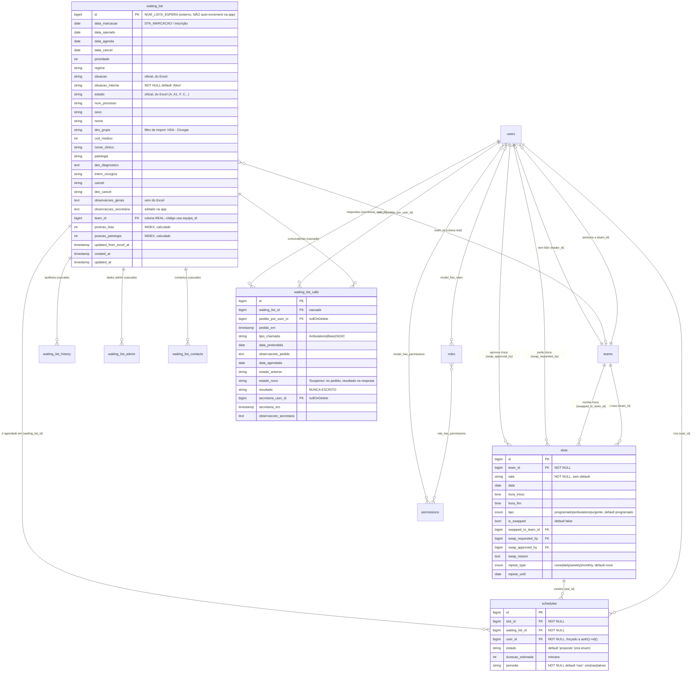

# 02 — Data Model, Database Rules, Queries & Persistência

---

## 1. Visão geral do modelo

O modelo tem **três blocos**:

1. **Núcleo clínico/administrativo** — `waiting_list` e as suas tabelas satélite (`waiting_list_history`, `waiting_list_admin`, `waiting_list_contacts`, `waiting_list_calls`).
2. **Núcleo de agendamento** — `teams`, `slots`, `schedules`, `users`.
3. **Infra-estrutura** — RBAC do Spatie (`roles`, `permissions`, pivots), `sessions`, `cache`, `jobs`, `agenda` (vestigial).

**Ponto central de todo o sistema:** `waiting_list.id` **não é gerado pela aplicação** — é o `NUM_LISTA_ESPERA` do sistema hospitalar, importado do Excel. [CONFIRMADO — `app/Models/WaitingList.php:39` (`public $incrementing = false`), migração `2026_07_05_164325` comentário linha 11, `ExcelImportService::normalizeRow():122-129`]

Consequência: **não há geração de IDs de doente na aplicação**. Um doente só existe no sistema depois de aparecer num ficheiro Excel importado. Não existe fluxo de criação manual (`WaitingListController::store()` está vazio). [CONFIRMADO]

---

## 2. ERD (Mermaid)



> **Nota sobre o ERD:** a relação `waiting_list → teams` está desenhada sobre `team_id`, que é a coluna que **existe realmente na base de dados**. O código PHP refere-se consistentemente a `equipa_id`, que **não existe em nenhuma migração**. Ver `07-inconsistencias-e-bugs.md § B-01`.

---

## 3. Entidades em detalhe

### 3.1 `waiting_list` — Doente em lista de espera

**Migração base:** `2026_07_05_164325_create_waiting_list_table.php`
**Migrações de alteração:** `2026_07_09_184930` (posições), `2026_07_09_224221` (observações)
**Model:** `app/Models/WaitingList.php`

| Coluna | Tipo | Null | Default | Origem | Notas |
|---|---|---|---|---|---|
| `id` | bigint unsigned | Não | — (PK) | Excel `NUM_LISTA_ESPERA` | `$incrementing = false`. **Não auto-gerado pela app.** |
| `data_marcacao` | date | Sim | null | Excel | Data de inscrição em LE. Chave de ordenação primária da listagem. |
| `data_operado` | date | Sim | null | Excel | — |
| `data_agenda` | date | Sim | null | Excel | Agenda **oficial** do hospital, distinta de `schedules`. |
| `data_cancel` | date | Sim | null | Excel | — |
| `prioridade` | integer | Sim | null | Excel | Menor = mais prioritário (usado em `ORDER BY prioridade` ascendente). [INFERIDO da ordenação] |
| `regime` | string | Sim | null | Excel | Ex.: `Internamento`, `Ambulatório`. [INFERIDO — `WaitingListSeeder:31`] |
| `situacao` | string | Sim | null | Excel | Valores observados: `Inscrito`, `Pre-Inscrito`, `Readmitido`, `Transferido Para`, `Operado`, `Cancelado`. |
| `situacao_interna` | string | **Não** | `'Ativo'` | **Aplicação** | Domínio = `ResultadoChamada`. Não está em `$fillable`. |
| `estado` | string | Sim | null | Excel | Valores observados: `A`, `A1`, `F`, `C`. |
| `num_processo` | string | Sim | null | Excel `NUM_PROCESSO` / `UTENTE` | Identificador do doente no hospital. |
| `sexo` | string | Sim | null | Excel | — |
| `nome` | string | Sim | null | Excel `NOME` | **Dado pessoal identificável.** |
| `des_grupo` | string | Sim | null | Excel | Serve de filtro no import (`HSA - Cirurgia`). |
| `cod_medico` | integer | Sim | null | Excel | — |
| `nome_clinico` | string | Sim | null | Excel | Nome do médico. |
| `patologia` | string | Sim | null | Excel | — |
| `des_diagnostico` | text | Sim | null | Excel | — |
| `interv_cirurgica` | string | Sim | null | Excel | — |
| `cancel` | string | Sim | null | Excel | Código de cancelamento. |
| `des_cancel` | string | Sim | null | Excel | Descrição do cancelamento. |
| `observacoes_gerais` | text | Sim | null | Excel (`OBSERVACOES`/`OBSER`) | Sobrescrito a cada import. |
| `observacoes_secretaria` | text | Sim | null | **Aplicação** | Editado via `updateObservacoesGerais`. Nunca tocado pelo import. |
| `team_id` | bigint unsigned FK→`teams.id` | Sim | null | — | **Nunca escrito por nenhum fluxo da aplicação.** Só é preenchido pelo `WaitingListSeeder`. |
| `posicao_lista` | integer, **INDEX** | Sim | null | Calculado | Posição absoluta na LE. |
| `posicao_patologia` | integer, **INDEX** | Sim | null | Calculado | Posição relativa dentro do grupo de patologia. |
| `updated_from_excel_at` | timestamp | Sim | null | Aplicação | Marcado só quando o import **detecta alteração**. |
| `created_at` / `updated_at` | timestamp | Sim | null | Laravel | **Não são preenchidos pelo import** (usa `DB::table()->insertOrIgnore`). |

**Atributo calculado:** `situacao_color` (em `$appends`) → `ResultadoChamada::from($this->situacao_interna)->color()`. [CONFIRMADO — `WaitingList.php:41,88-91`]
→ **Risco:** se `situacao_interna` contiver um valor fora do enum, `from()` lança `ValueError` e **qualquer serialização do model rebenta com 500**. Ver `07 § B-05`.

**Sem soft delete.** Nenhum model do projecto usa `SoftDeletes`. [CONFIRMADO — grep]

---

### 3.2 `waiting_list_history` — Auditoria de alterações do Excel

**Migração:** `2026_07_05_164504` · **Model:** `WaitingListHistory`

| Coluna | Tipo | Null | Default |
|---|---|---|---|
| `id` | bigint | Não | PK auto |
| `waiting_list_id` | FK→`waiting_list.id` **ON DELETE CASCADE** | Não | — |
| `campo_alterado` | string | Não | — |
| `valor_antigo` | text | Sim | null |
| `valor_novo` | text | Sim | null |
| `alterado_em` | timestamp | **Não** | — (escrito com `now()`) |
| `origem` | string | Não | `'excel'` |
| `created_at`/`updated_at` | timestamp | Sim | null (**não preenchidos** — inserção via `DB::table()->insert`) |

**Uso pela Business Logic:** escrita exclusivamente por `ExcelImportService::processBatch()`. **Nunca lida** por nenhum controller ou página. `WaitingListHistoryController` está vazio e sem rotas. [CONFIRMADO]

---

### 3.3 `waiting_list_admin` — Estado administrativo do doente

**Migração:** `2026_07_06_143728` · **Model:** `WaitingListAdmin` (`$table = 'waiting_list_admin'`)

| Coluna | Tipo | Null | Default |
|---|---|---|---|
| `id` | bigint | Não | PK auto |
| `waiting_list_id` | FK→`waiting_list.id` **CASCADE** | Não | — |
| `contactado` | boolean (cast `boolean`) | Não | `false` |
| `data_contacto` | date (cast `date`) | Sim | null |
| `contactado_por` | string | Sim | null |
| `observacoes` | text | Sim | null |
| `created_at`/`updated_at` | timestamp | Sim | null |

**Divergência crítica [CONFIRMADO]:** o model declara `contact_result` em `$fillable` (`WaitingListAdmin.php:17`) e `WaitingListController::updateAdmin` (linha 172) e `WaitingListAdminSeeder` (linha 25) tentam escrever essa coluna — **que não existe em nenhuma migração desta tabela**. A coluna `contact_result` só existe em `waiting_list_contacts`. Ver `07 § B-02`.

**Cardinalidade declarada vs real:** o model `WaitingList` declara `hasOne(WaitingListAdmin)` (linha 60), mas não existe índice único em `waiting_list_id` — a base permite N registos por doente. [CONFIRMADO]

---

### 3.4 `waiting_list_contacts` — Histórico de contactos

**Migração:** `2026_07_09_173922` · **Model:** `WaitingListContact`

| Coluna | Tipo | Null | Default |
|---|---|---|---|
| `id` | bigint | Não | PK auto |
| `waiting_list_id` | FK→`waiting_list.id` **CASCADE** | Não | — |
| `data_contacto` | date | **Não** | — |
| `contactado_por` | string | Sim | null |
| `contact_result` | string | **Não** | — |
| `observacoes` | text | Sim | null |
| `created_at`/`updated_at` | timestamp | Sim | null |

**Domínio de `contact_result`** — não há constraint nem enum PHP. Os valores são fixados **apenas no `<select>` do frontend** [CONFIRMADO — `AdminObservacoesModal.tsx:70-75`]:
`nao_atendeu`, `nao_quer_operar`, `quer_operar_mais_tarde`, `outra_instituicao`, `quer_operar`, `outro`.
O backend valida apenas `required|string` (`WaitingListController:158`) — **qualquer string é aceite**.
O `WaitingListAdminSeeder` usa valores diferentes (`atendeu`, `sem resposta`) — terceiro vocabulário. [CONFIRMADO — `WaitingListAdminSeeder:25`]

---

### 3.5 `waiting_list_calls` — Convocatórias

**Migração:** `2026_07_24_202252` · **Model:** `WaitingListCall` (classe **vazia**)

| Coluna | Tipo | Null | Default | Escrito por |
|---|---|---|---|---|
| `id` | bigint | Não | PK auto | — |
| `waiting_list_id` | FK→`waiting_list.id` **CASCADE** | **Não** | — | `pedirChamada` |
| `pedido_por_user_id` | FK→`users.id` **nullOnDelete** | Sim | null | `pedirChamada` (`auth()->id()`) |
| `pedido_em` | timestamp | Sim | null | `pedirChamada` (`now()`) |
| `tipo_chamada` | string | Sim | null | `pedirChamada` |
| `data_pretendida` | date | Sim | null | `pedirChamada` |
| `observacoes_pedido` | text | Sim | null | `pedirChamada` |
| `data_agendada` | date | Sim | null | `respostaChamada` |
| `estado_anterior` | string | Sim | null | `respostaChamada` (copia o `estado_novo` anterior) |
| `estado_novo` | string | Sim | null | `pedirChamada` → `'Suspenso'`; `respostaChamada` → resultado |
| `resultado` | string | Sim | null | **NUNCA ESCRITO** |
| `secretaria_user_id` | FK→`users.id` **nullOnDelete** | Sim | null | `respostaChamada` |
| `secretaria_em` | timestamp | Sim | null | `respostaChamada` |
| `observacoes_secretaria` | text | Sim | null | `respostaChamada` |
| `created_at`/`updated_at` | timestamp | Sim | null | `pedirChamada`/`respostaChamada` (explicitamente) |

**Bug estrutural [CONFIRMADO]:** a coluna `resultado` é a que dá nome ao conceito e é a **única** usada como critério de "pendente" (`chamadasPendentes` faz `whereNull('resultado')`, linha 90), mas **nenhum código a escreve**. A resposta da secretaria grava em `estado_novo`. Resultado: a lista de convocatórias pendentes nunca esvazia. Ver `07 § B-03`.

**Cardinalidade declarada vs real:** `WaitingList::call()` é `hasOne` (`WaitingList.php:83-86`), mas a tabela aceita N chamadas por doente. `hasOne` sem `latestOfMany()` devolve a linha que o SGBD retornar primeiro — na prática a **mais antiga**. Ver `07 § B-04`.

---

### 3.6 `slots` — Blocos operatórios

**Migração:** `2026_07_05_164402` · **Model:** `Slot`

| Coluna | Tipo | Null | Default | Em `$fillable`? |
|---|---|---|---|---|
| `id` | bigint | Não | PK auto | — |
| `team_id` | FK→`teams.id` | **Não** | — | Sim |
| `sala` | string | **Não** | **sem default** | Sim |
| `data` | date (cast `date`) | Não | — | Sim |
| `hora_inicio` | time (cast `datetime:H:i`) | Não | — | Sim |
| `hora_fim` | time (cast `datetime:H:i`) | Não | — | Sim |
| `tipo` | enum(`programado`,`ambulatorio`,`urgente`) | Não | `programado` | Sim |
| `is_swapped` | boolean (cast) | Não | `false` | Sim |
| `swapped_to_team_id` | FK→`teams.id` | Sim | null | Sim |
| `swap_requested_by` | FK→`users.id` | Sim | null | Sim |
| `swap_approved_by` | FK→`users.id` | Sim | null | Sim |
| `swap_reason` | text | Sim | null | Sim |
| `repeat_type` | enum(`none`,`daily`,`weekly`,`monthly`) | Não | `none` | **NÃO** |
| `repeat_until` | date | Sim | null | **NÃO** |

**Bug [CONFIRMADO]:** `repeat_type` e `repeat_until` **não estão em `$fillable`** (`Slot.php:11-23`). `SlotController::store` faz `Slot::create($data)` — o mass-assignment **descarta silenciosamente** estes dois campos. Os slots gerados existem, mas a BD nunca regista que foram criados por repetição, e `Slots/Index.tsx:58-59` lê `slot.repeat_type`/`slot.repeat_until` que serão sempre `none`/`null`. Ver `07 § B-06`.

**Ausência de constraint de sobreposição:** nada impede dois slots na mesma `sala`, `data` e intervalo horário sobreposto. Não há índice único nem validação. [CONFIRMADO]

**Nenhum fluxo escreve os campos de troca.** `is_swapped`, `swapped_to_team_id`, `swap_requested_by`, `swap_approved_by`, `swap_reason` só são preenchidos pelo `SlotSeeder`. Não existe endpoint de pedido/aprovação de troca, apesar de existirem os métodos `SlotPolicy::requestSwap()` e `approveSwap()`. [CONFIRMADO]

---

### 3.7 `schedules` — Agendamento cirúrgico

**Migração:** `2026_07_05_164433`; alterada por `2026_07_10_220203` (estado) e `2026_07_12_220203` (pernoita) · **Model:** `Schedule`

| Coluna | Tipo | Null | Default |
|---|---|---|---|
| `id` | bigint | Não | PK auto |
| `slot_id` | FK→`slots.id` | **Não** | — |
| `waiting_list_id` | FK→`waiting_list.id` | **Não** | — |
| `user_id` | FK→`users.id` | **Não** | — |
| `estado` | string (era `enum(agendado,realizado,cancelado)`) | Não | `'proposto'` |
| `duracao_estimada` | integer (minutos) | Sim | null |
| `pernoita` | string | **Não** | `'nao'` |

**Histórico do campo `estado` [CONFIRMADO]:**
- Migração original (`164433`): `enum('agendado','realizado','cancelado') default 'agendado'`.
- Migração `2026_07_10_220203`: convertida para `string` com default `'proposto'`, para acomodar o enum PHP `ScheduleEstadoTypes` (`proposto`, `pronto`, `agendado`, `operado`, `cancelado`).
- **A migração `down()` desta alteração aponta para a tabela errada** (`waiting_list_schedules`, que não existe) → o rollback rebenta. [CONFIRMADO — `2026_07_10_220203:25`]
- Consequência: `realizado` deixou de ser válido para o enum PHP, mas linhas antigas com esse valor continuam na BD e fazem `ScheduleEstadoTypes::from()` lançar `ValueError` no accessor `estado_cor`. `resources/js/types/Schedule.ts:6` ainda declara `"realizado"`. Ver `07 § B-07`.

**Sem constraint de BD sobre `estado` nem sobre `pernoita`** — são `string` livres desde a migração de alteração. A validação existe apenas ao nível do controller (`pernoita` sim; `estado` **não**). [CONFIRMADO — `WaitingListController:188-189`]

**Regra de propriedade forçada no model [CONFIRMADO — `Schedule.php:25-32`]:**
```php
static::creating(function ($schedule) {
    if (auth()->check()) { $schedule->user_id = auth()->id(); }
});
```
O `user_id` passado pelo controller é **sempre sobreposto** pelo utilizador autenticado. Se não houver sessão, `user_id` fica nulo → violação de NOT NULL.

**Sem unicidade:** nada impede o mesmo doente ser agendado em vários slots simultaneamente, nem duplicar o mesmo par (`slot_id`, `waiting_list_id`). [CONFIRMADO]

---

### 3.8 `teams` — Equipas cirúrgicas

**Migração:** `2026_07_05_164022`; `cor`/`ativa` em `2026_07_11_083950` · **Model:** `Team`

| Coluna | Tipo | Null | Default | `$fillable` |
|---|---|---|---|---|
| `id` | bigint | Não | PK auto | — |
| `nome` | string | **Não** | — | Sim |
| `leader_id` | FK→`users.id` (**RESTRICT** por omissão) | Sim | null | Sim |
| `cor` | string | Sim | null | Sim |
| `ativa` | boolean | Não | `true` | Sim |

**Ciclo de FK:** `teams.leader_id → users.id` e `users.team_id → teams.id`. Ambas as FKs são `RESTRICT` (default do Laravel). Isto impede apagar um utilizador que seja líder e impede apagar uma equipa com membros. [CONFIRMADO — migrações `164022:12,16`]

**`ativa` nunca é usada como filtro** em nenhuma query da aplicação. Equipas inactivas continuam a aparecer em todos os dropdowns. [CONFIRMADO — grep por `ativa`]

**`Team::waitingList()`** usa `hasMany(WaitingList::class, 'equipa_id')` — FK inexistente. [CONFIRMADO — `Team.php:35`]

**Validação de campo fantasma:** `TeamController::store/update` validam `sala_default` (`TeamController:49,73`), coluna que não existe nem está em `$fillable` → é validada e depois descartada. [CONFIRMADO]

---

### 3.9 `users` — Utilizadores

**Migração:** `0001_01_01_000000`; `role` alterado em `2026_07_12_214647` · **Model:** `User`

| Coluna | Tipo | Null | Default |
|---|---|---|---|
| `id` | bigint | Não | PK auto |
| `name` | string | Não | — |
| `email` | string **UNIQUE** | Não | — |
| `password` | string | Não | — |
| `role` | string (era `enum(admin,secretaria,membro,lider)`) | Não | `'team_member'` |
| `team_id` | FK→`teams.id` | Sim | null |
| `created_at`/`updated_at` | timestamp | Sim | null |

**Colunas em falta [CONFIRMADO]:** a tabela **não tem** `email_verified_at` nem `remember_token`, mas o código escreve em ambas:
- `Settings/ProfileController.php:35` → `$user->email_verified_at = null` quando o e-mail muda.
- `Auth/NewPasswordController.php:51` → `'remember_token' => Str::random(60)`.
- `LoginRequest::authenticate()` → `Auth::attempt($credentials, $this->boolean('remember'))` e o formulário de login tem checkbox "remember" (`auth/login.tsx:15,27`) → o Laravel tenta actualizar `remember_token`.
- `database/factories/UserFactory.php:29,31` usa ambas → **todos os testes que criem utilizadores por factory falham**.
Ver `07 § B-08`.

**Duplicação de papéis [CONFIRMADO]:** existem dois sistemas de papéis em paralelo:
1. Coluna `users.role` (string livre).
2. Roles do Spatie (`model_has_roles`).
Os helpers do model verificam **os dois com OR** (`User.php:39-57`):
```php
public function isAdmin(): bool { return $this->hasRole('admin') || $this->role === 'admin'; }
```
Excepção: `isTeamMember()` verifica **apenas** roles do Spatie, sem fallback para a coluna. [CONFIRMADO — `User.php:54-57`] Ver `07 § B-09`.

**`UserController::store` nunca escreve `role`:** valida `role` (linha 36) mas não o inclui no `User::create()` (linhas 46-51) — o utilizador fica com o default de BD `'team_member'` e o papel real só existe no Spatie. `update()` (linha 86) já escreve, porque faz `$user->update($data)` com o array completo. [CONFIRMADO] → cria dessincronização entre os dois sistemas.

---

### 3.10 Tabelas de infra-estrutura

| Tabela | Migração | Notas |
|---|---|---|
| `agenda` | `2026_07_07_163810` | Só `id` + timestamps. Model é um `Pivot` vazio. `AgendaSeeder` insere 2 linhas sem semântica. **Sem uso.** |
| `password_reset_tokens` | `0001_01_01_000000` | PK = `email` |
| `sessions` | `0001_01_01_000000` | `SESSION_DRIVER=database` |
| `cache`, `cache_locks` | `0001_01_01_000001` | `CACHE_STORE=database`. Usado pelo Spatie Permission. |
| `jobs`, `job_batches`, `failed_jobs` | `0001_01_01_000002` | `QUEUE_CONNECTION=database`. **Nenhum job é despachado.** |
| `permissions`, `roles`, `model_has_permissions`, `model_has_roles`, `role_has_permissions` | `2026_07_09_065800` | Spatie. `teams` do package **desactivado** (`config/permission.php`). Unique em `(name, guard_name)`. |

---

## 4. Database Rules — Integridade

### 4.1 Chaves estrangeiras e comportamento em DELETE

| FK | Origem → Destino | ON DELETE | Consequência prática |
|---|---|---|---|
| `waiting_list_history.waiting_list_id` | → `waiting_list` | **CASCADE** | Apagar um doente apaga a sua auditoria — **perda de rasto**. |
| `waiting_list_admin.waiting_list_id` | → `waiting_list` | **CASCADE** | idem |
| `waiting_list_contacts.waiting_list_id` | → `waiting_list` | **CASCADE** | idem |
| `waiting_list_calls.waiting_list_id` | → `waiting_list` | **CASCADE** | idem |
| `waiting_list_calls.pedido_por_user_id` | → `users` | **SET NULL** | Perde-se quem pediu, mas a chamada sobrevive. |
| `waiting_list_calls.secretaria_user_id` | → `users` | **SET NULL** | idem |
| `waiting_list.team_id` | → `teams` | RESTRICT | Impede apagar equipa com doentes atribuídos. |
| `slots.team_id` | → `teams` | RESTRICT | Impede apagar equipa com slots. |
| `slots.swapped_to_team_id` | → `teams` | RESTRICT | idem |
| `slots.swap_requested_by` / `swap_approved_by` | → `users` | RESTRICT | Impede apagar utilizador envolvido em troca. |
| `schedules.slot_id` | → `slots` | RESTRICT | **`SlotController::destroy` rebenta** se o slot tiver agendamentos. |
| `schedules.waiting_list_id` | → `waiting_list` | RESTRICT | Impede apagar doente com agendamento. **Conflito com os CASCADE acima.** |
| `schedules.user_id` | → `users` | RESTRICT | **`UserController::destroy` rebenta** se o utilizador criou agendamentos. |
| `teams.leader_id` | → `users` | RESTRICT | **`UserController::destroy` rebenta** se o utilizador for líder. |
| `users.team_id` | → `teams` | RESTRICT | **`TeamController::destroy` rebenta** se a equipa tiver membros. |
| `model_has_roles.role_id`, `role_has_permissions.*` | → Spatie | CASCADE | Standard do package. |

> **Regra de integridade combinada:** apagar um `waiting_list` é uma operação **contraditória** — as tabelas satélite fazem CASCADE mas `schedules` faz RESTRICT. Um doente **com agendamento** não pode ser apagado; um **sem agendamento** perde silenciosamente todo o histórico. Nenhum endpoint expõe esta operação (`WaitingListController::destroy` está vazio), portanto na prática nunca é executada pela aplicação. [CONFIRMADO]

### 4.2 Índices

| Tabela | Índice | Tipo |
|---|---|---|
| `users` | `email` | UNIQUE |
| `waiting_list` | `posicao_lista` | INDEX |
| `waiting_list` | `posicao_patologia` | INDEX |
| `sessions` | `user_id`, `last_activity` | INDEX |
| `jobs` | `queue` | INDEX |
| `failed_jobs` | `uuid` | UNIQUE |
| `permissions` | `(name, guard_name)` | UNIQUE |
| `roles` | `(name, guard_name)` | UNIQUE |
| Todas as FKs | índice implícito criado pelo `foreignId()->constrained()` do Laravel | INDEX |

**Índices em falta que afectam as queries reais [INFERIDO — análise das queries em `WaitingListController::index`]:**
`waiting_list.num_processo`, `waiting_list.situacao`, `waiting_list.estado`, `waiting_list.prioridade`, `waiting_list.data_marcacao` — todos usados em filtros/ordenação da listagem paginada, nenhum indexado.
`slots.data` — usado em `whereBetween` em todas as vistas de agenda, não indexado.

### 4.3 Constraints ao nível da base de dados

| Constraint | Onde |
|---|---|
| `slots.tipo` ∈ {programado, ambulatorio, urgente} | ENUM |
| `slots.repeat_type` ∈ {none, daily, weekly, monthly} | ENUM |
| `users.email` único | UNIQUE |
| NOT NULL | ver tabelas acima |

**Constraints que existem apenas no código, não na BD:**
- `schedules.estado` ∈ `ScheduleEstadoTypes` — **não validado nem na BD nem no controller**.
- `schedules.pernoita` ∈ {sim, nao, talvez} — validado **só** no controller (`in:sim,nao,talvez`).
- `waiting_list.situacao_interna` ∈ `ResultadoChamada` — validado **só** em `updateSituacaoInterna` e `respostaChamada`.
- `waiting_list_calls.tipo_chamada` ∈ `TipoChamada` — o enum PHP existe mas **nunca é usado**; a validação é só `required|string`.
- `waiting_list_contacts.contact_result` — sem domínio validado no backend.

---

## 5. Queries e Persistência

### 5.1 Inventário das queries relevantes

| # | Localização | Operação | Notas de performance / correcção |
|---|---|---|---|
| Q1 | `WaitingListController::index:36-44` | SELECT paginado (20) com eager-load `admin, schedule, contacts, call` + filtros + `ORDER BY data_marcacao ASC` | Eager loading correcto (sem N+1). Ordenação sem índice. |
| Q2 | `WaitingListController::index:47-56,70-73` | 3× `SELECT DISTINCT` (situacao, estado, prioridade) | 3 full scans por pedido, sem cache. |
| Q3 | `WaitingListController::index:75-78` | **`WaitingList::all()`** + `map()` sobre todas as linhas | **Carrega a tabela inteira em memória a cada pedido**. O resultado (`$lista`) **não é consumido** pelo frontend (`Index.tsx` não o desestrutura). Ver `07 § B-10`. |
| Q4 | `WaitingListController::index:63-68` | Slots futuros | `where('data','>=', now())` compara coluna DATE com DATETIME → **exclui os slots de hoje**. Ver `07 § B-11`. |
| Q5 | `WaitingListController::export:245-267` | SELECT sem paginação → `Excel::download` | `where('equipa_id', ...)` → **coluna inexistente → erro SQL** para não-admin/não-secretaria. Carrega tudo em memória. |
| Q6 | `AgendaController::index:67-76` | **Todos os slots de sempre** com schedules + waitingList | Sem filtro de data. Cresce sem limite. |
| Q7 | `AgendaController::semana/mensal` | Slots do intervalo + **`WaitingList::whereDoesntHave(...)->get()`** sem limite | Carrega toda a lista de espera não agendada em cada carregamento de agenda. |
| Q8 | `AgendaController::exportPdf:33-46` | Slots do intervalo com schedules ≠ cancelado | OK. |
| Q9 | `WaitingListCallController::chamadasPendentes:89-97` | `DB::table('waiting_list_calls')->whereNull('resultado')` + **1 query por chamada × 2** (doente e utilizador) | **N+1 explícito** (`map` com 2 queries por linha). E `resultado` nunca é escrito → devolve **todas** as chamadas. |
| Q10 | `ExcelImportService::processBatch:196-199` | `SELECT` de existentes por lote (`whereIn id`) | Estratégia correcta — evita N+1. |
| Q11 | `ExcelImportService::processBatch:294-317` | `insertOrIgnore` + `upsert` + `insert` de histórico, **dentro de `DB::transaction`** | Única transacção explícita do projecto. |
| Q12 | `ExcelImportService::updatePositions/ByPatologia` | `UPDATE ... LEFT JOIN (SELECT ROW_NUMBER() OVER ...)` | **MySQL-only**. Full table scan + ordenação. |
| Q13 | `SlotController::index:20-27` | Slots com `team`, filtrados por equipa para não-admin | OK. |
| Q14 | `UserController::index:16` | `User::with('roles')->paginate(10)` | OK. |
| Q15 | `RolePermissionController::index:15-16` | Roles com permissions + todas as permissions | OK. |

### 5.2 Transacções

**Existe exactamente uma transacção explícita em todo o projecto** [CONFIRMADO — grep por `DB::transaction`, `beginTransaction`]:

`ExcelImportService::processBatch()`, linhas 294-317 — envolve `insertOrIgnore(waiting_list)` + `upsert(waiting_list)` + `insert(waiting_list_history)`.

**Alcance da transacção:** apenas **um lote** (default 1000 linhas, `DEFAULT_BATCH_SIZE`). Um ficheiro de 10 000 linhas produz 10 transacções independentes. Se a 7ª falhar, as 6 primeiras já estão commitadas — **o import não é atómico**. Ver `06-erros-edge-cases-e-fluxos.md`.

**Operações que deveriam ser transaccionais e não são:**

| Operação | Passos não atómicos | Risco |
|---|---|---|
| `WaitingListController::updateAdmin` | (1) `WaitingListContact::create` (2) `$waitingList->admin()->update()` | Se (2) falhar (e falha sempre — `contact_result` inexistente), o contacto de (1) **fica órfão** no histórico sem actualizar o estado. |
| `WaitingListCallController::respostaChamada` | (1) `UPDATE waiting_list_calls` (2) `WaitingList::findOrFail` (3) `$doente->save()` | Se (2) falhar (doente apagado), a chamada fica respondida mas o doente não reflecte a situação. |
| `UserController::store` | (1) `User::create` (2) `assignRole` (3) `Team::update(leader_id)` | Falha em (2) deixa utilizador sem papel; falha em (3) deixa equipa sem líder. |
| `TeamController::updateMembers` | (1) `UPDATE users SET team_id=NULL WHERE ...` (2) `UPDATE users SET team_id=? WHERE ...` | Falha entre (1) e (2) deixa utilizadores **sem equipa**. (Método inalcançável — sem rota.) |
| `SlotController::store` com repetição | N× `Slot::create` em loop | Falha a meio deixa série parcialmente criada. |

### 5.3 Locks e concorrência

**Não existe nenhum lock explícito** — nenhum `lockForUpdate()`, `sharedLock()`, `Cache::lock()`, nem coluna de versão/optimistic locking. [CONFIRMADO — grep]

**Race conditions identificadas:**

| ID | Cenário | Mecanismo | Impacto |
|---|---|---|---|
| RC-1 | Dois imports Excel em simultâneo | `processBatch` lê existentes → compara → escreve, sem lock. `updatePositions` corre no fim de ambos. | Histórico duplicado/incoerente; posições calculadas sobre estado intermédio. |
| RC-2 | Import concorrente com edição manual de `observacoes_secretaria` | O `upsert` do import não toca em `observacoes_secretaria` (não está em `getComparableFields`) → **seguro**. Mas toca em `observacoes_gerais`. | Perda de `observacoes_gerais` editadas (que aliás não são editáveis na app). Baixo. |
| RC-3 | Dois utilizadores pedem chamada para o mesmo doente | A verificação (`WaitingListController`… na verdade `WaitingListCallController:26`) e o `INSERT` (linha 30) são duas operações separadas sem lock. | Duas convocatórias para o mesmo doente. |
| RC-4 | Duas secretarias respondem à mesma chamada | `respostaChamada` faz `SELECT` (linha 57) e `UPDATE` (linha 63) sem lock; a segunda sobrepõe a primeira e grava `estado_anterior` já contaminado. | Perda de resposta; `estado_anterior` incorrecto. |
| RC-5 | Dois agendamentos no mesmo slot em simultâneo | Sem constraint de capacidade nem lock. | Over-booking do bloco operatório. |
| RC-6 | `updatePositions` durante leitura da lista | UPDATE massivo sem transacção envolvente. | Utilizador vê posições transitórias/nulas. |

### 5.4 Estratégia de consistência

**Modelo:** consistência imediata (read-your-writes) via redirect + refetch do Inertia. Não há eventual consistency, réplicas, nem CQRS.

**Padrão de resposta pós-escrita:** todos os endpoints de escrita devolvem `back()` ou `redirect()`, o que faz o Inertia refazer o GET da página — os dados são sempre relidos da BD. [CONFIRMADO]

**Excepção:** `Slots/CreateScheduleModal.tsx:35` faz `router.reload({ only: ['agenda'] })` — recarrega parcialmente. `Agenda/Semana.tsx:83-93,104-106` sincroniza o modal aberto com as props actualizadas via `useEffect`.

### 5.5 Cache

| Cache | Onde | TTL | Invalidação |
|---|---|---|---|
| **Permissões Spatie** | `config/permission.php:183-205`, store `default` = `database` | 24h | Automática pelo package em alterações de roles/permissions. `RolesSeeder:13` força `forgetCachedPermissions()`. |
| **Config/Routes/Views do Laravel** | `deploy.sh:21-23` (`config:cache`, `route:cache`, `view:cache`) | Até novo deploy | Manual, via `deploy.sh`. |
| **Cache aplicacional** | — | — | **Não existe.** Nenhum `Cache::remember` no código de domínio. |

**Nota:** com `config:cache` activo, `env()` deixa de funcionar fora dos ficheiros de config. `ExcelImportService::shouldRecalculatePositions():420` usa `getenv('EXCEL_IMPORT_POSITION_RECALC_LIMIT')` — `getenv()` **não lê o ficheiro `.env`** do Laravel (só variáveis reais do ambiente). Na prática o limite será sempre o default de 20 000. [CONFIRMADO/INFERIDO]

### 5.6 Processamento assíncrono ligado a persistência

**Não existe.** Apesar de `QUEUE_CONNECTION=database` e das tabelas `jobs`/`failed_jobs` estarem criadas, **nenhum job é despachado** em todo o projecto. [CONFIRMADO — grep sem `dispatch(`, `ShouldQueue`, `->onQueue`]

Consequência directa: a **importação de Excel corre de forma síncrona dentro do request HTTP**, com `set_time_limit(0)` e `max_execution_time=0` (`ExcelImportController:13-14`). Um ficheiro grande bloqueia o worker PHP durante todo o processamento e depende do timeout do servidor web (fora do controlo do Laravel).
