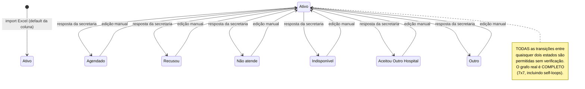
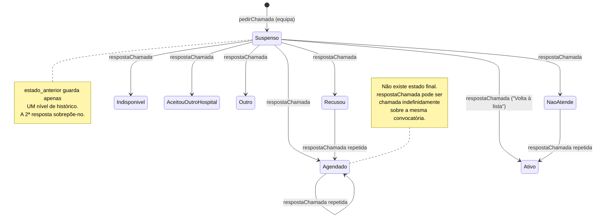
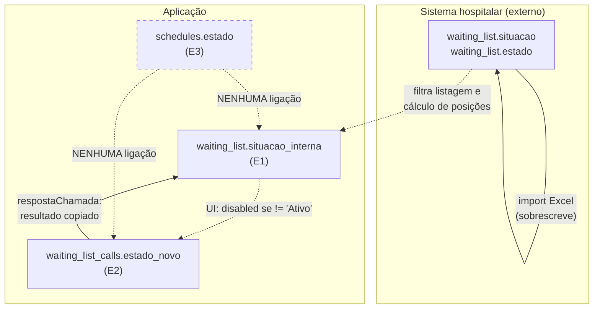

# 06 — Estados e State Machines

O sistema tem **quatro** conjuntos de estado distintos, todos sobre o mesmo doente ou o seu agendamento. Nenhum deles tem uma máquina de estados implementada: **não existe qualquer verificação de transição válida em todo o projecto**. Todas as transições são atribuições directas.

| # | Entidade / Campo | Domínio definido em | Transições validadas? |
|---|---|---|---|
| E1 | `waiting_list.situacao_interna` | `App\Enum\ResultadoChamada` | ❌ Não |
| E2 | `waiting_list_calls.estado_novo` | Strings livres (`'Suspenso'` + `ResultadoChamada`) | ❌ Não |
| E3 | `schedules.estado` | `App\Enum\ScheduleEstadoTypes` | ❌ Não |
| E4 | `waiting_list.situacao` / `.estado` | Externo (Excel) | N/A — só leitura |

---

## E1 — `waiting_list.situacao_interna`

**Fonte de verdade do estado interno do doente na aplicação.**

### Estados possíveis

[CONFIRMADO — `app/Enum/ResultadoChamada.php`]

| Valor armazenado | Label na UI | Cor |
|---|---|---|
| `Ativo` | **"Volta à lista"** | `bg-yellow-600` |
| `Agendado` | Agendado | `bg-blue-600` |
| `Recusou` | Recusou | `bg-red-600` |
| `Não atende` | Não atende | `bg-gray-600` |
| `Indisponível` | Indisponível | `bg-orange-600` |
| `Aceitou Outro Hospital` | Aceitou Outro Hospital | `bg-purple-600` |
| `Outro` | Outro | `bg-slate-600` |

> **Ambiguidade [CONFIRMADO]:** o `label()` de `Ativo` é `'Volta à lista'`, mas o `value` é `'Ativo'`. O método `label()` **nunca é chamado** — nem no PHP nem no frontend (o `SituacaoInternaModal` e o `SituacaoBadge` mostram o `value` cru). Ou seja, a UI mostra "Ativo" onde o autor pretendia mostrar "Volta à lista". Ver `08 § B-25`.

### Estado inicial

`'Ativo'` — imposto pelo **default da coluna** (`waiting_list.situacao_interna DEFAULT 'Ativo'`, migração `2026_07_05_164325:23`), não por código da aplicação. Como o import usa `DB::table()->insertOrIgnore` sem incluir esta coluna, todos os doentes importados entram em `Ativo`. [CONFIRMADO]

### Diagrama



### Quem provoca cada transição

| Origem da transição | Endpoint | Autorização | Estado destino |
|---|---|---|---|
| **Secretaria responde a convocatória** | `POST /waiting-list/chamada/{callId}/resposta` | 🔓 **nenhuma** | Qualquer valor de `ResultadoChamada` |
| **Edição manual** | `POST /waiting-list/{id}/situacao-interna` | 🔓 **nenhuma** | Qualquer valor de `ResultadoChamada` |
| **Import Excel** | — | — | **Nunca altera** (campo protegido) |

### Condições e restrições

| Aspecto | Estado |
|---|---|
| Pré-condição de transição | **Nenhuma.** O valor só tem de pertencer ao enum. |
| Transições inválidas | **Nenhuma é bloqueada.** `Agendado → Ativo`, `Recusou → Agendado`, `Ativo → Ativo` são todas aceites. |
| Estados finais | **Não existem.** Qualquer estado pode voltar a `Ativo`. |
| Efeito colateral | Só um: controla `disabled` do botão "Convocar" na UI (`Index.tsx:517`) e a cor do badge. |

### Regra implícita de elegibilidade

> **R-E1:** Um doente só é elegível para nova convocatória quando `situacao_interna === 'Ativo'`.

[CONFIRMADO — `WaitingList/Index.tsx:517`] Esta regra existe **apenas no frontend**, como atributo `disabled`. O endpoint `pedir-chamada` **não a verifica** — usa uma guarda diferente e ineficaz sobre `call->estado_novo`. Um pedido enviado directamente contorna-a. Ver `08 § B-26`.

### Risco de estado inválido

`WaitingList::getSituacaoColorAttribute()` faz `ResultadoChamada::from($this->situacao_interna)`. Se a coluna contiver um valor fora do enum — por escrita directa em BD, por importação de dados legados, ou pelo `WaitingListSeeder`/`ExcelImportService` se alguma vez lhe tocassem — **`from()` lança `ValueError`**. Como `situacao_color` está em `$appends`, o erro dispara em **qualquer serialização do model**, rebentando a listagem, a agenda e as convocatórias com 500. [CONFIRMADO — `WaitingList.php:41,88-91`]

O mesmo cálculo é repetido, redundantemente, em `WaitingListController::index:76`.

---

## E2 — `waiting_list_calls.estado_novo` (ciclo de vida da convocatória)

### Estados possíveis

Não há enum. Os valores observados no código são:

| Valor | Escrito por | Pertence a `ResultadoChamada`? |
|---|---|---|
| `Suspenso` | `pedirChamada:37` | ❌ **Não** |
| `Agendado` | `respostaChamada:67` | ✅ |
| `Ativo` | idem | ✅ |
| `Recusou` | idem | ✅ |
| `Não atende` | idem | ✅ |
| `Indisponível` | idem | ✅ |
| `Aceitou Outro Hospital` | idem | ✅ |
| `Outro` | idem | ✅ |
| `Operado` | *(só lido em `pedirChamada:26`)* | ❌ **Nunca escrito** |

### Diagrama



### Transições e responsáveis

| Transição | Quem | Endpoint | Pré-condição | Side effects |
|---|---|---|---|---|
| `[*] → Suspenso` | Equipa cirúrgica (**na prática: qualquer pessoa**) | `POST /waiting-list/{id}/pedir-chamada` | `data_pretendida > hoje`; doente existe; guarda R-CH1 (ineficaz) | `INSERT waiting_list_calls`. **Não** altera `waiting_list.situacao_interna` |
| `Suspenso → <resultado>` | Secretaria (**na prática: qualquer pessoa**) | `POST /waiting-list/chamada/{callId}/resposta` | Chamada existe; `resultado` ∈ enum; `data_agendada` se `Agendado` | `UPDATE waiting_list_calls` (`estado_anterior` ← valor actual) + `UPDATE waiting_list.situacao_interna` |
| `<qualquer> → <qualquer>` | idem | idem | **Sem verificação de que já foi respondida** | idem — sobrepõe a resposta anterior |

### Regra de guarda R-CH1 e as suas falhas

[CONFIRMADO — `WaitingListCallController.php:26-28`]
```php
if ($doente->call && in_array($doente->call->estado_novo, ['Suspenso','Agendado','Operado'])) {
    return back()->with('error', 'Doente não pode ser chamado.');
}
```

**Intenção [INFERIDO]:** impedir uma segunda convocatória enquanto a primeira está em curso, ou quando o doente já foi agendado/operado.

**Falhas [CONFIRMADO]:**

| # | Falha |
|---|---|
| 1 | `$doente->call` é `hasOne` sem `latestOfMany()` → devolve a chamada **mais antiga**. A partir da segunda convocatória, a guarda avalia sempre a primeira. |
| 2 | Depois de respondida a primeira chamada (p.ex. `estado_novo = 'Recusou'`), a guarda **nunca mais bloqueia** — pode-se convocar indefinidamente. |
| 3 | `'Operado'` nunca é escrito por lado nenhum → esse ramo é código morto. |
| 4 | O bloqueio devolve `->with('error', ...)`, que **não é lido pelo frontend** → o utilizador vê a UI comportar-se como sucesso. |
| 5 | A guarda inspecciona a convocatória, não `waiting_list.situacao_interna` — o estado do doente e o estado da convocatória divergem por construção. |

### Divergência com a coluna `resultado`

A tabela tem uma coluna `resultado` desenhada para este conceito (o comentário da migração lista `Agendado / VoltaLista / Recusou / NA / Indisponível`). **Nunca é escrita.** A resposta grava em `estado_novo`. `chamadasPendentes` filtra por `resultado IS NULL` → **nenhuma convocatória sai da lista de pendentes**. [CONFIRMADO] Ver `08 § B-03`.

---

## E3 — `schedules.estado` (agendamento cirúrgico)

### Estados possíveis

[CONFIRMADO — `app/Enum/ScheduleEstadoTypes.php`]

| Valor | Cor | Semântica [INFERIDO] |
|---|---|---|
| `proposto` | `bg-yellow-500` | Proposta inicial de agendamento |
| `pronto` | `bg-blue-500` | Doente preparado (pré-operatório concluído) |
| `agendado` | `bg-orange-500` | Confirmado no bloco |
| `operado` | `bg-green-500` | Cirurgia realizada |
| `cancelado` | `bg-red-500` | Cancelado |

### Estado inicial

`'proposto'` — default da coluna após a migração `2026_07_10_220203`. O frontend também inicializa com `'proposto'` (`CreateScheduleModal.tsx:13`). [CONFIRMADO]

### Diagrama do fluxo pretendido vs implementado

```mermaid
stateDiagram-v2
    direction LR
    [*] --> proposto

    proposto --> pronto
    pronto --> agendado
    agendado --> operado
    proposto --> cancelado
    pronto --> cancelado
    agendado --> cancelado
    operado --> [*]
    cancelado --> [*]

    note right of proposto
        FLUXO PRETENDIDO (inferido da
        ordem do enum e das cores).

        IMPLEMENTADO: nenhuma destas
        setas é verificada. O <select>
        do frontend oferece os 5 estados
        em qualquer momento e o backend
        valida apenas 'required|string'.
        O grafo real é COMPLETO (5x5).
    end note
```



**Estado das transições [CONFIRMADO]:**

| Aspecto | Realidade |
|---|---|
| Validação de enum no backend | **Nenhuma** — `'estado' => 'required|string'` (`WaitingListController:188,221`) |
| Constraint na BD | **Nenhuma** — coluna `string` desde `2026_07_10_220203` |
| Verificação de transição | **Nenhuma** |
| Opções na UI | Os 5 estados, sempre, sem filtro pelo estado actual (`CreateScheduleModal.tsx:81-85`, `EditScheduleModal.tsx:71-75`, `ScheduleModal.tsx:238-242`) |
| Consequência | `operado → proposto` é possível. Um valor arbitrário como `"xyz"` grava-se e depois rebenta o accessor `estado_cor`. |

### Quem pode provocar cada transição

| Transição | Endpoint | Autorização efectiva |
|---|---|---|
| Criação (`[*] → <qualquer>`) | `POST /waiting-lists/{id}/schedule` | `schedules.create` **+** `waiting_list.manage` **+** `SlotPolicy::schedule` → **só `admin`** na config de raiz |
| Alteração (`<qualquer> → <qualquer>`) | `PUT /waiting-lists/{id}/schedule/{schedule}` | `schedules.edit` + as anteriores → **só `admin`** |
| Eliminação física | — | **Não existe endpoint** |

### Side effects por estado

| Estado | Efeito |
|---|---|
| `cancelado` | **Único estado com efeito real:** exclui o agendamento de todas as vistas de agenda e do PDF (`AgendaController`, 4 locais). |
| `agendado` | Deveria excluir o doente da lista de "disponíveis para agendar" (`AgendaController:146,201`), mas a condição inclui também `'confirmado'`, valor inexistente. |
| `operado` | **Nenhum efeito.** Não escreve `waiting_list.data_operado`, não altera `situacao_interna`, e o doente **continua a aparecer como disponível** para novo agendamento. |
| `proposto`, `pronto` | Apenas cor no ecrã. |

### Estado legado `realizado`

[CONFIRMADO] A migração original (`2026_07_05_164433:14`) definia `enum('agendado','realizado','cancelado') DEFAULT 'agendado'`. A migração `2026_07_10_220203` converteu a coluna para `string` e o enum PHP passou a não incluir `realizado`.

Consequências:
- Linhas gravadas antes da migração com `realizado` (ou `agendado` como default antigo) continuam válidas na BD.
- `ScheduleEstadoTypes::from('realizado')` lança **`ValueError`** → o accessor `estado_cor` (em `$appends`) rebenta ao serializar esse `Schedule` → **500 em qualquer página de agenda que o inclua**.
- `resources/js/types/Schedule.ts:6` continua a declarar `"realizado"` e **não** declara `"pronto"` nem `"operado"` — o tipo TypeScript está dessincronizado do enum PHP.
- A migração `down()` de `2026_07_10_220203:25` referencia a tabela `waiting_list_schedules`, **que não existe** → rollback impossível.

Ver `08 § B-07`.

---

## E4 — `waiting_list.situacao` e `waiting_list.estado` (estado externo)

**Origem:** sistema hospitalar, via Excel. **A aplicação nunca os escreve fora do import.** [CONFIRMADO]

### `situacao` — valores conhecidos

| Valor | Origem da evidência |
|---|---|
| `Inscrito` | filtro default `WaitingListController:28`; `WaitingListSeeder:32` |
| `Pre-Inscrito` | idem |
| `Readmitido` | filtro default `WaitingListController:28` |
| `Transferido Para` | idem |
| `Operado` | exclusão em `updatePositionsByPatologia:470` |
| `Cancelado` | idem |

**[NÃO DETERMINÁVEL]** se esta lista é exaustiva — o domínio pertence ao sistema hospitalar e não está documentado no código. Os dropdowns da UI são construídos com `SELECT DISTINCT situacao` sobre os dados reais (`WaitingListController:47-50`), o que confirma que a aplicação **não conhece o domínio a priori**.

### `estado` — valores conhecidos

| Valor | Origem |
|---|---|
| `A` | filtro default `WaitingListController:32`; `WaitingListSeeder:33` |
| `A1` | `WaitingListSeeder:33` |
| `F`, `C` | exclusões em `ExcelChunkProcessor:238,261` (código morto) |

**[INFERIDO]** `A`/`A1` = activo; `F` = fechado/finalizado; `C` = cancelado. Não há nada no código que confirme esta leitura.

### Regras de negócio que dependem destes campos

| Regra | Onde | Confiança |
|---|---|---|
| Listagem mostra por omissão só `situacao ∈ {Readmitido, Inscrito, Pre-Inscrito, Transferido Para}` e `estado = 'A'` | `WaitingListController:27-33` | [CONFIRMADO] |
| `posicao_patologia` exclui `situacao ∈ {Operado, Cancelado}` | `ExcelImportService:470` | [CONFIRMADO] |
| `posicao_lista` **não exclui nada** | `ExcelImportService:432-447` | [CONFIRMADO] — contradiz a regra anterior |
| Importador morto excluiria também `estado ∈ {F, C}` de **ambas** as posições | `ExcelChunkProcessor:238,261` | [CONFIRMADO] — regra alternativa não activa |

**Comparações case-sensitive com valores hard-coded** em todos os pontos acima. Se o sistema hospitalar exportar `OPERADO` ou `operado`, os filtros deixam de funcionar silenciosamente. [CONFIRMADO]

---

## Relação entre as quatro máquinas de estado



**Conclusão estrutural [CONFIRMADO]:**

1. **`situacao` (externo) e `situacao_interna` (interno) nunca são reconciliados.** Um doente pode estar `situacao = 'Operado'` no hospital e `situacao_interna = 'Ativo'` na aplicação, e continuar a ser convocável. Não há regra que force coerência.
2. **A única ligação real entre máquinas é `E2 → E1`** (resposta da secretaria copia o resultado para a situação interna).
3. **`schedules.estado` (E3) está completamente isolado.** Marcar um agendamento como `operado` não escreve `waiting_list.data_operado`, não altera `situacao_interna` e não fecha a convocatória correspondente. E marcar a convocatória como `Agendado` não cria nenhum `Schedule`.
4. **Existem, portanto, três noções independentes de "este doente está agendado"** — `waiting_list.data_agenda` (do hospital), `waiting_list_calls.data_agendada` (da secretaria) e `schedules` com `estado = 'agendado'` (do bloco) — sem qualquer sincronização entre elas. Ver `08 § B-27`.
