# 09 — Business Rules Matrix, Dependency Map e Glossário

---

## 1. Business Rules Matrix

Cada regra tem uma referência precisa ao local onde foi identificada. Coluna **Estado**: ✅ funcional · ⚠️ parcialmente funcional · ❌ não funcional (ver `08`).

### 1.1 Importação de Excel

| ID | Regra | Contexto | Condição | Acção | Excepção | Fonte | Estado |
|---|---|---|---|---|---|---|---|
| BR-01 | Só linhas do serviço `HSA - Cirurgia` são importadas | Import | Coluna `des_grupo` presente e ≠ (case-insensitive) | Linha descartada | Se a coluna estiver ausente ou `null`, **nenhum filtro é aplicado** | `ExcelImportService.php:116-121` | ⚠️ |
| BR-02 | Linhas sem identificador válido são descartadas | Import | `(int)id <= 0` | Linha descartada | — | `ExcelImportService.php:122-125` | ✅ |
| BR-03 | O identificador do doente vem do sistema hospitalar | Import / Modelo | Sempre | `$incrementing = false`; id do Excel usado como PK | — | `WaitingList.php:39`; migração `2026_07_05_164325:11` | ✅ |
| BR-04 | Cabeçalhos aceitam múltiplos aliases | Import | Nome da coluna ∈ `headerMap` | Mapeia para o campo interno | **Case-sensitive**; colunas desconhecidas descartadas em silêncio | `ExcelImportService.php:16-52,108-114` | ✅ |
| BR-05 | Datas são normalizadas para `Y-m-d` por 9 estratégias sucessivas | Import | Sempre, nos 4 campos de data | Aplica a 1.ª estratégia que resolva | Falha → `null` (apaga a data existente) | `ExcelImportService.php:356-396` | ⚠️ |
| BR-06 | Números são interpretados como serial Excel (época 1900) | Import | `is_numeric($value)` | `($v - 25569) * 86400` | Ficheiros Mac (época 1904) ficam 4 anos adiantados | `ExcelImportService.php:366-368` | ⚠️ |
| BR-07 | Datas com `/` usam formato português `d/m/Y` | Import | String contém `/` | `createFromFormat('d/m/Y')` | Falha → `Carbon::parse` (heurística americana) | `ExcelImportService.php:383-388` | ⚠️ |
| BR-08 | Dentro do mesmo lote, a última linha com o mesmo id vence | Import | Id repetido | Sobrepõe no buffer | Ids repetidos em lotes diferentes são ambos processados | `ExcelImportService.php:83` | ⚠️ |
| BR-09 | Registo inexistente → INSERT sem histórico | Import | `!isset($existing[$id])` | `insertOrIgnore`; `importados++` | — | `ExcelImportService.php:233-237,298` | ✅ |
| BR-10 | Registo existente é comparado em 18 campos normalizados | Import | Registo existe | Comparação estrita após normalização | `cod_medico` e `interv_cirurgica` **excluídos** | `ExcelImportService.php:244-277,323-345` | ⚠️ |
| BR-11 | Só o **primeiro** campo alterado gera histórico | Import | Diferença detectada | Grava 1 linha e faz `break` | **Auditoria estruturalmente incompleta** | `ExcelImportService.php:262-276` | ❌ |
| BR-12 | Alteração detectada → marca `updated_from_excel_at` | Import | `changed === true` | `= now()` | — | `ExcelImportService.php:280` | ✅ |
| BR-13 | Campos da aplicação são protegidos do import | Import | Sempre | `situacao_interna`, `observacoes_secretaria`, `posicao_*`, `team_id` não são tocados | — | `ExcelImportService.php:323-345` (por omissão) | ✅ |
| BR-14 | Escrita do lote é atómica | Import | Sempre | `DB::transaction` | Atómica **por lote**, não por ficheiro | `ExcelImportService.php:294-317` | ⚠️ |
| BR-15 | Posições só são recalculadas abaixo de 20 000 registos | Import | `COUNT(*) <= limite` | Executa 2 UPDATEs massivos | Acima do limite, **salta em silêncio** | `ExcelImportService.php:411-424` | ⚠️ |
| BR-16 | Recálculo de posições exige MySQL | Import | `getDriverName() === 'sqlite'` | `return` imediato | — | `ExcelImportService.php:428,450` | ✅ |
| BR-17 | Posição absoluta = ordem por prioridade, depois data de inscrição, depois id | Import | Recálculo activo | `ROW_NUMBER()` sobre **todos** os registos | **Não exclui operados/cancelados** | `ExcelImportService.php:432-447` | ⚠️ |
| BR-18 | Posição relativa = ordem dentro do grupo dos 2 primeiros caracteres do diagnóstico | Import | Recálculo activo | `PARTITION BY LEFT(des_diagnostico,2)` | Exclui `situacao ∈ {Operado, Cancelado}`; excluídos ficam a `NULL` | `ExcelImportService.php:456-473` | ⚠️ |
| BR-19 | Só ficheiros `.xlsx` são aceites | Import | MIME ou extensão ≠ | `422` / `withErrors` | Sem limite de tamanho na aplicação | `ExcelImportController.php:16-25` | ✅ |

### 1.2 Lista de Espera

| ID | Regra | Contexto | Condição | Acção | Excepção | Fonte | Estado |
|---|---|---|---|---|---|---|---|
| BR-20 | Por omissão, só doentes activos são listados | Listagem | `situacao` vazio | Aplica `['Readmitido','Inscrito','Pre-Inscrito','Transferido Para']` | O botão "Limpar" reactiva o default — não é possível ver tudo | `WaitingListController.php:27-29` | ✅ |
| BR-21 | Por omissão, só `estado = 'A'` | Listagem | `estado` vazio | Aplica `['A']` | Laravel reduz o array ao 1.º elemento | `WaitingListController.php:31-33` | ⚠️ |
| BR-22 | Ordenação por data de inscrição ascendente | Listagem | Sempre | `ORDER BY data_marcacao ASC` | Não usa `posicao_lista` | `WaitingListController.php:42` | ✅ |
| BR-23 | Paginação de 20 registos | Listagem | Sempre | `paginate(20)->withQueryString()` | — | `WaitingListController.php:43-44` | ✅ |
| BR-24 | Filtro de diagnóstico é parcial; os restantes são exactos | Listagem | Parâmetro presente | `LIKE %v%` vs `=` | — | `WaitingListController.php:37-41` | ✅ |
| BR-25 | Equipas e slots oferecidos são restritos à equipa do utilizador | Listagem | `!isAdmin() && !isSecretary()` | `where('id'/'team_id', user.team_id)` | **A query principal de doentes NÃO é restrita** | `WaitingListController.php:59,66` | ⚠️ |
| BR-26 | Só slots futuros e não trocados são oferecidos | Listagem | Sempre | `data >= now()` e `is_swapped = false` | Comparação DATE vs DATETIME **exclui os slots de hoje** | `WaitingListController.php:64-65` | ⚠️ |
| BR-27 | Admin e secretaria vêem toda a lista de espera | Policy | `isAdmin() \|\| isSecretary()` | Acesso total | — | `WaitingListPolicy.php:22-24` | ✅ |
| BR-28 | Membro só vê doentes da sua equipa | Policy | Caso contrário | `belongsToTeam($wl->equipa_id)` | **`equipa_id` não existe** → sempre `false`; e `view()` nunca é invocada | `WaitingListPolicy.php:27` | ❌ |
| BR-29 | Membro de equipa nunca edita a lista de espera | Policy | Não é admin/secretaria/líder | `return false` | — | `WaitingListPolicy.php:47` | ✅ |
| BR-30 | Líder edita apenas doentes da sua equipa | Policy | `isTeamLeader()` | `belongsToTeam($wl->equipa_id)` | **`equipa_id` não existe** → líderes não editam nada | `WaitingListPolicy.php:42-44` | ❌ |
| BR-31 | Exportação restrita à equipa para não-admin/secretaria | Export | `!isAdmin() && !isSecretary()` | `where('equipa_id', team_id)` | **Erro SQL** — coluna inexistente | `WaitingListController.php:247-249` | ❌ |
| BR-32 | O export não aplica os filtros por omissão da listagem | Export | Sempre | Só os filtros explícitos | O ficheiro contém doentes que não estavam no ecrã; `prioridade` é ignorada | `WaitingListController.php:251-265` | ⚠️ |
| BR-33 | O export contém 10 colunas fixas | Export | Sempre | Inclui `posicao_lista` e `posicao_patologia`; **não** inclui `nome` | Cabeçalho da 10.ª coluna desalinhado | `WaitingListExport.php:16-48` | ⚠️ |
| BR-34 | `observacoes_secretaria` é o único campo de texto editável | Observações | `waiting_list.manage` + policy | `UPDATE waiting_list` | O nome da rota/método diz "gerais" mas escreve o campo da secretaria | `WaitingListController.php:272-287` | ✅ |
| BR-35 | Cada contacto administrativo gera um registo imutável de histórico | Contactos | Sempre | `INSERT waiting_list_contacts` | — | `WaitingListController.php:163-169` | ✅ |
| BR-36 | O estado administrativo é actualizado após o contacto | Contactos | Sempre | `admin()->update($data)` | **Erro SQL** (`contact_result`); e `hasOne` sem registo → 0 linhas | `WaitingListController.php:172` | ❌ |
| BR-37 | O domínio de `contact_result` é definido só no frontend | Contactos | — | 6 valores no `<select>` | Backend valida `required\|string`; seeder usa um 3.º vocabulário | `AdminObservacoesModal.tsx:70-75` | ⚠️ |

### 1.3 Convocatórias

| ID | Regra | Contexto | Condição | Acção | Excepção | Fonte | Estado |
|---|---|---|---|---|---|---|---|
| BR-38 | A data pretendida tem de ser estritamente futura | Pedido | Sempre | `after:today` | — | `WaitingListCallController.php:19` | ✅ |
| BR-39 | Não convocar doente já suspenso, agendado ou operado | Pedido | `call->estado_novo ∈ {Suspenso, Agendado, Operado}` | Bloqueia com flash `error` | `hasOne` devolve a chamada mais antiga; flash invisível; `Operado` nunca é escrito | `WaitingListCallController.php:26-28` | ❌ |
| BR-40 | Uma nova convocatória entra em estado `Suspenso` | Pedido | Sempre | `estado_novo = 'Suspenso'` | **`waiting_list.situacao_interna` NÃO é alterado** apesar do toast afirmar o contrário | `WaitingListCallController.php:37,45` | ❌ |
| BR-41 | Só doentes `Ativo` podem ser convocados | UI | `situacao_interna !== 'Ativo'` | Botão `disabled` | **Regra só no cliente** — o endpoint não a verifica e é público | `WaitingList/Index.tsx:517` | ⚠️ |
| BR-42 | O resultado da chamada torna-se a situação interna do doente | Resposta | Sempre | `doente.situacao_interna = resultado` | Não transaccional com o UPDATE da chamada | `WaitingListCallController.php:75-77` | ✅ |
| BR-43 | O estado anterior da convocatória é preservado | Resposta | Sempre | `estado_anterior ← estado_novo actual` | Só 1 nível; a 2.ª resposta sobrepõe-no | `WaitingListCallController.php:66` | ⚠️ |
| BR-44 | `data_agendada` é obrigatória se o resultado for `Agendado` | Resposta | `resultado === 'Agendado'` | `required_if` | Sem `after:today` — aceita datas passadas | `WaitingListCallController.php:53` | ✅ |
| BR-45 | O resultado tem de pertencer a `ResultadoChamada` | Resposta | Sempre | `Rule::enum` | — | `WaitingListCallController.php:52` | ✅ |
| BR-46 | Convocatórias pendentes = `resultado IS NULL`, por ordem de pedido | Pendentes | Sempre | `whereNull('resultado')` | **A coluna nunca é escrita** → devolve tudo | `WaitingListCallController.php:90-91` | ❌ |
| BR-47 | O tipo de chamada é `Ambulatorio`, `Base` ou `SIGIC` | Pedido | — | Definido só no `<select>` | O enum `TipoChamada` existe e **nunca é usado**; backend aceita qualquer string | `PedirChamadaModal.tsx:65-67`; `TipoChamada.php` | ⚠️ |

### 1.4 Blocos e Agendamentos

| ID | Regra | Contexto | Condição | Acção | Excepção | Fonte | Estado |
|---|---|---|---|---|---|---|---|
| BR-48 | Utilizador não-admin vê os seus slots e os recebidos por troca | Slots | `!isAdmin() && !isSecretary()` | `team_id = X OR swapped_to_team_id = X` | — | `SlotController.php:22-27` | ✅ |
| BR-49 | Slots podem repetir-se diária, semanal ou mensalmente até uma data | Slots | `repeat_type !== 'none'` | Ciclo de `Slot::create` | Sem transacção, sem limite; `repeat_until` nulo + data passada → série longa | `SlotController.php:61-91` | ⚠️ |
| BR-50 | Os metadados de repetição são guardados no slot | Slots | — | — | **`repeat_type`/`repeat_until` fora de `$fillable`** → descartados | `Slot.php:11-23` | ❌ |
| BR-51 | Qualquer membro da equipa proprietária pode editar o slot | Policy | `slots.edit` + `belongsToTeam(team_id)` | Permite | Admin/secretaria passam sempre | `SlotPolicy.php:20-31` | ✅ |
| BR-52 | Apagar um slot exige ser líder da equipa proprietária | Policy | `slots.delete` + `isTeamLeader()` + `belongsToTeam` | Permite | Admin/secretaria passam sempre | `SlotPolicy.php:33-44` | ✅ |
| BR-53 | Num slot trocado, quem agenda é a equipa receptora | Policy | `is_swapped === true` | `belongsToTeam(swapped_to_team_id)` | Nenhum fluxo escreve os campos de troca | `SlotPolicy.php:62-68`; `SchedulePolicy.php:28-34` | ⚠️ |
| BR-54 | Pedir troca cabe a qualquer membro da equipa proprietária | Policy | `schedules.move` + `belongsToTeam(team_id)` | Permite | **Sem endpoint** | `SlotPolicy.php:71-79` | ❌ |
| BR-55 | Aprovar troca cabe ao líder da equipa proprietária | Policy | `schedules.move` + `isTeamLeader()` + `belongsToTeam` | Permite | **Sem endpoint** | `SlotPolicy.php:81-89` | ❌ |
| BR-56 | Agendar exige `schedules.create` **e** `waiting_list.manage` **e** propriedade do slot | Agendamento | Todas | Cria `Schedule` | **Só o admin reúne as três** na config de raiz | `routes/web.php:38`; `WaitingListController.php:183,194` | ⚠️ |
| BR-57 | O autor do agendamento é sempre o utilizador autenticado | Agendamento | `auth()->check()` | `user_id = auth()->id()` (sobrepõe o valor recebido) | Sem sessão → `user_id` nulo → violação de NOT NULL | `Schedule.php:25-32` | ✅ |
| BR-58 | `pernoita` ∈ {sim, nao, talvez} | Agendamento | Sempre | `in:sim,nao,talvez` | Obrigatório também no cancelamento → **parte o cancelamento pela UI** | `WaitingListController.php:189,222` | ⚠️ |
| BR-59 | O estado do agendamento não é validado contra o enum | Agendamento | Sempre | `required\|string` | Valores inválidos gravam-se e rebentam o accessor `estado_cor` | `WaitingListController.php:188,221` | ❌ |
| BR-60 | Não existem regras de capacidade ou exclusividade | Agendamento | — | — | Sem verificação de duração vs slot, de duplicados ou de doente já operado | ausência confirmada em `WaitingListController.php:181-212` | ❌ |
| BR-61 | Editar/apagar um agendamento depende de poder criá-lo | Policy | `update`/`delete` | Delegam em `create()` | Dependência implícita entre permissões | `SchedulePolicy.php:54,74` | ⚠️ |
| BR-62 | O cancelamento é lógico (estado), não físico | Agendamento | — | `estado = 'cancelado'` | Não existe endpoint DELETE; e o payload da UI omite `pernoita` → 422 | `EditScheduleModal.tsx:111-124` | ❌ |

### 1.5 Agenda

| ID | Regra | Contexto | Condição | Acção | Excepção | Fonte | Estado |
|---|---|---|---|---|---|---|---|
| BR-63 | Agendamentos cancelados nunca aparecem na agenda nem no PDF | Agenda | Sempre | `where('estado','!=','cancelado')` | — | `AgendaController.php:36,68,112,165` | ✅ |
| BR-64 | A semana vai de segunda a domingo | Agenda | Vista semanal | `startOfWeek(MONDAY)`→`endOfWeek(SUNDAY)` | O frontend só renderiza **Seg-Sex** | `AgendaController.php:106-107`; `Semana.tsx:45` | ⚠️ |
| BR-65 | A vista mensal mostra a grelha completa (semanas parciais incluídas) | Agenda | Vista mensal | `startOfMonth()->startOfWeek()` → `endOfMonth()->endOfWeek()` | — | `AgendaController.php:159-160` | ✅ |
| BR-66 | Só doentes sem agendamento activo são oferecidos | Agenda | Semana/Mensal | `whereDoesntHave('schedules', estado ∈ ['agendado','confirmado'])` | `'confirmado'` não existe; `'operado'` não é excluído; sem limite | `AgendaController.php:146-148,201-203` | ⚠️ |
| BR-67 | Cada equipa recebe uma cor de uma paleta de 10 | Agenda | Sempre | `$palette[$index % 10]` | Instável (muda ao criar/apagar equipas); coexiste com `teams.cor` | `AgendaController.php:80-96` | ⚠️ |
| BR-68 | O PDF é A4 landscape | Agenda | Export | `setPaper('a4','landscape')` | — | `AgendaController.php:56` | ✅ |
| BR-69 | A vista `/agenda` não filtra por data | Agenda | Sempre | Carrega **todos** os slots | Cresce sem limite | `AgendaController.php:67-76` | ⚠️ |

### 1.6 Utilizadores, Equipas e RBAC

| ID | Regra | Contexto | Condição | Acção | Excepção | Fonte | Estado |
|---|---|---|---|---|---|---|---|
| BR-70 | Utilizadores de equipa têm de ter equipa associada | Utilizadores | `role ∈ {team_member, team_leader, membro, lider}` e `team_id` vazio | `withErrors` | Admin e secretaria podem ficar sem equipa | `UserController.php:40-44,80-84` | ✅ |
| BR-71 | Atribuir role de líder define o líder da equipa | Utilizadores | `role ∈ {team_leader, lider}` e `team_id` | `Team::update(['leader_id' => user.id])` | Sobrepõe o líder anterior sem aviso; não há despromoção | `UserController.php:55-57,90-92` | ⚠️ |
| BR-72 | Password mínima de 6 caracteres na criação por admin | Utilizadores | Sempre | `min:6` | Inconsistente com `Password::defaults()` (8) no registo | `UserController.php:35` | ⚠️ |
| BR-73 | Actualizar utilizador substitui todas as roles | Utilizadores | Sempre | `syncRoles([$role])` | Um utilizador só pode ter uma role | `UserController.php:88` | ✅ |
| BR-74 | A coluna `users.role` não é persistida na criação | Utilizadores | `store` | Fica o default `'team_member'` | Dessincroniza da role Spatie | `UserController.php:46-51` | ❌ |
| BR-75 | Só o admin pode apagar equipas | Policy | `teams.manage` + `isAdmin()` | Permite | Sem verificação de dependências → FK RESTRICT → 500 | `TeamPolicy.php:50-57` | ⚠️ |
| BR-76 | O líder pode editar a sua equipa | Policy | `teams.manage` + `isTeamLeader()` + `belongsToTeam` | Permite | Líderes não têm `teams.manage` na config de raiz | `TeamPolicy.php:35-48` | ⚠️ |
| BR-77 | Membro/líder só vê a sua equipa | Equipas | `!isAdmin() && !isSecretary()` | Filtra equipas **e** utilizadores | — | `TeamController.php:23-31` | ✅ |
| BR-78 | A role `admin` não pode ser apagada | RBAC | `role.name === 'admin'` | `withErrors` | Pode ser **esvaziada** ou **renomeada**; não há protecção do último admin | `RolePermissionController.php:58-60` | ⚠️ |
| BR-79 | Actualizar uma role substitui todas as suas permissões | RBAC | Sempre | `syncPermissions` | — | `RolePermissionController.php:47` | ✅ |
| BR-80 | O admin recebe todas as permissões existentes no momento do seed | RBAC | Seeder | `syncPermissions(Permission::all())` | Permissões criadas depois **não** são atribuídas | `RolesSeeder.php:66` | ⚠️ |
| BR-81 | As roles legadas recebem as mesmas permissões das novas | RBAC | Seeder | `membro`←`team_member`, `lider`←`team_leader` | — | `RolesSeeder.php:86-87` | ✅ |
| BR-82 | O registo público não atribui role nem equipa | Auth | Sempre | Cria utilizador sem permissões | Conta autenticada mas bloqueada em quase tudo | `RegisteredUserController.php:39-43` | ⚠️ |
| BR-83 | Login limitado a 5 tentativas por e-mail+IP | Auth | 6.ª tentativa | `ValidationException` + evento `Lockout` | — | `LoginRequest.php:60-76` | ✅ |
| BR-84 | Eliminar a própria conta exige a password actual | Auth | Sempre | `current_password` | Sem verificação de dependências → FK RESTRICT | `ProfileController.php:48-50` | ⚠️ |

---

## 2. Dependency Map

### 2.1 Grafo de dependências

```mermaid
flowchart TB
    subgraph FE["Frontend (React/Inertia)"]
        WLI["WaitingList/Index"]
        CP["WaitingList/ChamadasPendentes"]
        IMP["WaitingList/Import"]
        AG["Agenda/Index|Semana|Mensal"]
        SL["Slots/Index + SlotModal"]
        TM["Teams/Index"]
        US["Users/*"]
        RP["RolesPermissions/Index"]
        MOD["Modais: PedirChamada, SecretariaResposta,<br/>SituacaoInterna, ObservacoesGerais,<br/>AdminObservacoes, Schedule,<br/>Create/EditSchedule"]
    end

    subgraph CTRL["Controllers"]
        WLC["WaitingListController"]
        WCC["WaitingListCallController"]
        EIC["ExcelImportController"]
        AC["AgendaController"]
        SC["SlotController"]
        TC["TeamController"]
        UC["UserController"]
        RPC["RolePermissionController"]
    end

    subgraph POL["Policies"]
        WLP["WaitingListPolicy"]
        SLP["SlotPolicy"]
        SCP["SchedulePolicy"]
        TP["TeamPolicy"]
    end

    subgraph SRV["Services"]
        EIS["ExcelImportService"]
    end

    subgraph MOD_L["Models"]
        MWL["WaitingList"]
        MS["Schedule"]
        MSL["Slot"]
        MT["Team"]
        MU["User"]
        MH["WaitingListHistory"]
        MA["WaitingListAdmin"]
        MC["WaitingListContact"]
        MCA["WaitingListCall (vazio)"]
    end

    subgraph ENUM["Enums"]
        RC["ResultadoChamada"]
        SET["ScheduleEstadoTypes"]
        TCH["TipoChamada (órfão)"]
    end

    subgraph EXT["Externo"]
        XLS["Ficheiro Excel<br/>(sistema hospitalar)"]
        DB[("MySQL / SQLite")]
        SPATIE["spatie/laravel-permission"]
        PDF["DomPDF"]
        MEXC["maatwebsite/excel"]
        SEXC["spatie/simple-excel"]
    end

    WLI --> WLC
    WLI --> MOD
    MOD --> WLC
    MOD --> WCC
    CP --> WCC
    IMP --> EIC
    AG --> AC
    SL --> SC
    SL --> WLC
    TM --> TC
    US --> UC
    RP --> RPC

    WLC --> WLP
    WLC --> MWL
    WLC --> MS
    WLC --> MSL
    WLC --> MC
    WLC --> MT
    WLC --> RC
    WLC --> SLP
    WLC --> MEXC

    WCC --> MWL
    WCC --> RC
    WCC -.->|"DB::table<br/>(ignora o model)"| DB

    EIC --> EIS
    EIS --> SEXC
    EIS -.->|"DB::table + SQL cru"| DB

    AC --> MSL
    AC --> MS
    AC --> MWL
    AC --> MT
    AC --> PDF

    SC --> SLP
    SC --> MSL
    SC --> MT

    TC --> TP
    TC --> MT
    TC --> MU

    UC --> MU
    UC --> MT
    UC --> SPATIE

    RPC --> SPATIE

    MWL --> RC
    MS --> SET
    MS --> MSL
    MS --> MWL
    MS --> MU
    MSL --> MT
    MSL --> MU
    MT --> MU

    WLP --> MU
    SLP --> MU
    SCP --> MU
    TP --> MU
    WLP --> SPATIE
    SLP --> SPATIE
    SCP --> SPATIE
    TP --> SPATIE

    XLS --> EIS

    style TCH stroke-dasharray: 5 5
    style MCA stroke-dasharray: 5 5
    style SCP stroke-dasharray: 5 5
```

### 2.2 Matriz Controller × Model × Policy

| Controller | Models usados | Policies invocadas | Enums | Externos |
|---|---|---|---|---|
| `WaitingListController` | `WaitingList`, `Schedule`, `Slot`, `Team`, `WaitingListContact` | `WaitingListPolicy` (viewAny, update), `SlotPolicy::schedule` | `ResultadoChamada` | `maatwebsite/excel` |
| `WaitingListCallController` | `WaitingList` (+ `DB::table` cru em `waiting_list_calls`, `waiting_list`, `users`) | **nenhuma** | `ResultadoChamada` | — |
| `ExcelImportController` | — | **nenhuma** | — | `ExcelImportService` |
| `AgendaController` | `Slot`, `Schedule`, `WaitingList`, `Team` | **nenhuma** | — | DomPDF |
| `SlotController` | `Slot`, `Team` | `SlotPolicy` (viewAny, create, update, delete) | — | — |
| `TeamController` | `Team`, `User` | `TeamPolicy` (viewAny, create, update, delete) | — | — |
| `UserController` | `User`, `Team`, `Role` | **nenhuma** | — | Spatie |
| `RolePermissionController` | `Role`, `Permission` | **nenhuma** | — | Spatie |
| `ScheduleController` | *(vazio)* | — | — | — |
| `WaitingListAdminController` | *(vazio)* | — | — | — |
| `WaitingListHistoryController` | *(vazio)* | — | — | — |

### 2.3 Pontos de acoplamento elevado

| # | Ponto | Descrição | Risco |
|---|---|---|---|
| **AC-1** | **`WaitingListController` como god-controller** | 305 linhas; gere lista de espera, contactos administrativos, agendamentos, observações, exportação e situação interna. Toca em 5 models e 2 policies. | Qualquer alteração afecta 4 módulos distintos. É o ficheiro mais crítico do projecto. |
| **AC-2** | **`WaitingList` como hub de dados** | 5 relações de saída; referenciado por 6 controllers, 3 policies e todas as tabelas satélite (4 com CASCADE). | Alterações ao model propagam-se a todo o sistema. O `$appends` com `Enum::from()` faz um valor inválido rebentar 4 módulos. |
| **AC-3** | **Acoplamento por string às permissões** | 23 permissões referenciadas por nome literal em rotas, policies e componentes React. | Renomear uma permissão via `/access-control` parte silenciosamente a autorização. Sem constantes nem enum. |
| **AC-4** | **Autorização em duas camadas desalinhadas** | Middleware da rota e policy do controller exigem permissões diferentes em 6 rotas. | A permissão efectiva é a conjunção, não a declarada. Difícil de raciocinar e de auditar. |
| **AC-5** | **`WaitingListCallController` fora do Eloquent** | Usa `DB::table` para 3 tabelas apesar de existirem models. Não beneficia de casts, `$appends`, `$fillable` nem eventos. | Regras do model (ex.: `situacao_color`) não se aplicam. Divergência de comportamento face ao resto do sistema. |
| **AC-6** | **`ExcelImportService` acoplado ao esquema** | Contém o mapa de cabeçalhos, a lista de campos comparáveis e SQL MySQL cru com nomes de coluna literais. | Qualquer alteração de esquema exige mudanças em 4 sítios do mesmo ficheiro. SQL não portável. |
| **AC-7** | **`SchedulePolicy::update`/`delete` delegam em `create`** | Dependência não óbvia entre permissões. | Conceder `schedules.edit` sem `schedules.create` não produz efeito. |
| **AC-8** | **Frontend acoplado a domínios do backend** | Os valores de `contact_result`, `tipo_chamada` e `schedules.estado` estão hard-coded em `<select>` sem validação equivalente no servidor. | O frontend é a única fonte de verdade de 3 domínios de negócio. |
| **AC-9** | **Duplo sistema de papéis** | `users.role` + roles Spatie, verificados com OR nos helpers. | Duas fontes de verdade que se dessincronizam (BR-74). |
| **AC-10** | **Cores de equipa em dois esquemas** | `teams.cor` e a paleta calculada por índice. | Incoerência visual no mesmo ecrã (B-20). |

### 2.4 Dependências externas por módulo

| Módulo | Externo | Criticidade | Sem fallback? |
|---|---|---|---|
| Import | `spatie/simple-excel`, ficheiro Excel do hospital, MySQL (posições) | Crítica | Sim |
| Export lista | `maatwebsite/excel` | Média | Sim |
| Export agenda | `barryvdh/laravel-dompdf` | Baixa | Sim |
| Autorização | `spatie/laravel-permission` + cache (database, 24h) | Crítica | Sim |
| Sessões / Cache / Filas | Base de dados | Crítica | Sim |
| Frontend | `@inertiajs/react`, Radix UI, `sonner`, Ziggy | Crítica (build) | — |
| Auth por e-mail | Servidor SMTP (`MAIL_MAILER=log` em dev) | Baixa | Sim |

**Nenhuma integração HTTP com sistemas externos.** Nenhum webhook, nenhuma API de terceiros, nenhum timeout ou retry configurado. [CONFIRMADO]

---

## 3. Glossário

### 3.1 Termos de domínio

| Termo | Significado | Onde aparece |
|---|---|---|
| **Lista de Espera (LE)** | Registo de doentes a aguardar cirurgia, sincronizado do sistema hospitalar | tabela `waiting_list` |
| **Nº Lista Espera** | Identificador do doente na lista de espera, atribuído pelo sistema hospitalar. É a PK. | `waiting_list.id`, Excel `NUM_LISTA_ESPERA` |
| **Nº Processo / Utente** | Identificador do doente no hospital | `waiting_list.num_processo` |
| **Situação** | Estado **oficial** do doente na LE, vindo do Excel (`Inscrito`, `Pre-Inscrito`, `Readmitido`, `Transferido Para`, `Operado`, `Cancelado`) | `waiting_list.situacao` |
| **Situação Interna** | Estado **da aplicação**, resultado do processo interno de convocatória. Domínio: `ResultadoChamada`. | `waiting_list.situacao_interna` |
| **Estado** | Código de estado do sistema hospitalar (`A`, `A1`, `F`, `C`) | `waiting_list.estado` |
| **Data LE / Data Marcação** | Data de inscrição em lista de espera. Critério de ordenação (mais antigo primeiro). | `waiting_list.data_marcacao` |
| **Prioridade** | Grau de prioridade clínica. Menor valor = mais prioritário. | `waiting_list.prioridade` |
| **Posição Absoluta** | Posição do doente em toda a lista de espera | `waiting_list.posicao_lista` |
| **Posição Relativa** | Posição dentro do grupo de patologia (2 primeiros caracteres do diagnóstico) | `waiting_list.posicao_patologia` |
| **Regime** | Modalidade da cirurgia (`Internamento`, `Ambulatório`) | `waiting_list.regime` |
| **Patologia** | Classificação da doença | `waiting_list.patologia` |
| **Interv. Cirúrgica** | Procedimento previsto. **Nunca importado** (B-13). | `waiting_list.interv_cirurgica` |
| **Convocatória / Chamada** | Pedido da equipa para que a secretaria contacte o doente com vista a marcar cirurgia | `waiting_list_calls` |
| **Tipo de Chamada** | `Ambulatorio`, `Base` ou `SIGIC` — via administrativa da convocatória | `waiting_list_calls.tipo_chamada` |
| **SIGIC** | Sistema Integrado de Gestão de Inscritos para Cirurgia (sistema nacional português de LE cirúrgica) | `TipoChamada::SIGIC` |
| **Suspenso** | Estado de uma convocatória à espera de resposta da secretaria | `waiting_list_calls.estado_novo` |
| **Volta à lista** | Label pretendido para `Ativo` — o doente regressa à LE após contacto sem marcação. **Nunca exibido** (B-25). | `ResultadoChamada::Ativo->label()` |
| **Slot / Bloco Operatório** | Período de sala de operações atribuído a uma equipa, num dia e horário | tabela `slots` |
| **Sala** | Sala do bloco operatório | `slots.sala` |
| **Troca (swap)** | Cedência de um slot de uma equipa a outra. Modelo e autorização existem; **fluxo não implementado**. | `slots.is_swapped`, `swapped_to_team_id` |
| **Schedule / Agendamento** | Colocação de um doente num slot | tabela `schedules` |
| **Pernoita** | Se o doente fica internado após a cirurgia (`sim`/`nao`/`talvez`) | `schedules.pernoita` |
| **Duração estimada** | Minutos previstos para a cirurgia. Registada, **nunca usada em cálculo**. | `schedules.duracao_estimada` |
| **Agenda** | Vista calendarizada dos slots e respectivos agendamentos | `AgendaController` |
| **Equipa** | Equipa cirúrgica (Colorectal, Hepatobiliopancreática, …) | tabela `teams` |
| **Líder** | Responsável pela equipa; tem permissões acrescidas em slots e equipa | `teams.leader_id`, role `team_leader` |
| **Secretaria** | Papel administrativo: contacta doentes, responde a convocatórias, importa e exporta | role `secretaria` |
| **HSA - Cirurgia** | Serviço de Cirurgia do hospital. Filtro obrigatório do import. | `ExcelImportService::SERVICE_GROUP` |
| **Histórico** | Registo de alterações vindas do Excel. **Incompleto** (B-11) e nunca lido. | tabela `waiting_list_history` |
| **Observações Gerais** | Texto vindo do Excel; sobrescrito a cada import | `waiting_list.observacoes_gerais` |
| **Observações da Secretaria** | Texto editável na aplicação; protegido do import | `waiting_list.observacoes_secretaria` |

### 3.2 Termos técnicos

| Termo | Significado neste projecto |
|---|---|
| **Inertia** | Ponte entre Laravel e React: os controllers devolvem componentes React com props, em vez de JSON ou Blade |
| **Policy** | Classe de autorização Laravel que combina permissão + regra de propriedade (equipa) |
| **Permission / Role** | RBAC do `spatie/laravel-permission`, tabelas `permissions`/`roles` + pivots |
| **Guard** | `web` (sessão) — o único guard usado |
| **Toast** | Notificação visual (`sonner`), partilhada via flash de sessão `toast` |
| **Route-model binding** | Resolução automática de `{waitingList}`, `{slot}` etc. para instâncias de model; 404 se não existir |
| **`$fillable`** | Whitelist de mass-assignment. Campos fora dela são **silenciosamente descartados** (causa de B-06) |
| **`$appends`** | Atributos calculados incluídos em toda a serialização. Causa de B-05 e B-07 |
| **`upsert`** | INSERT ... ON DUPLICATE KEY UPDATE — usado no import |
| **`insertOrIgnore`** | INSERT que ignora colisões de PK — protege o import de corridas |
| **Early exit / `break`** | O `break` que trunca a auditoria do import (B-11) |
| **Serial Excel** | Número de dias desde 1899-12-30 usado pelo Excel para datas |
| **N+1** | Padrão de queries em ciclo. Presente em `chamadasPendentes` |
| **CASCADE / RESTRICT** | Comportamento das FKs ao apagar o registo pai |
| **Ziggy** | Expõe as rotas nomeadas do Laravel ao JavaScript (`route('waiting.export')`) |

---

## 4. Índice geral da documentação

| Ficheiro | Conteúdo |
|---|---|
| [`01-visao-geral-e-arquitetura.md`](01-visao-geral-e-arquitetura.md) | Executive Summary · Architecture Overview · Modules & Components |
| [`02-modelo-de-dados.md`](02-modelo-de-dados.md) | Data Model · ERD · Database Rules · Queries, Transacções, Concorrência e Cache |
| [`03-business-logic.md`](03-business-logic.md) | Business Logic detalhada por módulo (M1-M11) |
| [`04-api-endpoints.md`](04-api-endpoints.md) | Catálogo dos 66 endpoints com inputs, validações, lógica, side effects e erros |
| [`05-autenticacao-e-autorizacao.md`](05-autenticacao-e-autorizacao.md) | Authentication · Authorization · Policies · Security Rules |
| [`06-state-machines.md`](06-state-machines.md) | Estados, transições e diagramas das 4 máquinas de estado |
| [`07-erros-edge-cases-e-fluxos.md`](07-erros-edge-cases-e-fluxos.md) | Error Handling · Edge Cases · Side Effects · Async · Fluxos E2E · Observabilidade |
| [`08-inconsistencias-e-bugs.md`](08-inconsistencias-e-bugs.md) | 31 inconsistências/bugs (B-01…B-31) · 12 assumptions e ambiguidades (AM-01…AM-12) |
| [`09-matrizes.md`](09-matrizes.md) | Business Rules Matrix (84 regras) · Dependency Map · Glossário |
