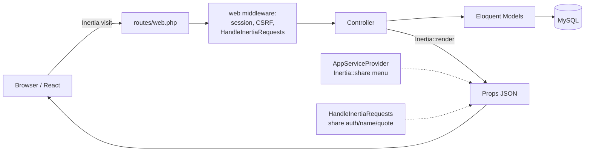
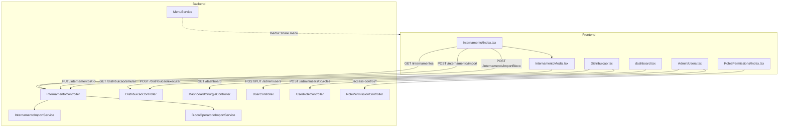
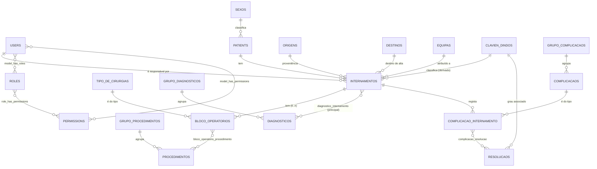
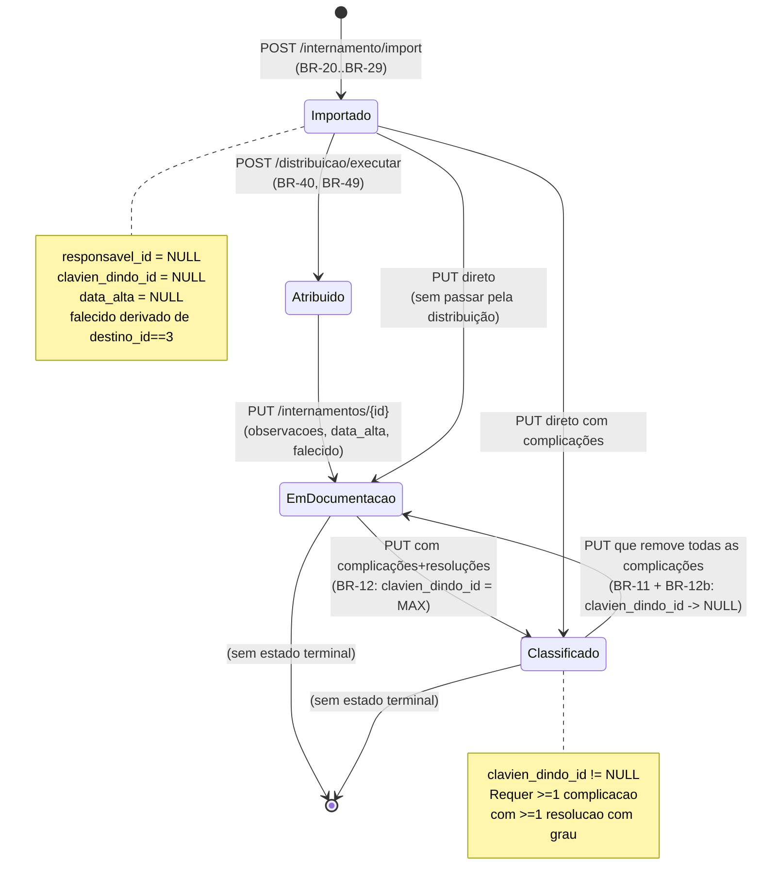
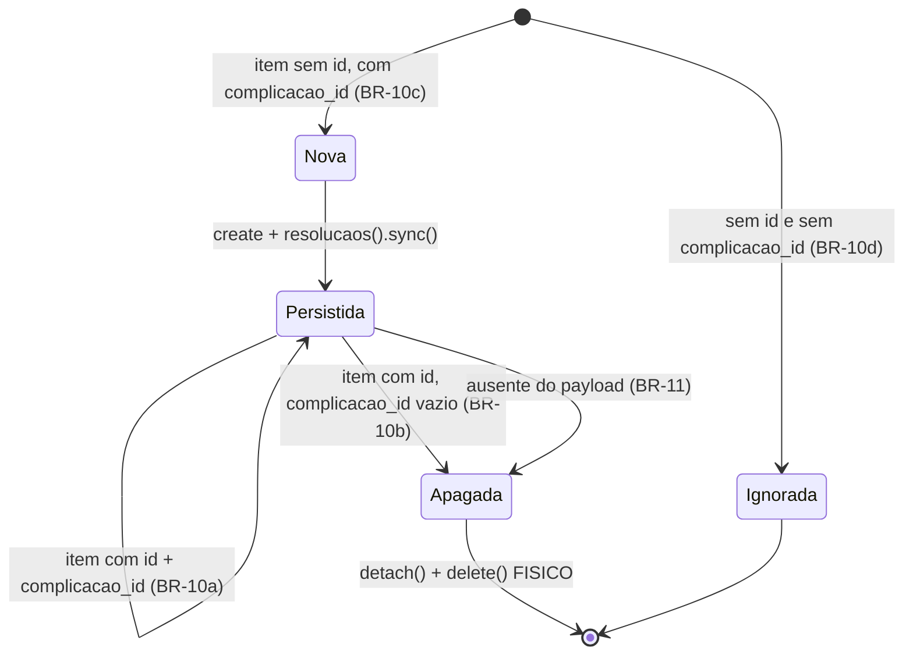
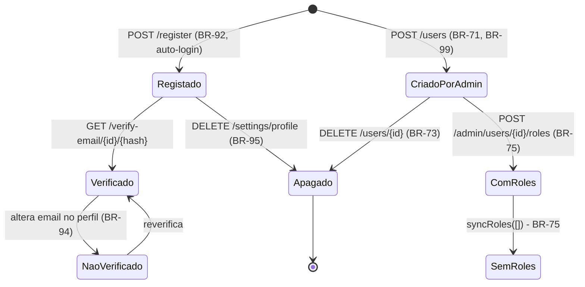
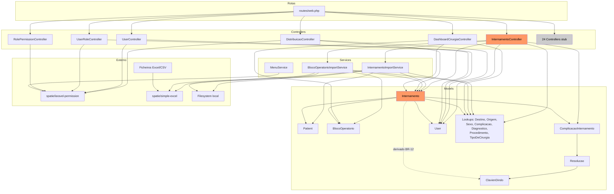

# Documentação de Business Logic — Sistema de Morbimortalidade Cirúrgica

> **Base da análise:** commit `50f8ad3` (branch `main`), estado limpo do repositório.
> **Método:** reverse engineering do código-fonte. Cada regra tem referência a ficheiro e linha.
> **Convenção de confiança usada em todo o documento:**
> - **[CONFIRMADO]** — lido diretamente no código.
> - **[INFERIDO]** — deduzido de utilização consistente, mas sem definição explícita no repositório.
> - **[NÃO DETERMINÁVEL]** — não existe informação suficiente no projeto analisado.

---

## 1. Executive Summary

O projeto é uma aplicação web para **registo, classificação e análise de morbimortalidade cirúrgica** de um serviço hospitalar. O texto de apresentação em [welcome.tsx](resources/js/pages/welcome.tsx:52) descreve-a como "Plataforma integrada para registo, análise e monitorização de internamentos, complicações cirúrgicas, mortalidade e indicadores de qualidade assistencial".

Na prática, o que o código implementa é:

1. **Ingestão de dados hospitalares por Excel/CSV** — dois importadores distintos: internamentos (com paciente + diagnósticos) e blocos operatórios (com tipo de cirurgia + procedimentos).
2. **Enriquecimento clínico manual** — um médico/interno abre um internamento importado e regista complicações, resoluções, observações, data de alta clínica, óbito, origem/destino.
3. **Classificação automática Clavien-Dindo** — o grau do internamento é derivado das resoluções das complicações registadas, não é escolhido pelo utilizador.
4. **Distribuição de carga de trabalho** — atribuição semi-automática de internamentos sem responsável a um conjunto de internos, equilibrando cargas.
5. **Dashboard cirúrgico** — contagens e séries temporais sobre blocos operatórios.
6. **RBAC** — papéis e permissões via `spatie/laravel-permission`, com menu lateral gerado por role.

### Estado de maturidade (importante para quem receber este código)

O sistema está num estado **funcional mas incompleto e frágil**. Factos relevantes, todos [CONFIRMADO]:

- **Não existem migrations para as tabelas de negócio.** `database/migrations/` contém apenas as 3 migrations do starter kit (users/cache/jobs). Todo o modelo de dados clínico existe **apenas na base de dados de produção**. O comando [ScaffoldDatabase.php](app/Console/Commands/ScaffoldDatabase.php) faz o caminho inverso: lê a BD e gera código.
- **A maioria das rotas não tem middleware de autenticação** (secção 9 e 18). Isto inclui `internamentos`, `patients`, e os endpoints de importação.
- **26 dos 30 controllers são stubs vazios** gerados por scaffolding, com rotas registadas a apontar para eles.
- Existem **bugs confirmados com impacto direto no negócio** (secção 18), designadamente o contador de importação que devolve sempre `0` e o cálculo de cargas na distribuição que devolve sempre `0`.

### Módulos com lógica de negócio real

| Módulo | Ficheiro principal | Linhas de lógica |
|---|---|---|
| Internamentos (listagem + edição clínica) | [InternamentoController.php](app/Http/Controllers/InternamentoController.php) | ~345 |
| Importação de internamentos | [InternamentoImportService.php](app/Services/InternamentoImportService.php) | 155 |
| Importação de blocos operatórios | [BlocoOperatorioImportService.php](app/Services/BlocoOperatorioImportService.php) | 173 |
| Distribuição por responsável | [DistribuicaoController.php](app/Http/Controllers/DistribuicaoController.php) | 268 |
| Dashboard cirúrgico | [DashboardCirurgiaController.php](app/Http/Controllers/DashboardCirurgiaController.php) | 129 |
| RBAC / menu | [RolePermissionController.php](app/Http/Controllers/RolePermissionController.php), [MenuService.php](app/Services/MenuService.php) | ~163 |
| Edição clínica (UI) | [InternamentoModal.tsx](resources/js/components/internamento/InternamentoModal.tsx) | 638 |

Tudo o resto é *infrastructure/technical logic* (starter kit Laravel + Inertia + shadcn/ui) ou código morto.

---

## 2. Architecture Overview

### 2.1 Stack

| Camada | Tecnologia | Fonte |
|---|---|---|
| Backend | PHP 8.2+, Laravel 12 | [composer.json:12-14](composer.json) |
| Bridge SPA | Inertia.js 2 (server-driven SPA) | [composer.json:13](composer.json), [app.tsx](resources/js/app.tsx) |
| Frontend | React 19 + TypeScript 5.7 | [package.json](package.json) |
| UI | Tailwind 4, Radix UI / shadcn, lucide-react | [package.json](package.json) |
| Gráficos | Chart.js via react-chartjs-2 | [package.json](package.json) |
| Notificações UI | react-hot-toast | [app-layout.tsx:3](resources/js/layouts/app-layout.tsx) |
| RBAC | spatie/laravel-permission ^6.25 | [composer.json:16](composer.json) |
| Excel/CSV | spatie/simple-excel ^3.7 | [composer.json:17](composer.json) |
| Rotas no JS | tightenco/ziggy ^2.4 | [composer.json:18](composer.json) |
| Build | Vite 6 | [vite.config.js](vite.config.js) |

### 2.2 Base de dados

**[INFERIDO — MySQL/MariaDB]**, apesar de `.env.example` dizer `DB_CONNECTION=sqlite` ([.env.example:24](.env.example)). Evidência de que a BD real é MySQL:

- `DB::select('SHOW TABLES')` — sintaxe MySQL ([ScaffoldDatabase.php:17](app/Console/Commands/ScaffoldDatabase.php)).
- Consultas a `INFORMATION_SCHEMA.COLUMNS` / `INFORMATION_SCHEMA.KEY_COLUMN_USAGE` ([ScaffoldDatabase.php:83](app/Console/Commands/ScaffoldDatabase.php), [:152](app/Console/Commands/ScaffoldDatabase.php), [:196](app/Console/Commands/ScaffoldDatabase.php)).
- `DATE_FORMAT(data_intervencao, '%Y-%m')` — função MySQL ([DashboardCirurgiaController.php:104](app/Http/Controllers/DashboardCirurgiaController.php)).
- Literais de string com aspas duplas dentro de `selectRaw` (`ambulatorio = "S"`) — só válido em MySQL sem `ANSI_QUOTES` ([DashboardCirurgiaController.php:55](app/Http/Controllers/DashboardCirurgiaController.php)).

Isto significa que **o pipeline de CI está a correr contra um motor diferente do de produção** — ver [tests.yml:32](.github/workflows/tests.yml), que faz `touch database/database.sqlite`.

### 2.3 Fluxo de um pedido



**Pontos de partilha global de props** (executados em *todos* os renders Inertia):

| Prop | Origem | Conteúdo |
|---|---|---|
| `menu` | [AppServiceProvider.php:24-31](app/Providers/AppServiceProvider.php) | Menu lateral filtrado por role. `[]` se guest. |
| `auth.user` | [HandleInertiaRequests.php:45-54](app/Http/Middleware/HandleInertiaRequests.php) | `{id, name, email, roles[]}` ou `null`. |
| `name` | [HandleInertiaRequests.php:43](app/Http/Middleware/HandleInertiaRequests.php) | `config('app.name')` |
| `quote` | [HandleInertiaRequests.php:39,44](app/Http/Middleware/HandleInertiaRequests.php) | Citação aleatória (starter kit, decorativo) |

### 2.4 Ausência de camadas

**[CONFIRMADO]** Não existe:
- Camada de **Repository** — os controllers falam diretamente com Eloquent.
- Camada de **Policy / Gate** — `app/Policies/` não existe; nenhum `authorize()` é chamado.
- Camada de **Events / Listeners** de domínio — nenhum evento próprio; só os eventos do starter kit de auth.
- Camada de **Jobs / Queues** — `QUEUE_CONNECTION=database` está configurado e a tabela `jobs` existe, mas **nenhum Job é definido no projeto**.
- **DTOs / Resources** — os models são serializados em bruto para o frontend via `toArray()`.

Os únicos **Services** são os dois importadores e o `MenuService`.

---

## 3. Modules & Components

### 3.1 Mapa de responsabilidades

| Componente | Responsabilidade real (validada na implementação) | Estado |
|---|---|---|
| `InternamentoController` | `index` (listagem/filtros), `update` (edição clínica + derivação Clavien), `import`, `importBloco`. `create/store/show/edit/destroy` são **vazios**. | Ativo, parcial |
| `InternamentoImportService` | Parsing Excel → Patient + Internamento + Diagnósticos | Ativo |
| `BlocoOperatorioImportService` | Parsing Excel → BlocoOperatorio + TipoDeCirurgia + Procedimentos | Ativo |
| `DistribuicaoController` | `index` (formulário), `simular` (dry-run), `executar` (persiste) | Ativo |
| `DashboardCirurgiaController` | Agregações sobre blocos operatórios | Ativo |
| `UserController` | `index` (lista paginada de ativos), `store`, `update`, `destroy` | Ativo |
| `UserRoleController` | `index` (duplicado de UserController), `updateRoles` | Ativo, duplicado |
| `RolePermissionController` | CRUD de roles e permissões (Spatie) | Ativo |
| `MenuService` | Menu lateral por role | Ativo |
| `ScaffoldDatabase` | Ferramenta de desenvolvimento: gera Models/Controllers/Requests/Rotas/TSX a partir da BD | Ferramenta, não runtime |
| **26 controllers restantes** | Stubs vazios com todos os métodos `//` | **Código morto com rota pública registada** |

Lista completa dos stubs vazios **[CONFIRMADO por comparação de conteúdo]**: `BlocoOperatorioController`, `BlocoOperatorioProcedimentoController`, `ClavienDindoController`, `ComplicacaoController`, `ComplicacaoInternamentoController`, `ComplicacaoResolucaoController`, `DestinoController`, `DiagnosticoController`, `DiagnosticoInternamentoController`, `EquipaController`, `FailedImportRowController`, `GrupoComplicacaoController`, `GrupoDiagnosticoController`, `GrupoProcedimentoController`, `JobBatchController`, `OrigemController`, `PasswordResetTokenController`, `PatientController`, `PermissionController`, `ProcedimentoController`, `ResolucaoController`, `RoleController`, `SexoController`, `TipoDeCirurgiaController`.

Todos os 26 `FormRequest` em `app/Http/Requests/` (exceto `Auth/LoginRequest` e `Settings/ProfileUpdateRequest`) têm **`authorize(): return false`** e **`rules(): return []`** — ver [PatientRequest.php:15,26](app/Http/Requests/PatientRequest.php). **Nenhum deles é usado por nenhum controller.** Se alguém os ligar a uma rota, todos os pedidos passam a devolver **403**.

### 3.2 Comunicação entre componentes



**Nota de acoplamento [CONFIRMADO]:** o `InternamentoController` instancia os services diretamente com `new` ([InternamentoController.php:320](app/Http/Controllers/InternamentoController.php), [:337](app/Http/Controllers/InternamentoController.php)) em vez de injeção de dependências. Não são testáveis por substituição.

### 3.3 Fluxos de negócio principais

1. **Ingestão** — Excel de internamentos → BD → Excel de blocos operatórios → BD (a ordem importa, ver BR-14).
2. **Atribuição** — distribuição dos internamentos sem responsável pelos internos.
3. **Documentação clínica** — o responsável abre o internamento e regista complicações/resoluções/óbito/observações.
4. **Classificação** — o sistema deriva o grau Clavien-Dindo automaticamente.
5. **Análise** — dashboard e listagens filtradas.

### 3.4 Dependências externas

| Dependência | Tipo | Criticidade | Comportamento em falha |
|---|---|---|---|
| MySQL/MariaDB | BD primária | Crítica | `QueryException` → 500. Sem retry, sem fallback. |
| Ficheiros Excel/CSV do hospital | Input manual | Alta | Ver secção 12 (erros por linha). |
| Sistema de email (SMTP) | Recuperação de password / verificação | Baixa | `MAIL_MAILER=log` por defeito ([.env.example:51](.env.example)) — em produção sem SMTP configurado, os emails de reset **não saem e não há erro visível**. |
| `fonts.bunny.net` | CDN de fontes (só na página `welcome`) | Nula | Degradação visual. |
| Filesystem local (`storage/app/private`) | Ficheiros de importação | Média | Falha de escrita → exceção não tratada no upload. |

**Não existem integrações com APIs externas.** [CONFIRMADO — `config/services.php` está vazio de credenciais e não há chamadas HTTP de saída no código.]

---

## 4. Business Logic

### 4.1 Módulo: Listagem de Internamentos

**Ficheiro:** [InternamentoController::index()](app/Http/Controllers/InternamentoController.php:23-168)

#### Input → Validações → Regras → Decisões → Side Effects → Output

**Input (query string):** `processo`, `data_entrada_de`, `data_entrada_ate`, `destino_id`, `origem_id`, `responsavel_id`, `clavien_dindo_id`, `falecido`, `page`.

**Validações:** **nenhuma** [CONFIRMADO]. Não existe `$request->validate()` neste método. Os IDs são injetados diretamente em cláusulas `where` (o Eloquent faz binding, portanto não há SQL injection, mas um `destino_id=abc` produz simplesmente zero resultados em vez de erro).

**Regras de negócio:**

| ID | Regra | Linha |
|---|---|---|
| BR-01 | Se `data_entrada_de` **ou** `data_entrada_ate` estiver em falta, o período assume o valor **hardcoded `2025-09-01` a `2025-09-30`**. | [:62-65](app/Http/Controllers/InternamentoController.php) |
| BR-02 | Se `de > ate`, as datas são **trocadas automaticamente** em vez de gerar erro. | [:68-70](app/Http/Controllers/InternamentoController.php) |
| BR-03 | O filtro de datas é aplicado a **`data_saida`**, apesar de os parâmetros se chamarem `data_entrada_*`. | [:73](app/Http/Controllers/InternamentoController.php) |
| BR-04 | Um utilizador com role **`Interno do geral`** só vê internamentos onde `responsavel_id = ele próprio`. | [:41-43](app/Http/Controllers/InternamentoController.php) |
| BR-05 | O filtro de processo é **`LIKE %valor%`** (pesquisa parcial), não igualdade. | [:50](app/Http/Controllers/InternamentoController.php) |
| BR-06 | Ordenação fixa por `data_saida` ascendente, 20 por página. | [:122](app/Http/Controllers/InternamentoController.php) |
| BR-07 | As listas de opções de `responsavel` só incluem utilizadores com **`ativo = true`**. | [:129](app/Http/Controllers/InternamentoController.php) |

**Prioridade entre regras:** BR-01 é avaliada **antes** de BR-02; ou seja, o período por defeito nunca é trocado. BR-04 é aplicada antes de todos os filtros do utilizador e **não pode ser contornada** por um filtro `responsavel_id` — as duas cláusulas `where` acumulam-se com `AND`, portanto um `Interno do geral` que filtre por outro responsável obtém sempre zero resultados.

**Decisão implícita [INFERIDO]:** o período por defeito de Setembro/2025 sugere que este valor foi colocado durante o desenvolvimento para corresponder ao lote de dados em teste. Não há nada no código que o justifique como regra de negócio permanente. **Interpretação mais provável: é um valor temporário esquecido em produção.** Suporte: é uma string literal, não uma configuração, não um `now()->startOfMonth()`.

**Side effects:** nenhum. É uma operação de leitura pura.

**Output:** página Inertia `Internamento/Index` com:
- `items` — paginação Laravel (`data`, `links`, `from`, `to`, `total`).
- `filters` — merge dos filtros fixos com o período efetivamente aplicado.
- `destino_options`, `origem_options`, `responsavel_options`, `clavien_options` — mapas `{nome: id}`.

**Anti-padrão relevante [CONFIRMADO]:** em [:150-158](app/Http/Controllers/InternamentoController.php), o `through()` injeta **todas as listas de opções em cada linha da página**, incluindo `complicacao_options` e `resolucao_options`. Com 20 linhas por página, cada lista completa de complicações e resoluções é serializada 20 vezes no JSON de resposta. A UI usa depois essas cópias por linha ([InternamentoModal.tsx:86](resources/js/components/internamento/InternamentoModal.tsx): `optionsSource?.[key] ?? pageProps?.[key]`).

**Ambiguidade [CONFIRMADO no código, intenção NÃO DETERMINÁVEL]:** `pluck('id', 'name')` em [:129](app/Http/Controllers/InternamentoController.php) usa o **nome** como chave do mapa. Dois utilizadores com o mesmo nome colapsam numa única entrada (o último vence). O mesmo padrão aplica-se a `Destino`, `Origem`, `ClavienDindo`, `Complicacao` e `Resolucao` — todos assumem **nomes únicos**, sem que exista garantia disso no código.

---

### 4.2 Módulo: Edição Clínica do Internamento (o núcleo do sistema)

**Ficheiro:** [InternamentoController::update()](app/Http/Controllers/InternamentoController.php:206-302)
**UI:** [InternamentoModal.tsx](resources/js/components/internamento/InternamentoModal.tsx)

Este é o método com maior densidade de regras de negócio do projeto.

#### Pré-condições

- O internamento tem de existir → `findOrFail` ([:208](app/Http/Controllers/InternamentoController.php)) → **404** se não.
- **Não há verificação de autorização de qualquer tipo** [CONFIRMADO]. Nem `auth`, nem role, nem ownership. Ver secção 9.

#### Validações [CONFIRMADO — :210-227]

| Campo | Regra | Nota |
|---|---|---|
| `destino_id` | `nullable\|exists:destinos,id` | |
| `data_alta` | `nullable\|date` + `Rule::date()->beforeOrEqual($internamento->data_saida)` | **BR-08** |
| `origem_id` | `nullable\|exists:origems,id` | tabela `origems` (plural incorreto mas real) |
| `responsavel_id` | `nullable\|exists:users,id` | não exige `ativo=1` |
| `clavien_dindo_id` | `nullable\|exists:clavien_dindos,id` | **é validado mas sempre sobrescrito** — ver BR-12 |
| `falecido` | `nullable\|boolean` | |
| `observacoes` | `nullable\|string\|max:1000` | |
| `complicacao_internamentos` | `nullable\|array` | |
| `complicacao_internamentos.*.id` | `nullable\|exists:complicacao_internamento,id` | **não verifica se pertence a este internamento na validação** |
| `complicacao_internamentos.*.complicacao_id` | `nullable\|exists:complicacaos,id` | |
| `complicacao_internamentos.*.resolucaos.*.id` | `nullable\|exists:resolucaos,id` | |

**BR-08 (data de alta clínica):** `data_alta` tem de ser **anterior ou igual a `data_saida`**. Semanticamente: `data_saida` é a saída administrativa importada do sistema hospitalar; `data_alta` é a **alta clínica** registada manualmente. O tooltip na UI confirma: *"Colocar aqui a data da alta clínica, se for o caso."* ([InternamentoModal.tsx:320](resources/js/components/internamento/InternamentoModal.tsx)).

**Edge case não tratado [CONFIRMADO]:** se `$internamento->data_saida` for `NULL`, a regra `beforeOrEqual(null)` é avaliada com um operando nulo. O comportamento resultante **[NÃO DETERMINÁVEL sem executar]** — depende da implementação interna de `Rule::date()` no Laravel 12. Como o importador exige `Dta_Alta` não vazia (BR-20), os registos importados nunca têm `data_saida` nula; registos criados por outra via poderiam.

**BR-09 (campos silenciosamente descartados):** `$request->validate()` devolve **apenas** as chaves validadas. O frontend envia o objeto `form` inteiro (`{...form, complicacao_internamentos}` em [InternamentoModal.tsx:152-159](resources/js/components/internamento/InternamentoModal.tsx)), incluindo `patient`, `episodio`, `data_entrada`, `dias_internamento` e **`bloquear`**. Todos são descartados sem aviso.

Isto tem uma consequência direta: **o campo `bloquear` é apresentado como editável na UI** ([InternamentoModal.tsx:79-80](resources/js/components/internamento/InternamentoModal.tsx): `editableFields = ['observacoes', 'falecido', 'bloquear', 'data_alta']`) mas **nunca é gravado**, porque não consta das regras de validação. O utilizador altera o checkbox, grava, recebe "Internamento atualizado com sucesso!" e a alteração perde-se.

#### Regras de negócio — sincronização de complicações

Todo o bloco corre dentro de `DB::transaction()` ([:232-298](app/Http/Controllers/InternamentoController.php)).

| ID | Condição | Ação | Linha |
|---|---|---|---|
| BR-10a | Item tem `id` **e** `complicacao_id` preenchido | **UPDATE** da complicação + `sync()` das resoluções. ID adicionado a `$incomingIds`. | [:244-249](app/Http/Controllers/InternamentoController.php) |
| BR-10b | Item tem `id` mas `complicacao_id` vazio/null | **DELETE** da complicação (com `detach()` prévio das resoluções) | [:250-253](app/Http/Controllers/InternamentoController.php) |
| BR-10c | Item **sem** `id` mas com `complicacao_id` | **CREATE** de nova complicação + `sync()` das resoluções | [:255-261](app/Http/Controllers/InternamentoController.php) |
| BR-10d | Item sem `id` **e** sem `complicacao_id` | **Ignorado silenciosamente** (nenhum ramo do `if` corresponde) | [:255](app/Http/Controllers/InternamentoController.php) |
| BR-10e | Item com `id` que **não pertence** a este internamento | **Ignorado silenciosamente** — o `->where('id', ...)` está scoped à relação e devolve `null` | [:241-243](app/Http/Controllers/InternamentoController.php) |
| BR-11 | Complicações existentes **não presentes** no payload | **DELETE em cascata** (detach + delete) | [:264-274](app/Http/Controllers/InternamentoController.php) |

**BR-11 é uma regra de sincronização destrutiva total.** O ramo `else` em [:269-274](app/Http/Controllers/InternamentoController.php) significa que se `$incomingIds` ficar vazio — o que acontece quando o payload não traz complicações **ou quando todas as complicações enviadas foram inválidas** — **todas as complicações do internamento são apagadas**.

Isto cria um **caminho de perda de dados** [CONFIRMADO]: qualquer `PUT /internamentos/{id}` que omita a chave `complicacao_internamentos` apaga o histórico completo de complicações desse internamento. Não há confirmação, não há soft delete, não há log.

Nota: os dois ramos do `if/else` em [:264-274](app/Http/Controllers/InternamentoController.php) são **funcionalmente equivalentes** — `whereNotIn('id', [])` já devolveria todos os registos. O `else` é redundante mas não altera o comportamento.

#### BR-12 — Derivação automática do grau Clavien-Dindo

**A regra de negócio clínica mais importante do sistema.** [InternamentoController.php:279-297](app/Http/Controllers/InternamentoController.php)

```
clavien_dindo_id(internamento) = MAX( resolucao.clavien_dindo_id )
                                 sobre TODAS as resoluções
                                 de TODAS as complicações do internamento
                                 ignorando valores NULL
                                 → NULL se não existir nenhuma
```

Regras derivadas:

- **BR-12a:** o valor enviado pelo utilizador em `clavien_dindo_id` é validado mas **sempre sobrescrito** pelo cálculo ([:295-297](app/Http/Controllers/InternamentoController.php) corre depois de `$internamento->update($validatedData)` em [:233](app/Http/Controllers/InternamentoController.php)). O campo é efetivamente **read-only** apesar de a validação o aceitar.
- **BR-12b:** se o internamento ficar sem complicações, ou se nenhuma resolução tiver grau associado, **`clavien_dindo_id` é reposto a NULL**. A classificação é sempre recalculada de raiz, nunca incrementada.
- **BR-12c:** a comparação é `>` sobre o **ID numérico** da tabela `clavien_dindos` ([:288](app/Http/Controllers/InternamentoController.php)), não sobre um campo de ordem ou de severidade.

**BR-12c é uma dependência implícita crítica [CONFIRMADO no código, semântica INFERIDA]:** o código assume que **os IDs de `clavien_dindos` estão inseridos por ordem crescente de gravidade** (I < II < IIIa < IIIb < IVa < IVb < V). Se alguém inserir um grau novo na tabela, ou se a ordem de inserção original não corresponder à escala Clavien-Dindo, **a classificação de gravidade fica silenciosamente errada em todos os internamentos recalculados**. Não existe nenhum campo `ordem`/`severidade`/`peso` no model `ClavienDindo` ([ClavienDindo.php:9](app/Models/ClavienDindo.php): apenas `descricao`, `nome`).

**Ineficiência associada [CONFIRMADO]:** a linha [:279](app/Http/Controllers/InternamentoController.php) faz `load('complicacaoInternamentos.resolucaos')` mas o ciclo interno em [:284](app/Http/Controllers/InternamentoController.php) usa `$ci->resolucaos()->get()` — **uma nova query por complicação**, ignorando o eager load. N+1 confirmado.

#### Pós-condições

- `internamentos.clavien_dindo_id` reflete o máximo das resoluções (ou NULL).
- `complicacao_internamento` contém exatamente as complicações enviadas.
- `complicacao_resolucao` reflete exatamente as resoluções enviadas por complicação.
- Redirect `back()` com flash `success` ([:301](app/Http/Controllers/InternamentoController.php)).

**Nota:** `data_saida`, `data_entrada`, `episodio`, `dias_internamento`, `patient_id` e `equipa_id` **nunca são alterados por esta via**. São dados de origem hospitalar, imutáveis a partir da UI. [CONFIRMADO — não constam das regras de validação.]

#### Estados de UI derivados (regras de apresentação com semântica clínica)

**BR-13 [InternamentoModal.tsx:66-72](resources/js/components/internamento/InternamentoModal.tsx):** os separadores disponíveis dependem de existirem blocos operatórios.

| Condição | Separadores |
|---|---|
| `bloco_operatorios_count > 0` | paciente, internamento, diagnosticos, **bloco_operatorios, complicacoes, clavien**, destino, observacoes, responsavel |
| `bloco_operatorios_count == 0` | paciente, internamento, diagnosticos, destino, observacoes, responsavel |

**Consequência de negócio:** **só é possível registar complicações e ver a classificação Clavien-Dindo em internamentos com bloco operatório.** Um internamento médico (não cirúrgico) não tem UI para complicações. A regra é coerente com o domínio (Clavien-Dindo é uma escala de complicações *cirúrgicas*), mas **não é imposta no backend** — um `PUT` direto com `complicacao_internamentos` num internamento sem bloco é aceite e processado normalmente.

**BR-14 [Internamento/Index.tsx:270](resources/js/pages/Internamento/Index.tsx):** código de cor da listagem — fundo **azul** se tem blocos operatórios, **verde** se não tem.

---

### 4.3 Módulo: Importação de Internamentos

**Ficheiro:** [InternamentoImportService](app/Services/InternamentoImportService.php)
**Endpoint:** `POST /internamento/import` → [InternamentoController::import()](app/Http/Controllers/InternamentoController.php:312-327)

#### Colunas esperadas no ficheiro [CONFIRMADO por leitura das chaves]

| Coluna Excel | Destino | Obrigatória |
|---|---|---|
| `NUM_PROCESSO` | `patients.processo` | **Sim** |
| `INT_EPISODIO` | `internamentos.episodio` | **Sim** |
| `Dta_Alta` | `internamentos.data_saida` | **Sim** |
| `DTA_NASCIMENTO` | `patients.data_nascimento` | Não |
| `SEXO` | `patients.sexo_id` | Não |
| `DTA_INTERNAMENTO` | `internamentos.data_entrada` | Não |
| `DIAS INT` | `internamentos.dias_internamento` | Não |
| `Alta` | → lookup de `destinos.nome` | Não |
| `COD_PROVENIENCIA` | → `origens.id` | Não |
| `COD_DIAGNOSTICO` | → diagnósticos (lista `;`) | Não |

#### Fluxo

```
Upload → validate(mimes:xlsx,csv) → store('imports') → SimpleExcelReader
   → por cada linha:
        validarLinha()          [pode lançar]
        dedupe por episódio     [pode saltar]
        DB::transaction:
            obterPaciente()
            criarInternamento()
            addDiagnosticos()
        catch → regista erro e continua
   → devolve {imported, errors}
```

#### Regras

| ID | Regra | Linha |
|---|---|---|
| BR-20 | `NUM_PROCESSO`, `INT_EPISODIO` e `Dta_Alta` são **obrigatórios**; ausência lança exceção e a linha é rejeitada. | [:71-81](app/Services/InternamentoImportService.php) |
| BR-21 | **Idempotência por episódio:** se `INT_EPISODIO` já existe (cache carregada no início), a linha é **saltada silenciosamente** — não conta como importada nem como erro. | [:43-45](app/Services/InternamentoImportService.php) |
| BR-22 | O paciente é obtido por `firstOrCreate` na chave **`processo`**. Se já existir, `data_nascimento` e `sexo_id` do ficheiro **são ignorados**. | [:86-92](app/Services/InternamentoImportService.php) |
| BR-23 | `destino_id` = lookup de `Alta` no mapa `{nome → id}` de `destinos`. Se não encontrar → **NULL** (sem erro). | [:97](app/Services/InternamentoImportService.php) |
| BR-24 | `origem_id` = `COD_PROVENIENCIA` se existir como ID em `origens`, senão **99**. | [:98](app/Services/InternamentoImportService.php) |
| BR-25 | **`falecido = (destino_id == 3)`** — o óbito é derivado do destino de alta. | [:109](app/Services/InternamentoImportService.php) |
| BR-26 | `data_alta` é sempre inicializada a **NULL** (é preenchida manualmente mais tarde). | [:105](app/Services/InternamentoImportService.php) |
| BR-27 | `COD_DIAGNOSTICO` é dividido por **`;`**; cada código é trimado; vazios são saltados. | [:126-133](app/Services/InternamentoImportService.php) |
| BR-28 | Diagnóstico inexistente é **criado automaticamente** com `codigo` e `descricao = codigo`. | [:140-149](app/Services/InternamentoImportService.php) |
| BR-29 | A associação usa `syncWithoutDetaching` — **não remove** diagnósticos já associados e não duplica. | [:152](app/Services/InternamentoImportService.php) |

**BR-24 e BR-25 são *magic numbers* [CONFIRMADO]:**
- `99` como origem por defeito — não existe constante, enum ou comentário. **[INFERIDO]** que corresponde a uma entrada "Desconhecido/Outro" na tabela `origens`. **Não determinável a partir do código analisado.**
- `3` como destino de óbito — igualmente hardcoded. **[INFERIDO]** que `destinos.id = 3` é "Falecido"/"Óbito". Se a tabela `destinos` for reordenada ou repovoada, **a flag de mortalidade de todas as importações futuras fica errada**, e é sobre esta flag que assenta todo o propósito do sistema ("morbimortalidade").

**BR-22 — dependência implícita:** `Origem::pluck('id', 'id')` em [:25](app/Services/InternamentoImportService.php) constrói um mapa `{id → id}`. Isto significa que `COD_PROVENIENCIA` no Excel **tem de ser o ID numérico da tabela `origens`**, não um nome ou código hospitalar. Contrasta com `destinos`, que é mapeado por **nome**. As duas colunas do mesmo ficheiro usam convenções diferentes.

#### BUG CONFIRMADO — contador de importados sempre 0

[InternamentoImportService.php:47](app/Services/InternamentoImportService.php):

```php
DB::transaction(function () use ($row, $importados) {   // ← por VALOR
    ...
    $importados++;                                       // ← incrementa a cópia
});
```

A variável `$importados` é capturada **por valor**, não por referência. O incremento afeta apenas a cópia local do closure. O `return ['imported' => $importados]` em [:64](app/Services/InternamentoImportService.php) devolve sempre **`0`**.

Comparação: o `BlocoOperatorioImportService` faz corretamente `use ($row, &$importados)` ([BlocoOperatorioImportService.php:35](app/Services/BlocoOperatorioImportService.php)).

**Impacto para o utilizador:** o toast em [Internamento/Index.tsx:104](resources/js/pages/Internamento/Index.tsx) mostra sempre **"0 registos importados!"** mesmo quando a importação corre na perfeição. Os dados *são* gravados; apenas a contagem está errada.

#### Persistência do ficheiro

`$request->file('file')->store('imports')` ([InternamentoController.php:318](app/Http/Controllers/InternamentoController.php)) grava no disco `local`, cuja raiz é `storage_path('app/private')` ([config/filesystems.php:35](config/filesystems.php)). O service é depois chamado com `storage_path("app/private/{$path}")` ([:321](app/Http/Controllers/InternamentoController.php)) — coerente.

**Os ficheiros nunca são apagados** [CONFIRMADO]. Acumulam-se indefinidamente em `storage/app/private/imports/` com dados clínicos identificáveis (número de processo, data de nascimento, sexo, diagnósticos). Ver secção 14.

---

### 4.4 Módulo: Importação de Blocos Operatórios

**Ficheiro:** [BlocoOperatorioImportService](app/Services/BlocoOperatorioImportService.php)
**Endpoint:** `POST /internamento/importBloco`

#### Colunas esperadas

| Coluna Excel | Destino | Obrigatória |
|---|---|---|
| `BLO_NUM_REG` | `bloco_operatorios.bloco_num` (chave natural) | **Sim** |
| `DTA_INTERVENCAO` | `bloco_operatorios.data_intervencao` | **Sim** |
| `DES_TIPO_CIRURGIA` | `tipo_de_cirurgias.nome` | **Sim** (validado indiretamente) |
| `NUM_EPISODIO` | → lookup em `internamentos.episodio` | Não |
| `CIR_AMB` | `bloco_operatorios.ambulatorio` (`'S'`/`'N'`) | Não |
| `COD_INTERV_CIRURGICA` | → `procedimentos.codigo` (lista) | Não |
| `PROCEDIMENTO PRINCIPAL` | → `procedimentos.nome` | Não |

#### Regras

| ID | Regra | Linha |
|---|---|---|
| BR-30 | `BLO_NUM_REG` e `DTA_INTERVENCAO` obrigatórios. | [:64-70](app/Services/BlocoOperatorioImportService.php) |
| BR-31 | **`NUM_EPISODIO` foi explicitamente desativado como obrigatório** (validação comentada). | [:60-62](app/Services/BlocoOperatorioImportService.php) |
| BR-32 | **Regra de ambulatório:** sem `NUM_EPISODIO`, **ou** com episódio que não existe em `internamentos` → `internamento_id = NULL`. O comentário no código classifica ambos os casos como "é ambulatório". | [:73-88](app/Services/BlocoOperatorioImportService.php) |
| BR-33 | `DES_TIPO_CIRURGIA` vazio → exceção, linha rejeitada. | [:96-98](app/Services/BlocoOperatorioImportService.php) |
| BR-34 | Tipo de cirurgia inexistente (lookup por **nome**) é **criado automaticamente**, com `codigo = COD_INTERV_CIRURGICA` ou, na sua ausência, o próprio nome. | [:100-111](app/Services/BlocoOperatorioImportService.php) |
| BR-35 | **Upsert por `bloco_num`:** se já existir um bloco com o mesmo `BLO_NUM_REG`, é **atualizado**; senão é criado. | [:116-137](app/Services/BlocoOperatorioImportService.php) |
| BR-36 | `ambulatorio` assume **`'N'`** se `CIR_AMB` estiver ausente. | [:124](app/Services/BlocoOperatorioImportService.php), [:134](app/Services/BlocoOperatorioImportService.php) |
| BR-37 | Procedimentos: `COD_INTERV_CIRURGICA` é dividido por **`;` ou `,`**. | [:147](app/Services/BlocoOperatorioImportService.php) |
| BR-38 | Procedimento inexistente é criado com `nome = PROCEDIMENTO PRINCIPAL` se preenchido, senão `nome = codigo`. | [:160-168](app/Services/BlocoOperatorioImportService.php) |
| BR-39 | Associação via `syncWithoutDetaching` (não remove, não duplica). | [:170](app/Services/BlocoOperatorioImportService.php) |

**BR-35 vs BR-21 — inconsistência entre os dois importadores [CONFIRMADO]:**
- Internamentos: episódio duplicado → **salta** (preserva o registo existente e as edições clínicas feitas nele).
- Blocos: `bloco_num` duplicado → **atualiza** (sobrescreve `internamento_id`, `tipo_de_cirurgia_id`, `ambulatorio`, `data_intervencao`).

A consequência prática é que **reimportar o ficheiro de blocos pode desligar um bloco do seu internamento**: se a segunda importação tiver `NUM_EPISODIO` vazio ou apontar para um episódio ainda não importado, a BR-32 devolve `null` e a BR-35 grava esse `null` por cima de uma associação previamente correta. O bloco passa a "ambulatório" e o internamento perde `bloco_operatorios_count`, o que por sua vez (BR-13) **remove o separador de complicações da UI e esconde a classificação Clavien-Dindo**.

**BR-32 — dependência de ordem entre importações [CONFIRMADO]:** o mapa `$this->internamentos` é carregado uma única vez no início ([:21](app/Services/BlocoOperatorioImportService.php)). **O ficheiro de internamentos tem de ser importado antes do ficheiro de blocos**, caso contrário todos os blocos são classificados como ambulatório. Esta ordem obrigatória **não está documentada, não é validada e não é sugerida na UI** — os dois botões de importação aparecem lado a lado, sem ordem indicada ([Internamento/Index.tsx:163-171](resources/js/pages/Internamento/Index.tsx)).

**BR-38 — regra de qualidade de dados duvidosa [CONFIRMADO]:** `$nomePrincipal` é o **mesmo valor para todos os códigos da linha** ([:149](app/Services/BlocoOperatorioImportService.php), fora do ciclo). Se uma linha tiver `COD_INTERV_CIRURGICA = "A;B;C"` e `PROCEDIMENTO PRINCIPAL = "Apendicectomia"`, e nenhum dos três códigos existir, são criados **três procedimentos diferentes todos chamados "Apendicectomia"**. Só o primeiro é de facto o procedimento principal.

**Bug menor [CONFIRMADO]:** a guarda em [:143](app/Services/BlocoOperatorioImportService.php) permite passar quando `COD_INTERV_CIRURGICA` está vazio mas `PROCEDIMENTO PRINCIPAL` não. A linha seguinte faz `preg_split(..., $row['COD_INTERV_CIRURGICA'])` sobre um valor vazio → devolve `['']` → o ciclo salta o código vazio. Sem crash, mas **o `PROCEDIMENTO PRINCIPAL` é ignorado nesse caso** — o procedimento nunca é registado.

---

### 4.5 Módulo: Distribuição de Internamentos

**Ficheiro:** [DistribuicaoController](app/Http/Controllers/DistribuicaoController.php)

O objetivo de negócio é **atribuir internamentos sem responsável a um conjunto de internos, equilibrando a carga de trabalho**, distinguindo casos cirúrgicos (com bloco) de não cirúrgicos (sem bloco).

Três endpoints: `index` (formulário), `simular` (dry-run), `executar` (persiste).

#### 4.5.1 `simular` — [DistribuicaoController.php:38-167](app/Http/Controllers/DistribuicaoController.php)

**Validações [CONFIRMADO — :40-45]:**

| Campo | Regra |
|---|---|
| `data_entrada_de` | `required\|date` |
| `data_entrada_ate` | `required\|date\|after_or_equal:data_entrada_de` |
| `responsaveis` | `required\|array` |
| `responsaveis.*` | `exists:users,id` |

**Regras:**

| ID | Regra | Linha |
|---|---|---|
| BR-40 | Só entram na distribuição internamentos com **`responsavel_id IS NULL`**. Nunca há reatribuição. | [:57](app/Http/Controllers/DistribuicaoController.php) |
| BR-41 | O período filtra **`data_saida`** (apesar do nome `data_entrada_*`). | [:58](app/Http/Controllers/DistribuicaoController.php) |
| BR-42 | Só utilizadores com **`ativo = 1`** podem receber internamentos. | [:53-54](app/Http/Controllers/DistribuicaoController.php) |
| BR-43 | Os internamentos são separados em dois grupos — **com bloco** e **sem bloco** — e distribuídos em **duas passagens independentes**. | [:67-68](app/Http/Controllers/DistribuicaoController.php), [:143-146](app/Http/Controllers/DistribuicaoController.php) |
| BR-44 | **Peso de cada responsável = `1 / (carga + 1)`**. Recebe o internamento quem tiver **maior peso** (= menor carga). | [:104](app/Http/Controllers/DistribuicaoController.php), [:117](app/Http/Controllers/DistribuicaoController.php) |
| BR-45 | Após cada atribuição, a carga é incrementada e os pesos recalculados e renormalizados. | [:129-138](app/Http/Controllers/DistribuicaoController.php) |
| BR-46 | A "carga atual" é contada sobre **`data_entrada`**, não `data_saida`. | [:90](app/Http/Controllers/DistribuicaoController.php) |

**Fórmula de decisão:**

```
peso(r) = 1 / (carga(r) + 1)
escolhido = argmax_r peso(r)      →  equivalente a argmin_r carga(r)
carga(escolhido) += 1
```

**Observação matemática [CONFIRMADO]:** a normalização dos pesos ([:108-111](app/Http/Controllers/DistribuicaoController.php) e [:135-138](app/Http/Controllers/DistribuicaoController.php)) **não tem qualquer efeito na decisão** — dividir todos os pesos pela mesma soma não altera qual é o máximo. São ~10 linhas de código sem impacto funcional, executadas uma vez por internamento distribuído.

**BR-46 é uma inconsistência de negócio [CONFIRMADO]:** os internamentos **a distribuir** são selecionados por `data_saida` ([:58](app/Http/Controllers/DistribuicaoController.php)), mas a **carga já existente** de cada responsável é contada por `data_entrada` ([:90](app/Http/Controllers/DistribuicaoController.php)). Os dois conjuntos referem-se a populações diferentes de internamentos para o mesmo intervalo de datas, pelo que o equilíbrio calculado não corresponde ao equilíbrio real. **Interpretação mais provável: erro de copy/paste**, dado que os parâmetros se chamam `data_entrada_*` e um dos dois sítios foi alterado para `data_saida` sem o outro. Suporte: o mesmo par de campos aparece trocado em `InternamentoController::index` (BR-03).

#### BUG CONFIRMADO — cargas do grupo "sem bloco" são sempre 0

[DistribuicaoController.php:62-64](app/Http/Controllers/DistribuicaoController.php):

```php
$internamentosComBlocoIds = DB::table('bloco_operatorios')
    ->pluck('internamento_id')
    ->toArray();
```

Por BR-32, `bloco_operatorios.internamento_id` **é nullable e contém NULLs** (todos os blocos de ambulatório). O array resultante contém `null`.

Esse array é depois usado em **cláusulas SQL**:

```php
$query->whereNotIn('id', $internamentosComBlocoIds);   // linha 95
```

Em SQL, `id NOT IN (1, 2, NULL)` avalia sempre para `NULL` (nunca `TRUE`), portanto **a query devolve zero linhas independentemente dos dados**. Consequência: `$cargas[$r->id] = 0` para todos os responsáveis no ramo "sem bloco" ([:98](app/Http/Controllers/DistribuicaoController.php)).

O mesmo defeito existe em `executar` ([:212-221](app/Http/Controllers/DistribuicaoController.php), `$cargasSem`).

**Impacto de negócio:** a distribuição de casos **sem bloco** ignora completamente a carga pré-existente de cada interno e comporta-se como se todos partissem do zero. Casos **com bloco** não são afetados (`whereIn` com NULL na lista funciona corretamente para os IDs não nulos).

Nota: a separação inicial dos grupos em [:67-68](app/Http/Controllers/DistribuicaoController.php) usa `Collection::whereIn`/`whereNotIn` (comparação em PHP, não SQL) e **está correta** — o problema é exclusivamente nas queries dentro de `$distribuir`.

#### 4.5.2 `executar` — [DistribuicaoController.php:169-267](app/Http/Controllers/DistribuicaoController.php)

**Validações: NENHUMA** [CONFIRMADO]. Ao contrário de `simular`, este método lê `$request->data_entrada_de`, `$request->data_entrada_ate` e `$request->responsaveis` **sem qualquer validação**.

| ID | Regra | Linha |
|---|---|---|
| BR-47 | Se nenhum dos responsáveis indicados estiver ativo, o closure faz `return` e **nada acontece** — mas a resposta continua a ser **"Distribuição aplicada com sucesso."** | [:180-182](app/Http/Controllers/DistribuicaoController.php), [:266](app/Http/Controllers/DistribuicaoController.php) |
| BR-48 | Em caso de **empate** de pesos, o responsável é escolhido **aleatoriamente** entre os empatados. | [:242-252](app/Http/Controllers/DistribuicaoController.php) |
| BR-49 | Cada internamento é atualizado individualmente com `$internamento->update(['responsavel_id' => ...])`. | [:254-256](app/Http/Controllers/DistribuicaoController.php) |
| BR-50 | Tudo corre dentro de uma única `DB::transaction`. | [:174](app/Http/Controllers/DistribuicaoController.php) |

#### BR-51 — `simular` e `executar` implementam algoritmos diferentes

**[CONFIRMADO]** — divergência com impacto direto na confiança do utilizador:

| Aspeto | `simular` | `executar` |
|---|---|---|
| Desempate | `array_keys($pesos, max($pesos))[0]` → **sempre o primeiro** ([:117](app/Http/Controllers/DistribuicaoController.php)) | `array_rand($candidatos)` → **aleatório** ([:252](app/Http/Controllers/DistribuicaoController.php)) |
| Cálculo de pesos | Uma vez + atualização incremental ([:101-111](app/Http/Controllers/DistribuicaoController.php)) | Recalculado do zero a cada iteração ([:234-238](app/Http/Controllers/DistribuicaoController.php)) |
| Normalização | Sim (inócua) | Não |
| Validação | Completa | Nenhuma |
| Persistência | Não | Sim |

**Consequência:** a UI **obriga** o utilizador a simular antes de executar (o botão "Executar" está `disabled` até `hasValidSimulation` ser `true` — [Distribuicao.tsx:220](resources/js/pages/Internamento/Distribuicao.tsx)), mas **a simulação não é garantia do resultado real**. Com N internos e cargas iniciais iguais (cenário comum, agravado pelo bug das cargas a zero), há empates constantes e a distribuição efetiva é aleatória, enquanto a simulação mostra sempre tudo concentrado nos primeiros da lista.

**Além disso, os parâmetros não são revalidados**: nada impede que o utilizador simule com um intervalo e execute com outro, uma vez que `executar` é um POST independente que reenvia o estado atual do formulário ([Distribuicao.tsx:64-71](resources/js/pages/Internamento/Distribuicao.tsx)).

#### BR-52 — O filtro `tipo` é enviado mas nunca usado

**[CONFIRMADO]** O frontend envia `tipo: 'ambos' | 'com' | 'sem'` em ambos os pedidos ([Distribuicao.tsx:43](resources/js/pages/Internamento/Distribuicao.tsx), [:69](resources/js/pages/Internamento/Distribuicao.tsx)). **Nenhum dos métodos do backend lê `$request->tipo`.** A distribuição processa **sempre** os dois grupos ([:143-146](app/Http/Controllers/DistribuicaoController.php), [:262-263](app/Http/Controllers/DistribuicaoController.php)).

O seletor "Tipo de Internamento" na UI não tem qualquer efeito.

#### BR-53 — Filtro por perfil é exclusivamente client-side

**[CONFIRMADO]** [Distribuicao.tsx:99-105](resources/js/pages/Internamento/Distribuicao.tsx): a lista de responsáveis é filtrada por role **no browser**. O backend nunca recebe nem valida `perfil`. A seleção efetiva é a lista de IDs em `responsaveis`, validada apenas contra `exists:users,id` — **qualquer ID de utilizador é aceite, independentemente do seu role**.

#### Bug de UI [CONFIRMADO]

`simular` devolve as props `responsaveis`, `resultadoInicial`, `statsInicial`, `logsInicial` ([:148-163](app/Http/Controllers/DistribuicaoController.php)) mas **não devolve `perfis`**. Como o Inertia substitui as props da página, o dropdown "Perfil" fica **vazio depois da primeira simulação** (o código do frontend usa `props.perfis ?? []`, portanto não rebenta — apenas fica sem opções).

#### "Logs" [CONFIRMADO]

Os "Logs de distribuição" apresentados na UI ([Distribuicao.tsx:275-284](resources/js/pages/Internamento/Distribuicao.tsx)) são uma **string fixa gerada no momento** ([DistribuicaoController.php:156-162](app/Http/Controllers/DistribuicaoController.php)): `"Simulação concluída com sucesso."` com o timestamp atual. **Não existe persistência de histórico de distribuições.** `executar` não devolve logs de todo.

---

### 4.6 Módulo: Dashboard Cirúrgico

**Ficheiro:** [DashboardCirurgiaController::index()](app/Http/Controllers/DashboardCirurgiaController.php:15-128)

**Filtros (query string):** `data_inicio`, `data_fim`, `tipo_filtro`, `tipo_cirurgia`, `bloco`. **Sem validação.**

| ID | Regra | Linha |
|---|---|---|
| BR-60 | `tipo_filtro = 'ambulatorio'` → `ambulatorio = 'S'`; `'internamento'` → `'N'`; ausente → sem filtro. | [:38-42](app/Http/Controllers/DashboardCirurgiaController.php) |
| BR-61 | As datas aplicam-se a `bloco_operatorios.data_intervencao` **e** a `internamentos.data_entrada` (duas queries em paralelo). | [:28-36](app/Http/Controllers/DashboardCirurgiaController.php) |
| BR-62 | `data_inicio` usa `startOfDay()`, `data_fim` usa `endOfDay()` — intervalo **inclusivo**. | [:29,34](app/Http/Controllers/DashboardCirurgiaController.php) |
| BR-63 | `totalStats` ignora **todos** os filtros (agregação global). `stats` respeita os filtros. | [:53-79](app/Http/Controllers/DashboardCirurgiaController.php) |
| BR-64 | "Top tipos de cirurgia" = top 10 por contagem, com `LEFT JOIN` a `bloco_operatorios`. | [:81-101](app/Http/Controllers/DashboardCirurgiaController.php) |
| BR-65 | Série mensal agrupada por `DATE_FORMAT(data_intervencao, '%Y-%m')`, ordenada por `MIN(data_intervencao)`. | [:103-110](app/Http/Controllers/DashboardCirurgiaController.php) |
| BR-66 | "Últimas cirurgias" = 10 mais recentes por `data_intervencao DESC`. | [:112-115](app/Http/Controllers/DashboardCirurgiaController.php) |

**Problemas confirmados:**

1. **`LEFT JOIN` neutralizado** ([:83-91](app/Http/Controllers/DashboardCirurgiaController.php)): quando há filtro de datas, é aplicado um `where` sobre `bloco_operatorios.data_intervencao`. Numa query com `LEFT JOIN`, um `WHERE` sobre a tabela da direita converte-a em `INNER JOIN` — os tipos de cirurgia **sem** blocos no período desaparecem do ranking em vez de aparecerem com total 0. É provavelmente o comportamento desejado, mas o `LEFT JOIN` torna a intenção ambígua.

2. **Carregamento total em memória** ([:63-64](app/Http/Controllers/DashboardCirurgiaController.php)):
   ```php
   'totalInternamentos' => \count(Internamento::query()->get() ?? []),
   'totalProcedimentos' => \count(Procedimento::query()->get() ?? []),
   ```
   Hidrata **todos** os internamentos e **todos** os procedimentos como models Eloquent só para os contar. Devia ser `->count()`. Com dezenas de milhares de internamentos isto esgota memória. O `?? []` é redundante (`get()` nunca devolve null).

3. **Props declaradas mas nunca enviadas** [CONFIRMADO]: `dashboard.tsx` desestrutura `internamentos` e `blocos` ([dashboard.tsx:102](resources/js/pages/dashboard.tsx)), e a query `$internamentoQuery` é construída e filtrada ([:18](app/Http/Controllers/DashboardCirurgiaController.php), [:30](app/Http/Controllers/DashboardCirurgiaController.php), [:35](app/Http/Controllers/DashboardCirurgiaController.php)) — mas o `Inertia::render` **nunca envia `internamentos` nem `blocos`**. A query só é usada para `->count()` em [:78](app/Http/Controllers/DashboardCirurgiaController.php). O filtro `bloco` ([:48-50](app/Http/Controllers/DashboardCirurgiaController.php)) é aplicado mas **não existe controlo na UI** para o definir.

4. **`ultimas` e `tiposCirurgia` são calculados e enviados**, mas a UI atual não renderiza `ultimas` [CONFIRMADO — não há referência a `ultimas` no JSX de `dashboard.tsx`].

5. **Portabilidade** [CONFIRMADO]: `DATE_FORMAT` e `ambulatorio = "S"` são MySQL-only. Em SQLite (usado no CI) esta rota falha. Ver secção 18.

**BR-67 [dashboard.tsx:108-111](resources/js/pages/dashboard.tsx):** `handleFilterChange` chama `applyFilters()` imediatamente a seguir a `setLocalFiltros`. Como `setState` no React é assíncrono, **`applyFilters` usa o estado anterior** — o filtro só é aplicado à segunda alteração. Bug de UI clássico, confirmado pela leitura.

---

### 4.7 Módulo: Gestão de Utilizadores e RBAC

#### `UserController` — [app/Http/Controllers/UserController.php](app/Http/Controllers/UserController.php)

| Método | Regras | Linha |
|---|---|---|
| `index` | **BR-70:** só lista utilizadores com `ativo = 1`. Paginação de 20. Renderiza `Admin/Users`. | [:14](app/Http/Controllers/UserController.php) |
| `store` | **BR-71:** `name` obrigatório; `email` único; `password` mín. **6** caracteres; `roles` array opcional sincronizado. | [:24-35](app/Http/Controllers/UserController.php) |
| `update` | **BR-72:** password **opcional**; se vazia, é removida do payload e **não é alterada**. Sem verificação da password atual. | [:42-52](app/Http/Controllers/UserController.php) |
| `destroy` | **BR-73:** **hard delete**. Não desativa (`ativo=0`), apaga. | [:61-65](app/Http/Controllers/UserController.php) |

**BR-71 vs política global de passwords [CONFIRMADO — regra contraditória]:** `UserController::store` exige `min:6` ([:27](app/Http/Controllers/UserController.php)), enquanto o registo público e o reset de password usam `Rules\Password::defaults()` ([RegisteredUserController.php:35](app/Http/Controllers/Auth/RegisteredUserController.php), [NewPasswordController.php:41](app/Http/Controllers/Auth/NewPasswordController.php)), cujo default do Laravel é **mínimo 8 caracteres**. **Um administrador pode criar contas com passwords mais fracas do que o próprio utilizador conseguiria definir.**

**BR-74 — hashing [CONFIRMADO]:** `UserController` não faz `Hash::make()`, mas o model tem `'password' => 'hashed'` em `casts()` ([User.php:46](app/Models/User.php)). A password **é** hashed corretamente pelo cast. Não é um bug.

**BR-73 — inconsistência com o conceito de `ativo` [CONFIRMADO]:** todo o sistema filtra por `ativo = 1` (BR-07, BR-42, BR-70), o que indica um mecanismo de **desativação lógica**. No entanto `destroy` faz `$user->delete()` físico. Se um utilizador for apagado enquanto é `responsavel_id` de internamentos, a FK fica pendente — o comportamento depende da constraint na BD, que **[NÃO DETERMINÁVEL]** sem migrations.

**Bug de integração Inertia [CONFIRMADO]:** `store` devolve `return $user->load('roles')` ([:37](app/Http/Controllers/UserController.php)) — um model serializado em JSON, **não uma resposta Inertia**. O frontend chama este endpoint via `router.post` ([CreateOrUpdateModal.tsx:37](resources/js/components/user/CreateOrUpdateModal.tsx)), que exige uma resposta Inertia válida. O utilizador **é criado**, mas o Inertia lança erro no browser e o callback `onSuccess` (que mostra o toast e fecha o modal) **nunca corre**. O mesmo problema em `destroy`, que devolve `204 No Content` ([:64](app/Http/Controllers/UserController.php)).

`update` está correto — devolve `back()->with('toast', ...)` ([:54-58](app/Http/Controllers/UserController.php)).

#### `UserRoleController` — duplicação confirmada

[UserRoleController::index()](app/Http/Controllers/UserRoleController.php:12-18) renderiza **a mesma página** `Admin/Users` que `UserController::index`, mas:

| | `UserController::index` (`GET /users`) | `UserRoleController::index` (`GET /admin/users`) |
|---|---|---|
| Query | `User::where('ativo',1)->with('roles')->paginate(20)` | `User::with('roles')->get()` |
| Formato de `users` | Objeto de paginação (`{data, links, ...}`) | **Array simples** |
| Inclui inativos | Não | **Sim** |

A página faz `users.data.map(...)` ([Admin/Users.tsx:57](resources/js/pages/Admin/Users.tsx)). Em `/admin/users`, `users.data` é `undefined` → **`TypeError: Cannot read properties of undefined (reading 'map')` → página em branco**. [CONFIRMADO]

`/admin/users` não está no menu ([MenuService.php:13-38](app/Services/MenuService.php)), pelo que o erro só é atingível por URL direto — mas as rotas `POST /admin/users/{user}/roles` e `PUT /admin/users/{id}` **são** usadas pela página `/users`, que funciona.

**BR-75 [UserRoleController::updateRoles()](app/Http/Controllers/UserRoleController.php:20-29):** `syncRoles($request->roles)` — substituição total. Se `roles` vier ausente, `$request->roles` é `null` e o Spatie **remove todos os roles** do utilizador. A validação `'roles' => 'array'` não é `required`, portanto isto é alcançável. **Um administrador pode ficar sem roles e perder acesso ao sistema, sem forma de o recuperar pela UI.**

#### `RolePermissionController` — [app/Http/Controllers/RolePermissionController.php](app/Http/Controllers/RolePermissionController.php)

| ID | Regra | Linha |
|---|---|---|
| BR-76 | Roles e permissões são criados sempre no guard **`'web'`**. | [:28](app/Http/Controllers/RolePermissionController.php), [:77](app/Http/Controllers/RolePermissionController.php) |
| BR-77 | Nome de role/permissão tem de ser **único** (com exceção do próprio no update). | [:23](app/Http/Controllers/RolePermissionController.php), [:41](app/Http/Controllers/RolePermissionController.php), [:74](app/Http/Controllers/RolePermissionController.php), [:89](app/Http/Controllers/RolePermissionController.php) |
| BR-78 | As permissões são atribuídas **por nome**, validadas com `exists:permissions,name`. | [:25](app/Http/Controllers/RolePermissionController.php) |
| BR-79 | **A role `admin` não pode ser removida.** Única regra de proteção de RBAC no sistema. | [:58-60](app/Http/Controllers/RolePermissionController.php) |
| BR-80 | `syncPermissions($data['permissions'] ?? [])` — omitir `permissions` **remove todas** as permissões da role. | [:29](app/Http/Controllers/RolePermissionController.php), [:47](app/Http/Controllers/RolePermissionController.php) |
| BR-81 | Permissões podem ser apagadas **sem restrição**, mesmo estando associadas a roles. | [:101-110](app/Http/Controllers/RolePermissionController.php) |

**BR-79 é uma regra órfã [CONFIRMADO]:** a role protegida chama-se **`admin`**, mas nenhum outro ponto do sistema usa esse nome. O `MenuService` usa **`super_admin`** ([MenuService.php:18](app/Services/MenuService.php)) e o frontend usa **`super-admin`** ([Internamento/Index.tsx:149](resources/js/pages/Internamento/Index.tsx)). São **três strings diferentes** para o que aparenta ser o mesmo conceito de administrador. A proteção de BR-79 não protege a role que efetivamente dá acesso ao sistema. Ver secção 9.

#### `MenuService` — [app/Services/MenuService.php](app/Services/MenuService.php)

**BR-82:** o menu é construído estaticamente e filtrado por role ([:40-50](app/Services/MenuService.php)).

| Item | Href | Roles com acesso ao **item de menu** |
|---|---|---|
| Painel de controlo | `/dashboard` | `super_admin`, `Interno da especialidade`, `Interno do geral`, `Visitante` |
| Internamentos | `/internamentos` | `super_admin`, `Interno da especialidade`, `Interno do geral` |
| Utilizadores | `/users` | `super_admin` |
| Distribuição | `/distribuicao` | `super_admin` |

**BR-83 [CONFIRMADO]:** utilizador não autenticado → menu vazio ([:9-11](app/Services/MenuService.php)).

**BR-84 [CONFIRMADO]:** o suporte a filtragem por `permissions` existe no código ([:45-47](app/Services/MenuService.php)) mas **nenhum item do menu o usa** — todos usam `roles`. Código preparado mas não exercido.

**Aviso crítico:** este menu é **apenas apresentação**. Esconder um item do menu **não impede o acesso à rota**. Como praticamente nenhuma rota tem middleware de role (secção 9), qualquer utilizador autenticado — ou, na maioria dos casos, qualquer visitante — pode navegar diretamente para `/distribuicao` ou `/users`.

---

### 4.8 Módulo: Autenticação (starter kit)

Implementação padrão do Laravel React Starter Kit, sem customizações de negócio. Regras relevantes:

| ID | Regra | Fonte |
|---|---|---|
| BR-90 | Login com throttle de **5 tentativas** por `email\|IP`; dispara evento `Lockout`. | [LoginRequest.php:63-77](app/Http/Requests/Auth/LoginRequest.php) |
| BR-91 | Após login, `session()->regenerate()` (proteção contra session fixation). | [AuthenticatedSessionController.php:33](app/Http/Controllers/Auth/AuthenticatedSessionController.php) |
| BR-92 | Registo público está **aberto**: cria utilizador, dispara `Registered` e **faz login automático**. | [RegisteredUserController.php:41-45](app/Http/Controllers/Auth/RegisteredUserController.php) |
| BR-93 | O reset de password responde sempre com a mesma mensagem, exista ou não a conta (não enumera utilizadores). | [PasswordResetLinkController.php:37](app/Http/Controllers/Auth/PasswordResetLinkController.php) |
| BR-94 | Alterar o email no perfil **anula `email_verified_at`**. | [ProfileController.php:35-37](app/Http/Controllers/Settings/ProfileController.php) |
| BR-95 | Apagar a própria conta exige a password atual; faz logout, hard delete e invalida a sessão. | [ProfileController.php:50-62](app/Http/Controllers/Settings/ProfileController.php) |
| BR-96 | Alterar password exige `current_password` + `confirmed` + `Password::defaults()`. | [PasswordController.php:32-35](app/Http/Controllers/Settings/PasswordController.php) |
| BR-97 | Verificação de email com rota assinada + throttle `6,1`. | [auth.php:41-47](routes/auth.php) |

**BR-92 é um risco de negócio significativo [CONFIRMADO]:** `POST /register` está acessível publicamente ([auth.php:17](routes/auth.php)). Qualquer pessoa cria uma conta e fica autenticada. Como a maioria das rotas de dados clínicos **não tem sequer middleware `auth`** (secção 9), o registo nem é necessário para aceder aos dados — mas para as rotas que *têm* `auth` (`/dashboard`, `/distribuicao`), o registo público é suficiente para as atingir.

**BR-98 — o campo `ativo` não é verificado no login [CONFIRMADO]:** `Auth::attempt()` ([LoginRequest.php:46](app/Http/Requests/Auth/LoginRequest.php)) valida apenas email e password. **Um utilizador com `ativo = 0` consegue autenticar-se normalmente.** A desativação só o remove das listagens e da elegibilidade para distribuição — não lhe retira o acesso. Contradiz a intenção aparente do campo.

**BR-99 — utilizadores criados pelo admin não têm `ativo` definido [CONFIRMADO]:** `UserController::store` ([:24-31](app/Http/Controllers/UserController.php)) valida e cria apenas `name`, `email`, `password`, e `ativo` não consta do `$fillable` do model ([User.php:21-25](app/Models/User.php)). O valor depende do **default da coluna na BD** — **[NÃO DETERMINÁVEL]** sem migrations. Se o default for `0`/`NULL`, o utilizador recém-criado **não aparece na lista de utilizadores** (BR-70) nem pode receber internamentos (BR-42), apesar de conseguir fazer login.

---

## 5. Data Model

### 5.1 Aviso metodológico — origem da informação

**[CONFIRMADO]** `database/migrations/` contém **apenas** as três migrations do starter kit:
- `0001_01_01_000000_create_users_table.php` → `users`, `password_reset_tokens`, `sessions`
- `0001_01_01_000001_create_cache_table.php` → `cache`, `cache_locks`
- `0001_01_01_000002_create_jobs_table.php` → `jobs`, `job_batches`, `failed_jobs`

**Nenhuma tabela de negócio tem migration.** O schema clínico foi criado diretamente na base de dados e o comando `app:scaffold-database` gerou o código PHP a partir dela ([ScaffoldDatabase.php:17-73](app/Console/Commands/ScaffoldDatabase.php)).

Consequências para esta documentação:

| Informação | Determinável? |
|---|---|
| Nomes de tabelas e colunas | **[CONFIRMADO]** via `$fillable` e `$table` dos models |
| Relações e FKs lógicas | **[CONFIRMADO]** via métodos de relação |
| Tipos de dados exatos | **[INFERIDO]** por utilização |
| Nullability | **[INFERIDO]** parcialmente, por regras de validação |
| **Primary keys** | **[INFERIDO]** — `id` auto-increment (convenção Eloquent, nunca sobreposta) |
| **Índices** | **[NÃO DETERMINÁVEL]** |
| **Constraints (UNIQUE, CHECK, FK)** | **[NÃO DETERMINÁVEL]** |
| **Valores default de colunas** | **[NÃO DETERMINÁVEL]** |
| **ON DELETE / ON UPDATE** | **[NÃO DETERMINÁVEL]** |
| **Colunas não usadas pelo código** | **[NÃO DETERMINÁVEL]** — só se veem as que aparecem em `$fillable` |

**Recomendação:** executar `SHOW CREATE TABLE` em produção e gerar migrations de baseline. Sem isso, o ambiente não é reproduzível — um `git clone` + `php artisan migrate` produz uma aplicação **sem nenhuma tabela de negócio**.

### 5.2 Timestamps e soft deletes

**[CONFIRMADO]**
- Nenhum model usa o trait `SoftDeletes`. **Não existe soft delete em lado nenhum** — todos os `delete()` são físicos.
- Todos os models usam `$timestamps` = true (default) **exceto** `ComplicacaoInternamento`, que tem `public $timestamps = false` ([ComplicacaoInternamento.php:13](app/Models/ComplicacaoInternamento.php)).
- `ScaffoldDatabase` exclui explicitamente `id`, `created_at`, `updated_at`, `deleted_at` do `$fillable` ([:108](app/Console/Commands/ScaffoldDatabase.php)). A presença de `deleted_at` nessa lista sugere que **a coluna pode existir em algumas tabelas**, mas como nenhum model usa `SoftDeletes`, **seria ignorada**. [INFERIDO — não determinável se existe.]
- Nenhum model define `$casts` para o domínio clínico. **Datas são devolvidas ao frontend como strings em bruto**, não como objetos `Carbon`. Isto explica por que a UI as mostra diretamente sem formatação ([Internamento/Index.tsx:275-276](resources/js/pages/Internamento/Index.tsx)).

### 5.3 Entidades

#### `internamentos` — entidade central

**Model:** [Internamento.php](app/Models/Internamento.php)

| Campo | Tipo inferido | Null | Origem | Usado por |
|---|---|---|---|---|
| `id` | `bigint unsigned` PK | Não | auto | Tudo |
| `patient_id` | `bigint unsigned` FK → `patients.id` | Não | Importação | Listagem, modal |
| `episodio` | `varchar` | Não | Importação (`INT_EPISODIO`) | **Chave natural de deduplicação** (BR-21) e de ligação a blocos (BR-32) |
| `data_entrada` | `date`/`datetime` | Sim | Importação (`DTA_INTERNAMENTO`) | Cargas da distribuição (BR-46), filtros do dashboard |
| `data_saida` | `date`/`datetime` | Não (BR-20) | Importação (`Dta_Alta`) | **Filtro principal de listagem** (BR-03) e de distribuição (BR-41); limite superior de `data_alta` (BR-08) |
| `data_alta` | `date` | Sim | **Manual** | Alta clínica; inicializada a NULL (BR-26) |
| `dias_internamento` | `int` | Sim | Importação (`DIAS INT`) | Apresentação apenas |
| `destino_id` | FK → `destinos.id` | Sim | Importação + manual | Deriva `falecido` na importação (BR-25) |
| `origem_id` | FK → `origens.id` | Sim | Importação + manual | Filtro |
| `responsavel_id` | FK → `users.id` | Sim | **Distribuição** | Controlo de acesso (BR-04), critério de elegibilidade (BR-40) |
| `clavien_dindo_id` | FK → `clavien_dindos.id` | Sim | **Derivado** (BR-12) | Classificação de gravidade |
| `equipa_id` | FK → `equipas.id` | Sim | **[NÃO DETERMINÁVEL]** | Só eager-loaded no dashboard; nunca escrito nem apresentado |
| `falecido` | `boolean`/`tinyint` | Sim | Derivado (BR-25) + manual | Filtro; indicador de mortalidade |
| `mortalidade_esperada` | **[NÃO DETERMINÁVEL]** | ? | **Nunca escrito nem lido** | **Nenhum** |
| `bloquear` | `boolean`/`tinyint` | Sim | **Nunca gravado** (BR-09) | Aparece na UI como editável mas é descartado |
| `observacoes` | `text` (máx. 1000 validado) | Sim | Manual | Notas clínicas livres |
| `created_at` / `updated_at` | `timestamp` | Sim | Eloquent | — |

**Campos órfãos [CONFIRMADO]:** `mortalidade_esperada` aparece **apenas** no `$fillable` ([Internamento.php:9](app/Models/Internamento.php)). Nenhuma escrita, nenhuma leitura, nenhuma referência no frontend. Nome sugere um índice de risco pré-operatório (tipo POSSUM/P-POSSUM), central num sistema de morbimortalidade — **funcionalidade planeada e não implementada [INFERIDO]**. `equipa_id` está no mesmo estado, exceto por ser eager-loaded numa query do dashboard cujo resultado nunca é enviado ao frontend.

#### `patients`

**Model:** [Patient.php](app/Models/Patient.php)

| Campo | Tipo inferido | Origem |
|---|---|---|
| `id` | PK | auto |
| `processo` | `varchar` | Importação (`NUM_PROCESSO`) — **chave natural** (BR-22) |
| `data_nascimento` | `date` | Importação |
| `sexo_id` | FK → `sexos.id` | Importação (`SEXO`) |
| `localidade_id` | FK → `localidades.id`? | **Nunca escrito nem lido** |

**[CONFIRMADO]** `localidade_id` está no `$fillable` mas **não existe model `Localidade`** em `app/Models/`, nem relação, nem qualquer referência. Tabela referenciada **[NÃO DETERMINÁVEL]**.

**[INFERIDO]** `processo` deveria ter constraint `UNIQUE` — `firstOrCreate` (BR-22) depende disso para ser idempotente e seguro em concorrência. **Não confirmável.**

**Nota de privacidade:** não há nome, morada nem contacto. O paciente é identificado por número de processo. É uma pseudonimização parcial deliberada [INFERIDO].

#### `bloco_operatorios`

**Model:** [BlocoOperatorio.php](app/Models/BlocoOperatorio.php)

| Campo | Tipo inferido | Origem |
|---|---|---|
| `id` | PK | auto |
| `bloco_num` | `varchar` | Importação (`BLO_NUM_REG`) — **chave natural de upsert** (BR-35) |
| `internamento_id` | FK → `internamentos.id`, **nullable** | Importação; NULL = ambulatório (BR-32) |
| `tipo_de_cirurgia_id` | FK → `tipo_de_cirurgias.id` | Importação (BR-34) |
| `ambulatorio` | `char(1)` — `'S'`/`'N'` | Importação, default `'N'` (BR-36) |
| `data_intervencao` | `date`/`datetime` | Importação |

**Redundância semântica [CONFIRMADO]:** `ambulatorio` (coluna) e `internamento_id IS NULL` (BR-32) representam ambos o mesmo conceito, **mas são preenchidos por fontes independentes** — `ambulatorio` vem da coluna `CIR_AMB` do Excel, `internamento_id` vem do lookup do episódio. **Nada garante que sejam coerentes.** Um bloco pode ter `ambulatorio = 'N'` e `internamento_id = NULL` (episódio em falta no ficheiro) ou `ambulatorio = 'S'` e `internamento_id` preenchido.

Isto tem impacto direto: o **dashboard** classifica ambulatório/internamento por `ambulatorio` (BR-60), enquanto a **distribuição** e a **UI de internamentos** classificam por existência de blocos ligados (BR-43, BR-13). **Os dois módulos podem dar respostas diferentes sobre o mesmo bloco.**

#### `complicacao_internamento`

**Model:** [ComplicacaoInternamento.php](app/Models/ComplicacaoInternamento.php) — `$table` explícito, singular.

| Campo | Tipo | Nota |
|---|---|---|
| `id` | PK | Tem PK própria — **não é uma pivot pura**, é uma entidade |
| `complicacao_id` | FK → `complicacaos.id` | |
| `internamento_id` | FK → `internamentos.id` | |
| `resolucaos` | ??? | **Ver anomalia abaixo** |

**Anomalia confirmada [CONFIRMADO]:** `$fillable = ['complicacao_id', 'internamento_id', 'resolucaos']` ([:9](app/Models/ComplicacaoInternamento.php)) inclui `'resolucaos'`, que é **também o nome de um método de relação** `belongsToMany` ([:25-33](app/Models/ComplicacaoInternamento.php)).

Isto indica que existe uma **coluna** chamada `resolucaos` na tabela (o `$fillable` foi gerado a partir do `INFORMATION_SCHEMA` — [ScaffoldDatabase.php:107-113](app/Console/Commands/ScaffoldDatabase.php)), provavelmente um resíduo de um desenho anterior em que as resoluções eram guardadas como texto/JSON antes de se criar a tabela `complicacao_resolucao`.

**Risco concreto:** se algum código fizer `ComplicacaoInternamento::create(['resolucaos' => [...]])`, o Eloquent tenta escrever num campo com o mesmo nome de uma relação, com resultado imprevisível. O código atual **não o faz** — usa sempre `->resolucaos()->sync()` ([InternamentoController.php:248](app/Http/Controllers/InternamentoController.php)). Mas o campo continua mass-assignable.

**`$timestamps = false`** ([:13](app/Models/ComplicacaoInternamento.php)) — esta tabela **não tem `created_at`/`updated_at`**. **Não há forma de saber quando uma complicação foi registada.** Para um sistema clínico de auditoria, é uma lacuna relevante (secção 15).

#### `complicacao_resolucao` (pivot)

**Model:** [ComplicacaoResolucao.php](app/Models/ComplicacaoResolucao.php) (existe mas **nunca é usado** — o acesso é sempre pela relação `belongsToMany`).

| Campo | FK |
|---|---|
| `complicacao_internamento_id` | → `complicacao_internamento.id` |
| `resolucao_id` | → `resolucaos.id` |

**Conflito potencial [CONFIRMADO]:** o model `ComplicacaoResolucao` tem `$timestamps` ativo (default), mas o acesso real é via `belongsToMany(...)` **sem `->withTimestamps()`** ([ComplicacaoInternamento.php:27-32](app/Models/ComplicacaoInternamento.php)). O `sync()` **não escreve** `created_at`/`updated_at`. Se essas colunas existirem como `NOT NULL` sem default, **todos os `sync()` falham com erro de BD**. Como o sistema aparentemente funciona, **[INFERIDO]** que as colunas são nullable ou não existem. **Não determinável.**

#### `diagnostico_internamento` (pivot com atributos)

**Model:** [DiagnosticoInternamento.php](app/Models/DiagnosticoInternamento.php)

| Campo | Nota |
|---|---|
| `diagnostico_id` | FK → `diagnosticos.id` |
| `internamento_id` | FK → `internamentos.id` |
| `principal` | `boolean` — marca o diagnóstico principal |
| `descricao` | Texto livre |

**[CONFIRMADO]** O nome `diagnostico_internamento` corresponde exatamente à convenção de pivot do Laravel para `belongsToMany(Diagnostico::class)` em `Internamento` (ordem alfabética dos nomes singulares snake). Por isso `Internamento::diagnosticos()` ([Internamento.php:60-63](app/Models/Internamento.php)) funciona sem `$table` explícito.

**Duas vias de acesso à mesma tabela [CONFIRMADO]:**
1. `Internamento::diagnosticos()` — `belongsToMany` com `->withPivot('principal')`
2. `Internamento::diagnosticoInternamentos()` — `hasMany` para o model `DiagnosticoInternamento` com `->with('diagnostico')`

A listagem carrega a via 1 ([InternamentoController.php:28](app/Http/Controllers/InternamentoController.php)) e a UI lê `di.pivot.principal` ([InternamentoModal.tsx:373-374](resources/js/components/internamento/InternamentoModal.tsx)).

**`principal` nunca é escrito [CONFIRMADO]:** `grep -rn "principal" app/` devolve apenas o `$fillable`, o `withPivot` e as duas linhas de leitura no React. `syncWithoutDetaching([$diagnosticoId])` (BR-29) cria a linha da pivot **sem `principal` e sem `descricao`**. O valor fica ao critério do default da coluna — **[NÃO DETERMINÁVEL]**.

**Conclusão:** a funcionalidade "diagnóstico principal" — introduzida no commit mais recente, `50f8ad3 "add princial diagnostico"` — **está implementada apenas do lado da apresentação**. Não existe forma de marcar um diagnóstico como principal através da aplicação. [CONFIRMADO — o commit alterou apenas `Internamento.php` (adicionar `withPivot`) e `InternamentoModal.tsx` (renderizar a marca).]

#### `bloco_operatorio_procedimento` (pivot com atributos)

**Model:** [BlocoOperatorioProcedimento.php](app/Models/BlocoOperatorioProcedimento.php) — `$table` explícito.

| Campo | Nota |
|---|---|
| `bloco_operatorio_id` | FK |
| `procedimento_id` | FK |
| `descricao` | Texto livre — **nunca escrito** |

Mesmo padrão: `BlocoOperatorio::procedimentos()` (belongsToMany, usado na importação) e `BlocoOperatorio::blocoOperatorioProcedimentos()` (hasMany com `->with('procedimento')`, usado na UI — [InternamentoModal.tsx:355-359](resources/js/components/internamento/InternamentoModal.tsx)).

#### Tabelas de referência (lookup)

Todas com a mesma estrutura mínima e **todas geridas exclusivamente por acesso direto à BD** — os respetivos controllers são stubs vazios.

| Tabela | Campos | Como é populada | Notas |
|---|---|---|---|
| `destinos` | `nome` | **Manual/seed** | **`id = 3` significa óbito** (BR-25) |
| `origens` | `nome` | **Manual/seed** | **`id = 99` é o fallback** (BR-24) |
| `sexos` | `nome` | **Manual/seed** | `SEXO` do Excel é usado como ID direto |
| `equipas` | `nome`, `abrv` | **Manual/seed** | Não usada |
| `clavien_dindos` | `nome`, `descricao` | **Manual/seed** | **A ordem dos IDs define a gravidade** (BR-12c) |
| `grupo_complicacaos` | `nome` | Manual | Agrupa complicações |
| `complicacaos` | `nome`, `grupo_complicacao_id` | Manual | Catálogo clínico |
| `resolucaos` | `nome`, `descricao`, `clavien_dindo_id` | Manual | **Cada resolução carrega o seu grau Clavien-Dindo** — é a fonte da BR-12 |
| `grupo_diagnosticos` | `nome` | Manual | |
| `diagnosticos` | `codigo`, `nome`, `descricao`, `codigo_pai`, `grupo_diagnostico_id` | Manual **+ auto-criação na importação** (BR-28) | `codigo_pai` sugere hierarquia ICD; **nunca usado no código** |
| `grupo_procedimentos` | `nome` | Manual | |
| `procedimentos` | `codigo`, `nome`, `descricao`, `grupo_procedimento_id` | Manual **+ auto-criação** (BR-38) | |
| `tipo_de_cirurgias` | `nome` (+ `codigo`, ver nota) | Manual **+ auto-criação** (BR-34) | |

**Inconsistência de `$fillable` [CONFIRMADO]:** `TipoDeCirurgia::$fillable = ['nome']` ([TipoDeCirurgia.php:9](app/Models/TipoDeCirurgia.php)), mas o importador faz `TipoDeCirurgia::create(['codigo' => ..., 'nome' => ...])` ([BlocoOperatorioImportService.php:104-107](app/Services/BlocoOperatorioImportService.php)). Como `codigo` **não é mass-assignable**, é **silenciosamente descartado**. Todos os tipos de cirurgia criados automaticamente ficam **sem código**. (Não lança exceção — o Eloquent ignora atributos não-fillable por defeito.)

**Regra crítica de operação [CONFIRMADO]:** `destinos`, `origens`, `sexos`, `clavien_dindos`, `complicacaos` e `resolucaos` **não têm interface de gestão funcional**. `DatabaseSeeder` cria apenas um utilizador de teste ([DatabaseSeeder.php:19-22](database/seeders/DatabaseSeeder.php)). **Não existe no repositório nenhuma forma de popular estas tabelas.** Sem elas, a importação falha ou produz dados incorretos (destino NULL, origem 99, `falecido` sempre false) e a classificação Clavien-Dindo é sempre NULL.

#### `users`

Do starter kit ([create_users_table](database/migrations/0001_01_01_000000_create_users_table.php)), **com colunas adicionadas fora de migration**:

| Campo | Migration? | Fonte |
|---|---|---|
| `id`, `name`, `email` (unique), `email_verified_at`, `password`, `remember_token`, `created_at`, `updated_at` | **Sim** | Starter kit |
| **`ativo`** | **Não** | [UserController.php:14](app/Http/Controllers/UserController.php), [DistribuicaoController.php:17](app/Http/Controllers/DistribuicaoController.php), etc. |
| **`username`** | **Não** | Só referenciado em [Users/Index.tsx:50](resources/js/pages/Users/Index.tsx) e [Users/Create.tsx:6](resources/js/pages/Users/Create.tsx) — **nunca no backend** |

Nem `ativo` nem `username` estão no `$fillable` ([User.php:21-25](app/Models/User.php)) — **nenhum dos dois pode ser definido por mass assignment**. Ver BR-99.

#### Tabelas de RBAC (Spatie)

`roles`, `permissions`, `model_has_roles`, `model_has_permissions`, `role_has_permissions` — geridas pelo package. **[CONFIRMADO]** estão na lista de exclusão do scaffolder ([ScaffoldDatabase.php:39-43](app/Console/Commands/ScaffoldDatabase.php)) e **não existe `config/permission.php`** publicado, pelo que valem os defaults do package.

**Models duplicados e partidos [CONFIRMADO]:** existem `App\Models\Role` e `App\Models\Permission` **gerados pelo scaffolder**, que **não estendem os models do Spatie** e referenciam classes inexistentes:

```php
// app/Models/Permission.php:13-21
public function modelHasPermissions() { return $this->hasMany(ModelHasPermission::class, ...); }  // classe não existe
public function roleHasPermissions()  { return $this->hasMany(RoleHasPermission::class, ...); }   // classe não existe
```

O mesmo em [Role.php:13-21](app/Models/Role.php) (`ModelHasRole`, `RoleHasPermission`). **Invocar qualquer um destes métodos lança `Class not found`.**

Os controllers com lógica real importam corretamente `Spatie\Permission\Models\Role` ([UserController.php:8](app/Http/Controllers/UserController.php), [RolePermissionController.php:7-8](app/Http/Controllers/RolePermissionController.php), [DistribuicaoController.php:10](app/Http/Controllers/DistribuicaoController.php)). Apenas [routes/web.php:33](routes/web.php) importa `App\Models\Role` — para uma rota que está morta (secção 8).

#### Outros models órfãos

| Model | Estado |
|---|---|
| `FailedImportRow` | `belongsTo(Import::class)` — **`App\Models\Import` não existe** ([FailedImportRow.php:15](app/Models/FailedImportRow.php)). Além disso, o scaffolder exclui `failed_imports_rows` ([ScaffoldDatabase.php:35](app/Console/Commands/ScaffoldDatabase.php)) mas o model chama-se `FailedImportRow` (tabela `failed_import_rows`) — **nomes diferentes**. **Nenhum código escreve nesta tabela**; os erros de importação são devolvidos em memória (secção 12). |
| `JobBatch` | Model sobre a tabela do Laravel. Nenhum uso. |
| `PasswordResetToken` | Model sobre a tabela do Laravel. Nenhum uso — o reset usa a facade `Password`. |
| `ComplicacaoResolucao` | Existe, nunca instanciado. |
| `Resolucao::complicacaoInternamento()` | `belongsTo(ComplicacaoInternamento::class, 'complicacao_id', 'id')` ([Resolucao.php:23-26](app/Models/Resolucao.php)) — aponta para uma coluna `complicacao_id` **em `resolucaos`**, que não consta do `$fillable`. Relação **provavelmente inválida**; nunca é usada. |

### 5.4 Eager loading embutido nas relações

**[CONFIRMADO]** Vários models forçam eager loading dentro da própria definição da relação, o que significa que **não é possível carregá-los sem os filhos**:

| Relação | Força |
|---|---|
| `Internamento::patient()` | `->with('sexo')` ([Internamento.php:35](app/Models/Internamento.php)) |
| `Internamento::blocoOperatorios()` | `->with('blocoOperatorioProcedimentos')` ([:41](app/Models/Internamento.php)) |
| `Internamento::complicacaoInternamentos()` | `->with('complicacao','resolucaos')` ([:46](app/Models/Internamento.php)) |
| `Internamento::diagnosticoInternamentos()` | `->with('diagnostico')` ([:52](app/Models/Internamento.php)) |
| `BlocoOperatorio::blocoOperatorioProcedimentos()` | `->with('procedimento')` ([BlocoOperatorio.php:26](app/Models/BlocoOperatorio.php)) |

Efeito em cascata na listagem de internamentos: carregar `blocoOperatorios` traz automaticamente procedimentos **e** os seus `procedimento`. Para 20 internamentos, isto pode significar centenas de registos por página. É *technical logic*, mas com impacto direto no tamanho do payload e no desempenho percebido.

### 5.5 ERD



**O ciclo de derivação Clavien-Dindo é visível no diagrama:**
`CLAVIEN_DINDOS → RESOLUCAOS → COMPLICACAO_RESOLUCAO → COMPLICACAO_INTERNAMENTO → INTERNAMENTOS → CLAVIEN_DINDOS`.
O grau do internamento é o **máximo** dos graus que chegam por este caminho (BR-12).

### 5.6 Cardinalidades

| Relação | Cardinalidade | Obrigatoriedade |
|---|---|---|
| Patient → Internamento | 1 : N | Internamento **exige** paciente |
| User → Internamento (responsável) | 1 : N | **Opcional** (NULL até distribuição) |
| Internamento → BlocoOperatorio | 1 : N | **Opcional** — 0 blocos = internamento médico |
| BlocoOperatorio → Internamento | N : 1 **nullable** | NULL = ambulatório (BR-32) |
| BlocoOperatorio ↔ Procedimento | N : M | Opcional |
| Internamento ↔ Diagnostico | N : M (com `principal`) | Opcional |
| Internamento → ComplicacaoInternamento | 1 : N | Opcional |
| ComplicacaoInternamento → Complicacao | N : 1 | **Obrigatório na prática** — sem ele o registo é apagado (BR-10b) |
| ComplicacaoInternamento ↔ Resolucao | N : M | Opcional (mas sem resoluções não há grau Clavien) |
| Resolucao → ClavienDindo | N : 1 **nullable** | NULL = resolução que não contribui para o grau (BR-12) |

---

## 6. Database Rules

### 6.1 Regras de integridade **impostas pela aplicação** (não pela BD)

Estas regras vivem apenas no código PHP. **[CONFIRMADO]** Se alguém escrever diretamente na BD, nenhuma é aplicada.

| ID | Invariante | Onde é imposta | Risco se violada |
|---|---|---|---|
| DB-01 | `internamentos.episodio` é único | Apenas pela cache de deduplicação da importação (BR-21), **em memória, por pedido** | Duplicação em importações concorrentes |
| DB-02 | `patients.processo` é único | `firstOrCreate` (BR-22) | Pacientes duplicados em concorrência |
| DB-03 | `bloco_operatorios.bloco_num` é único | Lógica de upsert (BR-35) | Blocos duplicados |
| DB-04 | `internamentos.data_alta <= data_saida` | Validação (BR-08), **só na rota de update** | Importação e escrita direta podem violar |
| DB-05 | `internamentos.clavien_dindo_id` = MAX das resoluções | Recalculado em cada update (BR-12) | Fica desatualizado se as resoluções mudarem por outra via |
| DB-06 | `internamentos.falecido` ⇔ `destino_id = 3` | Só na **importação** (BR-25) | Editável manualmente depois — **podem divergir legitimamente** |
| DB-07 | `bloco_operatorios.ambulatorio` ⇔ `internamento_id IS NULL` | **Nunca imposta** | Divergem por desenho (secção 5.3) |

**DB-06 é uma ambiguidade de negócio relevante.** `falecido` é derivado na importação mas **editável na UI** ([InternamentoModal.tsx:79](resources/js/components/internamento/InternamentoModal.tsx), `editableFields`), e a validação do update aceita-o (`nullable|boolean`). Três interpretações possíveis:

1. `falecido` é o valor autoritativo, sendo `destino_id` apenas a sua origem inicial — permite corrigir erros do sistema hospitalar.
2. `destino_id` é autoritativo e `falecido` é uma cache desnormalizada que **devia** ser recalculada em cada update.
3. São conceitos distintos (`falecido` = óbito clínico registado; `destino_id = 3` = óbito administrativo).

**Interpretação mais provável: (1).** Suporte no código: o update **não recalcula** `falecido` a partir de `destino_id`, ao contrário do que faz explicitamente para `clavien_dindo_id` (BR-12). O autor sabia recalcular campos derivados e optou por não o fazer neste. Portanto a edição manual é intencional. **Não determinável com certeza.**

### 6.2 Regras estruturais **não determináveis**

**[NÃO DETERMINÁVEL a partir do código analisado]**, por ausência de migrations:

- Existência e tipo de constraints `UNIQUE` (DB-01 a DB-03 acima).
- Comportamento `ON DELETE` das FKs. Concretamente: o que acontece a `internamentos.responsavel_id` quando um utilizador é apagado por [UserController::destroy](app/Http/Controllers/UserController.php:61)? `CASCADE` apagaria internamentos (catastrófico), `SET NULL` devolveria os casos ao pool de distribuição, `RESTRICT` faria o delete falhar com 500. **É a questão mais urgente a esclarecer contra a BD real.**
- Índices em `internamentos.data_saida`, `internamentos.responsavel_id`, `internamentos.episodio`, `bloco_operatorios.internamento_id` e `patients.processo` — todos usados em filtros e lookups de importação e portanto **críticos para desempenho**.
- Defaults de `users.ativo` (ver BR-99), `diagnostico_internamento.principal`, `bloco_operatorios.ambulatorio`.
- Charset/collation (relevante para os lookups por nome de `destinos` e `tipo_de_cirurgias` — uma collation *case-insensitive* muda o comportamento de BR-23 e BR-34).

### 6.3 Como cada entidade é usada pela Business Logic

| Entidade | Escrita por | Lida por |
|---|---|---|
| `internamentos` | Importação (create), Update clínico, Distribuição (`responsavel_id`) | Listagem, Modal, Dashboard, Distribuição |
| `patients` | Importação (`firstOrCreate`) | Listagem (filtro `processo`), Modal |
| `bloco_operatorios` | Importação de blocos (upsert) | Dashboard, Modal, Distribuição (agrupamento com/sem bloco) |
| `complicacao_internamento` | **Só** Update clínico | Modal, Listagem (eager) |
| `complicacao_resolucao` | **Só** Update clínico (`sync`) | Cálculo Clavien-Dindo |
| `diagnostico_internamento` | **Só** Importação (`syncWithoutDetaching`) | Modal |
| `bloco_operatorio_procedimento` | **Só** Importação de blocos | Modal |
| `diagnosticos`, `procedimentos`, `tipo_de_cirurgias` | Importação (auto-criação) | Modal, Dashboard |
| `destinos`, `origens`, `sexos`, `clavien_dindos`, `complicacaos`, `resolucaos`, `equipas`, `grupo_*` | **Nada no repositório** | Dropdowns, cálculo Clavien-Dindo, derivação de `falecido` |
| `users` | Auth (registo), UserController, ProfileController | Tudo |
| `roles`/`permissions` | RolePermissionController, UserRoleController | MenuService, middleware |
| `failed_import_rows`, `job_batches`, `password_reset_tokens` | **Nada** | **Nada** |

---

## 7. Queries e Persistência

### 7.1 Transações

**[CONFIRMADO]** Existem exatamente **quatro** utilizações de `DB::transaction`:

| Local | Âmbito | Avaliação |
|---|---|---|
| [InternamentoController.php:232-298](app/Http/Controllers/InternamentoController.php) | Update do internamento + sync de complicações + recálculo Clavien | **Correto** — âmbito adequado |
| [InternamentoImportService.php:47-56](app/Services/InternamentoImportService.php) | **Uma linha** do Excel (paciente + internamento + diagnósticos) | Correto por linha; ver 7.2 |
| [BlocoOperatorioImportService.php:35-46](app/Services/BlocoOperatorioImportService.php) | **Uma linha** do Excel | Idem |
| [DistribuicaoController.php:174-264](app/Http/Controllers/DistribuicaoController.php) | Toda a distribuição | **Correto** — atomicidade total |

**Nenhuma usa isolamento explícito nem `lockForUpdate()`.** [CONFIRMADO — nenhuma ocorrência de `lockForUpdate`, `sharedLock`, `->lock(` ou `DB::raw('FOR UPDATE')` no projeto.]

### 7.2 Granularidade transacional das importações

A transação envolve **uma linha**, não o ficheiro. Consequência de negócio [CONFIRMADO]:

> **Uma importação nunca é atómica.** Se o processo morrer a meio (timeout PHP, OOM, deploy), as linhas já processadas ficam **permanentemente gravadas** e as restantes não. Não existe registo de onde parou.

A recuperação depende inteiramente das regras de idempotência:
- **Internamentos:** reimportar o ficheiro é seguro — episódios já existentes são saltados (BR-21). ✅
- **Blocos:** reimportar **atualiza** os existentes (BR-35). Se o estado da BD entretanto mudou, pode reverter associações. ⚠️ (ver 4.4)

**Bug de consistência da cache [CONFIRMADO]:** em [InternamentoImportService.php:113](app/Services/InternamentoImportService.php), a cache de episódios é atualizada **dentro** da transação:

```php
$this->episodios[$row['INT_EPISODIO']] = true;
```

Se a transação sofrer rollback (ex.: `addDiagnosticos` falha), a **cache em memória mantém a entrada**. Se o mesmo episódio aparecer novamente no ficheiro, é saltado por BR-21 — e **o internamento nunca é criado**, sem que apareça qualquer erro. Perda silenciosa de dados.

### 7.3 Inventário de operações CRUD

| Entidade | Create | Read | Update | Delete |
|---|---|---|---|---|
| `Internamento` | Importação | Listagem, Dashboard, Distribuição | Update clínico, Distribuição | **Nunca** |
| `Patient` | Importação (`firstOrCreate`) | Eager load | **Nunca** | **Nunca** |
| `BlocoOperatorio` | Importação | Dashboard, Modal | Importação (upsert) | **Nunca** |
| `ComplicacaoInternamento` | Update clínico | Eager load | Update clínico | **Update clínico (BR-10b, BR-11)** |
| `Diagnostico` | Importação (auto) | Eager load | **Nunca** | **Nunca** |
| `Procedimento` | Importação (auto) | Eager load, Dashboard | **Nunca** | **Nunca** |
| `TipoDeCirurgia` | Importação (auto) | Dashboard | **Nunca** | **Nunca** |
| `User` | Registo público, UserController | Listagens | UserController, ProfileController, PasswordController | UserController, ProfileController |
| `Role`/`Permission` | RolePermissionController | Vários | RolePermissionController | RolePermissionController |

**Observação de negócio:** **não existe forma de apagar um internamento, um paciente ou um bloco operatório através da aplicação.** `InternamentoController::destroy` é um método vazio ([:307-310](app/Http/Controllers/InternamentoController.php)) apesar de a rota `DELETE /internamentos/{id}` estar registada. Um registo importado por engano só pode ser corrigido por SQL direto.

### 7.4 Queries com problemas de desempenho

| # | Query | Ficheiro | Problema |
|---|---|---|---|
| Q1 | `\count(Internamento::query()->get())` | [DashboardCirurgiaController.php:63](app/Http/Controllers/DashboardCirurgiaController.php) | Hidrata **toda** a tabela para contar. Devia ser `->count()`. |
| Q2 | `\count(Procedimento::query()->get())` | [:64](app/Http/Controllers/DashboardCirurgiaController.php) | Idem |
| Q3 | `$ci->resolucaos()->get()` dentro de ciclo | [InternamentoController.php:284](app/Http/Controllers/InternamentoController.php) | **N+1** — ignora o `load()` da linha 279 |
| Q4 | `DB::table('bloco_operatorios')->pluck('internamento_id')` | [DistribuicaoController.php:62](app/Http/Controllers/DistribuicaoController.php), [:188](app/Http/Controllers/DistribuicaoController.php) | Carrega **todos** os IDs para memória, sem filtro de período; usado depois em `whereIn` com potencialmente dezenas de milhares de valores |
| Q5 | Opções duplicadas por linha no `through()` | [InternamentoController.php:150-158](app/Http/Controllers/InternamentoController.php) | Payload multiplicado por 20 |
| Q6 | Contagem de cargas em ciclo por responsável | [DistribuicaoController.php:88-99](app/Http/Controllers/DistribuicaoController.php) | 2 queries × N responsáveis por simulação (a versão `executar` usa `groupBy`, corretamente) |
| Q7 | `$internamento->update()` por registo | [DistribuicaoController.php:254](app/Http/Controllers/DistribuicaoController.php) | N UPDATEs individuais numa transação. Com centenas de internamentos, transação longa. |

**Q4 combina-se com o bug dos NULLs** descrito em 4.5 — a query é simultaneamente pesada e funcionalmente errada.

### 7.5 Concorrência e race conditions

**[CONFIRMADO]** Não existe qualquer mecanismo de controlo de concorrência: sem locks, sem versionamento otimista, sem `updated_at` check, sem idempotency keys.

| ID | Race condition | Cenário | Impacto |
|---|---|---|---|
| RC-01 | **Importações simultâneas** | Dois utilizadores importam o mesmo ficheiro em paralelo. Ambos carregam a cache de episódios **antes** de qualquer escrita ([:26](app/Services/InternamentoImportService.php)). Ambos veem o episódio como inexistente. | **Internamentos duplicados.** Só evitável por constraint `UNIQUE` na BD — **[NÃO DETERMINÁVEL]** se existe. |
| RC-02 | **`Patient::firstOrCreate` concorrente** | Dois processos criam o mesmo `processo` | Pacientes duplicados; internamentos ficam divididos entre eles. |
| RC-03 | **Lost update no internamento** | Dois clínicos abrem o mesmo internamento no modal, ambos gravam | O segundo `PUT` **sobrepõe** o primeiro **e apaga as complicações que o primeiro adicionou** (BR-11 sincroniza contra o payload do cliente, que é um snapshot obtido no momento em que o modal abriu). **Perda de trabalho silenciosa.** |
| RC-04 | **Distribuição concorrente** | Dois administradores executam a distribuição para o mesmo período | O segundo lê `whereNull('responsavel_id')` **antes** de o primeiro fazer commit (nível `REPEATABLE READ` do MySQL) → tenta atribuir os mesmos internamentos. O resultado final é a atribuição do último commit; a distribuição fica **desequilibrada** sem que ninguém se aperceba. |
| RC-05 | **Distribuição vs importação** | Importação a decorrer enquanto se distribui | Internamentos criados a meio ficam sem responsável e só entram na distribuição seguinte. Impacto baixo. |
| RC-06 | **Clavien-Dindo desatualizado** | Alteração do `clavien_dindo_id` de uma `Resolucao` diretamente na BD | Os internamentos **não são recalculados**. O grau só é reavaliado quando alguém volta a gravar esse internamento. Divergência permanente e invisível. |

**RC-03 é o mais provável em operação real** — vários internos a documentar internamentos ao mesmo tempo é o caso de uso normal do sistema.

### 7.6 Cache

**[CONFIRMADO]** `CACHE_STORE=database` está configurado e a tabela `cache` existe, mas **a aplicação nunca usa a facade `Cache`**. Não há cache de queries, de configuração de domínio, nem invalidação.

As únicas "caches" são **arrays em memória, com o tempo de vida de um pedido**, dentro dos importadores:

| Propriedade | Serviço | Carregada de |
|---|---|---|
| `$destinos` | Internamentos | `Destino::pluck('id','nome')` |
| `$origens` | Internamentos | `Origem::pluck('id','id')` |
| `$episodios` | Internamentos | `Internamento::pluck('id','episodio')` |
| `$diagnosticos` | Internamentos | `Diagnostico::pluck('id','codigo')` |
| `$tiposCirurgia` | Blocos | `TipoDeCirurgia::pluck('id','nome')` |
| `$internamentos` | Blocos | `Internamento::pluck('id','episodio')` |
| `$procedimentos` | Blocos | `Procedimento::pluck('id','codigo')` |

**Implicação de escala [CONFIRMADO]:** `Internamento::pluck('id','episodio')` carrega **todos** os internamentos existentes para memória no início de **cada** importação. Com 100.000 internamentos, são ~100.000 entradas de array antes de processar a primeira linha. É a maior limitação de escala do sistema.

### 7.7 Processamento assíncrono

**Não existe.** [CONFIRMADO — ver secção 11.] As importações correm **de forma síncrona dentro do pedido HTTP**.

### 7.8 Estratégia de consistência

| Aspeto | Estratégia real |
|---|---|
| Atomicidade | Por linha (importação) / por operação (update, distribuição) |
| Consistência de campos derivados | **Recálculo total** em cada escrita (`clavien_dindo_id`); nenhum para `falecido` |
| Consistência entre módulos | **Nenhuma** — `ambulatorio` vs `internamento_id` divergem por desenho |
| Reconciliação | **Nenhuma** — não há job de verificação nem comando de recálculo |
| Auditoria | **Nenhuma** |

---

## 8. API / Endpoints

### 8.1 Nota sobre a natureza da "API"

**[CONFIRMADO]** Não existe API REST/JSON. Todas as rotas estão em [routes/web.php](routes/web.php) (grupo `web`: sessão + cookies + CSRF) e devolvem **respostas Inertia** (HTML na primeira visita, JSON com `X-Inertia` nas seguintes). Não há `routes/api.php`, nem Sanctum, nem tokens.

**Headers relevantes (geridos pelo Inertia, iguais em todos os endpoints):**

| Header | Papel |
|---|---|
| `X-Inertia: true` | Marca o pedido como XHR Inertia → resposta JSON |
| `X-Inertia-Version` | Versão dos assets; se divergir → **409** + `X-Inertia-Location` (recarga forçada) |
| `X-XSRF-TOKEN` / `_token` | CSRF; em falta ou inválido → **419** |
| `X-Requested-With: XMLHttpRequest` | Definido pelo cliente Inertia |

**Códigos de estado transversais:**

| Código | Quando |
|---|---|
| `302` | Resposta normal de um POST/PUT/DELETE bem-sucedido (`back()` / `redirect()`) |
| `303` | Redirect após PUT/PATCH/DELETE (convertido pelo Inertia) |
| `403` | Middleware `permission:` falha (Spatie `UnauthorizedException`) |
| `404` | `findOrFail` / model binding falha |
| `419` | Sessão expirada / CSRF inválido |
| `422` | Falha de validação (`ValidationException`) — o Inertia devolve os erros em `props.errors` |
| `429` | Throttle (só em login, verificação de email) |
| `500` | Qualquer exceção não tratada |

### 8.2 Endpoints com lógica de negócio

| # | Método | Rota | Auth | Inputs | Validações | Business Logic | Escritas na BD | Side effects | Resposta |
|---|---|---|---|---|---|---|---|---|---|
| 1 | GET | `/dashboard` | **`auth`** ✅ | Query: `data_inicio`, `data_fim`, `tipo_filtro`, `tipo_cirurgia`, `bloco` | **Nenhuma** | BR-60…BR-67 | — | — | Inertia `dashboard` |
| 2 | GET | `/internamentos` | ❌ **nenhuma** | Query: `processo`, `data_entrada_de/ate`, `destino_id`, `origem_id`, `responsavel_id`, `clavien_dindo_id`, `falecido`, `page` | **Nenhuma** | BR-01…BR-07 | — | — | Inertia `Internamento/Index` |
| 3 | PUT | `/internamentos/{id}` | ❌ **nenhuma** | Body: ver 4.2 | 11 regras ([:210-227](app/Http/Controllers/InternamentoController.php)) | BR-08…BR-12 | `internamentos`, `complicacao_internamento`, `complicacao_resolucao` | Flash `success` | 302 `back()` |
| 4 | POST | `/internamento/import` | ❌ **nenhuma** | `file` (multipart) | `required\|mimes:xlsx,csv` | BR-20…BR-29 | `patients`, `internamentos`, `diagnosticos`, `diagnostico_internamento` | **Ficheiro gravado permanentemente** | 302 + flash `imported` (sempre 0 — bug), `importErrors` |
| 5 | POST | `/internamento/importBloco` | ❌ **nenhuma** | `file` (multipart) | `required\|mimes:xlsx,csv` | BR-30…BR-39 | `bloco_operatorios`, `tipo_de_cirurgias`, `procedimentos`, `bloco_operatorio_procedimento` | Ficheiro gravado | 302 + flash |
| 6 | GET | `/distribuicao` | **`auth`** ✅ | — | — | Lista utilizadores ativos + roles | — | — | Inertia `Internamento/Distribuicao` |
| 7 | GET | `/distribuicao/simular` | **`auth`** ✅ | Query: `data_entrada_de`, `data_entrada_ate`, `responsaveis[]`, `tipo` (ignorado) | 4 regras ([:40-45](app/Http/Controllers/DistribuicaoController.php)) | BR-40…BR-46, BR-51 | **Nenhuma** (dry-run) | — | Inertia (**sem `perfis`** — bug) |
| 8 | POST | `/distribuicao/executar` | **`auth`** ✅ | Body: idem | ❌ **NENHUMA** | BR-47…BR-52 | `internamentos.responsavel_id` (N UPDATEs) | Flash `success` **mesmo quando nada acontece** | 302 `back()` |
| 9 | GET | `/users` | ❌ **nenhuma** | — | — | BR-70 | — | — | Inertia `Admin/Users` |
| 10 | POST | `/users` \| `/admin/users` | ❌ **nenhuma** | `name`, `email`, `password`, `roles[]` | 4 regras ([:24-29](app/Http/Controllers/UserController.php)) | BR-71, BR-74 | `users`, `model_has_roles` | — | **JSON (quebra o Inertia)** |
| 11 | PUT | `/users/{user}` \| `/admin/users/{user}` | ❌ **nenhuma** | `name`, `email`, `password?` | 3 regras ([:42-46](app/Http/Controllers/UserController.php)) | BR-72 | `users` | Flash `toast` | 302 |
| 12 | DELETE | `/users/{user}` \| `/admin/users/{user}` | ❌ **nenhuma** | — | — | BR-73 (**hard delete**) | `users` | Efeito em `internamentos.responsavel_id` **[NÃO DETERMINÁVEL]** | **204 (quebra o Inertia)** |
| 13 | GET | `/admin/users` | ❌ **nenhuma** | — | — | Duplica #9 sem paginação | — | — | Inertia → **crash no browser** |
| 14 | POST | `/admin/users/{user}/roles` | ❌ **nenhuma** | `roles[]` | `roles\|array` | BR-75 (`syncRoles`) | `model_has_roles` | Flash `success` | 302 |
| 15 | GET | `/access-control` | ❌ **nenhuma** | — | — | Lista roles + permissões | — | — | Inertia `RolesPermissions/Index` |
| 16 | POST | `/access-control/roles` | **`permission:users.manage`** ✅ | `name`, `permissions[]` | 3 regras | BR-76…BR-78, BR-80 | `roles`, `role_has_permissions` | Flash `toast` | 302 |
| 17 | PUT | `/access-control/roles/{role}` | **`permission:users.manage`** ✅ | `name`, `permissions[]` | 3 regras | BR-77, BR-80 | `roles`, `role_has_permissions` | Flash `toast` | 302 |
| 18 | DELETE | `/access-control/roles/{role}` | **`permission:users.manage`** ✅ | — | — | **BR-79** (`admin` protegida) | `roles` | Flash `toast` ou `withErrors` | 302 |
| 19 | POST | `/access-control/permissions` | **`permission:users.manage`** ✅ | `name` | unique | BR-76 | `permissions` | Flash `toast` | 302 |
| 20 | PUT | `/access-control/permissions/{permission}` | **`permission:users.manage`** ✅ | `name` | unique | — | `permissions` | Flash `toast` | 302 |
| 21 | DELETE | `/access-control/permissions/{permission}` | **`permission:users.manage`** ✅ | — | — | BR-81 (sem proteção) | `permissions` | Flash `toast` | 302 |

### 8.3 Endpoints de autenticação e perfil

| Método | Rota | Middleware | Regras |
|---|---|---|---|
| GET/POST | `/register` | `guest` | BR-92 — **registo público aberto** |
| GET/POST | `/login` | `guest` | BR-90, BR-91, BR-98 |
| POST | `/logout` | `auth` | Invalida sessão + regenera token |
| GET/POST | `/forgot-password` | `guest` | BR-93 |
| GET/POST | `/reset-password` | `guest` | `Password::defaults()` |
| GET | `/verify-email` | `auth` | — |
| GET | `/verify-email/{id}/{hash}` | `auth`, `signed`, `throttle:6,1` | BR-97 |
| POST | `/email/verification-notification` | `auth`, `throttle:6,1` | — |
| GET/POST | `/confirm-password` | `auth` | Grava `auth.password_confirmed_at` |
| GET/PATCH/DELETE | `/settings/profile` | `auth` | BR-94, BR-95 |
| GET/PUT | `/settings/password` | `auth` | BR-96 |
| GET | `/settings/appearance` | `auth` | — |
| GET | `/` | — | Página pública |
| GET | `/up` | — | Health check do Laravel |

### 8.4 Rotas mortas ou inacessíveis

**[CONFIRMADO]**

| Rota | Problema |
|---|---|
| `GET /roles` ([web.php:78](routes/web.php)) | **Nunca é atingida.** `Route::resource('roles', RoleController::class)` na linha 73 regista `GET /roles` primeiro; o Laravel usa a **primeira** rota correspondente. O pedido vai para `RoleController@index`, que é um stub vazio → resposta **200 com corpo vazio**. |
| Resource routes de 24 controllers stub | `bloco_operatorios`, `clavien_dindos`, `complicacaos`, `destinos`, `diagnosticos`, `equipas`, `origems`, `patients`, `procedimentos`, `resolucaos`, `sexos`, `tipo_de_cirurgias`, `grupo_*`, `permissions`, `job_batches`, `failed_import_rows`, `password_reset_tokens`, `bloco_operatorio_procedimento`, `complicacao_internamento`, `complicacao_resolucao`, `diagnostico_internamento` — **7 rotas cada** (index/create/store/show/edit/update/destroy), todas devolvendo 200 vazio. **~170 rotas públicas sem função.** |
| `GET /internamentos/{id}`, `/create`, `/edit`, `POST /internamentos`, `DELETE /internamentos/{id}` | Registadas pelo `Route::resource`, métodos vazios |
| `GET /users/create`, `/users/{id}/edit` | Registadas; as páginas `Users/Create.tsx` e `Users/Edit.tsx` existem mas **não são renderizadas por nenhum controller** |

**Risco associado:** `Route::resource('password_reset_tokens', ...)` e `Route::resource('permissions', ...)` expõem rotas públicas com nomes sensíveis. Estão inertes hoje, mas **qualquer implementação futura desses stubs fica imediatamente pública** — não há middleware a proteger o grupo.

---

## 9. Authentication & Authorization

### 9.1 Autenticação

**[CONFIRMADO]** Sessão via cookie, guard `web`, provider Eloquent sobre `App\Models\User` ([config/auth.php](config/auth.php)). Passwords com bcrypt (12 rounds, [.env.example:17](.env.example)) via cast `hashed`.

Ver BR-90 a BR-99 (secção 4.8). Destaques:
- Registo público aberto (BR-92).
- **`ativo` não é verificado no login** (BR-98).

### 9.2 Modelo de autorização

**[CONFIRMADO]** `spatie/laravel-permission` com aliases registados em [bootstrap/app.php:28-32](bootstrap/app.php): `role`, `permission`, `role_or_permission`.

**Utilização efetiva desses aliases: 6 rotas**, todas com `permission:users.manage` ([web.php:105-116](routes/web.php)). **`role` e `role_or_permission` nunca são usados.**

### 9.3 Roles observados no código

Os roles **não são definidos em lado nenhum do repositório** — não há seeder de RBAC. Existem apenas como strings literais:

| Role | Onde aparece | Efeito |
|---|---|---|
| `super_admin` | [MenuService.php:18,24,30,36](app/Services/MenuService.php) | Vê os 4 itens de menu |
| `Interno da especialidade` | [MenuService.php:18,24](app/Services/MenuService.php) | Vê Dashboard + Internamentos |
| `Interno do geral` | [MenuService.php:18,24](app/Services/MenuService.php) + **[InternamentoController.php:41](app/Http/Controllers/InternamentoController.php)** | Vê Dashboard + Internamentos; **listagem restrita aos seus** |
| `Visitante` | [MenuService.php:18](app/Services/MenuService.php) | Vê apenas Dashboard |
| `super-admin` (hífen) | [Internamento/Index.tsx:149](resources/js/pages/Internamento/Index.tsx) | Mostraria os botões de importação |
| `admin` | [RolePermissionController.php:58](app/Http/Controllers/RolePermissionController.php) | Protegida contra remoção |

**BUG CONFIRMADO — os botões de importação nunca aparecem:**

```php
// MenuService.php:18  →  'super_admin'   (underscore)
```
```tsx
// Internamento/Index.tsx:149
const isSuperAdmin = auth.user?.roles?.includes('super-admin');   // hífen
```

Como o role real usado no menu é `super_admin`, o `includes('super-admin')` devolve sempre `false` e o bloco `{isSuperAdmin && (...)}` ([:160-174](resources/js/pages/Internamento/Index.tsx)) **nunca é renderizado**. **A funcionalidade de importação — o único meio de entrada de dados no sistema — está inacessível pela UI.** Os endpoints continuam a funcionar por POST direto (e sem autenticação).

Nota: `auth.user.roles` é populado com `getRoleNames()` ([HandleInertiaRequests.php:51](app/Http/Middleware/HandleInertiaRequests.php)) — um array de strings, portanto `.includes()` é a chamada correta; o problema é apenas a string.

### 9.4 Permissões observadas

**Uma única:** `users.manage` ([web.php:106](routes/web.php) e seguintes). Não existe seeder que a crie. **Se a permissão não existir na BD, o `PermissionMiddleware` do Spatie lança `PermissionDoesNotExist` → erro 500** em vez de 403.

### 9.5 Matriz de acesso real por recurso

| Recurso | Regra **efetivamente imposta** |
|---|---|
| `/` | Público |
| `/dashboard` | Qualquer autenticado (qualquer role, incluindo `Visitante`) |
| `/internamentos` (listar) | **Qualquer pessoa, mesmo não autenticada** — mas ver 9.6 |
| `/internamentos/{id}` (editar) | **Qualquer pessoa, mesmo não autenticada** |
| Importações | **Qualquer pessoa, mesmo não autenticada** |
| `/distribuicao/*` | Qualquer autenticado (**sem verificação de role**) |
| `/users`, `/admin/users*` | **Qualquer pessoa, mesmo não autenticada** |
| `/access-control` (ver) | **Qualquer pessoa** |
| `/access-control/*` (escrever) | Requer permissão `users.manage` |
| `/settings/*` | Qualquer autenticado (só o próprio perfil) |

### 9.6 Falha crítica — ausência de middleware `auth`

**[CONFIRMADO]** Em [routes/web.php](routes/web.php), apenas `/dashboard` (linhas 44-47) e `/distribuicao*` (linhas 97-99) estão dentro de `middleware(['auth'])`. **Todos os `Route::resource` (linhas 51-76) e as rotas de importação e de admin (linhas 81-95) estão fora de qualquer grupo protegido.**

Isto produz duas classes de problema:

**(a) Exposição de dados clínicos.** `GET /internamentos` devolve dados de pacientes a qualquer pessoa com o URL.

**(b) Erro 500 em vez de redirect para login.** [InternamentoController.php:41](app/Http/Controllers/InternamentoController.php):

```php
if ($request->user()->hasRole('Interno do geral')) {
```

Para um visitante não autenticado, `$request->user()` é `null` → **`Error: Call to a member function hasRole() on null`** → **500**.

**Efeito prático combinado [CONFIRMADO]:** um visitante anónimo que aceda a `/internamentos` recebe **erro 500**, não os dados. A falha de autenticação está a ser mascarada por um crash. Mas:
- `PUT /internamentos/{id}` **não** chama `$request->user()` — **funciona perfeitamente para um anónimo**. Qualquer pessoa pode alterar o registo clínico de qualquer internamento, apagar as suas complicações (BR-11) e alterar a classificação Clavien-Dindo.
- `POST /internamento/import` **não** chama `$request->user()` — **qualquer pessoa pode injetar dados no sistema**.
- `POST /users` — **qualquer pessoa pode criar contas com qualquer role**, incluindo `super_admin`, uma vez que `roles` é aceite sem restrição ([UserController.php:28,33-35](app/Http/Controllers/UserController.php)).

O último ponto é um caminho completo de **privilege escalation não autenticado**. Ver secção 14.

### 9.7 Casos em que um utilizador autenticado não pode executar uma operação

| Caso | Mecanismo |
|---|---|
| Apagar a role `admin` | BR-79 — verificação explícita |
| Criar role/permissão com nome duplicado | BR-77 — validação `unique` |
| Alterar password sem saber a atual | BR-96 — regra `current_password` |
| Apagar a própria conta sem password | BR-95 |
| **`Interno do geral` ver internamentos de outros** | BR-04 — **apenas na listagem**; ver abaixo |
| Gerir roles/permissões sem `users.manage` | Middleware |

**Limite importante de BR-04 [CONFIRMADO]:** a restrição do `Interno do geral` aplica-se **exclusivamente ao `index`**. `PUT /internamentos/{id}` não tem qualquer verificação de ownership. Um `Interno do geral` que conheça (ou adivinhe, os IDs são sequenciais) o ID de um internamento de outro colega **pode editá-lo integralmente**. A restrição é de visibilidade, não de autorização. Ver secção 14.

### 9.8 O que não existe

**[CONFIRMADO]** Sem Policies, sem Gates, sem `authorize()`, sem `can()` no backend, sem ownership checks fora de BR-04, sem 2FA, sem expiração de sessão por inatividade além do `SESSION_LIFETIME=120` minutos ([.env.example:32](.env.example)), sem restrição de IP, sem audit log.

---

## 10. State Machines

**[CONFIRMADO]** Não existe nenhuma coluna `status`/`estado`/`state` em nenhuma entidade, nem enum, nem máquina de estados explícita. Os estados abaixo são **implícitos**, derivados de combinações de campos nulos/não nulos. São documentados porque **governam o comportamento observável do sistema**.

### 10.1 Internamento — ciclo de vida implícito

Estado derivado de: `responsavel_id`, `bloco_operatorios_count`, `complicacao_internamentos`, `clavien_dindo_id`, `data_alta`, `falecido`.



#### Estados

| Estado | Condição | Como se atinge |
|---|---|---|
| **Importado** | `responsavel_id IS NULL` | `POST /internamento/import` |
| **Atribuído** | `responsavel_id IS NOT NULL` | `POST /distribuicao/executar` **ou** `PUT` manual |
| **Em documentação** | Tem `observacoes`/`data_alta`/complicações mas `clavien_dindo_id IS NULL` | `PUT /internamentos/{id}` |
| **Classificado** | `clavien_dindo_id IS NOT NULL` | `PUT` com ≥1 resolução com grau (BR-12) |
| **Cirúrgico / Médico** | `bloco_operatorios_count > 0` ou `= 0` | Determinado pela **importação de blocos**, não por ação no internamento |
| **Falecido** | `falecido = true` | Derivado na importação (BR-25) ou manual |

#### Transições, atores e condições

| # | De → Para | Quem pode | Condição | Side effects |
|---|---|---|---|---|
| T1 | `[novo]` → Importado | **Qualquer pessoa** (endpoint sem auth) | Episódio ainda não existe (BR-21) | Cria/reutiliza `Patient`, cria diagnósticos em falta |
| T2 | Importado → Atribuído | Qualquer **autenticado** | `responsavel_id IS NULL` **e** `data_saida` no período **e** existe user ativo | UPDATE em massa dentro de transação |
| T3 | Qualquer → Em documentação | **Qualquer pessoa** | Internamento existe; `data_alta <= data_saida` | Sincroniza complicações (**pode apagar**) |
| T4 | Em documentação → Classificado | **Qualquer pessoa** | ≥1 resolução com `clavien_dindo_id` | `clavien_dindo_id = MAX(...)` |
| T5 | Classificado → Em documentação | **Qualquer pessoa** | Remoção de complicações/resoluções | `clavien_dindo_id → NULL` |
| T6 | Médico → Cirúrgico | **Qualquer pessoa** (import de blocos) | Bloco com `NUM_EPISODIO` correspondente | **Desbloqueia os separadores de complicações na UI** (BR-13) |
| T7 | Cirúrgico → Médico | **Qualquer pessoa** (reimportação) | BR-35 grava `internamento_id = NULL` | **Esconde complicações já registadas na UI**, mas os dados persistem na BD |

#### Transições inválidas / impossíveis

**[CONFIRMADO]**

| Transição | Porque é impossível |
|---|---|
| Atribuído → Importado (desatribuir) | Nenhum código repõe `responsavel_id = NULL`. Só por SQL direto. |
| Reatribuir a outro responsável em massa | BR-40 filtra `whereNull('responsavel_id')` — a distribuição **nunca** reatribui. Só individualmente, pelo modal. |
| Apagar um internamento | `destroy` é um método vazio |
| Definir `clavien_dindo_id` manualmente | BR-12a sobrescreve sempre |
| Bloquear um internamento (`bloquear = true`) | BR-09 — o campo nunca é gravado |
| Marcar um diagnóstico como principal | Não existe caminho de escrita (secção 5.3) |

**Estado "bloqueado" [INFERIDO]:** o campo `bloquear` e o `editableFields` do modal indicam uma intenção de **congelar internamentos já validados** contra novas edições. **Nada disso está implementado**: o campo não é gravado (BR-09) e nenhuma query o lê. Funcionalidade planeada e abandonada a meio.

### 10.2 ComplicacaoInternamento — ciclo de vida

Existe apenas **dentro** de uma transação de `PUT /internamentos/{id}`.



**Ponto crítico:** o estado `Apagada` é **terminal e irreversível** — hard delete, sem `deleted_at`, sem log, e a tabela nem sequer tem timestamps (secção 5.3). **Uma complicação apagada não deixa qualquer rasto.**

### 10.3 User



**Dimensão ortogonal — `ativo` [CONFIRMADO]:**

| `ativo` | Pode fazer login? | Aparece em `/users`? | Recebe internamentos? | Aparece nos filtros? |
|---|---|---|---|---|
| `1` | **Sim** | Sim | Sim | Sim |
| `0` / NULL | **Sim** (BR-98) | Não | Não (BR-42) | Não (BR-07) |

**Não existe transição implementada para alterar `ativo`.** Não está no `$fillable` do model ([User.php:21-25](app/Models/User.php)) e nenhum controller o escreve. **O estado de ativação só é alterável por SQL direto.** A UI `Users/Create.tsx` tem um checkbox "Ativo" ([:73-79](resources/js/pages/Users/Create.tsx)) que é enviado mas descartado pela validação de `UserController::store`.

### 10.4 Estado da UI do modal de internamento

Não é estado de domínio, mas condiciona o que é editável ([InternamentoModal.tsx:15](resources/js/components/internamento/InternamentoModal.tsx)):

| Estado | `editMode` | Comportamento |
|---|---|---|
| **Visualização** (inicial) | `false` | Só leitura; sem botão de gravar; sem botão de adicionar complicação |
| **Edição** | `true` | Editáveis apenas: `observacoes`, `falecido`, `bloquear` (descartado), `data_alta` + selects com opções + complicações/resoluções |

Após `onSuccess` do PUT, volta a `false` ([:172](resources/js/components/internamento/InternamentoModal.tsx)).

---

## 11. Events & Async Processing

### 11.1 Inventário

**[CONFIRMADO]** — verificado por ausência de `app/Jobs/`, `app/Events/`, `app/Listeners/`, `app/Observers/`, `app/Notifications/` e por inspeção de [routes/console.php](routes/console.php).

| Mecanismo | Existe? | Detalhe |
|---|---|---|
| **Jobs / Queues** | **Não** | `QUEUE_CONNECTION=database` configurado, tabelas `jobs`/`job_batches`/`failed_jobs` migradas, model `JobBatch` existe — **mas nenhum Job é definido nem despachado** |
| **Events de domínio** | **Não** | Só os do starter kit: `Registered`, `Verified`, `PasswordReset`, `Lockout` |
| **Listeners** | **Não** | Nenhum registado; os eventos acima são consumidos pelos listeners internos do Laravel |
| **Model Observers** | **Não** | Nenhum |
| **Cron / Scheduler** | **Não** | `routes/console.php` contém apenas o comando `inspire` do starter kit |
| **Background workers** | **Não** | `composer dev` arranca `queue:listen` ([composer.json:60](composer.json)) mas **não há nada para processar** |
| **Webhooks (in/out)** | **Não** | — |
| **Broadcasting** | **Não** | `BROADCAST_CONNECTION=log` |
| **DB triggers/procedures** | **[NÃO DETERMINÁVEL]** | Sem acesso ao schema |

### 11.2 Consequência: as importações são síncronas

**[CONFIRMADO]** [InternamentoController::import()](app/Http/Controllers/InternamentoController.php:312-327) processa o ficheiro **dentro do pedido HTTP**, linha a linha, com uma transação e várias queries por linha.

```
Trigger:        POST multipart com ficheiro
Processamento:  SÍNCRONO, dentro do request
Business Rules: BR-20..BR-29
Persistência:   1 transação por linha
Side Effects:   ficheiro guardado; entidades de referência criadas
Resultado:      flash com contagem (sempre 0) + array de erros
```

**Riscos [CONFIRMADO]:**
- Excedido `max_execution_time` → **504/500 a meio**, com parte das linhas já gravada (ver 7.2).
- Excedido `memory_limit` → idem, agravado pelo carregamento de todos os episódios em memória (7.6).
- Excedido `upload_max_filesize`/`post_max_size` → validação falha ou pedido rejeitado pelo servidor web.
- **Sem feedback de progresso.** A UI mostra `loadingInternamento` mas [Internamento/Index.tsx:114](resources/js/pages/Internamento/Index.tsx) chama `setLoadingInternamento(false)` **imediatamente após** `router.post`, fora do callback assíncrono — o indicador de "A carregar..." desaparece de imediato enquanto o servidor ainda processa.

### 11.3 O único "assíncrono" real

`event(new Registered($user))` ([RegisteredUserController.php:43](app/Http/Controllers/Auth/RegisteredUserController.php)) dispara o envio de email de verificação. Com `MAIL_MAILER=log`, escreve para o log em vez de enviar. Com `QUEUE_CONNECTION=database` e um mailable *queued*, exigiria um worker — **que não está garantido em produção** ([deploy.sh](deploy.sh) não arranca nem supervisiona nenhum worker).

---

## 12. External Integrations

**[CONFIRMADO] Não existem integrações com sistemas externos.** Sem clientes HTTP, sem SDKs, sem `config/services.php` preenchido, sem filas externas.

A única "integração" é **assíncrona por ficheiro**, com intervenção humana:

### 12.1 Sistema hospitalar → Excel/CSV

| Aspeto | Detalhe |
|---|---|
| **Sistema externo** | Sistema de informação hospitalar (SONHO/SClínico ou equivalente) — **[INFERIDO]** pelos nomes das colunas (`INT_EPISODIO`, `NUM_PROCESSO`, `COD_PROVENIENCIA`, `BLO_NUM_REG`, `DES_TIPO_CIRURGIA`). **Não determinável qual.** |
| **Objetivo** | Trazer internamentos e blocos operatórios para enriquecimento clínico |
| **Dados recebidos** | Ver tabelas de colunas em 4.3 e 4.4 |
| **Dados enviados** | **Nenhum** — integração unidirecional |
| **Autenticação** | Nenhuma (o operador exporta manualmente e faz upload) |
| **Fluxo** | Exportação manual → upload → parsing síncrono → BD |
| **Timeouts** | Os do PHP/servidor web; não configurados no código |
| **Retries** | **Manuais** — reimportar o ficheiro. Seguro para internamentos (BR-21), **arriscado para blocos** (BR-35) |
| **Tratamento de erros** | Por linha; ver 13.2 |
| **Fallback** | Nenhum |
| **Impacto de indisponibilidade** | Nulo em runtime — o sistema funciona com os dados já importados. O impacto é a **desatualização**: sem importações regulares, o dashboard e as listagens ficam parados no tempo. |

### 12.2 CDN de fontes

`fonts.bunny.net` em [welcome.tsx:10-11](resources/js/pages/welcome.tsx) — apenas na landing page. Falha → degradação tipográfica. Sem impacto funcional.

### 12.3 Email (SMTP)

Ver secção 2.4. **`MAIL_MAILER=log` no `.env.example`.** Em produção, se não for reconfigurado, os emails de reset de password e de verificação **são escritos para `storage/logs/laravel.log` em vez de enviados**, sem qualquer indicação de erro para o utilizador (BR-93 devolve sempre a mesma mensagem de sucesso). O ficheiro `.env` real não está no repositório, portanto **[NÃO DETERMINÁVEL]** o que está configurado em produção.

---

## 13. Error Handling

### 13.1 Estratégia global

**[CONFIRMADO]** [bootstrap/app.php:35-37](bootstrap/app.php):

```php
->withExceptions(function (Exceptions $exceptions) {
    //
})
```

**Nenhuma customização.** Não há `report()`, `render()`, mapeamento de exceções, nem página de erro personalizada. Vale integralmente o comportamento default do Laravel.

**Não existe uma única chamada a `Log::` em todo o `app/`** [CONFIRMADO]. Ver secção 15.

### 13.2 Matriz de condições excecionais

Formato: **Condição → Onde ocorre → Como é detetada → Como é tratada → Resultado**

#### Validação

| # | Condição | Onde | Deteção | Tratamento | Resultado |
|---|---|---|---|---|---|
| E01 | Campo inválido no update do internamento | [InternamentoController.php:210](app/Http/Controllers/InternamentoController.php) | `$request->validate()` | `ValidationException` | **422**; erros em `props.errors`; modal mostra-os por campo ([InternamentoModal.tsx:165-168](resources/js/components/internamento/InternamentoModal.tsx)) + toast "Existem erros no formulário." |
| E02 | `data_alta > data_saida` | idem | `Rule::date()->beforeOrEqual` | idem | 422 no campo `data_alta` |
| E03 | `data_saida` é NULL | idem | **Não detetada** | — | **[NÃO DETERMINÁVEL]** |
| E04 | Ficheiro não é xlsx/csv | [:314](app/Http/Controllers/InternamentoController.php) | `mimes:` | `ValidationException` | 422 + toast genérico "Erro ao importar ficheiro." |
| E05 | Datas inválidas na simulação | [DistribuicaoController.php:40](app/Http/Controllers/DistribuicaoController.php) | `validate()` | 422 | `onError` → `setLoadingSimular(false)`; **nenhuma mensagem é mostrada ao utilizador** |
| E06 | **Datas inválidas na execução** | [:169](app/Http/Controllers/DistribuicaoController.php) | **NÃO DETETADA** | — | Ver E20 |
| E07 | Email duplicado ao criar utilizador | [UserController.php:26](app/Http/Controllers/UserController.php) | `unique:users,email` | 422 | Toast "Erro ao criar o utilizador" (sem detalhe) |
| E08 | Nome de role duplicado | [RolePermissionController.php:23](app/Http/Controllers/RolePermissionController.php) | `unique:roles,name` | 422 | Erros do Inertia |

#### Recursos inexistentes

| # | Condição | Onde | Tratamento | Resultado |
|---|---|---|---|---|
| E09 | Internamento inexistente no update | [InternamentoController.php:208](app/Http/Controllers/InternamentoController.php) | `findOrFail` | **404** |
| E10 | `User`/`Role`/`Permission` inexistente | Route model binding | Automático | **404** |
| E11 | `complicacao_internamento.id` de outro internamento | [:241](app/Http/Controllers/InternamentoController.php) | Scoped query → `null` | **Ignorado em silêncio** (BR-10e). Pior: como não entra em `$incomingIds`, a complicação legítima correspondente **é apagada** por BR-11 |
| E12 | `destino_id` do Excel não existe | [InternamentoImportService.php:97](app/Services/InternamentoImportService.php) | `?? null` | **NULL sem aviso** (BR-23) |
| E13 | `origem_id` do Excel não existe | [:98](app/Services/InternamentoImportService.php) | `?? 99` | **Fallback silencioso** (BR-24) |
| E14 | Episódio do bloco não existe | [BlocoOperatorioImportService.php:83](app/Services/BlocoOperatorioImportService.php) | `isset()` | **Tratado como ambulatório** (BR-32) — não é erro |

#### Erros de negócio na importação

| # | Condição | Onde | Tratamento | Resultado |
|---|---|---|---|---|
| E15 | `NUM_PROCESSO`/`INT_EPISODIO`/`Dta_Alta` em falta | [InternamentoImportService.php:71-81](app/Services/InternamentoImportService.php) | `throw new \Exception` | Capturada em [:57](app/Services/InternamentoImportService.php); mensagem `"Linha {$index}: ..."` acumulada; **processamento continua** |
| E16 | `BLO_NUM_REG`/`DTA_INTERVENCAO` em falta | [BlocoOperatorioImportService.php:64-70](app/Services/BlocoOperatorioImportService.php) | idem | idem |
| E17 | `DES_TIPO_CIRURGIA` vazio | [:96](app/Services/BlocoOperatorioImportService.php) | idem | idem |
| E18 | **Coluna ausente no ficheiro** (ex.: cabeçalho diferente) | Vários `$row['X']` | `catch (\Throwable)` | **Warning "Undefined array key"** → em PHP 8 não é exceção; `empty()` devolve `true` → cai nas validações E15/E16. Mas acessos **sem** `empty()`/`??`, como `$row['DTA_NASCIMENTO']` ([:89](app/Services/InternamentoImportService.php)) ou `trim($row['DES_TIPO_CIRURGIA'])` ([:93](app/Services/BlocoOperatorioImportService.php)), geram warning e usam `null` — `trim(null)` está **deprecated** em PHP 8.1+ |
| E19 | Erro de BD a meio de uma linha | `DB::transaction` | Rollback da linha + `catch` | Linha registada como erro; **mas a cache de episódios já foi poluída** (ver 7.2) |

**Comportamento agregado da importação [CONFIRMADO]:** o processamento é **resiliente por linha** — nunca aborta o ficheiro. O `catch (\Throwable $e)` em [:57](app/Services/InternamentoImportService.php) captura **tudo**, incluindo `Error` de PHP (typos, chamadas a métodos em null). Uma linha que provoque um erro de programação é reportada ao utilizador como se fosse um erro de dados: `"Linha 42: Call to a member function on null"`.

**Erros expostos ao utilizador [CONFIRMADO]:** `$e->getMessage()` é devolvido diretamente ao browser via flash e mostrado em toasts ([Internamento/Index.tsx:106-108](resources/js/pages/Internamento/Index.tsx)). Uma `QueryException` inclui o **SQL completo e os valores dos binds** na mensagem. Isto expõe estrutura da BD e dados clínicos de outras linhas a quem estiver a fazer o upload. Ver secção 14.

#### Erros não tratados

| # | Condição | Onde | Resultado |
|---|---|---|---|
| E20 | **`executar` sem parâmetros válidos** | [DistribuicaoController.php:171-176](app/Http/Controllers/DistribuicaoController.php) | `$request->responsaveis` = `null` → `whereIn('id', null)` → **`TypeError`/`QueryException` → 500**. Datas nulas → `whereBetween('data_saida', [null, null])` → 0 resultados, "sucesso" sem efeito |
| E21 | **Guest em `/internamentos`** | [InternamentoController.php:41](app/Http/Controllers/InternamentoController.php) | `hasRole()` on null → **500** |
| E22 | `permission:users.manage` com permissão inexistente na BD | Middleware Spatie | `PermissionDoesNotExist` → **500** (não 403) |
| E23 | Falha de escrita do ficheiro de upload | [:318](app/Http/Controllers/InternamentoController.php) | Exceção não capturada → **500** |
| E24 | Ficheiro Excel corrompido | `SimpleExcelReader::create()` | **Fora** do try/catch (que está dentro do `each`) → exceção propaga → **500** |
| E25 | BD indisponível | Qualquer query | `QueryException` → **500**. Sem retry, sem circuit breaker |
| E26 | Utilizador apagado enquanto é responsável | [UserController.php:63](app/Http/Controllers/UserController.php) | Depende da FK — **[NÃO DETERMINÁVEL]** |
| E27 | `store`/`destroy` de utilizador via Inertia | [:37](app/Http/Controllers/UserController.php), [:64](app/Http/Controllers/UserController.php) | Resposta não-Inertia → **erro no cliente**; a operação **já foi executada** no servidor |
| E28 | `/admin/users` | [Admin/Users.tsx:57](resources/js/pages/Admin/Users.tsx) | `users.data` undefined → **TypeError no browser**, página em branco |

### 13.3 Rollbacks, retries e fallbacks

| Mecanismo | Existe? | Detalhe |
|---|---|---|
| **Rollback** | Parcial | Apenas o rollback automático de `DB::transaction`. Âmbito: uma linha (importação) ou uma operação. **Sem compensação da cache em memória** (7.2). |
| **Retry automático** | **Não** | Nenhum retry de BD, de ficheiro ou de rede |
| **Retry manual** | Sim | Reimportar o ficheiro (com as ressalvas de BR-21 vs BR-35) |
| **Fallback de valores** | Sim | `origem_id → 99` (BR-24); `ambulatorio → 'N'` (BR-36); `destino_id → NULL` (BR-23); `nome do procedimento → codigo` (BR-38) |
| **Circuit breaker** | **Não** | — |
| **Dead-letter queue** | **Não** | A tabela `failed_import_rows` existe e tem model, **mas nunca é escrita** |
| **Idempotência** | Parcial | BR-21 (internamentos ✅), BR-35 (blocos ⚠️), BR-29/BR-39 (`syncWithoutDetaching` ✅). **`executar` da distribuição não é idempotente** — mas BR-40 (`whereNull`) evita reatribuições, o que o torna *acidentalmente* seguro para repetição |

---

## 14. Security Rules & Edge Cases

### 14.1 Edge cases por categoria

#### Dados nulos ou vazios

| # | Caso | Comportamento |
|---|---|---|
| EC-01 | `data_saida` NULL no update | E03 — **[NÃO DETERMINÁVEL]** |
| EC-02 | Payload sem `complicacao_internamentos` | **Apaga todas as complicações** (BR-11) |
| EC-03 | `observacoes` = string vazia | Aceite (`nullable`), gravada como `''` (não NULL) |
| EC-04 | `COD_DIAGNOSTICO` vazio | `return` antecipado — internamento fica sem diagnósticos (BR-27) |
| EC-05 | `COD_DIAGNOSTICO = "K35;;K36"` | O código vazio é saltado (BR-27); os outros dois são processados |
| EC-06 | `CIR_AMB` ausente | Default `'N'` (BR-36) |
| EC-07 | `responsaveis` vazio em `executar` | E20 → 500 |
| EC-08 | Utilizador sem roles | `hasAnyRole()` → false → **menu completamente vazio** (BR-82). Consegue fazer login mas não vê nada. |
| EC-09 | `menu` undefined no frontend | [app-sidebar.tsx:23](resources/js/components/app-sidebar.tsx) faz `menu.map(...)` **sem guarda** → crash se a prop faltar. Está sempre presente via `Inertia::share`, portanto não é atingível hoje. |

#### Dados duplicados

| # | Caso | Comportamento |
|---|---|---|
| EC-10 | Episódio repetido no **mesmo** ficheiro | 1.ª ocorrência cria; a cache é atualizada em [:113](app/Services/InternamentoImportService.php); as seguintes são saltadas ✅ |
| EC-11 | Episódio já na BD | Saltado (BR-21) ✅ |
| EC-12 | `bloco_num` repetido | **Atualizado** (BR-35) — a última linha do ficheiro vence |
| EC-13 | Dois utilizadores com o mesmo `name` | **Colidem** no `pluck('id','name')` — um deles desaparece do dropdown de responsáveis (4.1) |
| EC-14 | Dois destinos com o mesmo `nome` | Colidem em `pluck('id','nome')` — o lookup de BR-23 fica não determinístico |
| EC-15 | Mesmo diagnóstico duas vezes na mesma linha | `syncWithoutDetaching` deduplica ✅ |

#### Estados inconsistentes

| # | Caso | Comportamento |
|---|---|---|
| EC-16 | `ambulatorio='S'` **e** `internamento_id` preenchido | Possível; ver 5.3. Dashboard e listagem discordam |
| EC-17 | `falecido=true` mas `destino_id != 3` | Possível após edição manual (DB-06) |
| EC-18 | Complicações registadas num internamento **sem** blocos | Possível por `PUT` direto; **invisível na UI** (BR-13) mas continua a influenciar `clavien_dindo_id` |
| EC-19 | `clavien_dindo_id` preenchido sem complicações | Só por SQL direto; o `PUT` seguinte repõe NULL (BR-12b) |
| EC-20 | `Resolucao` sem `clavien_dindo_id` | Não contribui para o máximo (BR-12) — se **todas** forem assim, o internamento fica sem classificação apesar de ter complicações |
| EC-21 | Internamento com responsável **inativo** | Possível: a validação de `responsavel_id` não exige `ativo=1`; e um utilizador pode ser desativado depois de atribuído. Fica atribuído mas fora dos dropdowns |

#### Requests repetidos / concorrência

Ver 7.5 (RC-01 a RC-06). Adicionalmente:

| # | Caso | Comportamento |
|---|---|---|
| EC-22 | Duplo clique em "Executar distribuição" | O botão fica `disabled` durante o pedido ([Distribuicao.tsx:220](resources/js/pages/Internamento/Distribuicao.tsx)) ✅, mas **o backend não tem proteção**. Um duplo POST direto é *acidentalmente* seguro por BR-40 |
| EC-23 | Duplo clique em "Guardar" no modal | Sem proteção no cliente **nem** no servidor. Duas transações sequenciais; a segunda é idempotente em termos de resultado final |
| EC-24 | Upload do mesmo ficheiro duas vezes | Internamentos ✅ / blocos ⚠️ (BR-35) |
| EC-25 | Recurso apagado durante a operação | Um utilizador apagado a meio da distribuição → `$internamento->update(['responsavel_id' => id_inexistente])` → falha de FK **[NÃO DETERMINÁVEL]** ou dado órfão |

#### Dados obsoletos

| # | Caso | Comportamento |
|---|---|---|
| EC-26 | Modal aberto durante muito tempo, dados alterados por outrem | **Lost update** (RC-03) — o payload do cliente é autoritativo |
| EC-27 | Alteração do grau de uma `Resolucao` | Internamentos existentes **não** são recalculados (RC-06) |
| EC-28 | Reordenação da tabela `clavien_dindos` | **Toda a classificação histórica passa a estar errada** (BR-12c) |
| EC-29 | Assets desatualizados no browser | Inertia devolve **409** e força recarga ✅ |

#### Valores inesperados

| # | Caso | Comportamento |
|---|---|---|
| EC-30 | `falecido = "abc"` | `boolean` rejeita → 422 ✅ |
| EC-31 | `destino_id = 99999` | `exists:` rejeita → 422 ✅ |
| EC-32 | `page = -1` na listagem | Paginação do Laravel trata → primeira página ✅ |
| EC-33 | `processo` com `%` ou `_` | **Interpretados como wildcards LIKE** — não são escapados ([:50](app/Http/Controllers/InternamentoController.php)). Sem risco de injeção (binding), mas resultados inesperados |
| EC-34 | `observacoes` com 1001 caracteres | `max:1000` → 422 ✅. Sem contador na UI |
| EC-35 | Datas em formato não ISO no Excel | Passadas **em bruto** para o Eloquent. Sem parsing, sem `Carbon`. O MySQL converte ou rejeita conforme o formato — **[NÃO DETERMINÁVEL]** |

### 14.2 Regras de segurança

#### O que está bem [CONFIRMADO]

| Área | Estado |
|---|---|
| SQL injection | **Protegido** — Eloquent com bindings em toda a parte; os `selectRaw` não interpolam input do utilizador |
| XSS | **Protegido** — React escapa por defeito. O único `dangerouslySetInnerHTML` ([Internamento/Index.tsx:325](resources/js/pages/Internamento/Index.tsx)) recebe labels de paginação geradas pelo Laravel |
| CSRF | **Protegido** — grupo `web` + token do Inertia |
| Passwords | bcrypt via cast `hashed` ✅ |
| Session fixation | `regenerate()` no login ✅ |
| Enumeração de utilizadores | Mensagem neutra no reset (BR-93) ✅ |
| Brute force no login | Throttle 5 tentativas (BR-90) ✅ |
| Secrets no repositório | **Nenhum** — `.env` não está versionado; `.env.example` só tem placeholders ✅ |
| Serialização da password | `$hidden = ['password','remember_token']` ✅ |

#### Vulnerabilidades confirmadas

| # | Severidade | Problema | Evidência |
|---|---|---|---|
| **S-01** | **Crítica** | **Criação de conta com role arbitrário, sem autenticação.** `POST /users` não tem middleware e aceita `roles[]` sem restrição → qualquer pessoa cria uma conta `super_admin` | [web.php:76](routes/web.php), [UserController.php:22-35](app/Http/Controllers/UserController.php) |
| **S-02** | **Crítica** | **Escrita não autenticada em registos clínicos.** `PUT /internamentos/{id}` sem `auth` e sem authorization | [web.php:65](routes/web.php), [InternamentoController.php:206](app/Http/Controllers/InternamentoController.php) |
| **S-03** | **Crítica** | **Ingestão de dados não autenticada.** `POST /internamento/import` e `/importBloco` sem `auth` | [web.php:81-85](routes/web.php) |
| **S-04** | **Alta** | **Destruição de dados não autenticada.** `DELETE /users/{id}` sem `auth` (hard delete); BR-11 permite apagar todas as complicações de qualquer internamento | [web.php:76](routes/web.php), [:89-95](routes/web.php) |
| **S-05** | **Alta** | **Gestão de roles sem authorization.** `POST /admin/users/{user}/roles` sem middleware → escalada de privilégios | [web.php:88](routes/web.php) |
| **S-06** | **Alta** | **IDOR / broken access control.** Um `Interno do geral` pode editar internamentos de outros (BR-04 só cobre a listagem); IDs sequenciais | [InternamentoController.php:206](app/Http/Controllers/InternamentoController.php) |
| **S-07** | **Média** | **Exposição de dados clínicos por leitura não autenticada.** `GET /internamentos` sem `auth` (hoje mascarado pelo 500 de E21, mas o `/admin/users` expõe emails de todos os utilizadores) | [web.php:51-76](routes/web.php) |
| **S-08** | **Média** | **Fuga de informação em mensagens de erro.** `$e->getMessage()` de `QueryException` inclui SQL e binds, devolvido ao browser | [InternamentoImportService.php:59](app/Services/InternamentoImportService.php) |
| **S-09** | **Média** | **Dados clínicos identificáveis acumulados em disco.** Ficheiros de importação nunca são apagados (`storage/app/private/imports/`) | [InternamentoController.php:318](app/Http/Controllers/InternamentoController.php) |
| **S-10** | **Média** | **Registo público aberto** num sistema com dados de saúde (BR-92) | [auth.php:17](routes/auth.php) |
| **S-11** | **Média** | **Política de password inconsistente** — admin pode criar contas com 6 caracteres (BR-71 vs `Password::defaults()`) | [UserController.php:27](app/Http/Controllers/UserController.php) |
| **S-12** | **Média** | **Utilizadores desativados mantêm acesso** (BR-98) | [LoginRequest.php:46](app/Http/Requests/Auth/LoginRequest.php) |
| **S-13** | **Baixa** | **Sem rate limiting** nas importações, na distribuição ou nos updates. Só login e verificação de email têm throttle | [routes/web.php](routes/web.php) |
| **S-14** | **Baixa** | **`console.log('props', props)`** despeja todas as props da página (incluindo lista de utilizadores e emails) na consola do browser | [Distribuicao.tsx:20](resources/js/pages/Internamento/Distribuicao.tsx) |
| **S-15** | **Baixa** | **Sem audit trail.** Impossível saber quem alterou um registo clínico, ou quando (secção 15) | Transversal |
| **S-16** | **Baixa** | **Upload validado apenas por extensão/MIME declarado.** `mimes:xlsx,csv` do Laravel verifica o MIME real, mas não há limite de tamanho (`max:`) → DoS por ficheiro grande, agravado pelo processamento síncrono | [InternamentoController.php:314](app/Http/Controllers/InternamentoController.php) |

#### Dados sensíveis tratados

**[CONFIRMADO]** O sistema processa **dados de saúde** (categoria especial ao abrigo do RGPD, art.º 9.º): número de processo, data de nascimento, sexo, datas de internamento, diagnósticos (códigos ICD), procedimentos cirúrgicos, complicações e **óbito**.

Não existe: cifra em repouso (ao nível da aplicação), pseudonimização adicional, política de retenção, registo de acessos, nem mecanismo de exportação/eliminação a pedido do titular.

**A combinação de S-01, S-02 e S-07 significa que, no estado atual, o conjunto de dados clínicos está acessível e modificável por qualquer pessoa com acesso de rede à aplicação.** Esta deve ser a primeira prioridade de correção.

### 14.3 Correção mínima recomendada (não aplicada — apenas documentada)

A alteração de menor risco que fecha S-01 a S-07 é envolver as rotas de negócio no middleware existente:

```php
Route::middleware(['auth'])->group(function () {
    Route::resource('internamentos', InternamentoController::class);
    Route::post('/internamento/import', ...);
    // ... restantes
});
```

E acrescentar verificação de role/permissão nos endpoints de gestão de utilizadores e de importação. Isto **não** resolve S-06 (IDOR), que exige uma Policy sobre `Internamento`.

---

## 15. Side Effects & Observability

### 15.1 Inventário de side effects

| Tipo | Existe? | Onde / Condição |
|---|---|---|
| **Escritas na BD** | Sim | Ver 7.3 |
| **Criação de ficheiros** | Sim | Upload de importação, **permanente**, `storage/app/private/imports/` — sempre que um upload passa a validação, **mesmo que o parsing falhe depois** |
| **Emails** | Sim (starter kit) | Verificação de email no registo (`Registered`); reset de password (`Password::sendResetLink`). **Nenhum email é enviado por lógica de negócio clínica** |
| **Notificações in-app** | Sim (só UI) | `react-hot-toast`; ver 15.2 |
| **Alterações de estado** | Sim | Ver secção 10 |
| **Flash messages de sessão** | Sim | `success`, `toast`, `imported`, `importErrors` |
| **Chamadas a APIs externas** | **Não** | — |
| **Eventos de domínio** | **Não** | — |
| **Invalidação de cache** | **Não** | Não há cache |
| **Logs** | **Não** | Ver 15.3 |

### 15.2 Notificações ao utilizador

**[CONFIRMADO]** Toda a comunicação com o utilizador é feita por toasts no cliente, disparados nos callbacks do Inertia — **nunca a partir de flash messages do servidor**.

| Ação | Mensagem | Condição | Fonte |
|---|---|---|---|
| Aplicar filtro | "Filtros aplicados com sucesso!" | **Disparado antes de o pedido terminar** — mostrado mesmo se o pedido falhar | [Internamento/Index.tsx:61](resources/js/pages/Internamento/Index.tsx) |
| Limpar filtros | "Filtros limpos com sucesso!" | Idem | [:73](resources/js/pages/Internamento/Index.tsx) |
| Importar (sucesso) | "{N} registos importados!" | `onSuccess` | [:104](resources/js/pages/Internamento/Index.tsx) — **N é sempre 0** para internamentos (bug de 4.3) |
| Importar (erros por linha) | Um toast **por cada linha com erro** | `onSuccess` | [:106-108](resources/js/pages/Internamento/Index.tsx) — um ficheiro com 200 linhas inválidas gera **200 toasts** |
| Importar (falha) | "Erro ao importar ficheiro." | `onError` | [:110-112](resources/js/pages/Internamento/Index.tsx) |
| Formato inválido | `alert()` nativo do browser | Antes do upload | [:94](resources/js/pages/Internamento/Index.tsx) |
| Guardar internamento | "Internamento atualizado com sucesso!" | `onSuccess` | [InternamentoModal.tsx:173](resources/js/components/internamento/InternamentoModal.tsx) |
| Erro no formulário | "Existem erros no formulário." + erros por campo | `onError` | [:166-167](resources/js/components/internamento/InternamentoModal.tsx) |
| Criar/editar utilizador | "Utilizador criado/atualizado com sucesso" | `onSuccess` | [CreateOrUpdateModal.tsx:30,39](resources/js/components/user/CreateOrUpdateModal.tsx) — **nunca dispara na criação** (bug E27) |

**Flash messages do servidor nunca chegam ao ecrã [CONFIRMADO]:** `back()->with('success', ...)` ([InternamentoController.php:301](app/Http/Controllers/InternamentoController.php)) e `->with('toast', ...)` ([UserController.php:54](app/Http/Controllers/UserController.php), [RolePermissionController.php:31](app/Http/Controllers/RolePermissionController.php) e mais 5 sítios) escrevem para a sessão, **mas `HandleInertiaRequests::share()` não partilha `flash`** ([HandleInertiaRequests.php:41-55](app/Http/Middleware/HandleInertiaRequests.php)) e nenhum componente React lê `props.flash`.

**Todas as mensagens de sucesso do backend são efetivamente código morto.** As 8 chamadas a `->with('toast', ...)` do `RolePermissionController` e do `UserController` são invisíveis — as operações de RBAC não dão qualquer feedback ao utilizador.

### 15.3 Observabilidade

**[CONFIRMADO — verificado por ausência total de `Log::`, `logger()`, `report()` em `app/`]**

| Aspeto | Estado |
|---|---|
| **Logs aplicacionais** | **Nenhum.** Zero chamadas a `Log::` no projeto |
| **Logs de erro** | Só o handler default do Laravel → `storage/logs/laravel.log` (`LOG_CHANNEL=stack`, `LOG_LEVEL=debug`) |
| **Audit log** | **Nenhum.** A tabela `activity_log` está na lista de exclusão do scaffolder ([ScaffoldDatabase.php:33](app/Console/Commands/ScaffoldDatabase.php)), o que sugere que **existiu ou foi planeada** — mas não há package de auditoria no `composer.json` nem escritas para essa tabela |
| **Métricas** | **Nenhumas** |
| **Tracing** | **Nenhum** |
| **Health check** | `/up` (Laravel, [bootstrap/app.php:17](bootstrap/app.php)) — verifica apenas que o framework arranca |
| **Monitorização de erros** (Sentry/Bugsnag) | **Nenhuma** |
| **Histórico de importações** | **Nenhum.** Os resultados vivem numa flash message e desaparecem no refresh seguinte |
| **Histórico de distribuições** | **Nenhum.** Os "logs" da UI são texto gerado no momento (4.5) |

### 15.4 Informação indisponível para diagnóstico

Perguntas de operação que **não é possível responder** com o sistema atual:

1. Quem alterou este internamento, e quando? (sem audit log; `complicacao_internamento` nem tem `updated_at`)
2. Quando foi registada esta complicação? (`$timestamps = false`)
3. Que ficheiro originou este internamento? (não há `import_id`)
4. Quantas importações correram esta semana e com que taxa de erro?
5. Que linhas do último ficheiro falharam? (a `failed_import_rows` nunca é escrita)
6. Quem executou a última distribuição e com que parâmetros?
7. Porque é que este internamento mudou de grau Clavien-Dindo?
8. Quantos utilizadores estão ativos? Quem entrou no sistema?

**Para um sistema de registo clínico, a ausência de audit trail é a lacuna estrutural mais séria** — não apenas técnica, mas de conformidade.

### 15.5 Diagnóstico mínimo hoje disponível

- `storage/logs/laravel.log` — stack traces de exceções não tratadas.
- Ficheiros em `storage/app/private/imports/` — permitem reconstruir o que foi importado (efeito colateral positivo de S-09).
- `internamentos.created_at`/`updated_at` — indicam **que** houve alteração, não qual nem por quem.

---

## 16. End-to-End Business Flows

### F1 — Ciclo completo: do Excel ao indicador de morbimortalidade

```
[Operador exporta do sistema hospitalar]
    ↓
[UI] Internamento/Index → botão "Importar Internamentos"
    ⚠️ O botão NUNCA aparece (bug super-admin/super_admin, secção 9.3)
    ↓
POST /internamento/import  (⚠️ sem auth — S-03)
    ↓
validate(file: required|mimes:xlsx,csv)          → 422 se falhar
    ↓
store('imports') → storage/app/private/imports/  ⚠️ ficheiro permanente (S-09)
    ↓
InternamentoImportService::import()
    ├─ carrega 4 caches em memória (⚠️ todos os internamentos — 7.6)
    └─ por cada linha:
         ├─ validarLinha()                        → erro na lista, continua
         ├─ if episódio existe → SKIP             (BR-21)
         └─ DB::transaction:
              ├─ Patient::firstOrCreate(processo) (BR-22)
              ├─ Internamento::create             (BR-23, BR-24, BR-25, BR-26)
              └─ addDiagnosticos                  (BR-27, BR-28, BR-29)
    ↓
return {imported: 0 ⚠️ (bug), errors: [...]}
    ↓
[UI] toast "0 registos importados!" + 1 toast por erro
    ↓
─────────────────────────────────────────────
POST /internamento/importBloco   ⚠️ TEM de vir DEPOIS (BR-32)
    ↓
BlocoOperatorioImportService::import()
    └─ por linha, em transação:
         ├─ obterInternamento por NUM_EPISODIO    → null = ambulatório (BR-32)
         ├─ obterTipoCirurgia (cria se falta)     (BR-34) ⚠️ 'codigo' descartado
         ├─ criarOuAtualizarBloco (upsert)        (BR-35, BR-36)
         └─ addProcedimentos                      (BR-37, BR-38, BR-39)
    ↓
[Internamento passa a "Cirúrgico"] → desbloqueia complicações na UI (BR-13)
    ↓
─────────────────────────────────────────────
GET /distribuicao → selecionar período + internos
    ↓
GET /distribuicao/simular  (validação completa)
    ├─ seleciona whereNull(responsavel_id) por data_saida  (BR-40, BR-41)
    ├─ separa com/sem bloco                                (BR-43)
    ├─ pesos 1/(carga+1), argmax                           (BR-44, BR-45)
    │  ⚠️ cargas "sem bloco" são sempre 0 (bug NULL IN)
    │  ⚠️ cargas contadas por data_entrada (BR-46)
    └─ devolve tabela + gráfico (⚠️ sem 'perfis')
    ↓
POST /distribuicao/executar  ⚠️ SEM validação (E20)
    └─ DB::transaction: N × UPDATE responsavel_id           (BR-48, BR-49)
       ⚠️ desempate aleatório ≠ simulação determinística (BR-51)
    ↓
[Internamento: Importado → Atribuído]
    ↓
─────────────────────────────────────────────
GET /internamentos  (⚠️ sem auth; 500 para guests — E21)
    ├─ Interno do geral → só os seus                       (BR-04)
    └─ período default set/2025 se não indicado            (BR-01)
    ↓
[Clínico clica "Editar"] → InternamentoModal
    ├─ separadores dependem de bloco_operatorios_count      (BR-13)
    └─ modo "Editar" → observacoes, falecido, data_alta, complicações
    ↓
PUT /internamentos/{id}  (⚠️ sem auth — S-02; sem ownership — S-06)
    ↓
validate (11 regras; data_alta <= data_saida — BR-08)     → 422
    ↓
DB::transaction:
    ├─ update dos campos validados (⚠️ 'bloquear' descartado — BR-09)
    ├─ sync de complicações: update / create / delete       (BR-10a..e)
    ├─ DELETE das ausentes do payload                       (BR-11) ⚠️ destrutivo
    └─ clavien_dindo_id = MAX(resolucao.clavien_dindo_id)   (BR-12)
         ⚠️ depende da ordem dos IDs de clavien_dindos (BR-12c)
    ↓
[Internamento: Em documentação → Classificado]
    ↓
back()->with('success')  → ⚠️ flash nunca é lida (15.2)
[UI] toast "Internamento atualizado com sucesso!"
    ↓
─────────────────────────────────────────────
GET /dashboard  (✅ com auth)
    └─ contagens por 'ambulatorio' (BR-60) ⚠️ critério diferente do da listagem
```

### F2 — Onboarding de um novo interno

```
Admin → GET /users  (⚠️ sem auth — S-01)
    ↓
"Novo Utilizador" → CreateOrUpdateModal
    ↓
POST /users {name, email, password}
    ├─ validate: unique email, password min:6 (⚠️ mais fraco que o global — S-11)
    ├─ User::create (password hashed pelo cast — BR-74)
    ├─ ⚠️ 'ativo' não é definido → depende do default da coluna (BR-99)
    └─ syncRoles(roles) se enviado  ⚠️ qualquer role, sem restrição — S-01
    ↓
return $user->load('roles')   ⚠️ JSON, não Inertia → cliente rebenta (E27)
    ↓  (o utilizador FOI criado, mas o toast não aparece e o modal não fecha)
    ↓
Admin clica nos botões de role na tabela
    ↓
POST /admin/users/{user}/roles {roles: [...]}   (⚠️ sem auth — S-05)
    └─ syncRoles → substituição total (BR-75)
       ⚠️ array vazio remove todos os roles, sem confirmação
    ↓
[Novo interno faz login]
    ├─ ⚠️ 'ativo' não é verificado (BR-98)
    └─ MenuService monta o menu pelo role (BR-82)
         ├─ 'Interno do geral'          → Dashboard + Internamentos (só os seus — BR-04)
         ├─ 'Interno da especialidade'  → Dashboard + Internamentos (todos)
         ├─ 'Visitante'                 → só Dashboard
         ├─ 'super_admin'               → tudo
         └─ sem role                    → menu vazio (EC-08)
    ⚠️ Esconder o menu não protege as rotas (9.6)
```

### F3 — Reimportação de blocos (fluxo de risco)

```
Operador reimporta ficheiro de blocos (ex.: versão corrigida)
    ↓
Para cada BLO_NUM_REG já existente:
    ├─ obterInternamento(NUM_EPISODIO)
    │    └─ se a coluna vier vazia OU o episódio não estiver na BD → null (BR-32)
    └─ bloco->update([internamento_id => null, ...])  (BR-35)
    ↓
[Bloco desligado do internamento]
    ↓
internamento.bloco_operatorios_count → 0
    ↓
[UI] separadores 'complicacoes' e 'clavien' desaparecem (BR-13)
    ↓
As complicações e o clavien_dindo_id CONTINUAM na BD, mas ficam inacessíveis pela UI
    ↓
Próximo PUT nesse internamento (agora sem o separador de complicações):
    payload sem 'complicacao_internamentos'
    → BR-11 apaga TODAS as complicações
    → BR-12b repõe clavien_dindo_id = NULL
    ↓
⚠️ PERDA PERMANENTE E SILENCIOSA do trabalho clínico de classificação
```

**Este é o cenário de perda de dados mais provável do sistema.** Encadeia BR-32 → BR-35 → BR-13 → BR-11 → BR-12b, sendo cada passo individualmente defensável.

---

## 17. Business Rules Matrix

| ID | Regra | Contexto | Condição | Ação | Exceção / Nota | Fonte |
|---|---|---|---|---|---|---|
| BR-01 | Período por defeito | Listagem | Falta uma das datas | Assume 2025-09-01 → 2025-09-30 | Hardcoded | [InternamentoController.php:62-65](app/Http/Controllers/InternamentoController.php) |
| BR-02 | Troca de datas | Listagem | `de > ate` | Troca em vez de erro | — | [:68-70](app/Http/Controllers/InternamentoController.php) |
| BR-03 | Campo do filtro de data | Listagem | Sempre | Filtra `data_saida` | Params chamam-se `data_entrada_*` | [:73](app/Http/Controllers/InternamentoController.php) |
| BR-04 | Visibilidade restrita | Listagem | Role `Interno do geral` | `where responsavel_id = user.id` | **Só no index**; update não protegido | [:41-43](app/Http/Controllers/InternamentoController.php) |
| BR-05 | Pesquisa de processo | Listagem | `processo` preenchido | `LIKE %valor%` | `%`/`_` não escapados | [:50](app/Http/Controllers/InternamentoController.php) |
| BR-06 | Ordenação/paginação | Listagem | Sempre | `data_saida ASC`, 20/página | — | [:122](app/Http/Controllers/InternamentoController.php) |
| BR-07 | Responsáveis elegíveis | Listagem | Sempre | Só `ativo = true` | Chave por `name` (colisões) | [:129](app/Http/Controllers/InternamentoController.php) |
| BR-08 | Alta clínica | Update | `data_alta` preenchida | Tem de ser `<= data_saida` | `data_saida` NULL: indeterminado | [:212-216](app/Http/Controllers/InternamentoController.php) |
| BR-09 | Campos descartados | Update | Campo fora das regras | Descartado em silêncio | **`bloquear` nunca é gravado** | [:210-227](app/Http/Controllers/InternamentoController.php) |
| BR-10a | Update de complicação | Update | Tem `id` + `complicacao_id` | UPDATE + sync resoluções | — | [:244-249](app/Http/Controllers/InternamentoController.php) |
| BR-10b | Remoção por vazio | Update | Tem `id`, sem `complicacao_id` | DELETE físico | — | [:250-253](app/Http/Controllers/InternamentoController.php) |
| BR-10c | Nova complicação | Update | Sem `id`, com `complicacao_id` | CREATE + sync | — | [:255-261](app/Http/Controllers/InternamentoController.php) |
| BR-10d | Item incompleto | Update | Sem `id` e sem `complicacao_id` | Ignorado | Silencioso | [:255](app/Http/Controllers/InternamentoController.php) |
| BR-10e | Item de outro internamento | Update | `id` não pertence | Ignorado → **e a complicação real é apagada** por BR-11 | Silencioso | [:241-243](app/Http/Controllers/InternamentoController.php) |
| BR-11 | Sincronização destrutiva | Update | Complicação ausente do payload | DELETE físico | **Payload vazio apaga tudo** | [:264-274](app/Http/Controllers/InternamentoController.php) |
| BR-12 | **Grau Clavien-Dindo** | Update | Sempre | `= MAX(resolucao.clavien_dindo_id)` | NULL se não houver | [:279-297](app/Http/Controllers/InternamentoController.php) |
| BR-12a | Campo read-only | Update | Utilizador envia valor | **Sempre sobrescrito** | Validado mas ignorado | [:295-297](app/Http/Controllers/InternamentoController.php) |
| BR-12b | Reposição a NULL | Update | Sem resoluções com grau | `clavien_dindo_id = NULL` | Recálculo total | [:280,296](app/Http/Controllers/InternamentoController.php) |
| BR-12c | Ordem = gravidade | Update | Sempre | Compara IDs numéricos | **Assume IDs por ordem de gravidade** | [:288](app/Http/Controllers/InternamentoController.php) |
| BR-13 | Separadores do modal | UI | `bloco_operatorios_count > 0` | Mostra complicações + clavien | Não imposto no backend | [InternamentoModal.tsx:66-72](resources/js/components/internamento/InternamentoModal.tsx) |
| BR-14 | Código de cor | UI | Tem blocos | Azul / verde | — | [Internamento/Index.tsx:270](resources/js/pages/Internamento/Index.tsx) |
| BR-20 | Campos obrigatórios | Import int. | Falta processo/episódio/alta | Rejeita a linha | Continua o ficheiro | [InternamentoImportService.php:71-81](app/Services/InternamentoImportService.php) |
| BR-21 | Deduplicação | Import int. | Episódio já existe | **Salta** | Não conta como erro | [:43-45](app/Services/InternamentoImportService.php) |
| BR-22 | Paciente por processo | Import int. | Sempre | `firstOrCreate(processo)` | Não atualiza os existentes | [:86-92](app/Services/InternamentoImportService.php) |
| BR-23 | Destino por nome | Import int. | Lookup de `Alta` | ID ou **NULL** | Silencioso | [:97](app/Services/InternamentoImportService.php) |
| BR-24 | Origem por ID | Import int. | Lookup de `COD_PROVENIENCIA` | ID ou **99** | Magic number | [:98](app/Services/InternamentoImportService.php) |
| BR-25 | **Óbito** | Import int. | `destino_id == 3` | `falecido = true` | **Magic number**; editável depois | [:109](app/Services/InternamentoImportService.php) |
| BR-26 | Alta clínica inicial | Import int. | Sempre | `data_alta = NULL` | Preenchida manualmente | [:105](app/Services/InternamentoImportService.php) |
| BR-27 | Split de diagnósticos | Import int. | `COD_DIAGNOSTICO` preenchido | Divide por `;`, trim | Vazios saltados | [:126-133](app/Services/InternamentoImportService.php) |
| BR-28 | Auto-criação | Import int. | Código desconhecido | Cria `Diagnostico` (`descricao = codigo`) | Sem descrição real | [:140-149](app/Services/InternamentoImportService.php) |
| BR-29 | Associação | Import int. | Sempre | `syncWithoutDetaching` | `principal`/`descricao` ficam por default | [:152](app/Services/InternamentoImportService.php) |
| BR-30 | Campos obrigatórios | Import bloco | Falta `BLO_NUM_REG`/`DTA_INTERVENCAO` | Rejeita a linha | — | [BlocoOperatorioImportService.php:64-70](app/Services/BlocoOperatorioImportService.php) |
| BR-31 | Episódio opcional | Import bloco | Sempre | Validação **desativada** | Comentada no código | [:60-62](app/Services/BlocoOperatorioImportService.php) |
| BR-32 | **Ambulatório** | Import bloco | Sem episódio **ou** episódio desconhecido | `internamento_id = NULL` | **Exige importar internamentos primeiro** | [:73-88](app/Services/BlocoOperatorioImportService.php) |
| BR-33 | Tipo obrigatório | Import bloco | `DES_TIPO_CIRURGIA` vazio | Rejeita a linha | — | [:96-98](app/Services/BlocoOperatorioImportService.php) |
| BR-34 | Auto-criação de tipo | Import bloco | Nome desconhecido | Cria `TipoDeCirurgia` | **`codigo` descartado** (não fillable) | [:100-111](app/Services/BlocoOperatorioImportService.php) |
| BR-35 | **Upsert de bloco** | Import bloco | `bloco_num` existe | **UPDATE** | Pode desligar do internamento | [:116-137](app/Services/BlocoOperatorioImportService.php) |
| BR-36 | Ambulatório default | Import bloco | `CIR_AMB` ausente | `'N'` | — | [:124,134](app/Services/BlocoOperatorioImportService.php) |
| BR-37 | Split de procedimentos | Import bloco | Sempre | Divide por `;` ou `,` | — | [:147](app/Services/BlocoOperatorioImportService.php) |
| BR-38 | Nome do procedimento | Import bloco | Código desconhecido | `PROCEDIMENTO PRINCIPAL` ou `codigo` | Mesmo nome para todos os códigos da linha | [:160-168](app/Services/BlocoOperatorioImportService.php) |
| BR-39 | Associação | Import bloco | Sempre | `syncWithoutDetaching` | — | [:170](app/Services/BlocoOperatorioImportService.php) |
| BR-40 | Elegibilidade | Distribuição | Sempre | Só `responsavel_id IS NULL` | **Nunca reatribui** | [DistribuicaoController.php:57](app/Http/Controllers/DistribuicaoController.php) |
| BR-41 | Período | Distribuição | Sempre | Filtra `data_saida` | Nome do param diverge | [:58](app/Http/Controllers/DistribuicaoController.php) |
| BR-42 | Responsáveis válidos | Distribuição | Sempre | Só `ativo = 1` | — | [:53-54](app/Http/Controllers/DistribuicaoController.php) |
| BR-43 | Dois grupos | Distribuição | Sempre | Com bloco / sem bloco, independentes | — | [:67-68,143-146](app/Http/Controllers/DistribuicaoController.php) |
| BR-44 | **Fórmula de carga** | Distribuição | Cada internamento | `peso = 1/(carga+1)`, escolhe o máximo | Normalização inócua | [:104,117](app/Http/Controllers/DistribuicaoController.php) |
| BR-45 | Atualização incremental | Distribuição | Após cada atribuição | `carga++`, recalcula pesos | — | [:129-138](app/Http/Controllers/DistribuicaoController.php) |
| BR-46 | Campo da carga | Distribuição | Sempre | Conta por `data_entrada` | **Incoerente com BR-41** | [:90](app/Http/Controllers/DistribuicaoController.php) |
| BR-47 | Sem responsáveis | Distribuição | Nenhum ativo | `return` silencioso | **Devolve "sucesso"** | [:180-182,266](app/Http/Controllers/DistribuicaoController.php) |
| BR-48 | Desempate | Distribuição (executar) | Pesos iguais | **Aleatório** | Diverge de `simular` | [:242-252](app/Http/Controllers/DistribuicaoController.php) |
| BR-49 | Persistência | Distribuição (executar) | Sempre | N × UPDATE | Em transação única | [:254-256](app/Http/Controllers/DistribuicaoController.php) |
| BR-51 | Simular ≠ Executar | Distribuição | Sempre | Algoritmos diferentes | **Simulação não é garantia** | [:117](app/Http/Controllers/DistribuicaoController.php) vs [:252](app/Http/Controllers/DistribuicaoController.php) |
| BR-52 | Filtro `tipo` | Distribuição | Sempre | **Ignorado pelo backend** | Controlo de UI sem efeito | [Distribuicao.tsx:196-204](resources/js/pages/Internamento/Distribuicao.tsx) |
| BR-53 | Filtro por perfil | Distribuição | Sempre | **Só no cliente** | Backend aceita qualquer user | [:99-105](resources/js/pages/Internamento/Distribuicao.tsx) |
| BR-60 | Ambulatório vs internamento | Dashboard | `tipo_filtro` | `ambulatorio = 'S'`/`'N'` | Critério diferente de BR-43 | [DashboardCirurgiaController.php:38-42](app/Http/Controllers/DashboardCirurgiaController.php) |
| BR-61 | Datas | Dashboard | Filtro de data | `data_intervencao` + `data_entrada` | — | [:28-36](app/Http/Controllers/DashboardCirurgiaController.php) |
| BR-62 | Intervalo inclusivo | Dashboard | Sempre | `startOfDay`/`endOfDay` | — | [:29,34](app/Http/Controllers/DashboardCirurgiaController.php) |
| BR-63 | Totais globais | Dashboard | Sempre | `totalStats` ignora filtros | Intencional | [:53-79](app/Http/Controllers/DashboardCirurgiaController.php) |
| BR-64 | Top tipos | Dashboard | Sempre | Top 10 por contagem | `LEFT JOIN` neutralizado por filtro | [:81-101](app/Http/Controllers/DashboardCirurgiaController.php) |
| BR-65 | Série mensal | Dashboard | Sempre | `DATE_FORMAT %Y-%m` | **MySQL-only** | [:103-110](app/Http/Controllers/DashboardCirurgiaController.php) |
| BR-70 | Utilizadores listados | Users | Sempre | Só `ativo = 1` | — | [UserController.php:14](app/Http/Controllers/UserController.php) |
| BR-71 | Criação de utilizador | Users | Sempre | `password min:6` | **Mais fraco que o global** | [:24-29](app/Http/Controllers/UserController.php) |
| BR-72 | Password opcional | Users | Vazia no update | Não é alterada | Sem `current_password` | [:48-52](app/Http/Controllers/UserController.php) |
| BR-73 | Remoção | Users | Sempre | **Hard delete** | Contradiz `ativo` | [:61-65](app/Http/Controllers/UserController.php) |
| BR-75 | Sincronização de roles | Users | Sempre | `syncRoles` (substituição) | Array vazio remove tudo | [UserRoleController.php:26](app/Http/Controllers/UserRoleController.php) |
| BR-76 | Guard | RBAC | Sempre | `'web'` | — | [RolePermissionController.php:28,77](app/Http/Controllers/RolePermissionController.php) |
| BR-77 | Unicidade | RBAC | Create/update | Nome único | — | [:23,41,74,89](app/Http/Controllers/RolePermissionController.php) |
| BR-79 | **Role protegida** | RBAC | `name === 'admin'` | Bloqueia remoção | **Nome não usado em mais lado nenhum** | [:58-60](app/Http/Controllers/RolePermissionController.php) |
| BR-80 | Permissões da role | RBAC | Sempre | `syncPermissions` | Omissão remove todas | [:29,47](app/Http/Controllers/RolePermissionController.php) |
| BR-81 | Remoção de permissão | RBAC | Sempre | Sem restrição | Mesmo se estiver em uso | [:101-110](app/Http/Controllers/RolePermissionController.php) |
| BR-82 | Menu por role | Navegação | Sempre | Filtra itens | **Apresentação apenas** | [MenuService.php:40-50](app/Services/MenuService.php) |
| BR-83 | Guest sem menu | Navegação | Não autenticado | `[]` | — | [:9-11](app/Services/MenuService.php) |
| BR-90 | Throttle de login | Auth | 5 tentativas | Bloqueia + evento `Lockout` | Por email+IP | [LoginRequest.php:63-77](app/Http/Requests/Auth/LoginRequest.php) |
| BR-92 | Registo público | Auth | Sempre | Cria + **login automático** | **Aberto a qualquer pessoa** | [RegisteredUserController.php:41-45](app/Http/Controllers/Auth/RegisteredUserController.php) |
| BR-94 | Reverificação de email | Perfil | Email alterado | `email_verified_at = NULL` | — | [ProfileController.php:35-37](app/Http/Controllers/Settings/ProfileController.php) |
| BR-95 | Auto-remoção | Perfil | Password correta | Logout + hard delete | — | [:50-62](app/Http/Controllers/Settings/ProfileController.php) |
| BR-96 | Mudança de password | Perfil | Sempre | `current_password` + `confirmed` | — | [PasswordController.php:32-35](app/Http/Controllers/Settings/PasswordController.php) |
| BR-98 | `ativo` no login | Auth | Sempre | **Não é verificado** | Inativos entram | [LoginRequest.php:46](app/Http/Requests/Auth/LoginRequest.php) |
| BR-99 | `ativo` na criação | Users | Sempre | **Não é definido** | Depende do default da coluna | [UserController.php:24-31](app/Http/Controllers/UserController.php) |

### 17.1 Dependências entre regras

| Regra | Depende de | Natureza |
|---|---|---|
| BR-12 | BR-10, BR-11 | Recalculada **depois** da sincronização de complicações — a ordem é essencial |
| BR-12 | Dados de `resolucaos.clavien_dindo_id` | Sem esses dados, o grau é sempre NULL |
| BR-12c | Ordem de inserção em `clavien_dindos` | **Dependência de dados não verificável em código** |
| BR-13 | BR-32, BR-35 | A UI de complicações depende da associação bloco↔internamento feita na importação |
| BR-11 | BR-13 | Se a UI esconder o separador, o payload vem sem complicações → apaga tudo (fluxo F3) |
| BR-25 | Dados de `destinos` (id=3) | Dependência de dados |
| BR-24 | Dados de `origens` (id=99) | Dependência de dados |
| BR-32 | BR-21 | Requer que os internamentos já existam |
| BR-40 | BR-49 | A idempotência da distribuição depende de a atribuição ser definitiva |
| BR-42 | BR-99 | Se `ativo` não for definido na criação, o novo utilizador nunca recebe casos |
| BR-04 | BR-49 | A visibilidade do `Interno do geral` depende de a distribuição ter corrido |
| BR-82 | Nomes de roles na BD | Strings literais; qualquer renomeação parte o menu |

---

## 18. Dependency Map

### 18.1 Grafo de dependências



### 18.2 Pontos de acoplamento elevado

| # | Ponto | Grau | Impacto de uma alteração |
|---|---|---|---|
| A1 | **`Internamento` (model)** | **Muito alto** | Referenciado por 5 controllers, 2 services e 7 outros models. É o hub do domínio. Qualquer alteração ao `$fillable` ou às relações propaga-se por todo o sistema. |
| A2 | **`InternamentoController`** | **Muito alto** | Acumula listagem, edição clínica **e** as duas importações — três responsabilidades distintas em 345 linhas. Instancia os services com `new` (não testável por substituição). |
| A3 | **Tabelas de lookup** | **Alto — acoplamento de dados** | `destinos.id=3`, `origens.id=99` e a ordem de `clavien_dindos.id` são **dependências de conteúdo da BD**, invisíveis no código e não verificáveis por testes |
| A4 | **`spatie/laravel-permission`** | Alto | Usado em MenuService, 3 controllers, middleware e frontend. Substituí-lo implicaria tocar em toda a autorização. |
| A5 | **`Inertia::share('menu')`** | Médio | Corre em **todos** os renders, incluindo os de guest. Uma exceção no `MenuService` parte a aplicação inteira. |
| A6 | **`spatie/simple-excel`** | Médio | Isolado nos dois services ✅ — bom encapsulamento. |
| A7 | **Eager loading nas relações** | Médio | 5 relações forçam `->with()` (5.4). Não é possível carregar `Internamento` "leve". |
| A8 | **Frontend ↔ nomes de roles** | **Alto e frágil** | Strings literais duplicadas entre PHP e TSX, **já dessincronizadas** (`super_admin`/`super-admin`/`admin`) |
| A9 | **`ScaffoldDatabase` ↔ schema da BD** | Alto | Depende de MySQL e de `INFORMATION_SCHEMA`; **reescreve `routes/web.php` por append** ([:229-233](app/Console/Commands/ScaffoldDatabase.php)) — correr o comando duas vezes duplica todas as rotas. |

### 18.3 Dependências ausentes por desenho

Não há dependências entre `DashboardCirurgiaController` e `DistribuicaoController`, nem entre os dois importadores (para além da ordem de execução implícita, BR-32). Os módulos são independentes na estrutura, mas **acoplados pelos dados**.

---

## 19. Inconsistencies & Potential Bugs

> Nenhuma destas questões foi corrigida — este documento apenas as regista.

### 19.1 Bugs confirmados com impacto funcional

| # | Sev. | Bug | Efeito | Local |
|---|---|---|---|---|
| **B-01** | **Alta** | `use ($row, $importados)` — captura por valor | **A importação de internamentos reporta sempre "0 registos importados"** | [InternamentoImportService.php:47](app/Services/InternamentoImportService.php) |
| **B-02** | **Alta** | `whereNotIn('id', [..., NULL])` | **As cargas do grupo "sem bloco" são sempre 0** → distribuição desequilibrada | [DistribuicaoController.php:95](app/Http/Controllers/DistribuicaoController.php), [:218](app/Http/Controllers/DistribuicaoController.php) |
| **B-03** | **Alta** | `'super-admin'` vs `'super_admin'` | **Os botões de importação nunca aparecem na UI** — o único meio de entrada de dados está inacessível | [Internamento/Index.tsx:149](resources/js/pages/Internamento/Index.tsx) vs [MenuService.php:18](app/Services/MenuService.php) |
| **B-04** | **Alta** | `executar` sem validação | 500 se faltarem parâmetros; "sucesso" falso se as datas forem nulas | [DistribuicaoController.php:169-176](app/Http/Controllers/DistribuicaoController.php) |
| **B-05** | **Alta** | `simular` ≠ `executar` | A simulação não prevê o resultado real (determinístico vs aleatório) | [:117](app/Http/Controllers/DistribuicaoController.php) vs [:252](app/Http/Controllers/DistribuicaoController.php) |
| **B-06** | **Média** | `/admin/users` devolve coleção, a página espera paginação | `users.data.map` → **TypeError, página em branco** | [UserRoleController.php:15](app/Http/Controllers/UserRoleController.php) vs [Admin/Users.tsx:57](resources/js/pages/Admin/Users.tsx) |
| **B-07** | **Média** | `store`/`destroy` devolvem JSON/204 em vez de Inertia | Erro no cliente; toast e fecho do modal não acontecem, apesar de a operação ter sido executada | [UserController.php:37,64](app/Http/Controllers/UserController.php) |
| **B-08** | **Média** | Flash messages nunca partilhadas | **8 mensagens de sucesso do backend são invisíveis** | [HandleInertiaRequests.php:41-55](app/Http/Middleware/HandleInertiaRequests.php) |
| **B-09** | **Média** | `bloquear` editável mas não validado | Alteração perdida com mensagem de sucesso | [InternamentoModal.tsx:79](resources/js/components/internamento/InternamentoModal.tsx) vs [InternamentoController.php:210-227](app/Http/Controllers/InternamentoController.php) |
| **B-10** | **Média** | `setLocalFiltros` + `applyFilters()` síncronos | **Os filtros do dashboard aplicam-se com um passo de atraso** | [dashboard.tsx:108-111](resources/js/pages/dashboard.tsx) |
| **B-11** | **Média** | `simular` não devolve `perfis` | O dropdown de perfis esvazia-se após a primeira simulação | [DistribuicaoController.php:148-163](app/Http/Controllers/DistribuicaoController.php) |
| **B-12** | **Média** | Cache de episódios poluída em rollback | **Perda silenciosa** de internamentos numa reimportação | [InternamentoImportService.php:113](app/Services/InternamentoImportService.php) |
| **B-13** | **Média** | `TipoDeCirurgia::$fillable` sem `codigo` | Todos os tipos auto-criados ficam sem código | [TipoDeCirurgia.php:9](app/Models/TipoDeCirurgia.php) vs [BlocoOperatorioImportService.php:104](app/Services/BlocoOperatorioImportService.php) |
| **B-14** | **Baixa** | `setLoading*(false)` fora do callback | O indicador "A carregar..." desaparece de imediato | [Internamento/Index.tsx:114,144](resources/js/pages/Internamento/Index.tsx) |
| **B-15** | **Baixa** | Toast de filtro antes da resposta | "Filtros aplicados com sucesso!" mesmo em caso de falha | [:61,73](resources/js/pages/Internamento/Index.tsx) |
| **B-16** | **Baixa** | Um toast por linha com erro | 200 linhas inválidas → 200 toasts | [:106-108](resources/js/pages/Internamento/Index.tsx) |
| **B-17** | **Baixa** | `PROCEDIMENTO PRINCIPAL` sem código | O procedimento não é registado | [BlocoOperatorioImportService.php:143-147](app/Services/BlocoOperatorioImportService.php) |
| **B-18** | **Baixa** | `console.log` de todas as props | Fuga de dados para a consola | [Distribuicao.tsx:20](resources/js/pages/Internamento/Distribuicao.tsx) |

### 19.2 Código morto / inacessível

| # | Item | Detalhe |
|---|---|---|
| D-01 | **~170 rotas** de 24 controllers stub | Todas devolvem 200 vazio |
| D-02 | `GET /roles` ([web.php:78](routes/web.php)) | **Inatingível** — sombreada por `Route::resource('roles')` na linha 73 |
| D-03 | 26 `FormRequest` | `authorize(): false`, `rules(): []`, **nenhum é usado** |
| D-04 | `App\Models\Role`, `App\Models\Permission` | Duplicam o Spatie; referenciam classes inexistentes (`ModelHasRole`, `RoleHasPermission`, `ModelHasPermission`) → **fatal se invocados** |
| D-05 | `FailedImportRow::import()` | `belongsTo(Import::class)` — **`App\Models\Import` não existe** |
| D-06 | `Resolucao::complicacaoInternamento()` | FK `complicacao_id` em `resolucaos` — não consta do `$fillable`; relação provavelmente inválida |
| D-07 | `Users/Create.tsx`, `Users/Edit.tsx` | Nunca renderizadas por nenhum controller; referenciam colunas (`username`) que o backend desconhece |
| D-08 | `mainNavItems` em [app-sidebar.tsx:12](resources/js/components/app-sidebar.tsx) | Array vazio, imediatamente sombreado por outra `const` com o mesmo nome na linha 23 |
| D-09 | `MenuService` — ramo `permissions` | [:45-47](app/Services/MenuService.php) — nenhum item o usa |
| D-10 | `internamentos`/`blocos`/`ultimas` no dashboard | Calculados ou declarados, nunca enviados ou nunca renderizados |
| D-11 | Filtro `bloco` do dashboard | Aplicado no backend, **sem controlo na UI** |
| D-12 | Normalização de pesos na distribuição | ~10 linhas sem efeito no resultado |
| D-13 | Ramo `else` em [InternamentoController.php:269-274](app/Http/Controllers/InternamentoController.php) | Funcionalmente idêntico ao ramo `if` |
| D-14 | `mortalidade_esperada`, `equipa_id`, `localidade_id`, `codigo_pai`, `descricao` (nas pivots) | Colunas nunca escritas nem lidas |
| D-15 | Tabela `failed_import_rows` | Model existe, **nunca é escrita** |
| D-16 | `array_merge(parent::share(), [...parent::share()], ...)` | [HandleInertiaRequests.php:41-42](app/Http/Middleware/HandleInertiaRequests.php) — chamada duplicada, inofensiva |

### 19.3 Regras contraditórias ou duplicadas

| # | Contradição |
|---|---|
| C-01 | **Ambulatório definido de duas formas** — `bloco_operatorios.ambulatorio` (dashboard, BR-60) vs `internamento_id IS NULL` (distribuição/UI, BR-32/BR-43). Podem discordar. |
| C-02 | **Filtro de data** — `data_saida` na seleção (BR-41) vs `data_entrada` na contagem de cargas (BR-46), no mesmo método. |
| C-03 | **Política de passwords** — `min:6` (admin, BR-71) vs `Password::defaults()` = 8 (registo/reset). |
| C-04 | **Deduplicação** — internamentos saltam (BR-21), blocos atualizam (BR-35). Semânticas opostas para o mesmo problema. |
| C-05 | **Nomes de admin** — `super_admin` (menu), `super-admin` (frontend), `admin` (proteção BR-79). Três strings, um conceito. |
| C-06 | **`ativo`** — filtra listagens e distribuição, mas **não bloqueia o login** (BR-98) e **não é definido na criação** (BR-99). |
| C-07 | **Remoção de utilizador** — hard delete (BR-73) contra a existência do campo `ativo` (desativação lógica). |
| C-08 | **`/users` vs `/admin/users`** — duas rotas, dois controllers, a mesma página, contratos de dados diferentes (B-06). |
| C-09 | **`clavien_dindo_id`** — validado como input editável mas sempre sobrescrito (BR-12a). |
| C-10 | **Campos derivados** — `clavien_dindo_id` é recalculado em cada update (BR-12); `falecido`, igualmente derivado, **nunca** é recalculado (DB-06). |

### 19.4 Validações em falta

| # | Onde | Falta |
|---|---|---|
| V-01 | `DistribuicaoController::executar` | **Toda** a validação |
| V-02 | `InternamentoController::index` | Formato de datas, tipos dos IDs |
| V-03 | `DashboardCirurgiaController::index` | Todos os parâmetros |
| V-04 | Uploads | Limite de tamanho (`max:`) |
| V-05 | `InternamentoController::update` | `responsavel_id` não exige `ativo=1`; `complicacao_internamentos.*.id` não verifica ownership na validação |
| V-06 | `UserController::store` | `ativo`; `roles.*` não validado contra `exists:roles,name` |
| V-07 | `UserRoleController::updateRoles` | `roles.*` não validado; permite `null` (BR-75) |
| V-08 | Importações | Presença das colunas obrigatórias no cabeçalho antes de processar |
| V-09 | Transversal | Nenhuma verificação de authorization em 9 dos endpoints com escrita |

### 19.5 Problemas de infraestrutura e testes

| # | Problema |
|---|---|
| I-01 | **Sem migrations do domínio** — `git clone` + `migrate` produz uma aplicação sem tabelas de negócio |
| I-02 | **CI corre em SQLite** ([tests.yml:32](.github/workflows/tests.yml)) contra produção em MySQL. `DashboardTest` faz `GET /dashboard`, que executa `DATE_FORMAT` e `ambulatorio = "S"` — **não pode passar em SQLite**, e as tabelas nem existem |
| I-03 | **Sem testes de negócio** — os únicos testes são os do starter kit (auth, perfil, dashboard). Zero cobertura de importação, distribuição ou Clavien-Dindo |
| I-04 | `deploy.sh` corre `php artisan migrate --force` — inofensivo hoje (sem migrations novas), perigoso quando existirem |
| I-05 | `deploy.sh` **não** corre `npm run build` nem reinicia workers; os assets compilados estão versionados em `public/build/` |
| I-06 | [ScaffoldDatabase.php:236](app/Console/Commands/ScaffoldDatabase.php) — `generateInertiaPages($model, $columns)` é chamado com **3 argumentos** ([:72](app/Console/Commands/ScaffoldDatabase.php)). PHP ignora o extra, mas a assinatura está errada |
| I-07 | [ScaffoldDatabase.php:238](app/Console/Commands/ScaffoldDatabase.php) — escreve em `js/Pages/` (maiúscula), mas o resolver do Inertia procura em `./pages/` ([app.tsx:18](resources/js/app.tsx)). **Em Linux, as páginas geradas nunca são encontradas** |
| I-08 | `appendRoutes` faz append cego a `routes/web.php` — **executar o comando duas vezes duplica todas as rotas** |
| I-09 | Assets de build versionados no Git — cada commit de frontend gera dezenas de ficheiros alterados (visível em `git show HEAD`) |

---

## 20. Assumptions & Ambiguities

### 20.1 Classificação global

| Área | Estado |
|---|---|
| Regras dos controllers e services | **CONFIRMADO** |
| Relações entre entidades | **CONFIRMADO** (via models) |
| Semântica dos magic numbers (`destino=3`, `origem=99`) | **INFERIDO** |
| Estrutura física da BD (tipos, índices, constraints, defaults) | **NÃO DETERMINÁVEL** |
| Sistema hospitalar de origem | **INFERIDO** pelos nomes das colunas |
| Roles e permissões existentes em produção | **NÃO DETERMINÁVEL** (não há seeder) |
| Configuração de produção (`.env`) | **NÃO DETERMINÁVEL** |

### 20.2 Ambiguidades por resolver com o cliente/equipa

| # | Ambiguidade | Observado | Interpretações | Mais provável | Suporte |
|---|---|---|---|---|---|
| **AM-01** | Período por defeito set/2025 | Datas hardcoded (BR-01) | (a) valor de teste esquecido; (b) período de estudo intencional | **(a)** | É um literal, não configuração; não usa `now()` |
| **AM-02** | `falecido` vs `destino_id=3` | Derivado na importação, editável depois (DB-06) | (a) `falecido` é autoritativo; (b) cache desnormalizada; (c) conceitos distintos | **(a)** | O autor recalcula `clavien_dindo_id` explicitamente e **não** recalcula `falecido` — omissão deliberada |
| **AM-03** | Significado de `bloquear` | Campo existe, UI editável, nunca gravado (BR-09) | (a) congelar internamentos validados; (b) resíduo | **(a)** | Está em `editableFields` com um checkbox — houve intenção de o usar |
| **AM-04** | `mortalidade_esperada` | Só no `$fillable` | (a) índice de risco (POSSUM); (b) resíduo | **(a)** | O nome é específico do domínio de morbimortalidade cirúrgica |
| **AM-05** | Ordem dos IDs de `clavien_dindos` | BR-12c compara IDs | (a) inseridos por ordem de gravidade; (b) coincidência frágil | **(a)** | É a única forma de o código estar correto — **mas depende de dados que não posso ver** |
| **AM-06** | `destinos.id = 3` | BR-25 | Corresponde a "Falecido"/"Óbito" | — | **Verificar em produção antes de qualquer alteração** |
| **AM-07** | `origens.id = 99` | BR-24 | Entrada "Desconhecido"/"Outro" | — | Convenção comum de códigos hospitalares |
| **AM-08** | Coluna `resolucaos` em `complicacao_internamento` | No `$fillable`, colide com o nome da relação | (a) resíduo de um desenho anterior (texto/JSON); (b) coluna ativa | **(a)** | A tabela `complicacao_resolucao` implementa a mesma coisa corretamente |
| **AM-09** | `/users` vs `/admin/users` | Duas rotas, mesma página | (a) refactor incompleto; (b) intenção de separar visão admin | **(a)** | `/admin/users` está partido (B-06) e fora do menu |
| **AM-10** | Role `admin` protegida (BR-79) | Nome não usado noutro sítio | (a) resto de um template; (b) o role de produção chama-se mesmo `admin` | **(a)** | O menu usa `super_admin` |
| **AM-11** | Filtro `tipo` na distribuição | Enviado, ignorado (BR-52) | (a) funcionalidade por implementar; (b) removida do backend | **(a)** | A UI está completa; o backend nunca a leu |
| **AM-12** | `equipas` | Tabela, model e FK existem; nunca usados | (a) funcionalidade planeada; (b) legado | **[NÃO DETERMINÁVEL]** | Só é eager-loaded numa query cujo resultado não é enviado |
| **AM-13** | "Diagnóstico principal" | Só leitura (5.3) | (a) implementação a meio (commit mais recente); (b) preenchido por processo externo | **(a)** | O commit `50f8ad3` adicionou apenas `withPivot` + render |
| **AM-14** | Ordem obrigatória das importações | BR-32 depende dela | (a) requisito operacional conhecido; (b) acidente | **(a)** | O comentário no código refere ambulatório explicitamente — o autor pensou no caso |

### 20.3 Perguntas prioritárias para a equipa

1. **Qual é o `ON DELETE` de `internamentos.responsavel_id`?** Determina se apagar um utilizador destrói registos clínicos.
2. **Confirmar `destinos.id = 3` = óbito e a ordem de gravidade de `clavien_dindos`.** São a base de todos os indicadores.
3. **`internamentos.episodio`, `patients.processo` e `bloco_operatorios.bloco_num` têm constraint `UNIQUE`?** Determina se as race conditions RC-01/RC-02 são reais.
4. **Qual é o default de `users.ativo`?** Determina se os utilizadores criados pelo admin funcionam (BR-99).
5. O período de set/2025 (BR-01) é intencional?
6. Existe uma cópia do schema de produção que possa ser convertida em migrations?

---

## 21. Glossary

| Termo | Significado no sistema |
|---|---|
| **Internamento** | Episódio de hospitalização de um paciente. Entidade central. Chave natural: `episodio`. |
| **Episódio** (`INT_EPISODIO`) | Identificador do internamento no sistema hospitalar. Chave de deduplicação (BR-21) e de ligação aos blocos (BR-32). |
| **Processo** (`NUM_PROCESSO`) | Número de processo clínico do paciente. Identificador pseudonimizado. |
| **Bloco Operatório** | Registo de uma intervenção cirúrgica. `bloco_num` (`BLO_NUM_REG`) é a chave natural. |
| **Ambulatório** | Cirurgia sem internamento. Representado de **duas formas incoerentes**: `ambulatorio = 'S'` e `internamento_id IS NULL`. |
| **Clavien-Dindo** | Escala internacional de gravidade de complicações cirúrgicas (I a V). Aqui **derivada automaticamente** do máximo das resoluções (BR-12). |
| **Complicação** | Evento adverso ocorrido durante o internamento. Catálogo em `complicacaos`, agrupado por `grupo_complicacaos`. |
| **Resolução** | Intervenção realizada para tratar uma complicação. **Cada resolução carrega um grau Clavien-Dindo** — é a fonte da classificação. |
| **Origem / Proveniência** | De onde veio o doente (`COD_PROVENIENCIA`). Default `99`. |
| **Destino** | Para onde foi o doente na alta (`Alta`). **`id = 3` significa óbito** (BR-25). |
| **Data de saída** (`data_saida`, `Dta_Alta`) | Saída administrativa, importada. **Campo de filtro principal.** |
| **Data de alta** (`data_alta`) | **Alta clínica**, registada manualmente. Tem de ser `<= data_saida` (BR-08). |
| **Falecido** | Óbito. Derivado de `destino_id = 3` na importação, editável depois. |
| **Responsável** | Interno encarregado de documentar o internamento. Atribuído pela distribuição. |
| **Distribuição** | Repartição automática de internamentos sem responsável, equilibrando cargas (BR-44). |
| **Carga** | Nº de internamentos já atribuídos a um responsável no período. Base do peso `1/(carga+1)`. |
| **Ativo** (`ativo`) | Flag de utilizador. Filtra listagens e distribuição, **mas não bloqueia o login** (BR-98). |
| **Morbimortalidade** | Domínio do sistema: análise conjunta de complicações (morbilidade) e óbitos (mortalidade) cirúrgicos. |
| **Interno do geral** | Role com visibilidade restrita aos seus próprios internamentos (BR-04, só na listagem). |
| **Interno da especialidade** | Role com acesso a todos os internamentos. |
| **super_admin** | Role administrativo. Ver C-05 — o nome está dessincronizado entre backend e frontend. |
| **Scaffold** | Comando `app:scaffold-database` que gera código **a partir da BD** (o inverso das migrations). |
| **Inertia** | Bridge Laravel↔React. Os controllers devolvem componentes React com props em vez de JSON ou Blade. |

---

## Anexo A — Ordem de leitura recomendada do código

Para um developer novo, por ordem de retorno de compreensão:

1. [routes/web.php](routes/web.php) — mapa geral (e a ausência de middleware)
2. [app/Models/Internamento.php](app/Models/Internamento.php) — o hub do domínio
3. [app/Http/Controllers/InternamentoController.php:206-302](app/Http/Controllers/InternamentoController.php) — **o núcleo da lógica clínica** (BR-08 a BR-12)
4. [app/Services/InternamentoImportService.php](app/Services/InternamentoImportService.php) — como os dados entram
5. [app/Services/BlocoOperatorioImportService.php](app/Services/BlocoOperatorioImportService.php) — a regra do ambulatório
6. [app/Http/Controllers/DistribuicaoController.php](app/Http/Controllers/DistribuicaoController.php) — o algoritmo de carga
7. [app/Services/MenuService.php](app/Services/MenuService.php) — o modelo de roles
8. [resources/js/components/internamento/InternamentoModal.tsx](resources/js/components/internamento/InternamentoModal.tsx) — a UI clínica

**Ignorar:** os 24 controllers stub, os 26 FormRequests, `App\Models\Role`/`Permission`, `Users/Create.tsx`, `Users/Edit.tsx`.

## Anexo B — Prioridades sugeridas (não executadas)

| Prioridade | Item | Referência |
|---|---|---|
| P0 | Adicionar middleware `auth` às rotas de negócio | S-01…S-07 |
| P0 | Gerar migrations de baseline a partir do schema de produção | I-01 |
| P1 | Corrigir `use (&$importados)` | B-01 |
| P1 | Filtrar NULLs em `pluck('internamento_id')` | B-02 |
| P1 | Uniformizar o nome do role de admin | B-03, C-05 |
| P1 | Validar `executar` | B-04, V-01 |
| P2 | Policy de `Internamento` (ownership) | S-06 |
| P2 | Substituir os magic numbers por configuração | BR-24, BR-25 |
| P2 | Campo de ordem em `clavien_dindos` | BR-12c, AM-05 |
| P2 | Proteger BR-11 contra payloads vazios | F3 |
| P3 | Audit log | S-15, 15.4 |
| P3 | Importações em fila (queue) | 11.2 |
| P3 | Partilhar flash messages no Inertia | B-08 |

---

*Documento gerado por análise estática do commit `50f8ad3`. Nenhum código foi alterado.*
